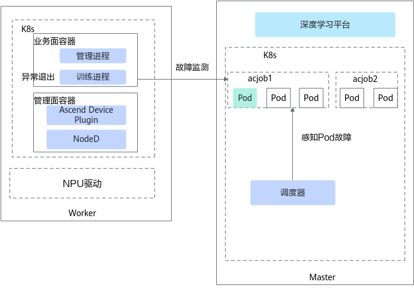

# 业务故障与任务卡死

## 业务面故障

断点续训特性支持通过Volcano调度器感知并处理因业务面故障导致的任务失败。业务面故障是因容器内的训练进程均异常退出后引起容器异常退出，导致Pod的Status变为Failed状态。在使用Ascend Operator的场景下，业务面故障仅支持任务的部分Pod发生故障的场景，若任务所有Pod在几秒内Status都转变为Failed，任务不会发生重调度，认定任务为失败状态。

业务面故障发现原理如[图1](#fig1761563615337)所示。

**图 1**  发现原理

调度器不断轮询地查询每个任务的Pod状态，从而感知到业务面故障并上报该故障。用户可根据具体业务需求对业务面故障做处理。断点续训获取到业务面故障后，Volcano会检测是否开启无条件重试功能，开启后会将任务重新调度，并重新执行训练任务，重试次数减1；当重试次数为0或者没有开启无条件重试功能时，不会对业务容器故障进行处理。

>[!NOTE]
>
>- 如需使用无条件重试功能，需在任务YAML中配置以下3个参数：fault-retry-times，restartPolicy及policies，详细参数说明请参见[YAML配置说明](../../../06_api/15_yaml_configuration.md#yaml_configuration)（policies是vcjob原生字段）。
>- 在使用Ascend Operator的场景下，若希望任务所有Pod的Status在转变为Failed后仍发生重调度，可参考[使用Volcano和Ascend Operator组件场景下，业务面故障的任务所有Pod的Status全部变为Failed，任务无法触发无条件重试重调度](https://gitcode.com/Ascend/mind-cluster/issues/362)。

### watchdog故障检测

NPU上Task执行异常（业务面故障）可能导致任务中正常NPU无法与故障NPU通信，使正常NPU集合通信陷入超时等待状态，任务集合通信出现等待超时异常后才退出（默认为30分钟）。开启watchdog功能（需同时开启业务面故障无条件重试能力），可以在该异常发生后，隔离故障NPU，将任务重调度到健康的NPU上，从而实现6分钟内使任务快速退出。

>[!NOTE]
>NPU上Task执行异常仅支持<term>Atlas A2 训练系列产品</term>的PyTorch框架使用watchdog功能。

### 所需组件

为保证业务面故障检测功能的正常使用，需要安装以下组件：Volcano、Ascend Operator

### 支持的故障处理类型

Job级别重调度、Pod级别重调度、进程级别重调度、优雅容错（本功能已日落）

## 任务卡死故障

任务卡死故障是指NPU上有进程运行，但进程长时间未取得实质性进展的异常状态。实际场景中存在多种卡死情况：

- 计算卡死： 进程停留在某个算子，无输出但NPU利用率低
- 内存卡死： 显存分配异常导致进程挂起
- 通信卡死： HCCL集合通信死锁
- 其他卡死情况

任务卡死检测功能可以及时发现并上报任务卡死故障，避免任务运行无进展，提高效率和资源利用率。

### 检测原理

卡死故障检测由Ascend Device Plugin组件负责，默认每隔**60秒**对每个NPU执行一轮检测。检测流程如下：

1. Ascend Device Plugin获取NPU上运行的进程信息，如果当前无进程运行则跳过本轮检测。
2. 采集当前轮次的NPU关键运行指标，包括：
   - AICore利用率：通过驱动接口获取NPU的AICore使用率。
   - HBM显存使用率：通过驱动接口获取NPU的HBM显存使用率。
   - 网络通信流量：
     - 对于Ascend 950 系列产品场景，通过hccn_tool工具采集UB的tx_busi_flit_num和rx_busi_flit_num统计量；
     - 对于其他场景，通过hccn_tool工具采集RoCE的roce_tx_all_pkt_num和roce_rx_all_pkt_num统计量。
   - 进程CPU时间：通过读取/proc/{pid}/stat文件获取进程的utime和stime，计算所有NPU关联进程的CPU时间。
3. 将当前轮次指标与上一轮次保存的指标进行对比，计算各项指标的增量值。
4. 当以下条件**全部满足**时，判定本轮任务为卡死状态：
   - NPU上有进程运行。
   - 当前AICore利用率 < AICore利用率阈值（默认5%）。
   - 当前HBM显存使用率增量 ≤ HBM显存阈值（默认0%）。
   - 当前网络通信流量增量 < 流量阈值（默认100包/分钟）。
   - 当前进程CPU时间增量 < CPU时间阈值（默认5秒）。

>[!NOTE]
>
>- 用户可根据实际场景自定义检测阈值，详细说明请参见[（可选）配置任务卡死检测参数](../03_configuration/05_task_hang_detection.md#可选配置任务卡死检测参数)。
>- 卡死故障检测仅在有进程运行的NPU上执行，无进程的NPU不进行检测。

### 故障上报机制

任务卡死故障采用连续检测确认机制，避免偶发性指标波动导致误报：

- 每轮检测判定为卡死状态后，卡死计数器加1。当连续检测到卡死状态的次数达到检测持续次数阈值（默认5次，即累计约5分钟）后，Ascend Device Plugin上报卡死故障到device-info-cm ConfigMap中。任务卡死故障码为200001002，故障级别在faultCode.json配置文件中定义。
- 当卡死条件不再满足时，卡死计数器清零。若此前已上报卡死故障，则消除该故障。

### 所需组件

为保证NPU卡死故障检测功能的正常使用，需要安装以下组件：Ascend Device Plugin

### 支持的故障处理类型

Job级别重调度、Pod级别重调度

## 相关操作

- [配置任务卡死检测](../03_configuration/05_task_hang_detection.md)
- [查询和验证故障](../04_querying_and_verifying_faults.md)
