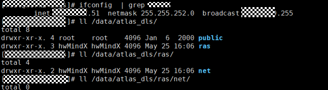
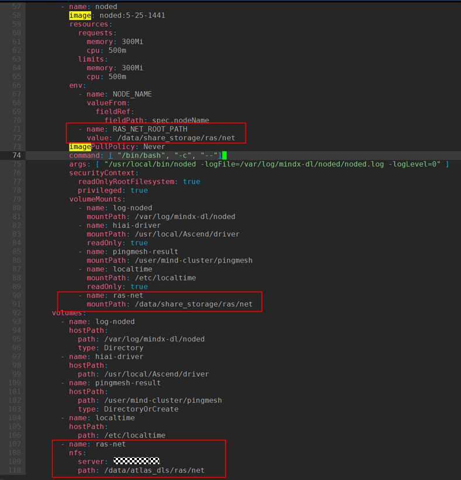

# 配置网络故障

## 配置参数面网络故障<a name="ZH-CN_TOPIC_0000002479226486"></a>

### 总线设备故障<a name="ZH-CN_TOPIC_0000002511346423"></a>

#### 配置文件说明<a name="ZH-CN_TOPIC_0000002511346513"></a>

针对总线设备故障的不同级别进行分级处理时，Ascend Device Plugin组件会获取到当前故障的故障码，根据SwitchFaultCode.json中故障码配置的故障级别，对故障进行相应处理。SwitchFaultCode.json为系统配置文件，若用户无特殊需求，请勿随意修改。若用户需要修改故障码对应的故障级别，可以通过由faultCode.json和SwitchFaultCode.json创建的mindx-dl-fault-config文件实现。

>[!NOTE]
>只有Atlas A3 训练系列产品存在**总线设备**，该设备的故障码可以查看SwitchFaultCode.json文件。

故障检测特性针对**总线设备**故障的不同级别进行分级处理。若用户需要修改故障码的故障级别，操作指导请参见[（可选）配置总线设备故障级别](#可选配置总线设备故障级别)。

Ascend Device Plugin从驱动获取到故障码后，将根据故障码对设备及业务的影响将故障划分为几种级别并进行相应的重调度处理，详细说明请参见[故障级别及处理说明表](../../../06_api/02_ascend_device_plugin.md#自定义灵衢设备故障)。

#### （可选）配置总线设备故障级别<a name="ZH-CN_TOPIC_0000002511426433"></a>

在制作Ascend Device Plugin镜像时，会将故障级别配置文件**SwitchFaultCode.json**内置在镜像中，启动Ascend Device Plugin时会读取这个文件的默认配置，作为当前故障处理依据。

如果用户想要自定义故障级别或者优雅容错相关配置，可以在集群中创建ConfigMap文件（mindx-dl-fault-config）。

- 如果Ascend Device Plugin启动时，集群中已经存在mindx-dl-fault-config，Ascend Device Plugin会优先按照已存在的mindx-dl-fault-config中配置的内容，作为当前故障处理依据。
- 如果重新安装Ascend Device Plugin后，集群中已经存在mindx-dl-fault-config，Ascend Device Plugin的默认**SwitchFaultCode.json**将不会生效，使用集群中已经存在的mindx-dl-fault-config。
- 如果重新安装Ascend Device Plugin后，集群中已经存在mindx-dl-fault-config且该ConfigMap中存在SwitchFaultCode.json字段，Ascend Device Plugin的默认SwitchFaultCode.json将不会生效，使用集群中已经存在的mindx-dl-fault-config。
- 若想要使用SwitchFaultCode.json默认配置，可以删除mindx-dl-fault-config，使Ascend Device Plugin读取默认SwitchFaultCode.json文件。
- 如果ConfigMap文件内容存在格式错误等问题，Ascend Device Plugin会默认读取镜像中内置的ConfigMap文件的内容，作为当前故障处理依据。

**使用SwitchFaultCode.json配置故障级别<a name="section067783615137"></a>**

以总线设备故障码\[0x00f1ff09,155913,cpu,na\]为例。该故障码由四部分组成：告警ID、故障ID、对端设备类型、端口号，如[表1 故障码说明](#zh-cn_topic_0000002007978080_table167355241939)所示。

**表 1**  故障码说明

<a name="zh-cn_topic_0000002007978080_table167355241939"></a>

|参数|说明|取值|
|--|--|--|
|告警ID|在以上示例中，告警ID为0x00f1ff09。|带内带外一致。|
|故障ID|在以上示例中，故障ID为155913。|带内带外一致。|
|对端设备类型|该故障所对应的对端设备类型。在以上示例中，对端设备类型为cpu。|<ul><li>取值为na：该故障为芯片故障，不涉及对端设备。</li><li>取值为cpu：该故障所对应的对端设备为CPU。</li><li>取值为npu：该故障所对应的对端设备为NPU。</li><li>取值为L2：该故障所对应的对端设备为L2。</li></ul>|
|端口号|在以上示例中，端口号为na。|取值只能为na。|

将当前故障的处理策略NotHandleFaultCodes（无需处理）修改为SeparateFaultCodes（隔离芯片，进行任务重调度）的操作示例如下。

1. 登录环境，进入Ascend Device Plugin解压目录。
2. 执行以下命令，查询是否已经基于SwitchFaultCode.json文件创建了mindx-dl-fault-config。

    ```shell
    kubectl describe cm -n kube-system mindx-dl-fault-config
    ```

    - 如果mindx-dl-fault-config已经存在，且存在SwitchFaultCode.json的相关字段，执行[步骤4](#zh-cn_topic_0000002007978080_li1014819812423)编辑该文件。
    - 如果mindx-dl-fault-config已经存在，但是不存在SwitchFaultCode.json的相关字段，需要先保存mindx-dl-fault-config内容，再删除mindx-dl-fault-config文件后，执行[步骤3](#zh-cn_topic_0000002007978080_li14147485427)创建该文件。
    - 如果不存在mindx-dl-fault-config，执行[步骤3](#zh-cn_topic_0000002007978080_li14147485427)创建该文件。

3. <a name="zh-cn_topic_0000002007978080_li14147485427"></a>执行以下命令，创建动态配置故障码所需ConfigMap文件（mindx-dl-fault-config）。

    ```shell
    kubectl create cm mindx-dl-fault-config -n kube-system  --from-file=./faultCode.json --from-file=./SwitchFaultCode.json --from-literal="PollInterval=300"
    ```

    回显示例如下。

    ```ColdFusion
    configmap/mindx-dl-fault-config created
    ```

    **表 2**  参数说明

    <a name="zh-cn_topic_0000002007978080_table14147138184211"></a>
    <table><thead align="left"><tr id="zh-cn_topic_0000002007978080_row1814716812426"><th class="cellrowborder" valign="top" width="33.33333333333333%" id="mcps1.2.4.1.1"><p id="zh-cn_topic_0000002007978080_p141471483423"><a name="zh-cn_topic_0000002007978080_p141471483423"></a>参数名</p>
    </th>
    <th class="cellrowborder" valign="top" width="11.701170117011701%" id="mcps1.2.4.1.2"><p id="zh-cn_topic_0000002007978080_p101477811428"><a name="zh-cn_topic_0000002007978080_p101477811428"></a>是否必选</p>
    </th>
    <th class="cellrowborder" valign="top" width="54.96549654965496%" id="mcps1.2.4.1.3"><p id="zh-cn_topic_0000002007978080_p1014718154210"><a name="zh-cn_topic_0000002007978080_p1014718154210"></a>说明</p>
    </th>
    </tr>
    </thead>
    <tbody><tr id="zh-cn_topic_0000002007978080_row1514810811424"><td class="cellrowborder" valign="top" width="33.33333333333333%" headers="mcps1.2.4.1.1 "><p id="zh-cn_topic_0000002007978080_p714817819421"><a name="zh-cn_topic_0000002007978080_p714817819421"></a>mindx-dl-fault-config</p>
    </td>
    <td class="cellrowborder" valign="top" width="11.701170117011701%" headers="mcps1.2.4.1.2 "><p id="zh-cn_topic_0000002007978080_p201488804220"><a name="zh-cn_topic_0000002007978080_p201488804220"></a>是</p>
    </td>
    <td class="cellrowborder" valign="top" width="54.96549654965496%" headers="mcps1.2.4.1.3 "><p id="zh-cn_topic_0000002007978080_p161481689426"><a name="zh-cn_topic_0000002007978080_p161481689426"></a>动态配置故障码所需的<span id="zh-cn_topic_0000002007978080_ph214819813425"><a name="zh-cn_topic_0000002007978080_ph214819813425"></a>ConfigMap</span>文件名称，不能修改该文件名称。</p>
    </td>
    </tr>
    <tr id="zh-cn_topic_0000002007978080_row814819819422"><td class="cellrowborder" valign="top" width="33.33333333333333%" headers="mcps1.2.4.1.1 "><p id="zh-cn_topic_0000002007978080_p101481589424"><a name="zh-cn_topic_0000002007978080_p101481589424"></a>kube-system</p>
    </td>
    <td class="cellrowborder" valign="top" width="11.701170117011701%" headers="mcps1.2.4.1.2 "><p id="zh-cn_topic_0000002007978080_p214814819427"><a name="zh-cn_topic_0000002007978080_p214814819427"></a>是</p>
    </td>
    <td class="cellrowborder" valign="top" width="54.96549654965496%" headers="mcps1.2.4.1.3 "><p id="zh-cn_topic_0000002007978080_p1614814815424"><a name="zh-cn_topic_0000002007978080_p1614814815424"></a>mindx-dl-fault-config所在命名空间，不能修改该命名空间名称。</p>
    </td>
    </tr>
    <tr id="zh-cn_topic_0000002007978080_row1714868114215"><td class="cellrowborder" valign="top" width="33.33333333333333%" headers="mcps1.2.4.1.1 "><p id="zh-cn_topic_0000002007978080_p182611591222"><a name="zh-cn_topic_0000002007978080_p182611591222"></a>SwitchFaultCode.json</p>
    </td>
    <td class="cellrowborder" valign="top" width="11.701170117011701%" headers="mcps1.2.4.1.2 "><p id="zh-cn_topic_0000002007978080_p1314868184217"><a name="zh-cn_topic_0000002007978080_p1314868184217"></a>是</p>
    </td>
    <td class="cellrowborder" valign="top" width="54.96549654965496%" headers="mcps1.2.4.1.3 "><p id="zh-cn_topic_0000002007978080_p17148118174218"><a name="zh-cn_topic_0000002007978080_p17148118174218"></a>用于保存故障码，必须与SwitchFaultCode.json文件名称保持一致。</p>
    </td>
    </tr>
    <tr id="zh-cn_topic_0000002007978080_row1714868114216"><td class="cellrowborder" valign="top" width="33.33333333333333%" headers="mcps1.2.4.1.1 "><p id="zh-cn_topic_0000002007978080_p182611591223"><a name="zh-cn_topic_0000002007978080_p182611591223"></a>faultCode.json</p>
    </td>
    <td class="cellrowborder" valign="top" width="11.701170117011701%" headers="mcps1.2.4.1.2 "><p id="zh-cn_topic_0000002007978080_p1314868184218"><a name="zh-cn_topic_0000002007978080_p1314868184218"></a>是</p>
    </td>
    <td class="cellrowborder" valign="top" width="54.96549654965496%" headers="mcps1.2.4.1.3 "><p id="zh-cn_topic_0000002007978080_p17148118174219"><a name="zh-cn_topic_0000002007978080_p17148118174219"></a>用于保存基础故障码，必须与faultCode.json文件名称保持一致。</p>
    </td>
    </tr>
    <tr id="zh-cn_topic_0000002007978080_row1714868114217"><td class="cellrowborder" valign="top" width="33.33333333333333%" headers="mcps1.2.4.1.1 "><p id="zh-cn_topic_0000002007978080_p182611591224"><a name="zh-cn_topic_0000002007978080_p182611591224"></a>PollInterval</p>
    </td>
    <td class="cellrowborder" valign="top" width="11.701170117011701%" headers="mcps1.2.4.1.2 "><p id="zh-cn_topic_0000002007978080_p1314868184219"><a name="zh-cn_topic_0000002007978080_p1314868184219"></a>否</p>
    </td>
    <td class="cellrowborder" valign="top" width="54.96549654965496%" headers="mcps1.2.4.1.3 "><p id="zh-cn_topic_0000002007978080_p17148118174220"><a name="zh-cn_topic_0000002007978080_p17148118174220"></a>配置故障码轮询间隔时间，单位为秒，取值范围为30~3600，不指定则默认取值为300s。</p>
    </td>
    </tr>
    </tbody>
    </table>

4. <a name="zh-cn_topic_0000002007978080_li1014819812423"></a>执行以下命令，编辑mindx-dl-fault-config文件。

    ```shell
    kubectl edit cm -n kube-system mindx-dl-fault-config
    ```

5. 在mindx-dl-fault-config文件中，找到故障码\[0x00f1ff09,155913,cpu,na\]。

    ```text
    Data
    ====
    SwitchFaultCode.json:
    ----
    {"NotHandleFaultCodes":[0x00f1ff09,155913,cpu,na],
    ...
    ```

6. 将故障码从NotHandleFaultCodes中删除，并添加到SeparateFaultCodes中。

    ```text
    Data
    ====
    SwitchFaultCode.json:
    ----
    {"NotHandleFaultCodes":[],
    ```

    ```json
    ...
    "SeparateFaultCodes":["[0x00f1ff09,155913,cpu,na]","[0x00f103b0,155907,na,na]",...]
    }
    ```

7. 修改完成后，按“Esc”键，输入:wq!保存并退出。
8. 等mindx-dl-fault-config文件更新生效后（PollInterval取值，不指定则为300s），查看操作是否成功。
    1. 执行以下命令，查询Ascend Device Plugin组件日志名称。

        ```shell
        kubectl get pods -A | grep ascend-device-plugin
        ```

        回显示例如下：

        ```ColdFusion
        kube-system      ascend-device-plugin-daemonset-910-jmlf5   1/1     Running   0              6h34m
        ```

    2. 通过查询到的组件日志名称，查询Ascend Device Plugin的组件日志信息。

        ```shell
        kubectl logs -n kube-system ascend-device-plugin-daemonset-910-jmlf5
        ```

        若日志出现“load switch fault code from configmap success”，表示手动配置故障码操作成功。

### 关联故障<a name="ZH-CN_TOPIC_0000002511426403"></a>

#### 配置文件说明<a name="ZH-CN_TOPIC_0000002479386560"></a>

故障检测特性针对关联故障（特殊故障会伴生其他相关联的故障场景），需要忽略特殊故障诱发的伴生故障。ClusterD组件会获取到特殊故障，根据**relationFaultCustomization.json**和**faultDuration.json**文件中配置的关联故障策略对故障任务进行特殊处理。

relationFaultCustomization.json、faultDuration.json为系统配置文件，若用户无特殊需求，请勿随意修改。

**表 3**  relationFaultCustomization文件说明

<a name="zh-cn_topic_0000002157130117_table5148194813113"></a>
<table><thead align="left"><tr id="zh-cn_topic_0000002157130117_row1614914482114"><th class="cellrowborder" valign="top" width="13.701370137013702%" id="mcps1.2.4.1.1"><p id="zh-cn_topic_0000002157130117_p278365710116"><a name="zh-cn_topic_0000002157130117_p278365710116"></a>参数</p>
</th>
<th class="cellrowborder" valign="top" width="69.05690569056905%" id="mcps1.2.4.1.2"><p id="zh-cn_topic_0000002157130117_p127832571915"><a name="zh-cn_topic_0000002157130117_p127832571915"></a>说明</p>
</th>
<th class="cellrowborder" valign="top" width="17.241724172417243%" id="mcps1.2.4.1.3"><p id="zh-cn_topic_0000002157130117_p47831857912"><a name="zh-cn_topic_0000002157130117_p47831857912"></a>取值</p>
</th>
</tr>
</thead>
<tbody><tr id="zh-cn_topic_0000002157130117_row1514912481715"><td class="cellrowborder" valign="top" width="13.701370137013702%" headers="mcps1.2.4.1.1 "><p id="zh-cn_topic_0000002157130117_p14783115717117"><a name="zh-cn_topic_0000002157130117_p14783115717117"></a>TriggerFault</p>
</td>
<td class="cellrowborder" valign="top" width="69.05690569056905%" headers="mcps1.2.4.1.2 "><p id="zh-cn_topic_0000002157130117_p1878313577120"><a name="zh-cn_topic_0000002157130117_p1878313577120"></a>伴生故障码，当前支持faultCode.json和SwitchFaultCode.json配置的故障码。</p>
</td>
<td class="cellrowborder" valign="top" width="17.241724172417243%" headers="mcps1.2.4.1.3 "><p id="zh-cn_topic_0000002157130117_p117831557615"><a name="zh-cn_topic_0000002157130117_p117831557615"></a>字符串</p>
</td>
</tr>
<tr id="zh-cn_topic_0000002157130117_row1714944814110"><td class="cellrowborder" valign="top" width="13.701370137013702%" headers="mcps1.2.4.1.1 "><p id="zh-cn_topic_0000002157130117_p6783657411"><a name="zh-cn_topic_0000002157130117_p6783657411"></a>RelationFaults</p>
</td>
<td class="cellrowborder" valign="top" width="69.05690569056905%" headers="mcps1.2.4.1.2 "><p id="zh-cn_topic_0000002157130117_p278411575113"><a name="zh-cn_topic_0000002157130117_p278411575113"></a>需要被关联的故障列表，可以是一个或多个故障码。当前支持faultCode.json和SwitchFaultCode.json配置的故障码。</p>
</td>
<td class="cellrowborder" valign="top" width="17.241724172417243%" headers="mcps1.2.4.1.3 "><p id="zh-cn_topic_0000002157130117_p178414571018"><a name="zh-cn_topic_0000002157130117_p178414571018"></a>字符串列表</p>
</td>
</tr>
<tr id="zh-cn_topic_0000002157130117_row111493481216"><td class="cellrowborder" valign="top" width="13.701370137013702%" headers="mcps1.2.4.1.1 "><p id="zh-cn_topic_0000002157130117_p578414571818"><a name="zh-cn_topic_0000002157130117_p578414571818"></a>FaultStrategy</p>
</td>
<td class="cellrowborder" valign="top" width="69.05690569056905%" headers="mcps1.2.4.1.2 "><p id="zh-cn_topic_0000002157130117_p178405710112"><a name="zh-cn_topic_0000002157130117_p178405710112"></a>关联故障匹配成功时对应任务的处理策略。</p>
<a name="zh-cn_topic_0000002157130117_ul17849570118"></a><ul id="zh-cn_topic_0000002157130117_ul17849570118"><li>Separate：任务隔离</li><li>SubHealth：任务亚健康</li></ul>
</td>
<td class="cellrowborder" valign="top" width="17.241724172417243%" headers="mcps1.2.4.1.3 "><p id="zh-cn_topic_0000002157130117_p1378413577119"><a name="zh-cn_topic_0000002157130117_p1378413577119"></a>字符串</p>
</td>
</tr>
<tr id="zh-cn_topic_0000002157130117_row84116191226"><td class="cellrowborder" colspan="3" valign="top" headers="mcps1.2.4.1.1 mcps1.2.4.1.2 mcps1.2.4.1.3 "><p id="zh-cn_topic_0000002157130117_p114317681616"><a name="zh-cn_topic_0000002157130117_p114317681616"></a>注：</p>
<p id="zh-cn_topic_0000002157130117_p47413216213"><a name="zh-cn_topic_0000002157130117_p47413216213"></a>当设备发生配置的RelationFaults时，<span id="zh-cn_topic_0000002157130117_ph12291515161616"><a name="zh-cn_topic_0000002157130117_ph12291515161616"></a>ClusterD</span>会将对应的故障加入待处理的故障码队列。在配置的TimeOutInterval时间内，如果发生了TriggerFault对应的故障，会按照用户配置的FaultStrategy策略对任务进行处理。如果超过配置的TimeOutInterval时间，总线设备故障类型，按照任务亚健康进行处理，芯片故障或者参数面网络故障，会忽略该故障。</p>
</td>
</tr>
</tbody>
</table>

**表 4**  faultDuration.json文件说明

<a name="zh-cn_topic_0000002157130117_table1484617498414"></a>
<table><thead align="left"><tr id="zh-cn_topic_0000002157130117_row1284615492415"><th class="cellrowborder" valign="top" width="13.36133613361336%" id="mcps1.2.4.1.1"><p id="zh-cn_topic_0000002157130117_p116699222514"><a name="zh-cn_topic_0000002157130117_p116699222514"></a>参数</p>
</th>
<th class="cellrowborder" valign="top" width="70.36703670367037%" id="mcps1.2.4.1.2"><p id="zh-cn_topic_0000002157130117_p56691922055"><a name="zh-cn_topic_0000002157130117_p56691922055"></a>说明</p>
</th>
<th class="cellrowborder" valign="top" width="16.271627162716275%" id="mcps1.2.4.1.3"><p id="zh-cn_topic_0000002157130117_p466911221257"><a name="zh-cn_topic_0000002157130117_p466911221257"></a>取值</p>
</th>
</tr>
</thead>
<tbody><tr id="zh-cn_topic_0000002157130117_row084615491413"><td class="cellrowborder" valign="top" width="13.36133613361336%" headers="mcps1.2.4.1.1 "><p id="zh-cn_topic_0000002157130117_p066920221954"><a name="zh-cn_topic_0000002157130117_p066920221954"></a>FaultCode</p>
</td>
<td class="cellrowborder" valign="top" width="70.36703670367037%" headers="mcps1.2.4.1.2 "><p id="zh-cn_topic_0000002157130117_p96702227514"><a name="zh-cn_topic_0000002157130117_p96702227514"></a>故障码，当前支持faultCode.json和SwitchFaultCode.json配置的故障码。</p>
</td>
<td class="cellrowborder" valign="top" width="16.271627162716275%" headers="mcps1.2.4.1.3 "><p id="zh-cn_topic_0000002157130117_p56701922954"><a name="zh-cn_topic_0000002157130117_p56701922954"></a>字符串</p>
</td>
</tr>
<tr id="zh-cn_topic_0000002157130117_row18467491043"><td class="cellrowborder" valign="top" width="13.36133613361336%" headers="mcps1.2.4.1.1 "><p id="zh-cn_topic_0000002157130117_p167022212517"><a name="zh-cn_topic_0000002157130117_p167022212517"></a>FaultType</p>
</td>
<td class="cellrowborder" valign="top" width="70.36703670367037%" headers="mcps1.2.4.1.2 "><p id="zh-cn_topic_0000002157130117_p667020225515"><a name="zh-cn_topic_0000002157130117_p667020225515"></a>故障类型：</p>
<a name="zh-cn_topic_0000002157130117_ul1367017221559"></a><ul id="zh-cn_topic_0000002157130117_ul1367017221559"><li>faultDevice：芯片故障或者参数面网络故障</li><li>faultSwitch：总线设备故障</li></ul>
</td>
<td class="cellrowborder" valign="top" width="16.271627162716275%" headers="mcps1.2.4.1.3 "><p id="zh-cn_topic_0000002157130117_p967010221359"><a name="zh-cn_topic_0000002157130117_p967010221359"></a>字符串</p>
</td>
</tr>
<tr id="zh-cn_topic_0000002157130117_row208478499416"><td class="cellrowborder" valign="top" width="13.36133613361336%" headers="mcps1.2.4.1.1 "><p id="zh-cn_topic_0000002157130117_p16713225511"><a name="zh-cn_topic_0000002157130117_p16713225511"></a>TimeOutInterval</p>
</td>
<td class="cellrowborder" valign="top" width="70.36703670367037%" headers="mcps1.2.4.1.2 "><p id="zh-cn_topic_0000002157130117_p36711221159"><a name="zh-cn_topic_0000002157130117_p36711221159"></a>故障码最长被关联时间。单位为秒。</p>
</td>
<td class="cellrowborder" valign="top" width="16.271627162716275%" headers="mcps1.2.4.1.3 "><p id="zh-cn_topic_0000002157130117_p186718221450"><a name="zh-cn_topic_0000002157130117_p186718221450"></a>整数</p>
</td>
</tr>
</tbody>
</table>

#### （可选）配置关联故障的处理策略<a name="ZH-CN_TOPIC_0000002479226478"></a>

在制作ClusterD镜像时，会将关联故障的两个配置文件内置在镜像中，启动ClusterD会读取这两个文件的默认配置，作为当前故障处理依据。

如果用户想要自定义关联的故障码以及对应的处理策略。可以在制作ClusterD镜像时，修改对应的relationFaultCustomization.json和faultDuration.json配置文件。

**操作步骤<a name="zh-cn_topic_0000002157048501_section2086912531189"></a>**

以RelationFaults为故障码81078603，TriggerFault为故障码8C1F8609为例。如果发生了芯片81078603的故障码，需要在后面60s内出现8C1F8609故障时忽略8C1F8609故障，并且隔离发生的81078603故障的任务。可以手动配置关联故障的处理策略为Separate。

1. 登录环境，进入ClusterD解压后的目录。
2. 执行**vi relationFaultCustomization.json**命令编辑配置文件。

    ```shell
    vi relationFaultCustomization.json
    ```

    将2个故障进行关联。修改完成后，按“Esc”键，输入:wq!保存并退出。

    ```json
    …
      {
        "TriggerFault": "8C1F8609",
        "RelationFaults": [
          "81078603"
        ],
        "FaultStrategy": "Separate"
      }
    …
    ```

3. 执行**vi faultDuration.json**命令编辑配置文件。

    ```shell
    vi faultDuration.json
    ```

    配置故障类型、故障关联时间等。修改完成后，按“Esc”键，输入:wq!保存并退出。

    ```json
    …
      {
        "FaultCode": "81078603",
        "FaultType": "faultDevice",
        "TimeOutInterval": 60
      }
    …
    ```

## 配置灵衢网络检测<a name="zh-cn_topic_0000002193288232_section18190175418362"></a>

### 前提条件<a name="zh-cn_topic_0000002193288232_section8281518121516"></a>

- （必选）已[创建命名空间](../../../05_developer_guide/00_installation_deployment/00_manual_installation/01_preparing_for_installation.md#创建命名空间)
- （必选）已[配置NodeD启动参数resultMaxAge](../../../05_developer_guide/00_installation_deployment/00_manual_installation/09_noded.md#参数说明)

### 配置步骤

配置灵衢网络检测，需执行以下步骤。

1. 配置共享存储。

    ClusterD和NodeD通过共享存储进行交互，两者的共享存储根路径需要保持一致。共享目录的根路径属主为9000用户，与ClusterD运行用户一致。

    1. 配置server。

        

    2. 修改NodeD配置。

        

    3. 如果存在ClusterD，则需修改ClusterD配置。

        

    4. 执行**kubectl get pods -o wide -A**命令出现如下示例，则表示已完成共享存储配置。

        

2. 启用或关闭灵衢网络检测。
    - （推荐）已安装Ascend Device Plugin和ClusterD
        1. 登录环境，进入NodeD解压目录。
        2. 执行以下命令创建名为pingmesh-config的ConfigMap文件。

            pingmesh-config.yaml为pingmesh配置文件，可从NodeD安装包中获取。

            ```shell
            kubectl apply -f pingmesh-config.yaml
            ```

            回显示例如下。

            ```ColdFusion
            configmap/pingmesh-config created
            ```

        3. 执行以下命令编辑pingmesh-config文件。该文件中各参数的填写说明如[表5](#zh-cn_topic_0000002193288232_table985012534578)所示。

            ```shell
            kubectl edit cm -n cluster-system pingmesh-config
            ```

            **表 5**  pingmesh-config cm

            <a name="zh-cn_topic_0000002193288232_table985012534578"></a>

            |参数|说明|取值|
            |--|--|--|
            |app|ConfigMap其中一个label的key。|pingmesh|
            |global|集群配置信息。|-|
            |"1"|超节点ID为1的配置示例，用户可根据实际情况进行修改或新增。当配置了某个超节点后，NodeD会采用超节点的配置信息而忽略global配置信息。|超节点ID|
            |activate|是否启用pingmesh功能。|on或off|
            |task_interval|pingmesh任务间隔。单位为秒。|[1~60]|

    - 未安装Ascend Device Plugin和ClusterD

        自行生成名为cluster-system的命名空间，name为super-pod-<superPodID\>、label为app=pingmesh的ConfigMap。且该ConfigMap中各字段需按照[super-pod-<super-pod-id\>](../../../06_api/04_clusterd/00_cluster_resources.md#section53741611135414)表填写。示例如下。

        ```yaml
        apiVersion: v1
        data:
          superPodDevice: '{"SuperPodID":"0","NodeDeviceMap":{"node-**-**":{"NodeName":"node-**-**","DeviceMap":{"0":"62914560","1":"62980097","10":"64225290","11":"64290827","12":"64487436","13":"64552973","14":"64749582","15":"64815119","2":"63176706","3":"63242243","4":"63438852","5":"63504389","6":"63700998","7":"63766535","8":"63963144","9":"64028681"}},"node-**-**":{"NodeName":"node-**-**","DeviceMap":{"0":"67108864","1":"67174401","10":"68419594","11":"68485131","12":"68681740","13":"68747277","14":"68943886","15":"69009423","2":"67371010","3":"67436547","4":"67633156","5":"67698693","6":"67895302","7":"67960839","8":"68157448","9":"68222985"}},"node-**-**":{"NodeName":"node-**-**","DeviceMap":{"0":"104857600","1":"104923137","10":"106168330","11":"106233867","12":"106430476","13":"106496013","14":"106692622","15":"106758159","2":"105119746","3":"105185283","4":"105381892","5":"105447429","6":"105644038","7":"105709575","8":"105906184","9":"105971721"}},"node-**-*":{"NodeName":"node-**-*","DeviceMap":{"0":"4194304","1":"4259841","10":"5505034","11":"5570571","12":"5767180","13":"5832717","14":"6029326","15":"6094863","2":"4456450","3":"4521987","4":"4718596","5":"4784133","6":"4980742","7":"5046279","8":"5242888","9":"5308425"}},"node-**-**":{"NodeName":"node-**-**","DeviceMap":{"0":"142606336","1":"142671873","10":"143917066","11":"143982603","12":"144179212","13":"144244749","14":"144441358","15":"144506895","2":"142868482","3":"142934019","4":"143130628","5":"143196165","6":"143392774","7":"143458311","8":"143654920","9":"143720457"}},"node-**-**":{"NodeName":"node-**-**","DeviceMap":{"0":"146800640","1":"146866177","10":"148111370","11":"148176907","12":"148373516","13":"148439053","14":"148635662","15":"148701199","2":"147062786","3":"147128323","4":"147324932","5":"147390469","6":"147587078","7":"147652615","8":"147849224","9":"147914761"}},"node-**-**":{"NodeName":"node-**-**","DeviceMap":{"0":"83886080","1":"83951617","10":"85196810","11":"85262347","12":"85458956","13":"85524493","14":"85721102","15":"85786639","2":"84148226","3":"84213763","4":"84410372","5":"84475909","6":"84672518","7":"84738055","8":"84934664","9":"85000201"}}}}'
        kind: ConfigMap
        metadata:
          labels:
            app: pingmesh
          name: super-pod-0       # 0为超节点ID
          namespace: cluster-system
        ```

## 配置光链路成员端口故障<a name="ZH-CN_TOPIC_0000002479387566"></a>

### 配置文件说明<a name="ZH-CN_TOPIC_0000002479387566_section_specifications "></a>

参数面光链路成员端口故障由Ascend Device Plugin组件负责检测。此功能涉及以下配置文件：

faultCode.json：配置参数面光链路成员端口故障的故障级别。

### （可选）参数面光链路成员端口故障<a name="zh-cn_topic_0000002479387566_section_custom_opticalportfaultlevel"></a>

若用户需要对参数面光链路成员端口故障后的NPU进行放行或其他操作，可参照[使用faultCode.json配置故障级别](./03_chip_faults.md#zh-cn_topic_0000001951258609_section112139052513)小节修改此故障码的故障级别，修改后的mindx-dl-fault-config示例如下：
自定义时需对需配置的机型的形态进行区分，当配置Atlas 850E 超节点和Atlas 650E 服务器中出uboe口的故障时，配置110001024和110000002。为其他及Atlas 950 SuperPoD 超节点形态时，配置020001002和020000002。

```json
   ...
  "SeparateNPUCodes":[
    ...,"020001002"
  ],
    ...
```

## 配置watchdog故障检测

### PyTorch场景

由于集群中出现的参数面网络故障不一定会影响训练任务，因此集群调度组件不会强制中断任务；当参数面网络故障影响训练任务时，会触发集合通信的网络超时等待机制，在等待时间（默认为30分钟）后，集群调度组件才能感知到该故障，从而触发断点续训。针对该问题，PyTorch  Adapter插件（TorchNPU）提供**watchdog故障检测**功能，可用于检测训练任务是否受到影响，缩短故障检测时间，该功能的详细说明请参见[表6](#zh-cn_topic_0000002163883997_zh-cn_topic_0000002017918296_table4822175901415)。

**表 6** watchdog故障检测功能说明

<a name="zh-cn_topic_0000002163883997_zh-cn_topic_0000002017918296_table4822175901415"></a>
<table><tbody><tr id="zh-cn_topic_0000002163883997_zh-cn_topic_0000002017918296_row9823145931412"><th class="firstcol" valign="top" width="20%" id="mcps1.2.3.1.1"><p id="zh-cn_topic_0000002163883997_zh-cn_topic_0000002017918296_p188231359141419"><a name="zh-cn_topic_0000002163883997_zh-cn_topic_0000002017918296_p188231359141419"></a>功能名称</p>
</th>
<td class="cellrowborder" valign="top" width="80%" headers="mcps1.2.3.1.1 "><p id="zh-cn_topic_0000002163883997_zh-cn_topic_0000002017918296_p128231659131413"><a name="zh-cn_topic_0000002163883997_zh-cn_topic_0000002017918296_p128231659131413"></a><span id="zh-cn_topic_0000002163883997_zh-cn_topic_0000002017918296_ph12943926103611"><a name="zh-cn_topic_0000002163883997_zh-cn_topic_0000002017918296_ph12943926103611"></a>watchdog</span>故障检测。</p>
</td>
</tr>
<tr id="zh-cn_topic_0000002163883997_zh-cn_topic_0000002017918296_row58231859181412"><th class="firstcol" valign="top" width="20%" id="mcps1.2.3.2.1"><p id="zh-cn_topic_0000002163883997_zh-cn_topic_0000002017918296_p1882355910149"><a name="zh-cn_topic_0000002163883997_zh-cn_topic_0000002017918296_p1882355910149"></a>功能特点</p>
</th>
<td class="cellrowborder" valign="top" width="80%" headers="mcps1.2.3.2.1 "><p id="zh-cn_topic_0000002163883997_zh-cn_topic_0000002017918296_p98238590143"><a name="zh-cn_topic_0000002163883997_zh-cn_topic_0000002017918296_p98238590143"></a>训练启动时，同时启动一个监测线程不断获取通信异常以及task执行异常。监测到故障发生后，快速抛出异常并终止训练任务进程，触发重调度流程。</p>
</td>
</tr>
<tr id="zh-cn_topic_0000002163883997_zh-cn_topic_0000002017918296_row138235598144"><th class="firstcol" valign="top" width="20%" id="mcps1.2.3.3.1"><p id="zh-cn_topic_0000002163883997_zh-cn_topic_0000002017918296_p15823155941416"><a name="zh-cn_topic_0000002163883997_zh-cn_topic_0000002017918296_p15823155941416"></a>使用说明</p>
</th>
<td class="cellrowborder" valign="top" width="80%" headers="mcps1.2.3.3.1 "><p id="zh-cn_topic_0000002163883997_zh-cn_topic_0000002017918296_p1982365912149"><a name="zh-cn_topic_0000002163883997_zh-cn_topic_0000002017918296_p1982365912149"></a>仅支持<span id="zh-cn_topic_0000002163883997_zh-cn_topic_0000002017918296_ph1810104910187"><a name="zh-cn_topic_0000002163883997_zh-cn_topic_0000002017918296_ph1810104910187"></a>PyTorch</span> 1.11.0、2.1.0及以上版本；<span id="zh-cn_topic_0000002163883997_zh-cn_topic_0000002017918296_ph1758915488355"><a name="zh-cn_topic_0000002163883997_zh-cn_topic_0000002017918296_ph1758915488355"></a>PyTorch</span> Adapter插件（TorchNPU）版本必须高于6.0.RC1。</p>
</td>
</tr>
<tr id="zh-cn_topic_0000002163883997_zh-cn_topic_0000002017918296_row11823195941410"><th class="firstcol" valign="top" width="20%" id="mcps1.2.3.4.1"><p id="zh-cn_topic_0000002163883997_zh-cn_topic_0000002017918296_p17823959121418"><a name="zh-cn_topic_0000002163883997_zh-cn_topic_0000002017918296_p17823959121418"></a>关键操作</p>
</th>
<td class="cellrowborder" valign="top" width="80%" headers="mcps1.2.3.4.1 "><p id="zh-cn_topic_0000002163883997_zh-cn_topic_0000002017918296_p132201841114917"><a name="zh-cn_topic_0000002163883997_zh-cn_topic_0000002017918296_p132201841114917"></a><span id="zh-cn_topic_0000002163883997_zh-cn_topic_0000002017918296_ph14998597340"><a name="zh-cn_topic_0000002163883997_zh-cn_topic_0000002017918296_ph14998597340"></a>PyTorch</span> 2.1.0及以上版本默认开启<span id="zh-cn_topic_0000002163883997_zh-cn_topic_0000002017918296_ph6991859163419"><a name="zh-cn_topic_0000002163883997_zh-cn_topic_0000002017918296_ph6991859163419"></a>watchdog</span>故障检测，<strong id="zh-cn_topic_0000002163883997_zh-cn_topic_0000002017918296_b28088598507"><a name="zh-cn_topic_0000002163883997_zh-cn_topic_0000002017918296_b28088598507"></a>无需手动配置环境变量</strong>。</p>
<p id="zh-cn_topic_0000002163883997_zh-cn_topic_0000002017918296_p1099185913342"><a name="zh-cn_topic_0000002163883997_zh-cn_topic_0000002017918296_p1099185913342"></a>（可选）如需关闭<span id="zh-cn_topic_0000002163883997_zh-cn_topic_0000002017918296_ph355416217352"><a name="zh-cn_topic_0000002163883997_zh-cn_topic_0000002017918296_ph355416217352"></a>watchdog</span>故障检测，需在训练的shell启动脚本（例如train_start.sh）中，修改以下环境变量。</p>
<pre class="screen" id="zh-cn_topic_0000002163883997_zh-cn_topic_0000002017918296_screen129905913414"><a name="zh-cn_topic_0000002163883997_zh-cn_topic_0000002017918296_screen129905913414"></a>...
# env for breakpoint ckpt
export RESUME_MODE_ENABLE=1
<br>
export HCCL_ASYNC_ERROR_HANDLING=0  <strong id="zh-cn_topic_0000002163883997_zh-cn_topic_0000002017918296_b177584103519"><a name="zh-cn_topic_0000002163883997_zh-cn_topic_0000002017918296_b177584103519"></a>          </strong># 该环境变量的详细说明请参见<a href="../../../06_api/13_environment_variable_description.md#taskd环境变量说明">TaskD环境变量说明</a></pre>
</td>
</tr>
</tbody>
</table>

### MindSpore场景

由于集群中出现的参数面网络故障不一定会影响训练任务，因此集群调度组件不会强制中断任务；当参数面网络故障影响训练任务时，会触发集合通信的网络超时等待机制，在等待时间（默认为30分钟）后，集群调度组件才能感知到该故障，从而触发断点续训。针对该问题，MindSpore提供**watchdog故障检测**功能，可用于检测训练任务是否受到影响，缩短故障检测时间，该功能的详细说明请参见[表7](#zh-cn_topic_0000002128524426_zh-cn_topic_0000002053878705_table17897155873217)。

**表 7** watchdog故障检测功能说明

<a name="zh-cn_topic_0000002128524426_zh-cn_topic_0000002053878705_table17897155873217"></a>
<table><tbody><tr id="zh-cn_topic_0000002128524426_zh-cn_topic_0000002053878705_row289715810326"><th class="firstcol" valign="top" width="20%" id="mcps1.2.3.1.1"><p id="zh-cn_topic_0000002128524426_zh-cn_topic_0000002053878705_p15897135815323"><a name="zh-cn_topic_0000002128524426_zh-cn_topic_0000002053878705_p15897135815323"></a>功能名称</p>
</th>
<td class="cellrowborder" valign="top" width="80%" headers="mcps1.2.3.1.1 "><p id="zh-cn_topic_0000002128524426_zh-cn_topic_0000002053878705_p148971958143217"><a name="zh-cn_topic_0000002128524426_zh-cn_topic_0000002053878705_p148971958143217"></a><span id="zh-cn_topic_0000002128524426_zh-cn_topic_0000002053878705_ph389717582323"><a name="zh-cn_topic_0000002128524426_zh-cn_topic_0000002053878705_ph389717582323"></a>watchdog</span>故障检测。</p>
</td>
</tr>
<tr id="zh-cn_topic_0000002128524426_zh-cn_topic_0000002053878705_row1589716585326"><th class="firstcol" valign="top" width="20%" id="mcps1.2.3.2.1"><p id="zh-cn_topic_0000002128524426_zh-cn_topic_0000002053878705_p1689713588324"><a name="zh-cn_topic_0000002128524426_zh-cn_topic_0000002053878705_p1689713588324"></a>功能特点</p>
</th>
<td class="cellrowborder" valign="top" width="80%" headers="mcps1.2.3.2.1 "><p id="zh-cn_topic_0000002128524426_zh-cn_topic_0000002053878705_p9897658123215"><a name="zh-cn_topic_0000002128524426_zh-cn_topic_0000002053878705_p9897658123215"></a>训练启动时，同时启动一个监测线程不断获取通信异常以及task执行异常。监测到故障发生后，快速抛出异常并终止训练任务进程，触发重调度。</p>
</td>
</tr>
<tr id="zh-cn_topic_0000002128524426_zh-cn_topic_0000002053878705_row189775853220"><th class="firstcol" valign="top" width="20%" id="mcps1.2.3.3.1"><p id="zh-cn_topic_0000002128524426_zh-cn_topic_0000002053878705_p7897105873219"><a name="zh-cn_topic_0000002128524426_zh-cn_topic_0000002053878705_p7897105873219"></a>使用说明</p>
</th>
<td class="cellrowborder" valign="top" width="80%" headers="mcps1.2.3.3.1 "><p id="zh-cn_topic_0000002128524426_zh-cn_topic_0000002053878705_p789713583324"><a name="zh-cn_topic_0000002128524426_zh-cn_topic_0000002053878705_p789713583324"></a>仅支持MindSpore 2.4版本以上</p>
</td>
</tr>
<tr id="zh-cn_topic_0000002128524426_zh-cn_topic_0000002053878705_row5898058143215"><th class="firstcol" valign="top" width="20%" id="mcps1.2.3.4.1"><p id="zh-cn_topic_0000002128524426_zh-cn_topic_0000002053878705_p19898458173211"><a name="zh-cn_topic_0000002128524426_zh-cn_topic_0000002053878705_p19898458173211"></a>关键操作</p>
</th>
<td class="cellrowborder" valign="top" width="80%" headers="mcps1.2.3.4.1 "><p id="zh-cn_topic_0000002128524426_zh-cn_topic_0000002053878705_p6898145818329"><a name="zh-cn_topic_0000002128524426_zh-cn_topic_0000002053878705_p6898145818329"></a>MindSpore<strong id="zh-cn_topic_0000002128524426_zh-cn_topic_0000002053878705_b171861451155620"><a name="zh-cn_topic_0000002128524426_zh-cn_topic_0000002053878705_b171861451155620"></a>默认开启</strong><span id="zh-cn_topic_0000002128524426_zh-cn_topic_0000002053878705_ph289835820329"><a name="zh-cn_topic_0000002128524426_zh-cn_topic_0000002053878705_ph289835820329"></a>watchdog</span>故障检测，<strong id="zh-cn_topic_0000002128524426_zh-cn_topic_0000002053878705_b2843133219564"><a name="zh-cn_topic_0000002128524426_zh-cn_topic_0000002053878705_b2843133219564"></a>无需手动配置</strong>。如果需要关闭<span id="ph1052517411176"><a name="ph1052517411176"></a>watchdog</span>故障检测，请在模型配置文件中新增如下加粗字段。</p>
<pre class="screen" id="zh-cn_topic_0000002128524426_zh-cn_topic_0000002053878705_screen1898205823219"><a name="zh-cn_topic_0000002128524426_zh-cn_topic_0000002053878705_screen1898205823219"></a>...
context:
  <strong id="b393317297113"><a name="b393317297113"></a>ascend_config:</strong>
    <strong id="b12660461696"><a name="b12660461696"></a>hccl_watchdog: False</strong>
...</pre>
</td>
</tr>
</tbody>
</table>
