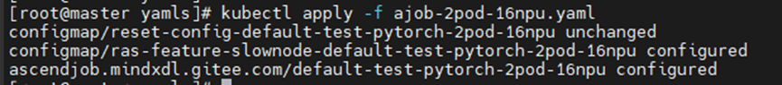
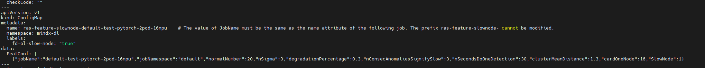
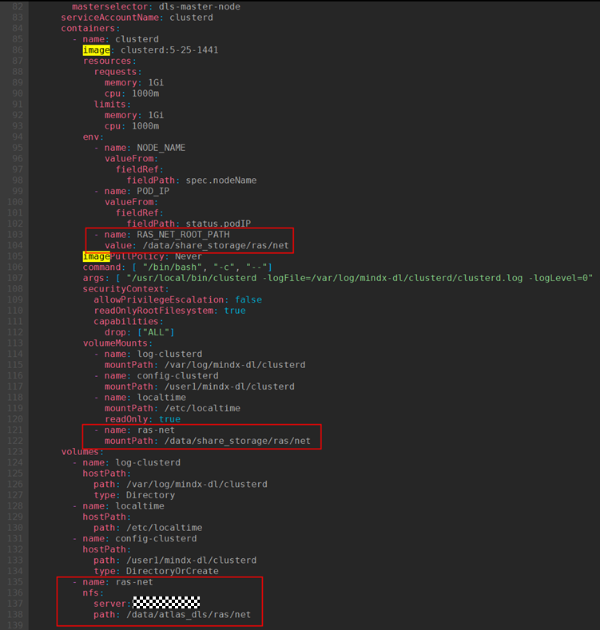
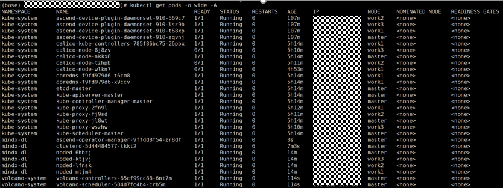

# 配置性能劣化、慢节点与慢网络诊断

## 配置性能劣化故障检测

### 使用7.1.RC1及以上版本TaskD

#### 前提条件<a name="zh-cn_topic_0000002194466236_section138036504533"></a>

- （可选）已安装[ClusterD](../../../05_developer_guide/00_installation_deployment/00_manual_installation/06_clusterd.md)、[Ascend Device Plugin](../../../05_developer_guide/00_installation_deployment/00_manual_installation/04_ascend_device_plugin.md)和[Volcano](../../../05_developer_guide/00_installation_deployment/00_manual_installation/05_volcano.md)（以上MindCluster组件版本均需与TaskD配套）
- 在容器内安装[TorchNPU](../../04_resumable_training/04_using_resumable_training_on_the_cli.md#ZH-CN_TOPIC_0000002479386504)（**可选**，PyTorch场景需安装、版本号≥7.1.RC1）、MindSpore（**可选**，MindSpore场景需安装、版本号≥2.7.0）、[CANN](../../04_resumable_training/04_using_resumable_training_on_the_cli.md#ZH-CN_TOPIC_0000002479386504)（**必选**，版本号≥8.2.RC1）、[TaskD](../../04_resumable_training/04_using_resumable_training_on_the_cli.md#ZH-CN_TOPIC_0000002479386504)（**必选**）

#### 准备软件包<a name="zh-cn_topic_0000002194466236_section8281518121516"></a>

**表 1**  准备软件包

<a name="zh-cn_topic_0000002194466236_table232305471415"></a>

|软件包|是否必选|说明|获取方法|使用场景|
|--|--|--|--|--|
|mstx_torch_plugin|否|<p>Ascend PyTorch Profiler中的[采集并解析msproftx数据](https://www.hiascend.com/document/detail/zh/canncommercial/800/devaids/devtools/profiling/atlasprofiling_16_0033.html)功能已经内置了通信算子的打点。为了方便用户在不修改业务代码的基础上获取更多关键阶段的耗时数据，mstx_torch_plugin在Ascend PyTorch Profiler内置了dataloader、forward、step、save_checkpoint这四个关键阶段函数的打点。</p><ul><li>如需使用FP打点数据，需安装mstx_torch_plugin。其他场景下无需安装。</li><li>需使用1.0及以上版本的mstx_torch_plugin。</li></ul>|[获取链接](https://ptdbg.obs.myhuaweicloud.com/profiler/example/1.0/mstx_torch_plugin-1.0-py3-none-any.whl)|PyTorch|

#### 配置性能劣化故障检测<a name="section1831691464111"></a>

本方案仅针对7.1.RC1及以上版本的TaskD组件。如使用7.1.RC1以下版本的组件请参见[使用其他版本TaskD](#使用其他版本taskd)章节进行操作。

- **PyTorch场景**

  1. 以下两种方式请根据实际需要进行二选一。
      - 在容器内安装mstx\_torch\_plugin。
          1. 下载mstx\_torch\_plugin的whl包。whl包链接：[mstx\_torch\_plugin](https://ptdbg.obs.myhuaweicloud.com/profiler/example/1.0/mstx_torch_plugin-1.0-py3-none-any.whl)。
          2. 安装软件包。

              ```shell
              pip install mstx_torch_plugin-1.0-py3-none-any.whl
              ```

          3. 在AI任务执行脚本中import导入该whl包。

              需保证import的顺序在import torch和import torch\_npu后面，示例如下。

              ```shell
              import torch
              import torch_npu
              import mstx_torch_plugin
              ```

      - 非原生优化器或不使用mstx\_torch\_plugin的情况下，为获取训练的Step耗时数据需修改训练脚本中的训练迭代循环，需增加Step打点代码。

          以下示例为PyTorch-MindSpeed场景，需修改./mindspeed\_llm/training/training.py文件，增加如下加粗字段。

          <pre codetype="Python">
          def train(forward_step_func, model, optimizer, opt_param_scheduler,
                    train_data_iterator, valid_data_iterator,
                    process_non_loss_data_func, config):
                      # Cache into one-logger for callback
              ……
              ……
              if is_profile_enabled():
                  prof = get_profiler()
                  prof.start()
              <strong>step_id = iteration</strong>
              while iteration < args.train_iters:
                  <strong>stream = torch.npu.current_stream()      # 获取当前环境的执行流，用于获取NPU侧时间</strong>
                  <strong>range_id = torch.npu.mstx.range_start(f"step {step_id}", stream) # 标识当前训练step的开始</strong>
                  ……
                  ……
                  if args.manual_gc:
                      if args.manual_gc_interval != 0 and iteration % args.manual_gc_interval == 0:
                          gc.collect()

                  if is_profile_enabled():
                      prof.step()
                  <strong>step_id +=1  # 训练step加一，用于标识下一step</strong>
                  <strong>torch.npu.mstx.range_end(range_id) # 标识当前训练step的结束</strong></pre>

  2. 在容器内，以CANN软件包的运行用户登录环境，执行source \$\{install\_path\}/set\_env.sh命令设置环境变量。其中\$\{install\_path\}为CANN软件的安装目录。示例如下。

      ```shell
      source /usr/local/Ascend/cann/set_env.sh
      ```

  3. 训练启动前，在训练脚本中导入LD\_PRELOAD环境变量。该环境变量允许系统提前加载指定的so文件。示例如下。

      ```shell
      export LD_PRELOAD=/usr/local/Ascend/cann/lib64/libmspti.so:/usr/local/python3.10.5/lib/python3.10/site-packages/taskd/python/cython_api/libs/libtaskd.so:$LD_PRELOAD
      ```

      - libmspti.so：该so由MindStudio提供，集成在CANN包内。当使用默认安装路径时，路径为：/usr/local/Ascend/cann/lib64/libmspti.so。

      - libtaskd.so：该so由TaskD组件提供，安装该whl包后，路径为：TaskD所在路径/taskd/python/cython\_api/libs/libtaskd.so。

          TaskD所在路径可通过以下命令进行查询。回显中的Location字段即为TaskD所在路径。

          ```shell
          pip show taskd
          ```

  4. 在分布式环境初始化完成，能够获取到全局rank之后，修改训练脚本，在训练脚本中拉起TaskD Manager，在管理进程中拉起TaskD Proxy，在训练进程内部拉起TaskD Worker。
      1. <a name="li399811541"></a>（可选）拉起TaskD Manager和TaskD Proxy。若通过gRPC接口方式开启轻量profiling获取落盘数据，则需执行如下步骤；若通过ConfigMap方式开启轻量profiling获取落盘数据，则跳过该步骤。
          1. 创建manager.py文件，放在调用训练脚本时的当前目录下。manager.py文件内容如下所示。

              ```python
              from taskd.api import init_taskd_manager, start_taskd_manager
              import os

              job_id=os.getenv("MINDX_TASK_ID")
              node_nums=XX         # 用户填入任务节点总数
              proc_per_node=XX     # 用户填入任务每个节点的训练进程数量

              init_taskd_manager({"job_id":job_id, "node_nums": node_nums, "proc_per_node": proc_per_node})
              start_taskd_manager()
              ```

              >[!NOTE]
              >manager.py文件中的参数详细说明请参见[def init\_taskd\_manager\(config:dict\) -\> bool:](../../../06_api/07_taskd/04_taskd_manager_apis.md#def-init_taskd_managerconfigdict---bool)。

          2. 在训练脚本中增加以下代码，拉起TaskD Manager和TaskD Proxy。

              ```shell
              sed -i '/import os/i import taskd.python.adaptor.patch' $(pip3 show torch | grep Location | awk -F ' ' '{print $2}')/torch/distributed/run.py

              if [[ "${RANK}" -eq 0 ]]; then
                  export MASTER_ADDR=${POD_IP}
                  python /job/code/manager.py 2>> /job/code/alllogs/$MINDX_TASK_ID/taskd/error.log &      # manager.py具体执行路径由当前路径决定，error.log日志路径需提前创建
              fi

              torchrun ...
              ```

      2. <a name="li23023"></a>拉起TaskD Worker。

         以下示例为PyTorch-MindSpeed场景，需修改QWEN3\_for\_PyTorch\_2.7\_code/mindspeed\_llm/training/training.py文件，在代码中增加如下加粗字段。

          <pre codetype="Python">
          def pretrain(train_valid_test_dataset_provider,
                        model_provider,
                        model_type,
                        forward_step_func,
                        process_non_loss_data_func=None,
                        extra_args_provider=None,
                        args_defaults={}):
              print_rank_0('time to initialize megatron (seconds): {:.3f}'.format(
                  time.time() - _TRAIN_START_TIME))
              print_datetime('after megatron is initialized')
              <strong>import torch.distributed as dist</strong>
              <strong>if dist.is_initialized():</strong>
                  <strong>rank = dist.get_rank()</strong>
                  <strong>from taskd.api.taskd_worker_api import init_taskd_worker</strong>
                  <strong>from taskd.api.taskd_worker_api import start_taskd_worker</strong>
                  <strong>init_taskd_worker(rank,5000)</strong>
                  <strong>start_taskd_worker()</strong>
              app_metrics['app_model_init_finish_time'] = one_logger_utils.get_timestamp_in_ms()
              one_logger_utils.on_pretrain_start()</pre>

         >[!NOTE]
         >以上代码init_taskd_worker(rank,5000)中的入参5000为/user/cluster-info/profiling的上限大小，详细说明请参见[def init\_taskd\_worker\(rank\_id: int, upper\_limit\_of\_disk\_in\_mb: int = 5000, framework: str = "pt"\) -\> bool](../../../06_api/07_taskd/01_taskd_worker_apis.md#ZH-CN_TOPIC_0000002479226866)中“upper\_limit\_of\_disk\_in\_mb”参数。

  5. <a name="li5236yaml"></a>修改任务YAML。
      1. 修改容器端口，在所有的Pod下增加TaskD通信使用的端口9601。

          ```yaml
          ...
                spec:
          ...
                  containers:
          ...
                    ports:
                    - containerPort: 9601
                      name: taskd-port
          ...
          ```

      2. 挂载文件。
          1. 挂载轻量profiling配置文件：需将宿主机上任务对应的data-trace ConfigMap落盘到/user/cluster-info/datatrace-config/命名空间.data-trace-任务名称/文件夹下。将名为profilingSwitch的文件挂载到容器指定路径：/user/cluster-info/datatrace-config/。
          2. 挂载轻量profiling落盘文件：轻量profiling数据写在容器内的/user/cluster-info/profiling路径下。如需在宿主机获取，请修改任务YAML，将该路径挂出。
              - 容器内YAML挂载示例如下。

                  ```yaml
                  volumeMounts:
                  - name: profilingdata
                    mountPath: /user/cluster-info/
                  - name: profileswitch
                    mountPath: /user/cluster-info/datatrace-config
                  ```

              - 宿主机内YAML挂载示例如下。

                  ```yaml
                  volumes:
                  - name: profileswitch
                    hostPath:
                      path: /user/cluster-info/datatrace-config/default.data-trace-default-test-pytorch-fault-mixtral
                  - name: profilingdata
                    hostPath:
                      path: /home/profilingdatapath
                  ```

  6. <a name="li52986profiling"></a>开启轻量profiling获取落盘数据。支持如下两种方式：
      - 修改ClusterD提供的gRPC接口：若配置了[“拉起TaskD Manager和TaskD Proxy”步骤](#li399811541)，需要使用该方式开启。详细接口信息请参见[ModifyTrainingDataTraceSwitch](../../../06_api/04_clusterd/04_performance_degradation_apis.md#modifytrainingdatatraceswitch)。

          >[!NOTE]
          >通过ClusterD提供的gRPC接口开启或修改轻量profiling获取落盘数据，创建的data-trace-<任务名称\> ConfigMap的生命周期会随着任务的删除而删除。当任务不存在时，该接口会调用失败。

      - 修改任务对应的data-trace ConfigMap：若未配置[“拉起TaskD Manager和TaskD Proxy”步骤](#li399811541)，需要使用该方式开启。具体操作步骤如下：

          以default命名空间下的名为default-test-pytorch-fault-mixtral的任务为例，以编辑ConfigMap的方式开启轻量profiling获取落盘数据，示例如下。

          1. 在master节点执行以下命令查询该任务对应的配置ConfigMap。

              ```shell
              kubectl get cm
              ```

              - 如果data-trace-default-test-pytorch-fault-mixtral cm已经存在，执行[步骤3](#zh-cn_topic_0000002194466236_li4751182133418)编辑该文件。

                  回显示例如下。

                  ```ColdFusion
                  NAME                                              DATA   AGE
                  data-trace-default-test-pytorch-fault-mixtral     1      18h
                  ```

              - 如果data-trace-default-test-pytorch-fault-mixtral cm不存在，执行[步骤2](#zh-cn_topic_0000002194466236_li1633768104412)创建该文件。

          2. <a name="zh-cn_topic_0000002194466236_li1633768104412"></a>执行以下命令，创建配置轻量profiling获取落盘数据所需ConfigMap文件。
              1. 将以下内容写入datacm.yaml。

                  ```yaml
                  apiVersion: v1
                  kind: ConfigMap
                  metadata:
                    name: data-trace-default-test-pytorch-fault-mixtral  # cm的名字需以data-trace为前缀+任务名
                    labels:
                      reset: "true"
                  data:
                    profilingSwitch: '{"CommunicationOperator":"off","Step":"on","SaveCheckpoint":"on","FP":"on","DataLoader":"on"}'
                  ```

              2. 在master节点执行以下命令，创建ConfigMap。

                  ```shell
                  kubectl apply -f datacm.yaml
                  ```

                  回显如下所示，表示ConfigMap创建成功。

                  ```ColdFusion
                  configmap/data-trace-default-test-pytorch-fault-mixtral created
                  ```

          3. <a name="zh-cn_topic_0000002194466236_li4751182133418"></a>执行以下命令编辑ConfigMap文件。

              ```shell
              kubectl edit cm data-trace-default-test-pytorch-fault-mixtral
              ```

          4. 如需开启通信算子，请将CommunicationOperator字段的取值改为“on”。

              ```yaml
              apiVersion: v1
              data:
                profilingSwitch: '{"CommunicationOperator":"on","Step":"on","SaveCheckpoint":"on","FP":"on","DataLoader":"on"}'
              ```

              >[!NOTE]
              >开启通信算子后可能造成训练性能下降，不建议常态开启通信算子。

          5. 按“Esc”键，输入:wq!保存并退出。

- **MindSpore场景**

  1. 在容器内，以CANN软件包的运行用户登录环境，执行source \$\{install\_path\}/set\_env.sh命令设置环境变量。其中\$\{install\_path\}为CANN软件的安装目录。示例如下。

      ```shell
      source /usr/local/Ascend/cann/set_env.sh
      ```

  2. 训练启动前，在训练脚本中导入LD\_PRELOAD环境变量。该环境变量允许系统提前加载指定的so文件。示例如下。

      ```shell
      export LD_PRELOAD=/usr/local/Ascend/cann/lib64/libmspti.so:/usr/local/python3.10.5/lib/python3.10/site-packages/taskd/python/cython_api/libs/libtaskd.so:$LD_PRELOAD
      ```

      - libmspti.so：该so由MindStudio提供，集成在CANN包内。当使用默认安装路径时，路径为：/usr/local/Ascend/cann/lib64/libmspti.so。

      - libtaskd.so：该so由TaskD组件提供，安装该whl包后，路径为：TaskD所在路径/taskd/python/cython\_api/libs/libtaskd.so。

          TaskD所在路径可通过以下命令进行查询。回显中的Location字段即为TaskD所在路径。

          ```shell
          pip show taskd
          ```

  3. 在分布式环境初始化完成，能够获取到全局rank之后，修改训练脚本，在训练脚本中拉起TaskD Manager，在管理进程中拉起TaskD Proxy，在训练进程内部拉起TaskD Worker。
      1. <a name="li399811541-duplicate-2"></a>（可选）拉起TaskD Manager和TaskD Proxy。若通过gRPC接口方式开启轻量profiling获取落盘数据，则需执行如下步骤；若通过ConfigMap方式开启轻量profiling获取落盘数据，则跳过该步骤。

          1. 创建manager.py文件，放在调用训练脚本时的当前目录下，manager.py文件内容如下所示。

              ```python
              from taskd.api import init_taskd_manager, start_taskd_manager
              import os

              job_id=os.getenv("MINDX_TASK_ID")
              node_nums=XX         # 用户填入任务节点总数
              proc_per_node=XX     # 用户填入任务每个节点的训练进程数量

              init_taskd_manager({"job_id":job_id, "node_nums": node_nums, "proc_per_node": proc_per_node})
              start_taskd_manager()
              ```

              >[!NOTE]
              >manager.py文件中的参数详细说明请参见[def init\_taskd\_manager\(config:dict\) -\> bool:](../../../06_api/07_taskd/04_taskd_manager_apis.md#def-init_taskd_managerconfigdict---bool)。

          2. 在训练脚本中增加以下代码拉起TaskD Manager。

              ```shell
              if [[ "${MS_SCHED_HOST}" -eq "${POD_IP}" ]]; then
                  python /job/code/manager.py 2>> /job/code/alllogs/$MINDX_TASK_ID/taskd/error.log &       # manager.py具体执行路径由当前路径决定，error.log日志路径需提前创建
              fi

              msrun ...
              ```

      2. <a name="li2302301"></a>拉起TaskD Worker。

          以下示例为MindSpore-MindFormers场景，需修改./mindformers/trainer/base\_trainer.py文件，在代码中增加如下加粗字段。

          <pre codetype="Python">
          def training_process(
                  self,
                  config: Optional[Union[dict, MindFormerConfig, ConfigArguments, TrainingArguments]] = None,
                  network: Optional[Union[Cell, PreTrainedModel]] = None,
                  dataset: Optional[Union[BaseDataset, GeneratorDataset]] = None,
                  optimizer: Optional[Optimizer] = None,
                  callbacks: Optional[Union[Callback, List[Callback]]] = None,
                  compute_metrics: Optional[Union[dict, set]] = None,
                  **kwargs):
              ……
              ……
              logger.info(".........Starting Training Model..........")
              if get_real_rank() % 8 == 0:
                  pprint(config)
              logger.info(".........Model Compiling, Please Wait a Moment...........")
              ......
              <strong>try:</strong>
                  <strong>rank = get_rank()</strong>
                  <strong>from taskd.api.taskd_worker_api import init_taskd_worker</strong>
                  <strong>from taskd.api.taskd_worker_api import start_taskd_worker</strong>
                  <strong>init_taskd_worker(rank,5000,"ms")</strong>
                  <strong>start_taskd_worker()</strong>
              <strong>except Exception as e:</strong>
                  <strong>print("failed to call mindcluster taskd")</strong>
              model.train(config.runner_config.epochs, dataset,
                          callbacks=callbacks,
                          dataset_sink_mode=config.runner_config.sink_mode,
                          sink_size=config.runner_config.sink_size,
                          initial_epoch=config.runner_config.initial_epoch)</pre>

      >[!NOTE]
      >以上代码init_taskd_worker(rank,5000,'ms')中的入参5000为/user/cluster-info/profiling的上限大小，详细说明请参见[def init\_taskd\_worker\(rank\_id: int, upper\_limit\_of\_disk\_in\_mb: int = 5000, framework: str = "pt"\) -\> bool](../../../06_api/07_taskd/01_taskd_worker_apis.md#ZH-CN_TOPIC_0000002479226866)中“upper\_limit\_of\_disk\_in\_mb”参数。

  4. 修改任务YAML。详细请参见[PyTorch场景的步骤5](#li5236yaml)。
  5. 开启轻量profiling获取落盘数据。详细请参见[PyTorch场景的步骤6](#li52986profiling)。

### 使用其他版本TaskD

#### 前提条件<a name="zh-cn_topic_0000002194466236_section138036504533-duplicate-2"></a>

- （可选）已安装[ClusterD](../../../05_developer_guide/00_installation_deployment/00_manual_installation/06_clusterd.md)、[Ascend Device Plugin](../../../05_developer_guide/00_installation_deployment/00_manual_installation/04_ascend_device_plugin.md)和[Volcano](../../../05_developer_guide/00_installation_deployment/00_manual_installation/05_volcano.md)（以上MindCluster组件版本均需与TaskD配套）
- 在容器内安装[TorchNPU](../../04_resumable_training/04_using_resumable_training_on_the_cli.md#ZH-CN_TOPIC_0000002479386504)（**可选**，PyTorch场景需安装、版本号≥7.0.0）、MindSpore（**可选**，MindSpore场景需安装、版本号≥2.6.RC1）、[CANN](../../04_resumable_training/04_using_resumable_training_on_the_cli.md#ZH-CN_TOPIC_0000002479386504)（**必选**，版本号≥8.1.RC1）、[TaskD](../../04_resumable_training/04_using_resumable_training_on_the_cli.md#ZH-CN_TOPIC_0000002479386504)（**必选**，版本号≥7.0.RC1）

#### 准备软件包<a name="zh-cn_topic_0000002194466236_section8281518121516-duplicate-2"></a>

**表 2**  准备软件包

<a name="zh-cn_topic_0000002194466236_table232305471415-duplicate-2"></a>

|软件包|是否必选|说明|获取方法|使用场景|
|--|--|--|--|--|
|mstx_torch_plugin|否|<p>Ascend PyTorch Profiler中的[采集并解析msproftx数据](https://www.hiascend.com/document/detail/zh/canncommercial/800/devaids/devtools/profiling/atlasprofiling_16_0033.html)功能已经内置了通信算子的打点。为了方便用户在不修改业务代码的基础上获取更多关键阶段的耗时数据，mstx_torch_plugin在Ascend PyTorch Profiler内置了dataloader、forward、step、save_checkpoint这四个关键阶段函数的打点。</p><ul><li>如需使用FP打点数据，需安装mstx_torch_plugin。其他场景下无需安装。</li><li>需使用1.0及以上版本的mstx_torch_plugin。</li></ul>|[获取链接](https://ptdbg.obs.myhuaweicloud.com/profiler/example/1.0/mstx_torch_plugin-1.0-py3-none-any.whl)|PyTorch|

#### 配置性能劣化故障检测<a name="section167141313174510"></a>

本方案仅针对7.1.RC1以下版本的TaskD组件。如使用7.1.RC1及以上版本的组件请参见[使用7.1.RC1及以上版本TaskD](#使用71rc1及以上版本taskd)章节。

- **PyTorch场景**

  1. （可选）在容器内安装mstx\_torch\_plugin。
      1. 下载mstx\_torch\_plugin的whl包。whl包链接：[mstx\_torch\_plugin](https://ptdbg.obs.myhuaweicloud.com/profiler/example/1.0/mstx_torch_plugin-1.0-py3-none-any.whl)。
      2. 安装软件包。

          ```shell
          pip install mstx_torch_plugin-1.0-py3-none-any.whl
          ```

      3. 在AI任务执行脚本中import导入该whl包。

          需保证import的顺序在import torch和import torch\_npu后面，示例如下。

          ```python
          import torch
          import torch_npu
          import mstx_torch_plugin
          ```

  2. （可选）非原生优化器或不使用mstx\_torch\_plugin的情况下，为获取训练的Step耗时数据需修改训练脚本中的训练迭代循环，需增加Step打点代码。

      以下示例为PyTorch-MindSpeed场景，需修改./mindspeed\_llm/training/training.py文件，增加如下加粗字段。

      <pre codetype="Python">
      def train(forward_step_func, model, optimizer, opt_param_scheduler,
                train_data_iterator, valid_data_iterator,
                process_non_loss_data_func, config):
                  # Cache into one-logger for callback
          ……
          ……
          if is_profile_enabled():
              prof = get_profiler()
              prof.start()
          <strong>step_id = iteration</strong>
          while iteration < args.train_iters:
             <strong>stream = torch.npu.current_stream()      # 获取当前环境的执行流，用于获取NPU侧时间</strong>
              <strong>range_id = torch.npu.mstx.range_start(f"step {step_id}", stream) # 标识当前训练step的开始</strong>
              ……
              ……
              if args.manual_gc:
                  if args.manual_gc_interval != 0 and iteration % args.manual_gc_interval == 0:
                      gc.collect()

              if is_profile_enabled():
                  prof.step()
              <strong>step_id +=1  # 训练step加一，用于标识下一step</strong>
              <strong>torch.npu.mstx.range_end(range_id) # 标识当前训练step的结束</strong></pre>

  3. 在容器内，以CANN软件包的运行用户登录环境，执行source \$\{install\_path\}/set\_env.sh命令设置环境变量。其中\$\{install\_path\}为CANN软件的安装目录。示例如下。

      ```shell
      source /usr/local/Ascend/cann/set_env.sh
      ```

  4. 训练启动前，在训练脚本中导入LD\_PRELOAD环境变量。该环境变量允许系统提前加载指定的so文件。示例如下。

      ```shell
      export LD_PRELOAD=/usr/local/Ascend/cann/lib64/libmspti.so:/usr/local/python3.10.5/lib/python3.10/site-packages/taskd/python/cython_api/libs/libtaskd.so:$LD_PRELOAD
      ```

      - libmspti.so：该so由MindStudio提供，集成在CANN包内。当使用默认安装路径时，路径为：/usr/local/Ascend/cann/lib64/libmspti.so。

      - libtaskd.so：该so由TaskD组件提供，安装该whl包后，路径为：TaskD所在路径/taskd/python/cython\_api/libs/libtaskd.so。

          TaskD所在路径可通过以下命令进行查询。回显中的Location字段即为TaskD所在路径。

          ```shell
          pip show taskd
          ```

  5. <a name="li230238965"></a>在分布式环境初始化完成，能够获取到全局rank之后，修改训练脚本，在训练进程内部拉起TaskD Worker。

      以下示例为PyTorch-MindSpeed场景，需修改QWEN3\_for\_PyTorch\_2.7\_code/mindspeed\_llm/training/training.py文件，在代码中增加如下加粗字段。

        <pre codetype="Python">
        def pretrain(train_valid_test_dataset_provider,
                      model_provider,
                      model_type,
                      forward_step_func,
                      process_non_loss_data_func=None,
                      extra_args_provider=None,
                      args_defaults={}):
            print_rank_0('time to initialize megatron (seconds): {:.3f}'.format(
                time.time() - _TRAIN_START_TIME))
            print_datetime('after megatron is initialized')
            <strong>import torch.distributed as dist</strong>
            <strong>if dist.is_initialized():</strong>
                <strong>rank = dist.get_rank()</strong>
                <strong>from taskd.api.taskd_worker_api import init_taskd_worker</strong>
                <strong>from taskd.api.taskd_worker_api import start_taskd_worker</strong>
                <strong>init_taskd_worker(rank,5000)</strong>
                <strong>start_taskd_worker()</strong>
            app_metrics['app_model_init_finish_time'] = one_logger_utils.get_timestamp_in_ms()
            one_logger_utils.on_pretrain_start()</pre>

        >[!NOTE]
        >以上代码init_taskd_worker(rank,5000)中的入参5000为/user/cluster-info/profiling的上限大小，详细说明请参见[def init\_taskd\_worker\(rank\_id: int, upper\_limit\_of\_disk\_in\_mb: int = 5000, framework: str = "pt"\) -\> bool](../../../06_api/07_taskd/01_taskd_worker_apis.md#ZH-CN_TOPIC_0000002479226866)中“upper\_limit\_of\_disk\_in\_mb”参数。

  6. <a name="li5236890yaml"></a>修改任务YAML。
      1. 挂载轻量profiling配置文件：需将宿主机上任务对应的data-trace ConfigMap落盘到/user/cluster-info/datatrace-config/命名空间.data-trace-任务名称/文件夹下。将名为profilingSwitch的文件挂载到容器指定路径：/user/cluster-info/datatrace-config/。
      2. 挂载轻量profiling落盘文件：轻量profiling数据写在容器内的/user/cluster-info/profiling路径下。如需在宿主机获取，请修改任务YAML，将该路径挂出。
          - 容器内YAML挂载示例如下。

              ```yaml
              volumeMounts:
              - name: profilingdata
                mountPath: /user/cluster-info/
              - name: profileswitch
                mountPath: /user/cluster-info/datatrace-config
              ```

          - 宿主机内YAML挂载示例如下。

              ```yaml
              volumes:
              - name: profileswitch
                hostPath:
                  path: /user/cluster-info/datatrace-config/default.data-trace-default-test-pytorch-fault-mixtral
              - name: profilingdata
                hostPath:
                  path: /home/profilingdatapath
              ```

  7. <a name="li52986890profiling"></a>开启轻量profiling获取落盘数据。修改任务对应的data-trace ConfigMap或ClusterD提供的gRPC接口，接口信息见[ModifyTrainingDataTraceSwitch](../../../06_api/04_clusterd/04_performance_degradation_apis.md#modifytrainingdatatraceswitch)，动态开启或关闭轻量profiling能力。

      以default命名空间下的名为default-test-pytorch-fault-mixtral的任务为例，以编辑ConfigMap的方式开启轻量profiling获取落盘数据，示例如下。

      1. 在master节点执行以下命令查询该任务对应的配置ConfigMap。

          ```shell
          kubectl get cm
          ```

          - 如果data-trace-default-test-pytorch-fault-mixtral cm已经存在，执行[步骤3](#zh-cn_topic_0000002194466236_li47511821334189)编辑该文件。

              回显示例如下。

              ```ColdFusion
              NAME                                              DATA   AGE
              data-trace-default-test-pytorch-fault-mixtral     1      18h
              ```

          - 如果data-trace-default-test-pytorch-fault-mixtral cm不存在，执行[步骤2](#zh-cn_topic_0000002194466236_li16337681044126)创建该文件。

      2. <a name="zh-cn_topic_0000002194466236_li16337681044126"></a>执行以下命令，创建配置轻量profiling获取落盘数据所需ConfigMap文件。
          1. 将以下内容写入datacm.yaml。

              ```yaml
              apiVersion: v1
              kind: ConfigMap
              metadata:
                name: data-trace-default-test-pytorch-fault-mixtral  # cm的名字需以data-trace为前缀+任务名
                labels:
                  reset: "true"
              data:
                profilingSwitch: '{"CommunicationOperator":"off","Step":"on","SaveCheckpoint":"on","FP":"on","DataLoader":"on"}'
              ```

          2. 在master节点执行以下命令，创建ConfigMap。

              ```shell
              kubectl apply -f datacm.yaml
              ```

              回显如下所示，表示ConfigMap创建成功。

              ```ColdFusion
              configmap/data-trace-default-test-pytorch-fault-mixtral created
              ```

      3. <a name="zh-cn_topic_0000002194466236_li47511821334189"></a>执行以下命令编辑ConfigMap文件。

          ```shell
          kubectl edit cm data-trace-default-test-pytorch-fault-mixtral
          ```

      4. 如需开启通信算子，请将CommunicationOperator字段的取值改为“on”。

          ```yaml
          apiVersion: v1
          data:
            profilingSwitch: '{"CommunicationOperator":"on","Step":"on","SaveCheckpoint":"on","FP":"on","DataLoader":"on"}'
          ```

          >[!NOTE]
          >开启通信算子后可能造成训练性能下降，不建议常态开启通信算子。

      5. 按“Esc”键，输入:wq!保存并退出。

- **MindSpore场景**

  1. 在容器内，以CANN软件包的运行用户登录环境，执行source \$\{install\_path\}/set\_env.sh命令设置环境变量。其中\$\{install\_path\}为CANN软件的安装目录。示例如下。

      ```shell
      source /usr/local/Ascend/cann/set_env.sh
      ```

  2. 训练启动前，在训练脚本中导入LD\_PRELOAD环境变量。该环境变量允许系统提前加载指定的so文件。示例如下。

      ```shell
      export LD_PRELOAD=/usr/local/Ascend/cann/lib64/libmspti.so:/usr/local/python3.10.5/lib/python3.10/site-packages/taskd/python/cython_api/libs/libtaskd.so:$LD_PRELOAD
      ```

      - libmspti.so：该so由MindStudio提供，集成在CANN包内。当使用默认安装路径时，路径为：/usr/local/Ascend/cann/lib64/libmspti.so。

      - libtaskd.so：该so由TaskD组件提供，安装该whl包后，路径为：TaskD所在路径/taskd/python/cython\_api/libs/libtaskd.so。

          TaskD所在路径可通过以下命令进行查询。回显中的Location字段即为TaskD所在路径。

          ```shell
          pip show taskd
          ```

  3. <a name="li23023896501"></a>在分布式环境初始化完成，能够获取到全局rank之后，修改训练脚本，在训练进程内部拉起TaskD Worker。

      以下示例为MindSpore-MindFormers场景，需修改./mindformers/trainer/base\_trainer.py文件，在代码中增加如下加粗字段。

       <pre codetype="Python">
       def training_process(
               self,
               config: Optional[Union[dict, MindFormerConfig, ConfigArguments, TrainingArguments]] = None,
               network: Optional[Union[Cell, PreTrainedModel]] = None,
               dataset: Optional[Union[BaseDataset, GeneratorDataset]] = None,
               optimizer: Optional[Optimizer] = None,
               callbacks: Optional[Union[Callback, List[Callback]]] = None,
               compute_metrics: Optional[Union[dict, set]] = None,
               **kwargs):
           ……
           ……
           logger.info(".........Starting Training Model..........")
           if get_real_rank() % 8 == 0:
               pprint(config)
           logger.info(".........Model Compiling, Please Wait a Moment...........")
           ......
           <strong>try:</strong>
               <strong>rank = get_rank()</strong>
               <strong>from taskd.api.taskd_worker_api import init_taskd_worker</strong>
               <strong>from taskd.api.taskd_worker_api import start_taskd_worker</strong>
               <strong>init_taskd_worker(rank,5000,"ms")</strong>
               <strong>start_taskd_worker()</strong>
           <strong>except Exception as e:</strong>
               <strong>print("failed to call mindcluster taskd")</strong>
           model.train(config.runner_config.epochs, dataset,
                       callbacks=callbacks,
                       dataset_sink_mode=config.runner_config.sink_mode,
                       sink_size=config.runner_config.sink_size,
                       initial_epoch=config.runner_config.initial_epoch)</pre>

      >[!NOTE]
      >以上代码init_taskd_worker(rank,5000)中的入参5000为/user/cluster-info/profiling的上限大小，详细说明请参见[def init\_taskd\_worker\(rank\_id: int, upper\_limit\_of\_disk\_in\_mb: int = 5000, framework: str = "pt"\) -\> bool](../../../06_api/07_taskd/01_taskd_worker_apis.md#ZH-CN_TOPIC_0000002479226866)中"upper\_limit\_of\_disk\_in\_mb"参数。

  4. 修改任务YAML。详细请参见[PyTorch场景的步骤6](#li5236890yaml)。
  5. 开启轻量profiling获取落盘数据。详细请参见[PyTorch场景的步骤7](#li52986890profiling)。

## 配置慢节点和慢网络诊断

### 使用前准备<a name="zh-cn_topic_0000002333550505_section420815439315"></a>

使用慢节点&慢网络故障诊断功能前，需增加NodeD中CPU和内存的资源大小，在NodeD启动YAML文件中更改资源信息。

当前YAML文件内容如下：

```yaml
resources:
            requests:
              memory: 300Mi
              cpu: 500m
            limits:
              memory: 300Mi
              cpu: 500m
```

修改后YAML文件内容如下：

```yaml
resources:
            requests:
              memory: 10Gi
              cpu: 5000m
            limits:
              memory: 10Gi
              cpu: 5000m
```

### 部署形态<a name="zh-cn_topic_0000002333550505_section1048011118418"></a>

ClusterD与FD-OL（Fault Diagnose Online）框架在同一进程中，都部署在管理节点。ClusterD启动时将自动拉起FD-OL框架。

### 配置慢节点诊断

#### 前提条件

- 已完成[性能劣化故障](#配置性能劣化故障检测)的部署。
- 修改“/user/slownode-cluster”文件目录属组。

  ```shell
  mkdir -m 750 /user/slownode-cluster
  chown hwMindX:hwMindX /user/slownode-cluster
  ```

#### 使用示例<a name="zh-cn_topic_0000002278667326_section19867823600"></a>

启动慢节点诊断任务。

1. 为获取并行域信息，需在训练脚本的训练迭代循环中增加获取并行域信息的函数调用。以下示例为PyTorch-MindSpeed场景，需在./mindspeed\_llm/training/training.py文件中增加如下加粗字段。

    <pre codetype="Python">
    def train(forward_step_func, model, optimizer, opt_param_scheduler,
              train_data_iterator, valid_data_iterator,
              process_non_loss_data_func, config):
        ……
        if is_profile_enabled():
            prof = get_profiler()
            prof.start()
        <strong>m_iter = 0</strong>
        while iteration < args.train_iters:
            ……
            args.curr_iteration = iteration
            loss_dict, skipped_iter, grad_norm, num_zeros_in_grad = \
                train_step(forward_step_func,
                           train_data_iterator,
                           model,
                           optimizer,
                           opt_param_scheduler,
                           config)
            iteration += 1
            <strong>m_iter += 1</strong>
            <strong>if m_iter == 5:</strong>
                <strong>from taskd.python.adaptor.pytorch.group_info import dump_group_info</strong>
                <strong>dump_group_info()</strong>
            batch_size = mpu.get_data_parallel_world_size() * \
                         args.micro_batch_size * \
                         get_num_microbatches()</pre>

2. 完成[使用前准备](#zh-cn_topic_0000002333550505_section420815439315)和[部署形态](#zh-cn_topic_0000002333550505_section1048011118418)。
3. 使用**kubectl apply -f ajob-2pod-16npu.yaml**命令，创建慢节点诊断任务写入configMap。

    

4. ajob-2pod-16npu.yaml内容如下所示，各回显数据说明请见[表3](#zh-cn_topic_0000002278667326_table1834456175114)。

    

    以下为YAML示例，不可以直接拷贝编译运行，仅供参考。

    ```yaml
    ---
    apiVersion: v1
    kind: ConfigMap
    metadata:
      name: ras-feature-slownode-default-test-pytorch-2pod-16npu    # The value of JobName must be the same as the name attribute of the following job. The prefix ras-feature-slownode- cannot be modified.
      namespace: mindx-dl
      labels:
        fd-ol-slow-node: "true"
    data:
      FeatConf: |
        {"jobName":"default-test-pytorch-2pod-16npu","jobNamespace":"default","normalNumber":20,"nSigma":3,"degradationPercentage":0.3,"nConsecAnomaliesSignifySlow":3,"nSecondsDoOneDetection":30,"clusterMeanDistance":1.3,"cardOneNode":16,"SlowNode":1}
    ---
    ```

    **表 3**  YAML文件回显说明

    <a name="zh-cn_topic_0000002278667326_table1834456175114"></a>

    |字段名|默认值|说明|
    |--|--|--|
    |jobNamespace|default|任务所在的namespace。|
    |jobName|-|任务名。|
    |normalNumber|20|计算初始阈值（正常数量）。|
    |nSigma|3个|设置σ的个数以计算其上下界。|
    |degradationPercentage|0.3|阈值，劣化的百分比，0.3表示劣化30%。|
    |nConsecAnomaliesSignifySlow|3次|设置异常次数，连续出现多次异常后才进行检测。|
    |nSecondsDoOneDetection|30秒|设置间隔时长，进行检测，单位为秒。|
    |clusterMeanDistance|1.3|聚类后，两个类别之间的阈值距离（mean1、mean2）。|
    |cardOneNode|16张卡|一个节点的卡片数量。|
    |slowNode|默认为1，开启任务。|<p>是否开启任务。</p><ul><li>1：开启任务。</li><li>0：关闭任务。</li></ul>|

### 配置慢网络诊断

#### 使用示例<a name="zh-cn_topic_0000002313236861_section1969604665710"></a>

1. 配置共享存储。

    ClusterD和NodeD通过共享存储进行交互，两者的共享存储根路径需要保持一致。共享目录的根路径属主为9000用户，与ClusterD运行用户一致。

    1. 配置server。

        

    2. 修改NodeD配置。

        

    3. 修改ClusterD配置。

        

    4. 执行**kubectl get pods -o wide -A**命令出现如下示例，则表示已完成共享存储配置。

        

2. 开启故障检测开关。
    1. 登录环境，进入NodeD解压目录。
    2. 执行以下命令创建名为pingmesh-config的ConfigMap文件。pingmesh-config.yaml为pingmesh配置文件，可从NodeD安装包中获取。

        ```shell
        kubectl apply -f pingmesh-config.yaml
        ```

        回显示例如下：

        ```ColdFusion
        configmap/pingmesh-config created
        ```

    3. 执行以下命令编辑pingmesh-config文件，该文件中各参数的填写说明如下表所示。

        ```shell
        kubectl edit cm -n cluster-system pingmesh-config
        ```

        **表 4**  pingmesh-config文件参数说明

        <a name="zh-cn_topic_0000002313236861_table15591134151811"></a>

        |参数|取值|说明|
        |--|--|--|
        |app|pingmesh|ConfigMap其中一个label的key。|
        |global|-|集群配置信息。|
        |"1"|超节点ID|超节点ID为1的配置示例，用户可根据实际情况进行修改或新增。当配置了某个超节点后，NodeD会采用超节点的配置信息而忽略global配置信息。|
        |activate|<ul><li>on：开启</li><li>off：关闭</li></ul>|是否启用pingmesh功能。|
        |task_interval|[1~60]|pingmesh任务间隔时间。单位为秒。|
