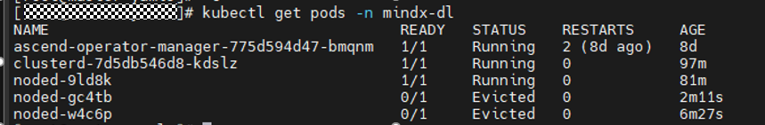
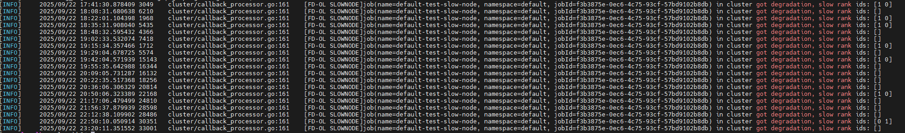
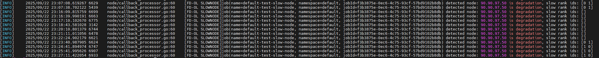
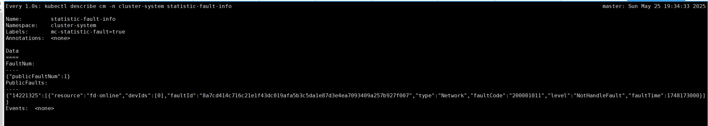

# 查询和验证故障

本章节仅用于验证故障是否被检测、诊断、汇聚和上报。

## 查询ConfigMap上报结果

- 每个计算节点的Ascend Device Plugin均会创建记录本节点NPU和灵衢总线设备信息的ConfigMap文件。该ConfigMap文件名为mindx-dl-deviceinfo-&lt;nodename&gt;（以下简称device-info-cm），故障信息会通过该ConfigMap进行上报。该ConfigMap文件中各字段的说明，请参见[ConfigMap说明](../../06_api/02_ascend_device_plugin.md#芯片资源)表。
- 每个计算节点的K8s RDMA Shared Dev Plugin均会创建记录本节点UB网卡故障信息的ConfigMap文件。该ConfigMap文件名为dpuinfo-&lt;nodename&gt;，UB网卡故障信息会通过该ConfigMap进行上报。该ConfigMap文件中各字段的说明，请参见[ConfigMap说明](../../06_api/11_k8s_rdma_shared_dev_plugin.md#table_dpuconfigmap_k8s_rdma_shared_dev_plugin)表。
- 当节点上存在节点故障时，每个计算节点的NodeD会创建记录本节点设备信息的ConfigMap文件。该ConfigMap文件名为mindx-dl-nodeinfo-&lt;nodename&gt;（以下简称node-info-cm），节点故障信息会通过该ConfigMap进行上报。该ConfigMap文件中各字段的说明，请参见[mindx-dl-nodeinfo-&lt;nodename&gt;](../../06_api/03_noded.md#节点资源)表。
- ClusterD会创建记录本集群设备信息的ConfigMap文件，该ConfigMap文件名为cluster-info-<device/switch>-<[0-5]>、cluster-info-node-cm（以下简称cluster-info-cm）。节点及芯片故障信息会通过[cluster-info-cm](../../06_api/04_clusterd/00_cluster_resources.md)进行上报。

相关查询入口：

- [Ascend Device Plugin故障信息](../../07_references/02_common_operations.md#ZH-CN_TOPIC_0000002479387086)
- [ClusterD故障信息](../../07_references/02_common_operations.md#ZH-CN_TOPIC_0000002511347035)
- [NodeD故障信息](../../07_references/02_common_operations.md#ZH-CN_TOPIC_0000002511427003)
- [UB网卡故障信息](../../07_references/02_common_operations.md#ZH-CN_TOPIC_0000002511347042)

## 查询pingmesh灵衢网络检测结果

### 查看检测结果信息<a name="zh-cn_topic_0000002193288232_section772614207398"></a>

>[!NOTE]
>检测结果查询周期为配置参数“task\_interval”的10倍。

灵衢网络检测的pingmesh结果写入文件&lt;nodename&gt;.log中。该文件中各字段的详细说明如下表所示。

**表 1**  &lt;nodename&gt;.log

<a name="zh-cn_topic_0000002193288232_table313985322113"></a>

|参数|说明|取值|
|--|--|--|
|uid|该次pingmesh任务的ID。|长度为64的字符串|
|config|该次pingmesh任务的用户配置。|字符串|
|physicID|NPU卡物理ID。|[0~15]|
|taskID|任务ID，0代表节点内部、1代表节点间。|0或1|
|DestNum|本次pingmesh目标地址数量。|[0~47]|
|source_addr|源地址|IPv4网络地址|
|target_addr|目标地址|IPv4网络地址|
|suc_pkt_num|发送成功的包数量。|-|
|fail_pkt_num|发送失败的包数量。|-|
|max_time|最长响应时间。|<ul><li>ping失败的时候，值为-1。</li><li>正常情况下为非负值。</li></ul>|
|min_time|最短响应时间。|<ul><li>ping失败的时候，值为-1。</li><li>正常情况下为非负值。</li></ul>|
|avg_time|平均响应时间。|<ul><li>ping失败的时候，值为-1。</li><li>正常情况下为非负值。</li></ul>|
|tp95_time|处于95%位置的响应时间。|<ul><li>ping失败的时候，值为-1。</li><li>正常情况下为非负值。</li></ul>|
|reply_stat_num|本次查询到的响应数量。|-|
|ping_total_num|本次任务累计的响应数量。|-|

### 查看故障信息<a name="zh-cn_topic_0000002193288232_section7712929183110"></a>

在管理节点上执行以下命令，查看灵衢网络检测的故障信息。

```shell
kubectl describe cm -n cluster-system pingmesh-fault-<nodename>
```

故障信息中各字段的详细说明如下所示。

**表 2**  pingmesh-fault-&lt;nodename&gt;

<a name="zh-cn_topic_0000002193288232_table2371535113510"></a>

|参数|说明|取值|
|--|--|--|
|mc-consumer-publicfault|ClusterD侦听所需的label key|true|
|PublicFault|公共故障信息key|详细说明请参见[fault字段说明](../../06_api/04_clusterd/03_public_fault_apis.md#configmap)表。|

## 查询性能劣化故障检测数据

- 落盘数据按rank进行分类，轻量profiling数据写在容器内的/user/cluster-info/profiling路径。
- 对于存在环境变量[MINDX\_TASK\_ID](../../06_api/13_environment_variable_description.md#ascend-operator环境变量说明)的Pod，rank 0数据在容器内的路径为/user/cluster-info/profiling/$MINDX\_TASK\_ID/0。

    >[!NOTE]
    >- 如无该环境变量，默认会落盘到名为default\_task\_id\_<i>时间戳</i>的文件夹内。
    >- /user/cluster-info/profiling达到配置的上限大小后，将进行文件老化，默认每次删除修改时间最早的20%个文件。不同TaskD版本的上限配置请参见：
    >    - 使用7.1.RC1及以上版本TaskD：PyTorch场景参考[“拉起TaskD Worker”步骤](./03_configuration/06_performance_diagnosis.md#li23023)；MindSpore场景参考[“拉起TaskD Worker”步骤](./03_configuration/06_performance_diagnosis.md#li2302301)。
    >    - 使用其他版本TaskD：PyTorch场景参考[步骤5](./03_configuration/06_performance_diagnosis.md#li230238965)；MindSpore场景参考[步骤3](./03_configuration/06_performance_diagnosis.md#li23023896501)。
    >- 轻量profiling文件以时间戳命名，各条记录以换行分割，每次追加写入rank下最新文件。最新文件大小超过10MB时，TaskD会新建profiling文件。如果使用NFS等网络存储方式，当数据同步较慢时，可能存在文件大小未达到10MB即创建新文件的情况。

## 查询慢节点诊断结果

在创建慢节点任务后，可通过查询ClusterD和NodeD的日志查看其诊断任务详情。

### 方式一：通过K8s日志查询集群侧慢节点诊断日志

1. 通过**kubectl get pods -n mindx-dl**命令，查询启动的ClusterD和NodeD节点数据。

    

2. 再使用<b>kubectl logs -n mindx-dl clusterd-7d5db546d8-kdslz | grep "got degradation, slow rank"</b>查询日志数据。
3. 若日志中出现如下图所示，则表明出现节点劣化。

    

### 方式二：通过落盘日志查询集群侧慢节点诊断日志

1. 使用<b>cat /var/log/mindx-dl.clusterd.clusterd.log | grep "got degradation, slow rank"</b>命令查询日志数据。
2. 若日志中出现如下图所示，则表明出现节点劣化。

    

### 方式三：查询节点侧的慢节点诊断日志

使用<b>kubectl logs -n mindx-dl node-9ld8k | grep "is degradation"</b>命令进行查询，若日志中出现如下图所示数据，则表明出现节点劣化。



### 已支持的慢节点网络故障<a name="zh-cn_topic_0000002278667326_section10496211245"></a>

<a name="zh-cn_topic_0000002278667326_table4804164084414"></a>

|故障码|故障说明|故障级别|
|--|--|--|
|110001010|慢节点故障，一次性消息上报。|SubHealthFault：亚健康故障。|
|100001011|故障劣化已恢复。|NotHandleFault：暂不处理故障。|

## 查询慢网络诊断结果

网络检测的pingmesh结果将写入文件&lt;nodename&gt;.log中，该文件中各字段的详细说明如下表所示。

**表 3**  &lt;nodename&gt;.log文件参数说明

<a name="zh-cn_topic_0000002313236861_table1485915561131"></a>

|参数|取值|说明|
|--|--|--|
|uid|长度为64的字符串|本次pingmesh任务的ID。|
|config|字符串|本次pingmesh任务的用户配置。|
|physicID|[0~15]|NPU卡物理ID。|
|taskID|<ul><li>节点内部的任务：0</li><li>节点间的任务：1</li></ul>|任务ID。|
|DestNum|[0~47]|本次pingmesh目标地址数量。|
|source_addr|IPv4网络地址|源地址。|
|target_addr|IPv4网络地址|目标地址。|
|suc_pkt_num|-|发送成功的包数量。|
|fail_pkt_num|-|发送失败的包数量。|
|max_time|<ul><li>正常情况：非负值</li><li>ping失败：-1</li></ul>|最长响应时间。|
|min_time|<ul><li>正常情况：非负值</li><li>ping失败：-1</li></ul>|最短响应时间。|
|avg_time|<ul><li>正常情况：非负值</li><li>ping失败：-1</li></ul>|平均响应时间。|
|tp95_time|<ul><li>正常情况：非负值</li><li>ping失败：-1</li></ul>|处于95%位置时的响应时间。|
|reply_stat_num|-|本次查询到的响应数量。|
|ping_total_num|-|本次任务累计的响应数量。|

### 查看gRPC上报结果<a name="zh-cn_topic_0000002313236861_section28851054410"></a>

慢网络诊断到故障，会通过gRPC上报至ClusterD的公共故障管理中心。

ConfigMap文件会显示相关信息，5秒钟之后自动清除。



### 已支持的慢网络故障<a name="zh-cn_topic_0000002313236861_section19919834124518"></a>

<a name="zh-cn_topic_0000002313236861_table4804164084414"></a>

|故障码|故障说明|故障级别|
|--|--|--|
|200001010|某节点中产生/恢复慢网络。|NotHandleFault：暂不处理故障。|
|200001011|超节点内的节点间产生/恢复慢网络。|NotHandleFault：暂不处理故障。|
|200001012|不是卡故障导致的慢网络。|NotHandleFault：暂不处理故障。|
