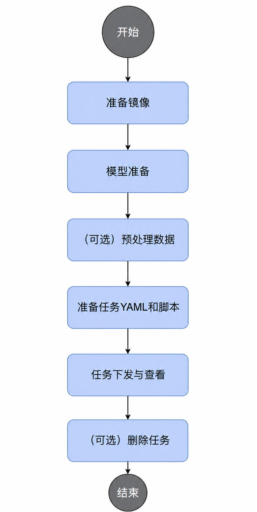

# 部署verl强化学习任务

## 实现原理

1. 集群调度组件定期上报节点和芯片信息。
    - kubelet上报节点芯片数量到节点对象Node中。
    - Ascend Device Plugin上报芯片拓扑和整卡信息：将芯片物理ID上报到device-info-cm；将可调度芯片总数（allocatable）、已使用芯片数（allocated）、芯片基础信息（device ip、super\_device\_ip）上报到Node，用于整卡调度。
    - 节点存在故障时，NodeD定期上报节点健康状态和硬件故障信息到node-info-cm；共享存储故障上报到ClusterD的公共故障中。
2. ClusterD读取device-info-cm、node-info-cm和公共故障信息，整合到cluster-info-cm。
3. 用户通过kubectl或其他深度学习平台下发verl框架的强化学习任务，Ascend Operator根据任务定义生成Master和Worker角色Pod。
4. Ascend Operator为任务创建PodGroup。
5. volcano-scheduler根据节点NPU数量、可用芯片、拓扑、标签和亲和性为Pod选择节点，并将分配的芯片信息写入Pod annotation。
6. kubelet创建容器时调用Ascend Device Plugin挂载NPU，Ascend Docker Runtime协助把设备挂载进容器。
7. Master和Worker容器执行启动脚本，启动脚本中执行ray集群的初始化操作，创建ray head及worker节点，使得verl框架能够基于ray识别到可用资源。
8. ray集群中NPU总数达到任务所需资源后，训练脚本通过`ray job submit`自动提交verl任务开始训练。

## 通过命令行使用

### 前提条件

- 确保Kubernetes集群中NPU节点已安装所需的MindCluster组件。
- 确保节点NPU、驱动及固件运行正常。
- 已准备好verl镜像、模型、数据集等。
- 宿主机已创建以下目录（可自行定义）：`/home/models`、`/home/dataset`、`/home/data`、`/home/checkpoints`、`/home/logs`。

### 流程说明

通过命令行使用MindCluster集群调度组件部署verl强化学习任务时，使用流程如下所示：



### 操作步骤

1. 准备镜像。

    本示例提供开箱即用的示例镜像`verl-sample:v26.2.0-fault-recover-cann9.0.0-torch_npu2.9.0.post2-910b-ubuntu22.04-py3.11-vllm`。用户也可根据所需自行制作镜像，或从[ascend/verl·Quay](https://quay.io/repository/ascend/verl?tab=tags&tag=latest)获取其他不同版本配置的基础镜像。本示例镜像可从AscendHub获取。

    本示例镜像基于以下社区官方基础镜像进行构建，镜像已包含verl、Ray、torch、CANN、vLLM等必要环境依赖，并集成verl-ascend-recipe中的fault_recover，可提供故障后的worker group重建及token级续推能力。

    ```text
    quay.io/ascend/verl:v0.8.0-cann9.0.0-torch_npu2.9.0.post2-910b-ubuntu22.04-py3.11-vllm
    ```

2. 模型准备。

    模型权重需自行从huggingface或其他平台下载，本示例使用[Qwen3-32B模型](https://www.modelscope.cn/models/Qwen/Qwen3-32B)。

    用户可自定义放置路径，但需在YAML文件中的挂载目录做相应修改。

3. （可选）预处理数据。

    本示例基于gsm8k原始数据集（可自行从[gsm8k·数据集](https://www.modelscope.cn/datasets/openai-mirror/gsm8k/files/)下载），需要进行预处理。如已完成数据处理可直接跳过，但请注意数据路径的正确性。

    将数据集放置于相应目录下，然后执行以下命令，并注意默认输出目录。

    ```shell
    python3 examples/data_preprocess/gsm8k.py --local_dataset_path /data/dataset/gsm8k/
    ```

4. 准备任务YAML和脚本。

    需要准备或修改的文件如下所示，可从[示例仓库](https://gitcode.com/Ascend/mindcluster-deploy/tree/master/samples/train/resumable-training/fault-tolerance/without-ranktable/pytorch/verl/grpo)获取基础示例文件，再根据实际场景进行定制修改：

    **表 1**  文件说明

    | 文件 | 作用 |
    | --- | --- |
    | `verl-grpo.yaml` | verl任务定义 |
    | `start_grpo.sh` | 容器启动脚本，负责初始化ray集群并拉起训练任务 |
    | `run_grpo_qwen3_32b_a3b_megatron.sh` | 训练启动脚本，通过ray job submit提交verl任务 |

    用户通过verl-grpo.yaml部署任务，YAML中配置了Pod启动后将调用`start_grpo.sh`初始化ray集群，在集群资源满足任务时，调用`run_grpo_qwen3_32b_a3b_megatron.sh`拉起verl任务。

    示例镜像已集成可用的`start_grpo.sh`与`run_grpo_qwen3_32b_a3b_megatron.sh`，位于容器/verl目录下，用于拉起A2场景的单节点Qwen3-32B模型的GRPO强化学习任务，用户可根据需要自行定制修改脚本。

    **参考verl-grpo.yaml**

    ```yaml
    apiVersion: mindxdl.gitee.com/v1
    kind: AscendJob
    metadata:
      name: mindspeed-rl
      labels:
        framework: pytorch
        fault-scheduling: "force"                 # must be force
        pod-rescheduling: "on"
        fault-retry-times: "100"
        ring-controller.atlas: ascend-910b
        subHealthyStrategy: "ignore"
      annotations:
    spec:
      schedulerName: volcano
      runPolicy:
        schedulingPolicy:
          minAvailable: 2
          queue: default
      successPolicy: AllWorkers
      replicaSpecs:
        Master:
          replicas: 1                             # Master must be force 1
          restartPolicy: Never                    # must be Never
          template:
            metadata:
              labels:
                ring-controller.atlas: ascend-910b
              annotations:
                huawei.com/skip-ascend-plugin: enabled
            spec:
              terminationGracePeriodSeconds: 0
              automountServiceAccountToken: false
              hostNetwork: false
              containers:
                - name: ascend                    # cannot modify
                  # image name, modify according to actual situation
                  image: verl-sample:v26.2.0-fault-recover-cann9.0.0-torch_npu2.9.0.post2-910b-ubuntu22.04-py3.11-vllm
                  imagePullPolicy: IfNotPresent
                  securityConext:
                    privileged: true
                  command:
                    - /bin/bash
                    - -c
                  # args, modify according to actual situation
                  args:
                    - |
                      cd /verl; bash start_grpo.sh;
                  env:
                    - name: PYTHONPATH
                      value: "/vllm"
                  ports:
                    - containerPort: 6666         # modify according to actual situation
                      name: ray-port
                    - containerPort: 8888         # modify according to actual situation
                      name: ray-dash-port
                  volumeMounts:
                    - name: ascend-driver
                      mountPath: /usr/local/Ascend/driver
                    - name: dshm
                      mountPath: /dev/shm
                    - name: localtime
                      mountPath: /etc/localtime
                    - name: dataset
                      mountPath: /data/dataset
                    - name: data-processed
                      mountPath: /root/data
                    - name: checkpoints
                      mountPath: /data/ckpt/Qwen3-32B-save/
                    - name: models
                      mountPath: /data/models
                    - name: logs
                      mountPath: /data/logs
              volumes:
                - name: ascend-driver
                  hostPath:
                    path: /usr/local/Ascend/driver
                - name: dshm
                  emptyDir:
                    medium: Memory
                - name: localtime
                  hostPath:
                    path: /etc/localtime
                - name: dataset
                  hostPath:
                    path: /home/dataset
                - name: data-processed
                  hostPath:
                    path: /home/data
                - name: checkpoints
                  hostPath:
                    path: /home/checkpoints
                - name: models
                  hostPath:
                    path: /home/models/Qwen
                - name: logs
                  hostPath:
                    path: /home/logs

        Worker:
          replicas: 1
          restartPolicy: Never
          template:
            metadata:
              labels:
                ring-controller.atlas: ascend-910b
            spec:
              terminationGracePeriodSeconds: 0
              automountServiceAccountToken: false
              hostNetwork: false
              containers:
                - name: ascend                    # cannot modify
                  # image name, modify according to actual situation
                  image: verl-sample:v26.2.0-fault-recover-cann9.0.0-torch_npu2.9.0.post2-910b-ubuntu22.04-py3.11-vllm
                  imagePullPolicy: IfNotPresent
                  command:
                    - /bin/bash
                    - -c
                  args:                           # modify according to actual situation
                    - |
                      cd /verl; bash start_grpo.sh;
                  env:
                    - name: PYTHONPATH
                      value: "/vllm"
                  resources:
                    limits:
                      huawei.com/Ascend910: 8
                    requests:
                      huawei.com/Ascend910: 8
                  volumeMounts:
                    - name: ascend-driver
                      mountPath: /usr/local/Ascend/driver
                    - name: dshm
                      mountPath: /dev/shm
                    - name: localtime
                      mountPath: /etc/localtime
                    - name: dataset
                      mountPath: /data/dataset
                    - name: data-processed
                      mountPath: /root/data
                    - name: checkpoints
                      mountPath: /data/ckpt/Qwen3-32B-save/
                    - name: models
                      mountPath: /data/models
                    - name: logs
                      mountPath: /data/logs

              volumes:
                - name: ascend-driver
                  hostPath:
                    path: /usr/local/Ascend/driver
                - name: dshm
                  emptyDir:
                    medium: Memory
                - name: localtime
                  hostPath:
                    path: /etc/localtime
                - name: dataset
                  hostPath:
                    path: /home/dataset
                - name: data-processed
                  hostPath:
                    path: /home/data
                - name: checkpoints
                  hostPath:
                    path: /home/checkpoints
                - name: models
                  hostPath:
                    path: /home/models/Qwen
                - name: logs
                  hostPath:
                    path: /home/logs
    ```

    **挂载关系**

    `verl-grpo.yaml`当前挂载关系如下，用户可根据实际情况修改：

    **表 2**  挂载关系

    | 宿主机路径 | 容器内路径 | 用途 |
    | --- | --- | --- |
    | `/home/models` | `/data/models` | 模型 |
    | `/home/dataset` | `/data/dataset` | 原始数据集 |
    | `/home/data` | `/root/data` | 预处理后的数据 |
    | `/home/checkpoints` | `/data/ckpt/Qwen3-32B-save/` | Checkpoint路径 |
    | `/home/logs` | `/data/logs` | 日志 |
    | `/usr/local/Ascend/driver` | `/usr/local/Ascend/driver` | NPU驱动 |

    **其他关键参数说明**

    **表 3**  verl-grpo.yaml参数说明

    | 参数 | 示例值 | 说明 |
    | --- | --- | --- |
    | `metadata.name` | `mindspeed-rl` | 任务名，决定Pod名前缀 |
    | `image` | `verl-sample:v26.2.0-fault-recover-cann9.0.0-torch_npu2.9.0.post2-910b-ubuntu22.04-py3.11-vllm` | 训练镜像 |
    | `minAvailable` | `2` | gang scheduling最少可调度副本数 |
    | `Master.replicas` | `1` | Master副本数，必须为1 |
    | `Worker.replicas` | `1` | Worker副本数 |
    | `Worker.resources` | `huawei.com/Ascend910: 8` | Worker申请的NPU数量 |
    | `Master.resources` | 无 | Master申请的NPU数量，若参与训练需配置 |
    | `ray-port` | `6666` | Ray Head GCS端口 |
    | `ray-dash-port` | `8888` | Ray Dashboard端口 |
    | `hostNetwork` | `false` | 是否使用宿主机网络 |

    **表 4**  start_grpo.sh参数说明

    | 变量 | 示例值 | 说明 |
    | --- | --- | --- |
    | `TP_SOCKET_IFNAME` | `data0.173` | 获取本机IP的网卡 |
    | `HCCL_SOCKET_IFNAME` | `data0.173` | HCCL通信网卡 |
    | `GLOO_SOCKET_IFNAME` | `data0.173` | GLOO通信网卡 |
    | `ServerPort` | `6666` | Ray Head端口 |
    | `DashboardPort` | `8888` | Ray Dashboard端口 |
    | `HCCL_HOST_SOCKET_PORT_RANGE` | `60000-60050` | HCCL在Host侧使用的通信端口范围 |
    | `HCCL_NPU_SOCKET_PORT_RANGE` | `61000-60050` | HCCL在Host侧使用的通信端口范围 |
    | `path_log_dir` | `/data/logs/$MINDX_TASK_ID/trainlog` | 训练日志目录 |
    | `NPU_PER_NODE` | `8` | 每节点NPU数，脚本根据`LOCAL_WORLD_SIZE`自动计算 |
    | `NNODES` | `2` | 节点数，脚本根据`WORLD_SIZE / LOCAL_WORLD_SIZE`自动计算 |

    以下变量由MindCluster注入：

    - `REPLICA_TYPE`：Master或Worker
    - `MASTER_ADDR`：Master节点地址
    - `WORLD_SIZE`：总卡数
    - `LOCAL_WORLD_SIZE`：每节点卡数
    - `MINDX_TASK_ID`：任务ID

    **表 5**  run_grpo_qwen3_32b_a3b_megatron.sh参数说明

    | 参数 | 示例值 | 说明 |
    | --- | --- | --- |
    | `MODEL_PATH` | `/data/models/Qwen3-32B` | 模型路径 |
    | `CKPTS_DIR` | `/data/ckpt/Qwen3-32B-save/` | Checkpoint输出目录 |
    | `TRAIN_FILE` | `/data/datasets/gsm8k-new/train.parquet` | 训练parquet路径 |
    | `TEST_FILE` | `/data/datasets/gsm8k-new/test.parquet` | 测试parquet路径 |
    | `train_tp` | `8` | 张量并行度 |
    | `train_pp` | `1` | 流水线并行度 |
    | `gen_tp` | `16` | vLLM张量并行度 |
    | `trainer.n_gpus_per_node` | `8` | 每节点NPU数 |
    | `trainer.nnodes` | `2` | 节点数 |
    | `trainer.save_freq` | `1` | Checkpoint保存频率 |
    | `trainer.total_training_steps` | `6` | 总训练步数 |

    以上参数需要用户根据任务实际情况进行修改。

5. 任务下发与查看。

    1. 下发任务。

        ```shell
        kubectl apply -f verl-grpo.yaml
        ```

    2. 查看Pod情况。

        ```shell
        kubectl get pod -n <namespace>
        ```

        确定所有Pod处于Running状态，容器启动后会自动执行训练脚本并提交Ray Job。

        ```ColdFusion
        NAMESPACE   NAME                          READY   STATUS    RESTARTS   AGE
        default     verl-test-master-0            1/1     Running   0          <time>
        default     verl-test-worker-0            1/1     Running   0          <time>
        ```

    3. 查看容器日志。

        ```shell
        kubectl logs mindspeed-rl-master-0 -f
        kubectl logs mindspeed-rl-worker-0 -f
        ```

    4. （可选）进入容器手动执行训练启动脚本。

        ```shell
        bash run_grpo_qwen3_32b_a3b_megatron.sh
        ```

    5. （可选）查看训练结果。

        ```shell
        ls /home/checkpoints/
        ls /home/logs/
        ```

        训练日志中出现`finished requests num: 0` 即开始正常训练。

6. （可选）删除任务。

      ```shell
      kubectl delete -f verl-grpo.yaml
      ```
