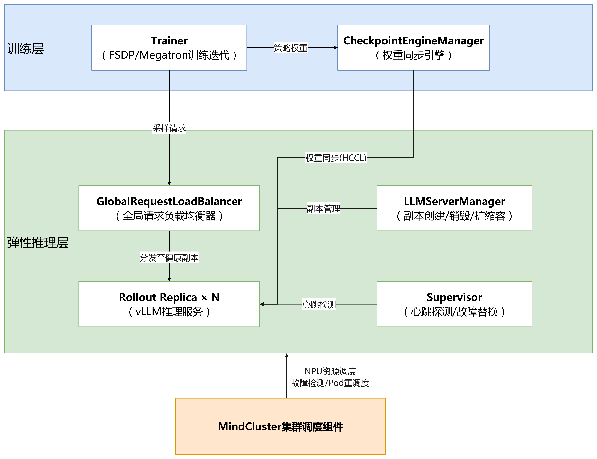

# 配置verl弹性推理容错

## 应用场景

强化学习（RL）训练任务通常由训练（Trainer）和推理采样（Rollout）两类角色交替协同完成，任务周期长达数小时至数天。随着集群规模增大，软硬件故障频发，当前RL任务存在如下痛点：

- **故障恢复粒度过粗**：任一Pod发生故障后，通常依赖Job级别重调度停止并重启所有训练容器，恢复时间随任务规模超线性劣化。
- **推理采样结果易丢失**：故障发生时，正在推理的prompt已生成的token全部作废，故障恢复后需要从头重新生成，浪费大量推理算力。
- **训推耦合导致故障域放大**：训练与推理部署在相同NPU资源上（共卡模式）时，推理侧的软件抖动（如vLLM进程hang、推理服务OOM）也会触发整个任务的故障处理，本可通过重试规避的故障被放大为任务级重调度。

为解决上述问题，verl-ascend-recipe提供[弹性推理容错](https://github.com/verl-project/verl-ascend-recipe/tree/main/rollout_elastic)特性，将推理采样从训练进程中拆分为独立的弹性推理层，提供推理实例故障的RAS能力：vLLM进程故障在业务层完成秒级自愈（请求重试、副本替换、token续推）；推理Pod级故障、NPU卡故障触发Pod重调度重建实例。整个过程训练不中断，不涉及Job级重调度。

>[!NOTE]
>本特性面向**训推分离部署**场景（推理使用独立的NPU资源），不适用于训推同步共卡部署模式。

## 关键功能

|功能名称| 说明                                                                       |
|--|--------------------------------------------------------------------------|
|执行模式| 提供fully-async（全异步）和one-step-off（一步偏差）两种训推分离执行模式，生成与训练重叠执行，提升训练效率。        |
|prompt重试| 单条prompt推理请求超时或失败时，自动切换到其他健康推理副本，并重试，无需人工介入。                             |
|token续推| 推理进程故障时，已生成的token增量持久化到存储；副本恢复后从断点继续生成，仅补推缺失的尾部token。                    |
|弹性扩缩容| 推理副本支持运行时扩容、缩容和故障替换，训练任务全程不中断。                                           |
|Pod重调度（前置依赖）| 推理Pod级故障、NPU卡故障时，依赖MindCluster故障检测与Pod重调度能力重建推理实例，不涉及Job级重调度，与业务层自愈形成互补。 |

## 整体架构

弹性推理容错特性将RL任务拆分为训练层和弹性推理层，两层之间通过权重同步链路和采样请求链路交互。架构如下所示：



其中各个部分的能力如下：

1. **Trainer（训练器）**：基于FSDP（Fully Sharded Data Parallel）或Megatron执行RL训练迭代，消费推理层返回的采样批次，通过CheckpointEngineManager向推理层同步最新策略权重。
2. **CheckpointEngineManager（权重同步引擎）**：管理训练侧到各推理副本的权重同步事务（昇腾环境使用HCCL通信域），支持成员动态增删和失败重试。
3. **LLMServerManager（推理副本管理器）**：负责推理副本（vLLM Server）的创建、销毁和弹性扩缩容。
4. **Rollout Replica（推理副本）**：独立部署的vLLM推理服务，承担prompt生成，可独立故障、替换和伸缩。
5. **GlobalRequestLoadBalancer（全局请求负载均衡器）**：将采样请求分发到健康副本，故障副本被标记后不再接收新请求。
6. **Supervisor（监督器）**：周期性心跳探测各副本，连续丢失心跳达到阈值后判定副本失效，触发隔离与替换。
7. **MindCluster集群调度组件**：负责NPU资源调度，故障检测与隔离，以及NPU卡故障、推理Pod级故障后的Pod重调度重建（Ascend Device Plugin、NodeD、ClusterD、Volcano、Ascend Operator等组件配合）。

## 端到端执行流程

弹性推理容错特性与MindCluster集群调度组件端到端配合执行，整体流程如下：

1. 用户下发RL训练任务，Volcano完成gang调度，将训练Pod和推理Pod调度到健康的NPU节点上。
2. 训练Pod启动后，初始化Ray集群并拉起verl任务；推理副本作为standalone服务启动，处于Pending状态，不接收请求。
3. 训练层完成首次权重同步后，推理副本被提升（promote）并加入负载均衡器，开始接收采样请求。
4. 训练与推理重叠执行：推理层持续或提前生成采样批次，训练层异步消费；权重按`trigger_parameter_sync_step`周期同步到推理副本。
5. 推理实例发生故障时（vLLM进程故障、NPU卡故障、推理Pod级故障），Supervisor、请求层或调度层检测到故障后执行实例级恢复：未完成prompt切换健康副本重试，故障副本从负载均衡器和权重同步组中移除；vLLM进程故障自动拉起替换副本，NPU卡故障、推理Pod级故障触发Pod重调度重建实例。**训练全程不中断，不涉及Job级重调度。**
6. 恢复后的推理实例完成权重同步后被提升（promote），重新加入负载均衡器继续提供采样服务。

## 支持的故障类型

本特性提供**推理实例故障**的RAS能力（故障检测、业务自愈与恢复）。训推分离部署下，单个推理Pod对应1个推理实例，推理实例故障时通过副本替换或Pod重调度完成实例级恢复，训练不中断，不涉及Job级重调度。支持的故障类型如下：

|故障类型|典型故障场景|检测机制|恢复方式|训练是否中断|
|--|--|--|--|--|
|vLLM进程故障|vLLM服务进程崩溃、hang、OOM，推理请求超时或返回错误|Supervisor心跳探测（`heartbeat_miss_threshold`）、单次调用超时（`server_call_timeout_s`）|业务层自愈（见下文故障自愈机制），训练不中断|否|
|NPU卡故障|推理副本所在NPU掉卡、芯片硬件故障|心跳探测失联、Ascend Device Plugin故障检测|故障副本移除；Pod重调度将推理实例重建到健康NPU，重新同步权重后提升（promote）|否|
|推理Pod级故障|推理Pod容器崩溃、OOM Kill、被驱逐|容器状态监测（Kubernetes）|Pod重调度重建推理实例（1 Pod = 1实例），重新同步权重后提升（promote）|否|

**故障自愈机制**

故障发生时，业务层按以下四个粒度逐级自愈，训练任务全程不中断：

|自愈粒度|触发场景|检测机制|自愈动作|训练是否中断|
|--|--|--|--|--|
|推理请求级|单条prompt请求超时、推理服务返回错误|请求超时（`server_call_timeout_s`）及响应错误|自动切换健康副本重试该prompt（prompt重试）|否|
|推理副本级|vLLM服务进程崩溃、OOM、副本失联无响应|Supervisor心跳探测连续丢失（`heartbeat_miss_threshold`）|副本隔离并自动拉起替换副本（弹性替换）|否|
|批次级|单批次内过多prompt重试耗尽仍失败|批次成功率低于阈值（`min_ok_ratio`）|成功率达标时仅保留成功prompt部分返回；低于阈值时丢弃该批次，所有批次均失败时生成任务终止|否（仅跳过该批次）|
|生成中断|推理过程中副本故障导致生成中断|请求失败或副本判死|基于持久化进度续推缺失尾部token（token续推）|否|

>[!NOTE]
>本特性仅覆盖推理实例故障。训练侧Pod、节点/芯片级故障不属于本特性处理范围，由MindCluster断点续训与重调度体系处理，详细说明请参见[故障处理](../04_fault_recovery/01_resumable_training/01_solutions_principles/01_fault_handling.md)。

**降级与边界说明**

|场景|行为|
|--|--|
|集群无空闲NPU，替换副本无法调度|任务以"N-1副本"降级运行，训练不中断；副本扩容可后续手动触发|
|token续推进度校验失败|自动降级为从头重新生成该prompt|
|单条prompt重试预算耗尽|计入批次失败率；批次成功率低于`min_ok_ratio`时丢弃该批次（训练不中断），所有批次均失败时生成任务终止、训练中断|
|同步训推共卡部署模式|不适用本特性|

## 使用约束

弹性推理容错特性存在以下使用约束：

- 一个K8s Pod内仅可部署一个推理实例（vLLM Replica），不支持一个Pod内部署多个推理实例。
- 同一时刻仅支持一个推理实例故障并恢复，不支持多个推理Pod同时故障。
- 仅支持vLLM推理实例故障，不支持SGLang、TrtLLM等其他推理框架实例故障，也不支持训练侧Pod故障。

支持范围如下：

|类别|支持范围|
|--|--|
|RL算法|PPO、GRPO|
|训练框架|Megatron、FSDP|
|推理引擎|vLLM|

## 使用步骤

弹性推理容错按以下步骤完成配置与启动：

### 步骤1：准备环境

1. 安装MindCluster集群调度组件（Volcano、Ascend Device Plugin、Ascend Docker Runtime、Ascend Operator、ClusterD），安装部署请参见[安装部署](../../05_developer_guide/00_installation_deployment/menu_installation_deployment.md)。
2. 参照[部署verl强化学习任务](./01_deploying_verl_reinforcement_learning_job.md)操作步骤1~3准备镜像、模型和数据集，并额外创建共享存储目录（如`/home/rollout_progress`），用于token续推进度持久化。
3. 安装指定版本verl（commit id为`dfc01f85`），支持以下两种方式：

    - 方式一：pip安装（推荐）

        ```shell
        pip install "verl @ git+https://github.com/verl-project/verl.git@dfc01f85"
        ```

        pip会自动clone仓库、checkout到该commit并构建安装，无需手动管理代码目录。

    - 方式二：git clone源码安装

        ```shell
        git clone https://github.com/verl-project/verl.git
        cd verl
        git checkout dfc01f85
        pip install -e .
        ```

        适合需要查看或修改verl源码的场景，安装后代码目录保留在本地。

4. 获取[verl-ascend-recipe代码](https://github.com/verl-project/verl-ascend-recipe)，将`rollout_elastic`目录与verl原生代码放置在同一目录下，使容器可导入该模块：

    ```shell
    git clone https://github.com/verl-project/verl-ascend-recipe.git
    ```

    挂载补丁通过环境变量开启（verl原生外部模块机制，不修改verl源码；示例脚本中已增加该配置）：

    ```shell
    export PYTHONPATH=<rollout_elastic父目录>:$PYTHONPATH
    export VERL_USE_EXTERNAL_MODULES=rollout_elastic.patch
    ```

5. 规划训推分离资源：推理副本使用独立NPU，并预留空闲NPU用于副本故障替换；无空闲资源时任务以"N-1副本"降级运行，不中断训练。
6. 确认任务所用的RL算法、训练框架和推理引擎符合[使用约束](#使用约束)中的支持范围。

### 步骤2：执行任务YAML脚本

1. 获取verl弹性推理容错示例（任务YAML、容器启动脚本、训练脚本），根据实际场景修改镜像、模型路径、数据路径和挂载目录。相关样例可参考[MindCluster-Samples](https://gitcode.com/Ascend/mindcluster-deploy/tree/master/samples/reinforcement-learning/verl/elastic-rollout)仓库的“samples/reinforcement-learning/verl/elastic-rollout”目录。
2. 确认任务YAML包含以下标注，用于开启故障检测与Pod重调度：NPU卡故障、推理Pod级故障时由重调度重建推理实例（不涉及Job级重调度），详细配置请参见[配置强化学习任务Pod重调度](./02_configuring_rescheduling_reinforcement_learning_job.md)。

    ```yaml
    metadata:
      labels:
        fault-scheduling: "force"            # 开启故障重调度（兜底）
        pod-rescheduling: "on"               # 开启Pod级重调度
        fault-retry-times: "100"             # 业务面故障无条件重试次数
    spec:
      template:
        metadata:
          annotations:
            huawei.com/recover_policy_path: pod   # （可选）恢复路径限制为Pod级重调度，不升级为Job级重调度；仅使用Volcano调度器时生效
    ```

3. 下发任务并查看Pod状态：

    ```shell
    kubectl apply -f verl-xxx.yaml
    kubectl get pod -n <namespace>
    ```

    所有Pod处于Running状态后，容器自动执行训练脚本；通过训练日志确认推理副本完成首次权重同步并被提升（promote），开始接收采样请求。

## 训练脚本关键参数说明

在训练启动脚本的verl配置中增加如下配置（示例脚本已集成，可按需修改）：

```yaml
actor_rollout_ref:
  rollout:
    mode: async                        # standalone异步推理（训推分离）
    calculate_log_probs: True
    checkpoint_engine:
      backend: "hccl"                  # 昇腾环境使用hccl，NVIDIA环境使用nccl

async_training:
  staleness_threshold: 0.1             # fully-async：样本最大陈旧度，超过后暂停生成
  trigger_parameter_sync_step: 4       # 每消费N个批次执行一次权重同步
  require_batches: 1                   # 每次同步消费的ppo_mini_batch数
  partial_rollout: True                # 权重同步后的中断生成续推
  fault_tolerance:
    enabled: True                      # 开启弹性推理容错（默认False，行为与原生verl完全一致）
    progress:
      enabled: True                    # 开启token续推
      persist_root: "checkpoints/rollout_progress"   # 进度持久化根目录（建议指向共享存储）
      flush_token_interval: 64         # 每生成N个token持久化一次进度
      model_version_policy:
        mode: "exact"                  # 续推版本门控：exact/relaxed/compatible

algorithm:
  rollout_correction:
    bypass_mode: True
```

**表 1** async_training参数说明

|参数| 默认值    |说明|
|--|--------|--|
|`staleness_threshold`| `0.1`  |fully-async模式下允许的样本最大陈旧度，队列中样本过于陈旧时暂停生成|
|`trigger_parameter_sync_step`| `4`    |训练侧每消费多少个批次触发一次向推理副本的权重同步|
|`require_batches`| `1`    |每次权重同步期间消费的mini-batch数量|
|`partial_rollout`| `True` |权重同步中止生成后，是否从断点续推|

**表 2** fault_tolerance故障容忍参数说明

|参数|默认值| 说明                               |
|--|--|----------------------------------|
|`enabled`|`False`| 弹性推理容错总开关，关闭时所有容错代码路径均不生效        |
|`heartbeat_interval_s`|`5.0`| Supervisor心跳探测周期，单位为秒            |
|`heartbeat_miss_threshold`|`3`| 连续丢失心跳次数达到该值即判定副本死亡              |
|`replace_dead_replicas`|`True`| 副本判死后是否自动拉起替换副本（仅standalone模式支持） |
|`max_request_retries`|`3`| 单条prompt跨副本重试的最大次数               |
|`request_timeout_s`|`600.0`| 单条prompt完整重试链路的总时间预算，单位为秒        |
|`server_call_timeout_s`|`120.0`| 单副本单次调用超时时间，超时触发重试，单位为秒          |
|`min_ok_ratio`|`0.5`| 批次最低成功率，低于该值时训练侧跳过该step          |

**表 3** fault_tolerance.progress（token续推）参数说明

|参数|默认值|说明|
|--|--|--|
|`enabled`|`False`|token续推开关，需与`fault_tolerance.enabled`同时开启|
|`persist_root`|`checkpoints/rollout_progress`|进度持久化根目录，多副本场景建议配置为共享存储路径|
|`flush_token_interval`|`64`|每生成多少个token持久化一次进度，值越小恢复时重推越少、持久化开销越大|
|`model_version_policy.mode`|`exact`|续推版本门控模式：<br>- `exact`：严格匹配权重版本<br>- `relaxed`：不校验<br>- `compatible`：版本缺失时放行|
|`write_timeout_s`|`30.0`|单次进度写入超时时间，单位为秒|
|`gc_delay_s`|`300.0`|进度记录完成后延迟回收时间，单位为秒|
|`gc_period_s`|`60.0`|后台垃圾回收周期，单位为秒|
