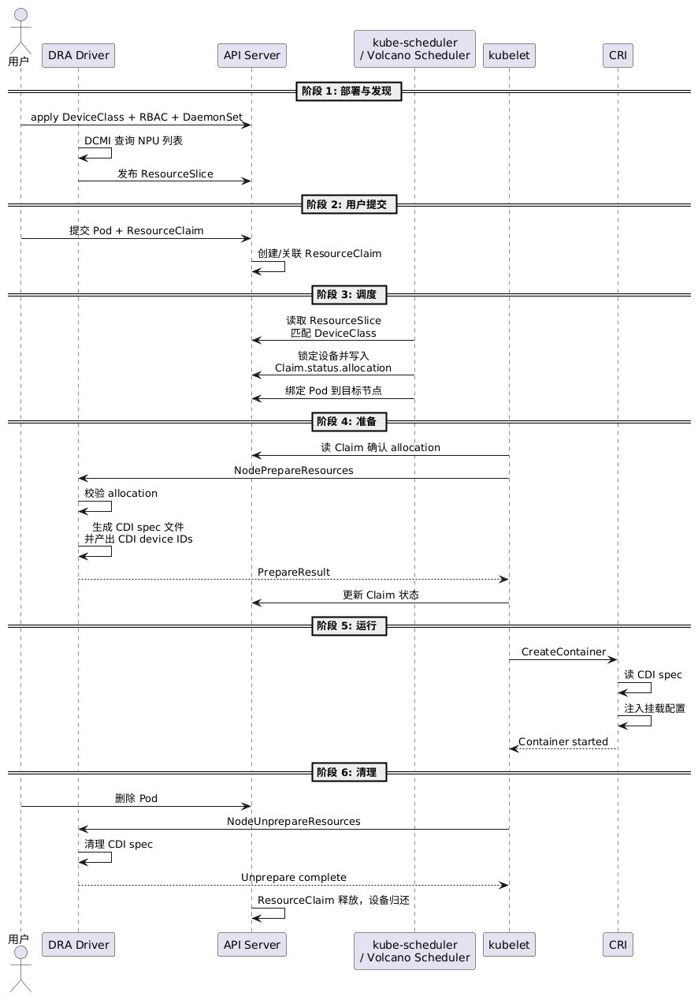

# 使用前必读

MindCluster集群调度组件支持通过Ascend Dynamic Resource Allocation（简称Ascend DRA）组件接入Kubernetes动态资源分配（Dynamic Resource Allocation，DRA）机制，实现NPU设备的发现、上报与按需分配。

本章节说明Ascend DRA组件的部署方法，并演示一次完整的Prepare（设备分配）与Unprepare（设备释放）流程，帮助用户理解DRA机制下NPU资源的生命周期管理。

## 概述

Ascend DRA组件以kubelet插件方式运行在每个计算节点上，基于Kubernetes DRA机制完成NPU资源管理。相比传统的Device Plugin + Extended Resource方式，DRA提供了更灵活的设备分配能力，支持按需选择具体设备并通过CDI（Container Device Interface）规范注入容器。

Ascend DRA组件的核心职责包括：

- **设备发现与上报**：启动时枚举本节点全部NPU设备，按ResourceSlice格式上报到API Server，供调度器感知可用资源。
- **设备分配（Prepare）**：当Pod引用了ResourceClaim并调度到本节点时，kubelet调用DRA插件为该Claim分配设备，生成CDI spec文件，并将CDI设备ID注入容器。
- **设备释放（Unprepare）**：当Pod删除时，kubelet调用DRA插件释放Claim对应的设备，清理CDI spec文件。
- **健康检查**：内置HTTP健康探针，配合Kubernetes livenessProbe机制探测组件存活状态。

## 生命周期

Ascend DRA组件的完整生命周期包含如下六个阶段：

- **部署与发现**：用户通过API Server下发DeviceClass、RBAC及DaemonSet；DRA组件启动后通过DCMI查询本节点NPU列表，并发布ResourceSlice到API Server。
- **用户提交**：用户提交引用了ResourceClaim的Pod，resourceclaim-controller负责创建并关联Claim。
- **调度**：kube-scheduler/Volcano Scheduler读取ResourceSlice匹配DeviceClass，锁定设备并写入Claim.status.allocation，将Pod绑定到目标节点。
- **准备（Prepare）**：kubelet读取Claim确认分配结果后调用DRA插件的NodePrepareResources回调；插件校验allocation，生成CDI spec文件并产出CDI device IDs返回给kubelet。
- **运行**：kubelet调用CRI创建容器，CRI自动合并静态与动态CDI spec，注入设备节点、挂载及环境变量。
- **清理（Unprepare）**：用户删除Pod后，kubelet调用DRA插件的NodeUnprepareResources回调，清理对应的CDI spec，Claim随之释放，设备归还资源池。

## 前提条件

在部署和使用Ascend DRA组件前，需要确保相关组件已经安装，若没有安装，可以参考[安装部署](../../03_installation_guide/02_installation/00_helm_installation.md)章节进行操作。

- Kubernetes集群版本 1.36.x。
- （可选）Volcano调度器。使用Volcano调度DRA任务时，ascend-volcano-plugin会对DRA任务旁路NPU专用调度逻辑。
- NPU节点已安装NPU驱动与固件，且设备运行正常。

> [!NOTE]
> Ascend DRA组件与Ascend Device Plugin是两种不同的设备接入方式。使用DRA方式时，节点上无需同时部署Ascend Device Plugin；若集群中同时存在两种接入方式的节点，请通过节点标签区分。

## 支持的产品形态

Ascend DRA组件支持的产品形态如下：

Atlas 200I/500 A2 推理产品
Atlas A2 训练系列产品
Atlas A2 推理系列产品
Atlas A3 训练系列产品
Atlas A3 推理系列产品
Ascend 950 系列产品

## 使用方式

MindCluster集群调度组件支持通过以下方式使用Ascend DRA组件：

- [部署DRA组件并运行Prepare/Unprepare验证](./01_deploying_dra_and_running_task.md)：通过部署DRA组件并下发引用ResourceClaim的任务，验证完整的设备分配与释放流程。

> [!NOTE]
> 关于Ascend DRA组件上报的ResourceSlice格式与健康检查接口的详细说明，请参见[Ascend Dynamic Resource Allocation](../../06_api/17_ascend_dynamic_resource_allocation_.md)。
