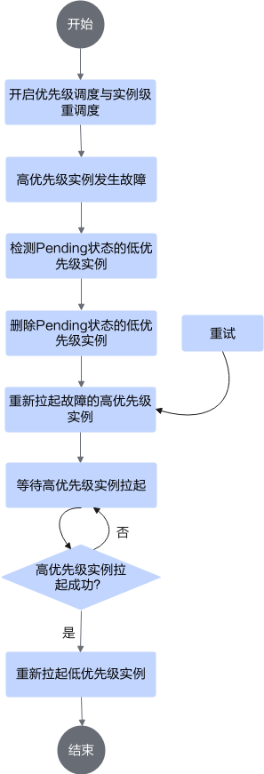

# 配置推理任务实例级重调度

当Infer Operator推理任务中出现节点、芯片或其他故障时，MindCluster集群调度组件可以对故障资源进行隔离并自动进行实例级重调度。如需了解故障的检测原理，请参见[故障检测](../resumable_training/01_solutions_principles.md#故障检测)章节。

## 前提条件

已完成Infer Operator服务部署，详细请参见[部署Infer Operator任务](./01_deploying_infer_operator_inference_job_with_vllm_proxy.md)。

## 重调度原理

Infer Operator在部署不同角色的实例时，会创建Deployment/StatefulSet（具体类型取决于配置项workload）对应实例，发生故障时，重调度故障Pod对应的整个实例。

当开启优先级调度，高优先级实例发生故障时，先删除Pending状态的低优先级实例，再重新拉起故障的高优先级实例，待高优先级实例拉起成功后，再拉起低优先级实例，以确保资源优先调度给高优先级实例。具体流程如[图1](#fig-priority-reschedule)所示。

**图 1**  开启优先级调度场景下的实例级重调度流程图

当需要适配其他服务化平台（例如：MindIE PyMotor）开启缩P保D特性时，需要同时配置开启优先级调度与实例级重调度。

## 配置实例级重调度

Infer operator任务配置实例级重调度示例如下，需修改以下加粗部分配置。相关配置项说明请参见[YAML参数说明](./01_deploying_infer_operator_inference_job_with_vllm_proxy.md#YAML参数说明)。
<pre codetype="yaml">
apiVersion: mindcluster.huawei.com/v1
kind: InferServiceSet
metadata:
  name: "my-test"
  namespace: default
spec:
  replicas: 1 # 推理服务副本数
  template:
    roles:
    - name: prefill # prefill定义
      replicas: 1   # prefill副本数
      workload:     # prefill中实例的CRD类型信息
        apiVersion: apps/v1
        kind: StatefulSet # workload类型，当前支持StatefulSet/Deployment
      metadata:
        labels:
          infer.huawei.com/gang-schedule: 'false' # 关闭gang调度，开启时会为每一个workload实例创建PodGroup
      spec:
        replicas: 1 # prefill中workload的pod副本数
        podManagementPolicy: Parallel # 此配置可不填，当workload为StatefulSet，且infer.huawei.com/gang-schedule为true时，需配置为Parallel
        selector:
          matchLabels:
            app: test-prefill # 用户自定义，需要与下面labels中app配置保持一致
        template:
          metadata:
            labels:
              app: test-prefill # 用户自定义，需要与下面labels中app配置保持一致
              <strong>fault-scheduling: 'external-force' # 开启实例级重调度</strong>
              fault-retry-times: '10'
              ring-controller.atlas: ascend-910b # 标识产品类型
            annotations:
              huawei.com/schedule_policy: chip8-node8 # 根据硬件形态设置
          spec:
            schedulerName: volcano # 指定调度器为Volcano
            containers:
            - name: prefill
              image: vllm-ascend:xxx # 自定义vllm镜像名
              ...
              resources:
                requests:
                  huawei.com/Ascend910: 8
                limits:
                  huawei.com/Ascend910: 8
              ... # 补充容器必要的挂载项与运行命令
    - name: decode  # decode定义
      replicas: 1   # decode副本数
      workload:     # decode中实例的CRD类型信息
        apiVersion: apps/v1
        kind: StatefulSet # workload类型，当前支持StatefulSet/Deployment
      metadata:
        labels:
          infer.huawei.com/gang-schedule: 'false' # 关闭gang调度，开启时会为每一个workload实例创建PodGroup
      spec:
        replicas: 1 # decode中workload的pod副本数
        podManagementPolicy: Parallel # 此配置可不填，当workload为StatefulSet，且infer.huawei.com/gang-schedule为true时，需配置为Parallel
        selector:
          matchLabels:
            app: test-decode # 用户自定义，需要与下面labels中app配置保持一致
        template:
          metadata:
            labels:
              app: test-decode # 用户自定义，需要与下面labels中app配置保持一致
              <strong>fault-scheduling: 'external-force' # 开启实例级重调度</strong>
              fault-retry-times: '10'
              ring-controller.atlas: ascend-910b # 标识产品类型
            annotations:
              huawei.com/schedule_policy: chip8-node8 # 根据硬件形态设置
          spec:
            schedulerName: volcano # 指定调度器为Volcano
            containers:
            - name: decode
              image: vllm-ascend:xxx # 自定义vllm镜像名
              ...
              resources:
                requests:
                  huawei.com/Ascend910: 8
                limits:
                  huawei.com/Ascend910: 8
              ... # 补充容器必要的挂载项与运行命令
    - name: router  # router定义
      replicas: 1   # router副本数
      services:     # router services定义，此处定义的service在一个角色范围内仅创建一个
      - name: vllm-router-service
        spec:
          ports:    # service的端口定义
          - port: 1026
            protocol: TCP
            targetPort: 1026
          selector:
            app: test-router # 用户自定义，需要与下面labels中app配置保持一致
          type: ClusterIP
      workload:     # router中实例的CRD类型信息
        apiVersion: apps/v1
        kind: Deployment # workload类型，当前支持StatefulSet/Deployment
      spec:
        replicas: 1 # router中workload的pod副本数
        selector:
          matchLabels:
            app: test-router # 用户自定义，需要与下面labels中app配置保持一致
        template:
          metadata:
            labels:
              app: test-router # 用户自定义，需要与下面labels中app配置保持一致
          spec:
            schedulerName: volcano # 指定调度器为Volcano
            containers:
            - name: router
              image: xxx:yyy # 自定义镜像名
              ... # 补充容器必要的挂载项与运行命令
</pre>
