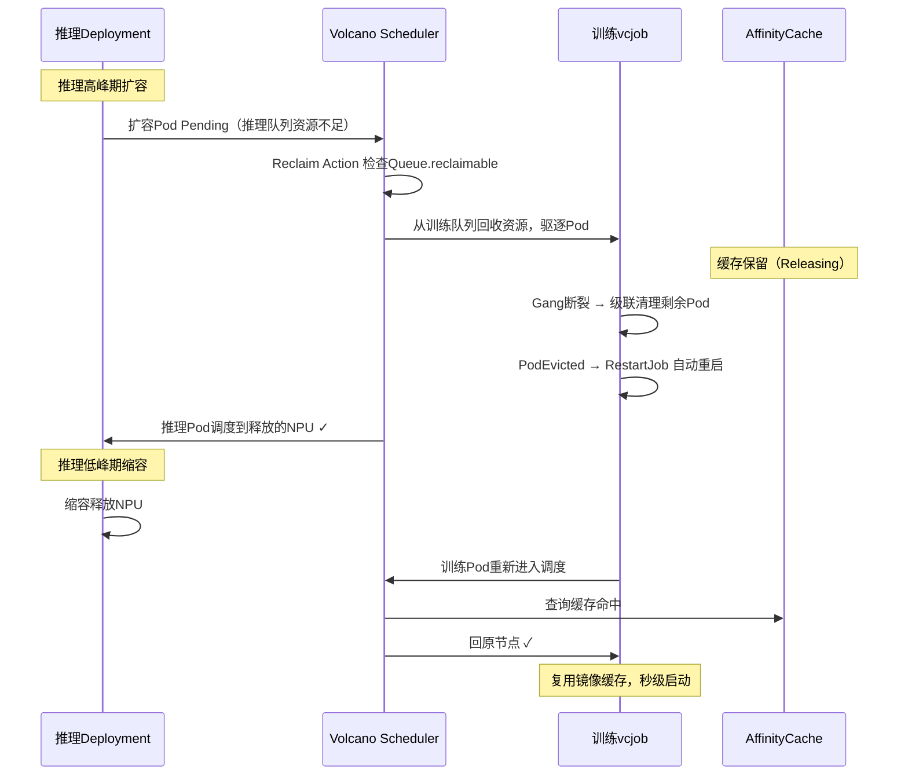

# 基于Reclaim的推理/训练任务交替运行<a name="ZH-CN_TOPIC_000000_reclaim_alternation"></a>

## 概述<a name="section_overview_reclaim"></a>

Reclaim（回收）是Volcano调度器的资源归还机制：高权重队列资源不足时，从低权重且`reclaimable: true`的队列中回收资源。与Preempt基于任务优先级不同，Reclaim基于队列权重，适合按业务线管理资源优先级。

在推理/训练共享集群中，训练队列设置`reclaimable: true`（可被回收），推理队列`reclaimable: false`。当推理队列资源不足时，从训练队列回收资源；当推理低峰期释放资源后，训练任务恢复运行。训练任务配置`minAvailable`等于`replicas`保证gang完整性，Pod被回收导致Job失败后由重调度模块自动触发Job重启，重建的Pod通过回原节点特性回到原节点。

## 实现原理<a name="section_principle_reclaim"></a>



## 操作步骤<a name="section_steps_reclaim"></a>

1. 创建Queue。

   ```yaml
   # 推理队列：高权重，不可被其他队列回收
   apiVersion: scheduling.volcano.sh/v1beta1
   kind: Queue
   metadata:
     name: inference
   spec:
     weight: 1
     reclaimable: false              # 推理队列资源不可被回收

   ---
   # 训练队列：低权重，可被高权重队列回收(集群默认存在，不需要额外部署)
   apiVersion: scheduling.volcano.sh/v1beta1
   kind: Queue
   metadata:
     name: default
   spec:
     weight: 1
     reclaimable: true               # 训练队列资源可被回收
   ```

2. 修改Scheduler Tier。

   修改Volcano调度器的ConfigMap（`volcano-scheduler-configmap`），删除`enqueue` action，增加`reclaim` action，并配置`gang`插件绕过gang保护：

   ```yaml
   data:
     volcano-scheduler.conf: |
       actions: "allocate, reclaim, backfill"  # 需要删除enqueue action，并增加reclaim action
       tiers:
       - plugins:
         - name: priority
           enableNodeOrder: false
         - name: gang
           enableNodeOrder: false
           enableReclaimable: false       # 绕过gang保护，允许回收任意训练Pod，例如训练任务的pod
         - name: conformance
           enableNodeOrder: false
         - name: volcano-npu_v26.1.0_linux-x86_64
       - plugins:
         - name: drf
           enableNodeOrder: false
         - name: predicates
           enableNodeOrder: false
         - name: proportion
           enableNodeOrder: false
         - name: nodeorder
         - name: binpack
           enableNodeOrder: false
       configurations:
         - name: init-params
           arguments: {"grace-over-time":"900","presetVirtualDevice":"true","nslb-version":"1.0","shared-tor-num":"2",
       "useClusterInfoManager":"true","self-maintain-available-card":"true","super-pod-size": "48", "reserve-nodes": "2",
       "forceEnqueue": "true", "prefer-previous-node": "true"}
   ```

3. 部署训练任务。

   ```yaml
   apiVersion: batch.volcano.sh/v1alpha1
   kind: Job
   metadata:
     name: train-job
     annotations:
       huawei.com/schedule_policy: chip4-node8
   spec:
     queue: default
     schedulerName: volcano
     policies:
     - event: PodEvicted              # pod被驱逐时，任务其他所有pod删除重启
       action: RestartJob
     minAvailable: 2                  # 等于replicas，保证gang完整性
     tasks:
     - replicas: 2
       name: test
       template:
         spec:
           containers:
           - name: training
             image: ubuntu:22.04
             command:
             - /bin/bash
             - -c
             - sleep inf
             resources:
               limits:
                 huawei.com/Ascend910: 8
               requests:
                 huawei.com/Ascend910: 8
   ```

   执行以下命令部署训练任务：

   ```bash
   kubectl apply -f train-job.yaml
   kubectl get pods -l volcano.sh/job-name=train-job -o wide
   kubectl describe pod -l volcano.sh/job-name=train-job | grep hccl/rankIndex
   ```

   > [!NOTE]
   > Reclaim方案下，训练队列`reclaimable: true` + `gang.enableReclaimable: false` 允许回收时绕过gang保护驱逐Pod。被回收后训练任务Pod数低于`minAvailable`，通常无法继续训练，对于vcjob场景可以在yaml中增加policies(event: PodEvicted, action: RestartJob)触发级联清理剩余Pod并重启Job。对于acjob场景，可以增加fault-retry-times和fault-scheduling标签触发重调度模块自动级联清理剩余Pod。重建的Pod通过回原节点特性优先回到原节点。

4. 部署推理任务。

   ```yaml
   apiVersion: apps/v1
   kind: Deployment
   metadata:
     name: inference-deploy
     labels:
       app: inference
   spec:
     replicas: 1                    # 推理副本数，可根据流量扩缩容
     selector:
       matchLabels:
         app: inference
     template:
       metadata:
         labels:
           app: inference
         annotations:
           huawei.com/schedule_policy: chip4-node8
           huawei.com/schedule_minAvailable: "1"
           scheduling.volcano.sh/queue-name: inference   # 需要指定任务属于inference队列
       spec:
         schedulerName: volcano
         containers:
         - name: inference
           image: ubuntu:22.04
           command:
           - /bin/bash
           - -c
           - sleep inf
           resources:
             limits:
               huawei.com/Ascend910: 8
             requests:
               huawei.com/Ascend910: 8
   ```

   执行以下命令部署推理任务及查看rankIndex对应的节点：

   ```bash
   kubectl apply -f inference-deploy.yaml
   kubectl get pods -l app=inference -o wide
   kubectl describe pod -l volcano.sh/job-name=train-job | grep hccl/rankIndex
   ```

5. 触发任务交替。

   **推理高峰期扩容（触发Reclaim回收训练资源），如果当前集群没有额外节点，那么会直接触发驱逐，不需要扩容：**

   ```bash
   kubectl scale deployment inference-deploy --replicas=2
   ```

   观察回收过程：

   ```bash
   # 观察推理Pod状态变化
   kubectl get pods -l app=inference -w

   # 观察训练Pod被驱逐
   kubectl get pods -l volcano.sh/job-name=train-job -w
   ```

   预期结果：推理新Pod进入Pending后，调度器从训练队列回收资源，训练Pod被驱逐，推理Pod调度到释放的NPU。训练Job触发`PodEvicted→RestartJob`策略，级联清理剩余Pod后自动重启，进入Pending等待资源。

   **推理低峰期缩容（释放NPU给训练任务）：**

   ```bash
   kubectl scale deployment inference-deploy --replicas=0
   ```

6. 验证回原节点。

   a. 查看训练Pod重新调度后的节点：

      ```bash
      kubectl get pods -l volcano.sh/job-name=train-job -o wide
      kubectl describe pod -l volcano.sh/job-name=train-job | grep hccl/rankIndex
      ```

   b. 查看调度器日志确认加分生效：

      ```bash
      kubectl logs -n volcano-system <volcano-scheduler-pod> | grep "addPreferPreviousNodeScore"
      # 输出示例:
      # addPreferPreviousNodeScore: task=train-job-test-0 rank=0 boosted selfNode=node-gpu-05 score=100000100
      ```

   训练Pod重建后所在节点应与驱逐前相同或高度一致。
