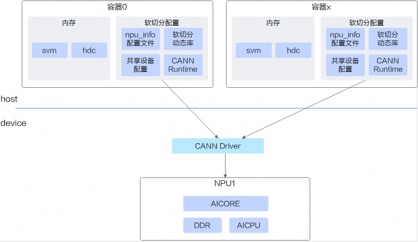

# 特性说明

基于vCANN-RT的虚拟化功能，是指通过向vCANN-RT提供软切分配置文件的方式，将物理机配置的NPU（昇腾AI处理器）挂载到容器中使用。

基于vCANN-RT的虚拟化实例功能具有以下优点：

- **降低使用门槛和成本**：多个用户可按需申请NPU资源，共同使用一张NPU卡的算力。
- **更细粒度的算力分配**：算力软切分方案基于时分复用，实现更细粒度的算力分配。

## 原理介绍

昇腾NPU硬件资源主要包括AICore（用于AI模型计算）、AICPU和内存等。基于vCANN-RT的虚拟化实例功能的核心原理是：根据用户指定的资源需求，以软切分配置文件的方式，通过vCANN-RT实现按需分配。例如，用户只需50% AICore的算力和2048MB高带宽内存时，系统会创建一个npu_info配置文件，通过vCANN-RT从NPU芯片获取上述资源提供给容器使用。基于vCANN-RT的虚拟化实例方案如[图1 基于vCANN-RT的虚拟化实例方案](#fig987114711574vcann)所示。

**图 1**  基于vCANN-RT的虚拟化实例方案

## 产品支持说明

**表 1**  产品支持情况说明

<table>
<thead align="left">
<tr>
<th class="cellrowborder" align="center" valign="center" width="30%">
产品系列
</th>
<th class="cellrowborder" align="center" valign="center" width="40%">
支持的场景
</th>
<th class="cellrowborder" align="center" valign="center" width="15%">
虚拟化方式
</th>
<th class="cellrowborder" align="center" valign="center" width="15%">
是否支持
</th>
</tr>
</thead>
<tbody align="left">
<tr>
<td class="cellrowborder" valign="top" width="30%"><term>Atlas A2 推理系列产品</term><ul><li>Atlas 800I A2 推理服务器</li></ul></td>
<td class="cellrowborder" rowspan="3" valign="center" width="40%">
在物理机生成软切分配置文件，挂载NPU和位置文件到容器
</td>
<td class="cellrowborder" rowspan="3" align="center" valign="center" width="15%">
软切分虚拟化
</td>
<td class="cellrowborder" rowspan="3" align="center" valign="center" width="10%">
是
</td>
</tr>
<tr>
<td class="cellrowborder" valign="top" width="30%"><term>Atlas A3 推理系列产品</term><ul><li>Atlas 800I A3 超节点服务器</li></ul></td>
</tr>
<tr>
<td class="cellrowborder" valign="top" width="30%"><term>Atlas 350 标卡</term></td>
</tr>
</tbody>
</table>

## 使用说明

- 软切分虚拟化基于[vCANN-RT](https://gitcode.com/openeuler/ubs-virt/blob/master/ubs-virt-enpu/vcann-rt/README.md)实现，直接将NPU重复挂载到多个容器，容器内的CANN按照配置好的比例使用NPU资源。
- 如果使用软切分虚拟化功能，请参见[软切分调度（推理）](./01_soft_allocation_scheduling_inference.md)章节进行操作。

## 使用约束

- 软切分虚拟化功能仅支持acjob任务类型。
- 在软切分虚拟化场景下，一个容器只能挂载一个NPU。
- 任务YAML中requests对应的数据表示请求的NPU的AICore百分比，不是真实NPU卡数。
- <term>Atlas A3 推理系列产品</term>使用软切分虚拟化功能时，必须开启单die直通模式，即在Ascend Device Plugin的YAML中，增加启动参数-useSingleDieMode=true。
- 物理NPU软切分虚拟化后，仅支持将物理NPU挂载到容器，不支持将该物理NPU直通到虚拟机。
- 在软切分虚拟化场景下，如果所有容器都挂载了相同的物理NPU，则该物理NPU必须采用相同的软切分策略。
- 由于硬件设备的限制(可以参考昇腾社区[使用约束](https://www.hiascend.com/document/detail/zh/canncommercial/900/programug/acldevg/aclcppdevg_000222.html))，建议vCANN-RT最大切分数量不超过单个device支持的最大用户进程数。
