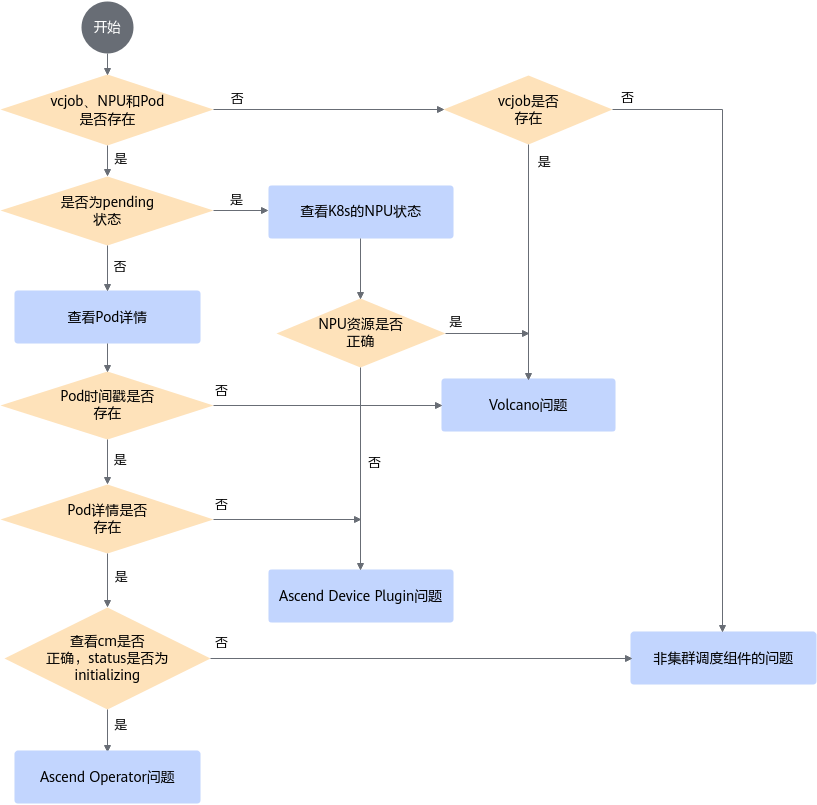

# FAQ

> 本文档中的FAQ已迁移至GitCode Issues，点击对应问题描述查看详情。

## 安装时出现的故障

- [初始化Kubernetes失败](https://gitcode.com/Ascend/mind-cluster/issues/338)
- [Kubernetes 1.25.10及以上版本，不支持vNPU的恢复使能功能](https://gitcode.com/Ascend/mind-cluster/issues/339)
- [使用1.24及以上版本的Kubernetes时，Docker使用失败](https://gitcode.com/Ascend/mind-cluster/issues/340)
- [Containerd作为Kubernetes容器引擎时，集群初始化失败](https://gitcode.com/Ascend/mind-cluster/issues/341)
- [组件Pod状态不为Running](https://gitcode.com/Ascend/mind-cluster/issues/342)
- [集群调度组件Pod处于ContainerCreating状态](https://gitcode.com/Ascend/mind-cluster/issues/343)
- [用户UID或GID被占用](https://gitcode.com/Ascend/mind-cluster/issues/337)
- [启动集群调度组件失败，日志打印"get sem errno =13"](https://gitcode.com/Ascend/mind-cluster/issues/390)
- [集群调度组件连接K8s异常](https://gitcode.com/Ascend/mind-cluster/issues/344)
- [组件启动YAML执行成功，找不到组件对应的Pod](https://gitcode.com/Ascend/mind-cluster/issues/345)
- [日志出现connecting to container runtime failed](https://gitcode.com/Ascend/mind-cluster/issues/346)
- [手动安装Volcano后，Pod状态为：CrashLoopBackOff](https://gitcode.com/Ascend/mind-cluster/issues/347)
- [Volcano组件工作异常，日志出现Failed to get plugin](https://gitcode.com/Ascend/mind-cluster/issues/348)
- [Ascend Operator日志打印Failed to watch \*v1alpha1.Job](https://gitcode.com/Ascend/mind-cluster/issues/349)
- [NPU Exporter检查动态路径失败，日志出现check uid or mode failed](https://gitcode.com/Ascend/mind-cluster/issues/350)

## 使用时出现的故障

### 故障定位流程

一般情况下，故障处理均需经历“收集信息 \> 定位故障 \> 排除故障”三个阶段。在收到告警信息后，通过收集故障现象信息、分析故障原因、定位故障、排除故障后，才可使业务恢复正常。常见的故障处理流程请参见[图1](#fig16356123319514)。

**图 1**  故障处理

- [kubelet重启后，NPU Exporter无法获取当前容器信息](https://gitcode.com/Ascend/mind-cluster/issues/321)
- [hccl.json文件没有生成](https://gitcode.com/Ascend/mind-cluster/issues/323)
- [K8s配置CPU绑核后无法使用npu-smi info](https://gitcode.com/Ascend/mind-cluster/issues/351)
- [训练任务处于Pending状态，原因：nodes are unavailable](https://gitcode.com/Ascend/mind-cluster/issues/352)
- [df -h执行失败，NFS启动失败](https://gitcode.com/Ascend/mind-cluster/issues/353)
- [手动删除vcjob后Pod一直处于Terminating状态](https://gitcode.com/Ascend/mind-cluster/issues/354)
- [资源不足时，任务处于Pending状态](https://gitcode.com/Ascend/mind-cluster/issues/355)
- [任务容器未成功挂载NPU](https://gitcode.com/Ascend/mind-cluster/issues/356)
- [配置正确情况下，NPU芯片故障不能触发重调度特性](https://gitcode.com/Ascend/mind-cluster/issues/357)
- [任务被重调度后Pod状态不一致](https://gitcode.com/Ascend/mind-cluster/issues/358)
- [使用动态虚拟化时，以普通用户运行推理业务失败](https://gitcode.com/Ascend/mind-cluster/issues/359)
- [使用Volcano v1.7.0版本，无法查询Pod状态](https://gitcode.com/Ascend/mind-cluster/issues/360)
- [执行.sh脚本，报$'\r': command not found异常](https://gitcode.com/Ascend/mind-cluster/issues/361)
- [使用Volcano和Ascend Operator组件场景下，业务面故障的任务所有Pod的Status全部变为Failed，任务无法触发无条件重试重调度](https://gitcode.com/Ascend/mind-cluster/issues/362)
- [执行盘古模型的训练任务时，报错提示No module named '\_sqlite3'](https://gitcode.com/Ascend/mind-cluster/issues/363)
- [执行PyTorch框架的训练任务时，提示找不到amp\_C](https://gitcode.com/Ascend/mind-cluster/issues/364)
- [同一芯片故障反复出现，导致训练任务中断反复进行重调度](https://gitcode.com/Ascend/mind-cluster/issues/365)
- [hostNetwork设置为true后，通信阻塞超时，任务失败](https://gitcode.com/Ascend/mind-cluster/issues/366)
- [ClusterD不上报ConfigMap](https://gitcode.com/Ascend/mind-cluster/issues/367)
- [启用进程级在线恢复后，报错There is unsafe data in the input tensor，恢复失败](https://gitcode.com/Ascend/mind-cluster/issues/368)
- [执行MindSpore框架的模型训练任务，在编译时报错The pointer\[origin\_node\_output\_addr\] is null](https://gitcode.com/Ascend/mind-cluster/issues/369)
- [NPU Exporter组件的Pod状态为CrashLoopBackOff](https://gitcode.com/Ascend/mind-cluster/issues/370)
- [执行kubectl命令报错：Error from server \(Forbidden\), can only create tokens for individual service accounts](https://gitcode.com/Ascend/mind-cluster/issues/371)
- [下发任务失败，未生成Pod](https://gitcode.com/Ascend/mind-cluster/issues/372)
- [vcjob任务未正常拉起，get event提示tasks in gang unschedulable: pod group is not ready, 1 minAvailable](https://gitcode.com/Ascend/mind-cluster/issues/373)
- [查看Pod日志出现报错：NPU is busy, check again](https://gitcode.com/Ascend/mind-cluster/issues/374)
- [公共故障的恢复消息丢失，导致故障芯片一直处于隔离状态](https://gitcode.com/Ascend/mind-cluster/issues/375)
- [任务申请的总芯片数量为32，sp-block设置为32可以正常训练，sp-block设置为16无法完成训练，训练容器报错提示初始化连接失败](https://gitcode.com/Ascend/mind-cluster/issues/377)
- [工作节点无训练任务执行，一直无法下发新的训练任务](https://gitcode.com/Ascend/mind-cluster/issues/378)
- [任务重调度之后，训练日志被覆盖](https://gitcode.com/Ascend/mind-cluster/issues/379)
- [Calico网络插件Not Ready](https://gitcode.com/Ascend/mind-cluster/issues/380)
- [训练进程报错退出，Pod状态非Error无法触发业务面重调度](https://gitcode.com/Ascend/mind-cluster/issues/381)
- [Node信息中Allocatable.huawei.com/Ascend910对应的芯片数量为8，下发8卡任务，任务处于Pending状态](https://gitcode.com/Ascend/mind-cluster/issues/382)
- [在Atlas 800 训练服务器上跑训练任务卡住，驱动日志报错：int\_process\_hwts\_sdma\_timeout](https://gitcode.com/Ascend/mind-cluster/issues/383)
- [同一个任务的不同Pod配置不同的nodeSelector导致重调度失败](https://gitcode.com/Ascend/mind-cluster/issues/385)
- [gRPC客户端与ClusterD连接时报错"too\_many\_pings"](https://gitcode.com/Ascend/mind-cluster/issues/386)
- [MindSpore断点续训场景报错重复注册](https://gitcode.com/Ascend/mind-cluster/issues/387)
- [进程级恢复时重建通信域失败](https://gitcode.com/Ascend/mind-cluster/issues/388)
- [npu-exporter自动重启、卡死、无法获取指标信息](https://gitcode.com/Ascend/mind-cluster/issues/395)
