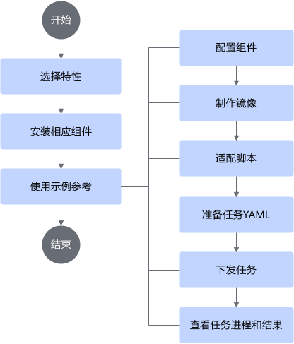

# 概述

集群调度组件基于业界流行的集群调度系统Kubernetes，增加了昇腾AI处理器（NPU）的支持，提供NPU资源管理、优化调度和分布式训练集合通信配置等基础功能。深度学习平台开发厂商可以有效减少底层资源调度相关软件开发工作量，使能用户基于MindCluster快速开发深度学习平台。

本文档是用户使用集群调度组件的指导文档，在安装和使用集群调度组件前，用户需要提前了解[集群调度组件的特性](./02_feature_description.md)，并根据具体特性的特点和功能，选择需要使用的特性并[安装相应的组件](../installation_guide/03_installation/manual_installation/00_obtaining_software_packages.md)。

## 使用流程

集群调度组件的安装和使用流程如下图所示。

**表 1**  使用流程

|步骤|描述|
|--|--|
|选择特性|集群调度组件支持训练任务和推理任务的多种特性。每种特性所需要的组件不同，组件的配置也各不相同。用户可以根据需要，选择相应的特性进行使用，支持多个特性同时使用。|
|安装相应组件|在选择特性后，需要安装相应的组件。组件的安装支持手动安装和使用工具安装。|
|使用示例参考|集群调度组件为用户提供全流程的特性使用示例，包括训练任务示例和推理任务示例。示例中包含集群调度组件支持的框架、模型和相应的脚本适配操作，帮助用户更好地了解和使用集群调度组件。|

## 免责声明

- 本文档可能包含第三方信息、产品、服务、软件、组件、数据或内容（统称“第三方内容”）。华为不控制且不对第三方内容承担任何责任，包括但不限于准确性、兼容性、可靠性、可用性、合法性、适当性、性能、不侵权、更新状态等，除非本文档另有明确说明。在本文档中提及或引用任何第三方内容不代表华为对第三方内容的认可或保证。
- 用户若需要第三方许可，须通过合法途径获取第三方许可，除非本文档另有明确说明。
