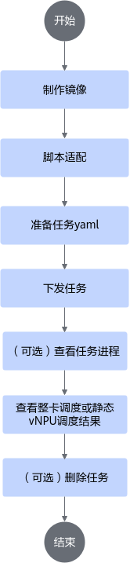
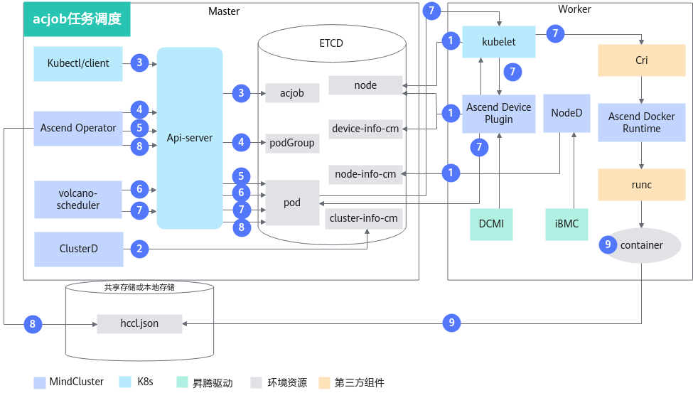
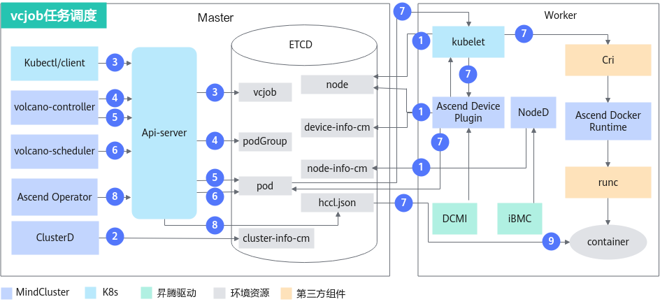
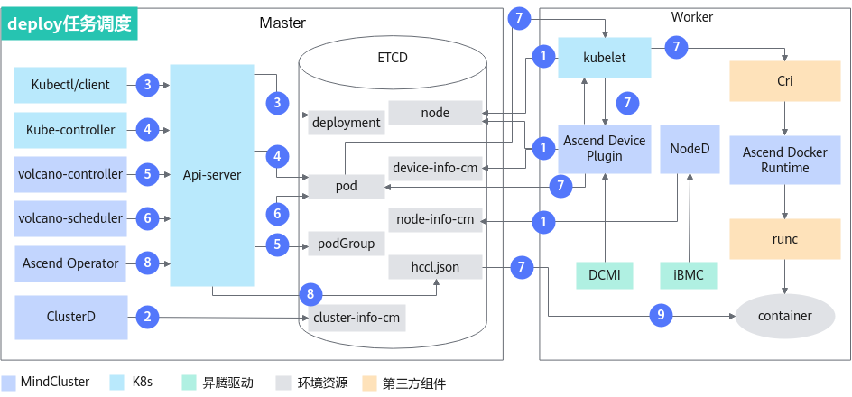

# 整卡调度（训练）<a name="ZH-CN_TOPIC_0000002479387138"></a>

## 使用前必读<a name="ZH-CN_TOPIC_0000002511347093"></a>

**前提条件<a name="section52051339787"></a>**

- 确保环境中有配置相应的存储方案，比如使用NFS（Network File System），用户可以参见[安装NFS](../../common_operations.md#安装nfs)进行操作。
- 在使用整卡调度特性前，需要确保相关组件已经安装，若没有安装，可以参考[安装部署](../../installation_guide//02_installation/manual_installation/00_obtaining_software_packages.md)章节进行操作。
    - 调度器（Volcano或其他调度器）
    - Ascend Device Plugin
    - Ascend Docker Runtime
    - Ascend Operator
    - ClusterD
    - NodeD

- 对于训练任务类型为acjob，调度器为Volcano的整卡调度，支持批量创建Pod和批量调度功能。
    - 若要使用批量创建Pod功能，安装Ascend Operator组件时需使用openFuyao定制Kubernetes组件。
    - 若要使用批量调度功能，安装Volcano组件时需使用openFuyao定制Kubernetes和volcano-ext组件，并开启批量调度功能。
    - 批量调度功能适用于超大规模集群场景，在此场景下请根据实际需要扩展MindCluster组件分配的CPU和内存资源，防止MindCluster组件出现性能不足或者超出分配内存使用，导致组件被Kubernetes驱逐。

**使用方式<a name="section179431435174811"></a>**

- 通过命令行使用：整卡调度特性需要使用调度器，用户可以选择使用Volcano调度器和其他调度器。无论选择哪种调度器，都需要使用Ascend Operator组件设置资源信息。
- 集成后使用：将集群调度组件集成到已有的第三方AI平台或者基于集群调度组件开发的AI平台。

**使用说明<a name="section577625973520"></a>**

- 资源监测可以和训练场景下的所有特性一起使用。
- 集群中同时跑多个训练任务，每个任务使用的特性可以不同。

**支持的产品形态<a name="section169961844182917"></a>**

- 支持以下产品使用**整卡调度**。
    - Atlas 训练系列产品
    - <term>Atlas A2 训练系列产品</term>
    - <term>Atlas A3 训练系列产品</term>

**使用流程<a name="section5640184231810"></a>**

整卡调度有3种使用场景，分别是通过命令行使用（Volcano）、通过命令行使用（其他调度器）和集成后使用。

通过命令行使用Volcano和其他调度器的使用流程一致。使用其他调度器准备任务YAML需要参考[通过命令行使用（其他调度器）](#通过命令行使用其他调度器)章节创建任务YAML。使用其他调度器的其余操作和使用Volcano一致，可以参考[通过命令行使用（Volcano）](#通过命令行使用volcano)进行操作。

**图 1**  整卡调度使用流程<a name="fig107864120214"></a>


1. 脚本适配时，用户可根据实际情况选择通过环境变量或文件配置资源信息。
2. 在准备任务YAML时，下发的任务YAML需要根据具体的NPU型号，选择不同的YAML进行修改适配。选择YAML时可以参考[准备任务YAML](#准备任务yaml)，根据实际情况选择合适的YAML。

## 实现原理<a name="ZH-CN_TOPIC_0000002479387150"></a>

根据训练任务类型的不同，特性的原理图略有差异。

**acjob任务<a name="section9971431567"></a>**

acjob任务原理图如[图1](#fig5188536014)所示。

**图 1**  acjob任务调度原理图<a name="fig5188536014"></a>


各步骤说明如下：

1. 集群调度组件定期上报节点和芯片信息。
    - kubelet上报节点芯片数量到节点对象（node）中。
    - Ascend Device Plugin定期上报芯片拓扑信息。
        - 上报整卡信息。将芯片的物理ID上报到device-info-cm中；可调度的芯片总数量（allocatable）、已使用的芯片数量（allocated）和芯片的基础信息（device ip和super\_device\_ip）上报到Node中，用于整卡调度。

    - 当节点上存在故障时，NodeD定期上报节点健康状态、节点硬件故障信息、节点DPC共享存储故障信息到node-info-cm中。

2. ClusterD读取device-info-cm和node-info-cm中信息后，将信息写入cluster-info-cm。
3. 用户通过kubectl或者其他深度学习平台下发acjob任务。
4. Ascend Operator为任务创建相应的PodGroup。关于PodGroup的详细说明，可以参考[开源Volcano官方文档](https://volcano.sh/zh/docs/v1-9-0/podgroup/)。
5. Ascend Operator为任务创建相应的Pod，并在容器中注入集合通信所需环境变量。
6. volcano-scheduler根据节点和芯片拓扑信息为任务选择合适节点，并在Pod的annotation上写入选择的整卡信息。

7. kubelet创建容器时，调用Ascend Device Plugin挂载芯片，Ascend Device Plugin或volcano-scheduler在Pod的annotation上写入芯片信息。Ascend Docker Runtime协助挂载相应资源。
8. Ascend Operator读取Pod的annotation信息，将相关信息写入hccl.json。
9. 容器读取环境变量或者hccl.json信息，建立通信通道，开始执行训练任务。

**vcjob任务<a name="section13884164615313"></a>**

vcjob任务的原理图如[图2](#fig8717151315416)所示。

**图 2**  vcjob任务调度原理图<a name="fig8717151315416"></a>


各步骤说明如下：

1. 集群调度组件定期上报节点和芯片信息。
    - kubelet上报节点芯片数量到节点对象（node）中。
    - Ascend Device Plugin定期上报芯片拓扑信息。
        - 上报整卡信息。将芯片的物理ID上报到device-info-cm中；可调度的芯片总数量（allocatable）和已使用的芯片数量（allocated）上报到Node中，用于整卡调度。

    - 当节点上存在故障时，NodeD定期上报节点健康状态、节点硬件故障信息、节点DPC共享存储故障信息到node-info-cm中。

2. ClusterD读取device-info-cm和node-info-cm中信息后，将信息写入cluster-info-cm。
3. 用户通过kubectl或者其他深度学习平台下发vcjob任务。
4. volcano-controller为任务创建相应PodGroup。关于PodGroup的详细说明，可以参考[开源Volcano官方文档](https://volcano.sh/zh/docs/v1-9-0/podgroup/)。
5. 当集群资源满足任务要求时，volcano-controller创建任务Pod。
6. volcano-scheduler根据节点和芯片拓扑信息为任务选择合适节点，并在Pod的annotation上写入选择的整卡信息。

7. kubelet创建容器时，调用Ascend Device Plugin挂载芯片，Ascend Device Plugin在Pod的annotation上写入芯片信息。Ascend Docker Runtime协助挂载相应资源，将hccl.json挂载进入容器。
8. Ascend Operator获取每个Pod的annotation信息，写入hccl.json。
9. 容器读取hccl.json信息，建立通信渠道，开始执行训练任务。

**deploy任务<a name="section32752223579"></a>**

deploy任务原理图如[图3](#fig06571541566)所示。

**图 3**  deploy任务调度原理图<a name="fig06571541566"></a>


各步骤说明如下：

1. 集群调度组件定期上报节点和芯片信息。
    - kubelet上报节点芯片数量到节点对象（node）中。
    - Ascend Device Plugin定期上报芯片拓扑信息。
        - 上报整卡信息。将芯片的物理ID上报到device-info-cm中；可调度的芯片总数量（allocatable）和已使用的芯片数量（allocated）上报到Node中，用于整卡调度。

    - 当节点上存在故障时，NodeD定期上报节点健康状态、节点硬件故障信息、节点DPC共享存储故障信息到node-info-cm中。

2. ClusterD读取device-info-cm和node-info-cm中信息后，将信息写入cluster-info-cm。
3. 用户通过kubectl或者其他深度学习平台下发deploy任务。
4. kube-controller为任务创建相应Pod。
5. volcano-controller创建任务PodGroup。关于PodGroup的详细说明，可以参考[开源Volcano官方文档](https://volcano.sh/zh/docs/v1-9-0/podgroup/)。
6. volcano-scheduler根据节点和芯片拓扑信息为任务选择合适节点，并在Pod的annotation上写入选择的整卡信息。

7. kubelet创建容器时，调用Ascend Device Plugin挂载芯片，Ascend Device Plugin在Pod的annotation上写入芯片信息。Ascend Docker Runtime协助挂载相应资源，将hccl.json挂载进入容器。
8. Ascend Operator获取每个Pod的annotation信息，写入hccl.json。
9. 容器读取hccl.json信息，建立通信渠道，开始执行训练任务。

## 通过命令行使用（Volcano）<a name="ZH-CN_TOPIC_0000002479227158"></a>

### 制作镜像<a name="ZH-CN_TOPIC_0000002479227164"></a>

**获取训练镜像<a name="zh-cn_topic_0000001609314597_section971616541059"></a>**

可选择以下方式中的一种来获取训练镜像：

- （推荐）从[昇腾镜像仓库](https://www.hiascend.com/developer/ascendhub)根据系统架构（ARM/x86\_64）、模型框架（PyTorch、MindSpore）下载配套驱动版本的**训练基础镜像**。基于训练基础镜像进行修改，将容器中默认用户修改为root（21.0.4版本之后训练基础镜像默认用户为非root）。基础镜像中不包含训练脚本、代码等文件，训练时通常使用挂载的方式将训练脚本、代码等文件映射到容器内。
- 从头开始定制用户自己的训练镜像，制作过程请参考[制作镜像](../../common_operations.md#制作镜像)中制作容器相关章节。

可将下载/制作的训练基础镜像重命名，如：training:v26.0.0。

**加固镜像<a name="zh-cn_topic_0000001609314597_section8425732111611"></a>**

下载或者制作的训练基础镜像可以进行安全加固，提升镜像安全性，可参见[容器安全加固](../../security_hardening.md#容器安全加固)章节进行操作。

### 脚本适配<a name="ZH-CN_TOPIC_0000002511347097"></a>

#### 通过环境变量配置资源信息<a name="ZH-CN_TOPIC_0000002479387142"></a>

根据模型框架选择对应的指导示例。

- [PyTorch](#zh-cn_topic_0000001558834814_section17760205783316)
- [MindSpore](#zh-cn_topic_0000001558834814_section868111733711)

    >[!NOTE]
    >- 本节中使用的数据集为[ImageNet2012](https://image-net.org/challenges/LSVRC/2012/2012-downloads.php)数据集（**注：如使用该数据集需遵循数据集提供者的使用规范**）。
    >- 下文中模型示例代码可能与实际版本存在差异，请以实际版本代码为准。
    >- 以下MindSpore示例需使用CANN 8.5.0之前版本。

**PyTorch<a name="zh-cn_topic_0000001558834814_section17760205783316"></a>**

1. <a name="zh-cn_topic_0000001558834814_li1298552813512"></a>下载[PyTorch代码仓](https://gitcode.com/Ascend/ModelZoo-PyTorch/tree/master/PyTorch/built-in/cv/classification/ResNet50_ID4149_for_PyTorch)中master分支的“ResNet50\_ID4149\_for\_PyTorch”作为训练代码。
2. 自行准备ResNet50对应的数据集，使用时请遵守对应规范。
3. 管理员用户上传数据集到存储节点。
    1. 进入“/data/atlas\_dls/public”目录，将数据集上传到任意位置，如“/data/atlas\_dls/public/dataset/resnet50/imagenet”。

        ```shell
        root@ubuntu:/data/atlas_dls/public/dataset/resnet50/imagenet# pwd
        ```

        回显示例如下：

        ```ColdFusion
        /data/atlas_dls/public/dataset/resnet50/imagenet
        ```

    2. 执行**du -sh**命令，查看数据集大小。

        ```shell
        root@ubuntu:/data/atlas_dls/public/dataset/resnet50/imagenet# du -sh
        ```

        回显示例如下：

        ```ColdFusion
        11G
        ```

4. 将[步骤1](#zh-cn_topic_0000001558834814_li1298552813512)中下载的训练代码解压到本地，将解压后的训练代码中“ModelZoo-PyTorch/PyTorch/built-in/cv/classification/ResNet50\_ID4149\_for\_PyTorch”目录上传至环境，如“/data/atlas\_dls/public/code/”路径下。
5. 在“/data/atlas\_dls/public/code/ResNet50\_ID4149\_for\_PyTorch”路径下，注释或删除main.py文件中的加粗字段。

    <pre codetype="Python">
    def main():
        args = parser.parse_args()
        os.environ['MASTER_ADDR'] = args.addr
        <strong>#os.environ['MASTER_PORT'] = '29501'  # 注释或删除该行代码</strong>
        if os.getenv('ALLOW_FP32', False) and os.getenv('ALLOW_HF32', False):
            raise RuntimeError('ALLOW_FP32 and ALLOW_HF32 cannot be set at the same time!')
        elif os.getenv('ALLOW_HF32', False):
            torch.npu.conv.allow_hf32 = True
        elif os.getenv('ALLOW_FP32', False):
            torch.npu.conv.allow_hf32 = False
            torch.npu.matmul.allow_hf32 = False</pre>

6. 进入“[mindcluster-deploy](https://gitcode.com/Ascend/mindxdl-deploy)”仓库，根据[mindcluster-deploy开源仓版本说明](../../appendix.md#mindcluster-deploy开源仓版本说明)进入版本对应分支。获取“samples/train/basic-training/without-ranktable/pytorch”目录中的train\_start.sh，在“/data/atlas\_dls/public/code/ResNet50\_ID4149\_for\_PyTorch/scripts”路径下，构造如下的目录结构。

    ```text
    root@ubuntu:/data/atlas_dls/public/code/ResNet50_ID4149_for_PyTorch/scripts#
    scripts/
         ├── train_start.sh
    ```

**MindSpore<a name="zh-cn_topic_0000001558834814_section868111733711"></a>**

1. <a name="zh-cn_topic_0000001558834814_li1141932513379"></a>下载[MindSpore代码仓](https://gitee.com/mindspore/models/tree/master/official/cv/ResNet)中master分支的“ResNet”代码作为训练代码。
2. 自行准备ResNet50对应的数据集，使用时请遵守对应规范。
3. 管理员用户上传数据集到存储节点。
    1. 进入“/data/atlas\_dls/public”目录，将数据集上传到任意位置，如“/data/atlas\_dls/public/dataset/imagenet”。

        ```shell
        root@ubuntu:/data/atlas_dls/public/dataset/imagenet# pwd
        ```

        回显示例如下：

        ```ColdFusion
        /data/atlas_dls/public/dataset/imagenet
        ```

    2. 执行**du -sh**命令，查看数据集大小。

        ```shell
        root@ubuntu:/data/atlas_dls/public/dataset/imagenet# du -sh
        ```

        回显示例如下：

        ```ColdFusion
        11G
        ```

4. 在本地解压[步骤1](#zh-cn_topic_0000001558834814_li1141932513379)中下载的训练代码，将“models/official/cv/”下的“ResNet”目录重命名为“ResNet50\_for\_MindSpore\_2.0\_code”。后续步骤以“ResNet50\_for\_MindSpore\_2.0\_code”目录为例。
5. 将ResNet50\_for\_MindSpore\_2.0\_code文件上传至环境“/data/atlas\_dls/public/code/”路径下。
6. 进入“[mindcluster-deploy](https://gitcode.com/Ascend/mindxdl-deploy)”仓库，根据[mindcluster-deploy开源仓版本说明](../../appendix.md#mindcluster-deploy开源仓版本说明)进入版本对应分支。获取“samples/train/basic-training/without-ranktable/mindspore”目录中的“train\_start.sh”文件，结合训练代码中“scripts”目录，在host上构造如下的目录结构。

    ```text
    root@ubuntu:/data/atlas_dls/public/code/ResNet50_for_MindSpore_2.0_code/scripts/#
    scripts/
    ├── docker_start.sh
    ├── run_standalone_train_gpu.sh
    ├── run_standalone_train.sh
     ...
    └── train_start.sh
    ```

7. 进入“/data/atlas\_dls/public/code/ResNet50\_for\_MindSpore\_2.0\_code/train.py”目录下，修改train.py对应部分，如下所示。

    ```Python
     ...
         if config.run_distribute:
             if target == "Ascend":
               #device_id = int(os.getenv('DEVICE_ID', '0'))   #注释该行代码
               #ms.set_context(device_id=device_id)     #注释该行代码
                 ms.set_auto_parallel_context(device_num=config.device_num, parallel_mode=ms.ParallelMode.DATA_PARALLEL,
                                              gradients_mean=True)
                 set_algo_parameters(elementwise_op_strategy_follow=True)
                 if config.net_name == "resnet50" or config.net_name == "se-resnet50":
                     if config.boost_mode not in ["O1", "O2"]:
                         ms.set_auto_parallel_context(all_reduce_fusion_config=config.all_reduce_fusion_config)
                 elif config.net_name in ["resnet101", "resnet152"]:
                     ms.set_auto_parallel_context(all_reduce_fusion_config=config.all_reduce_fusion_config)
                 init()
             # GPU target
     ...
    ```

#### 通过文件配置资源信息<a name="ZH-CN_TOPIC_0000002479387136"></a>

通过文件变量配置资源信息支持创建以下3种类型的对象：acjob、vcjob及deploy。下面将以vcjob和deploy为例，介绍脚本适配的操作示例。

- [PyTorch](#zh-cn_topic_0000001558834798_section17760205783316)
- [MindSpore](#zh-cn_topic_0000001558834798_section868111733711)

>[!NOTE]
>
>- 本节中使用的数据集为[ImageNet2012](https://image-net.org/challenges/LSVRC/2012/2012-downloads.php)数据集（**注：如使用该数据集需遵循数据集提供者的使用规范**）。
>- 下文中模型示例代码可能与实际版本存在差异，请以实际版本代码为准。
>- 以下MindSpore示例需使用CANN 8.5.0之前版本。

**PyTorch<a name="zh-cn_topic_0000001558834798_section17760205783316"></a>**

1. <a name="zh-cn_topic_0000001558834798_li1298552813512"></a>下载[PyTorch代码仓](https://gitcode.com/Ascend/ModelZoo-PyTorch/tree/master/PyTorch/built-in/cv/classification/ResNet50_ID4149_for_PyTorch)中master分支的“ResNet50\_ID4149\_for\_PyTorch”作为训练代码。
2. 自行准备ResNet50对应的数据集，使用时请遵守对应规范。
3. 管理员用户上传数据集到存储节点。
    1. 进入“/data/atlas\_dls/public”目录，将数据集上传到任意位置，如“/data/atlas\_dls/public/dataset/resnet50/imagenet”。

        ```shell
        root@ubuntu:/data/atlas_dls/public/dataset/resnet50/imagenet# pwd
        ```

        回显示例如下：

        ```ColdFusion
        /data/atlas_dls/public/dataset/resnet50/imagenet
        ```

    2. 执行**du -sh**命令，查看数据集大小。

        ```shell
        root@ubuntu:/data/atlas_dls/public/dataset/resnet50/imagenet# du -sh
        ```

        回显示例如下：

        ```ColdFusion
        11G
        ```

4. 将[步骤1](#zh-cn_topic_0000001558834798_li1298552813512)中下载的训练代码解压到本地，将解压后的训练代码中“ModelZoo-PyTorch/PyTorch/built-in/cv/classification/ResNet50\_ID4149\_for\_PyTorch”目录上传至环境，如“/data/atlas\_dls/public/code/”路径下。
5. 进入“[mindcluster-deploy](https://gitcode.com/Ascend/mindxdl-deploy)”仓库，根据[mindcluster-deploy开源仓版本说明](../../appendix.md#mindcluster-deploy开源仓版本说明)进入版本对应分支。获取“samples/train/basic-training/ranktable”目录中的train\_start.sh、rank\_table.sh和utils.sh文件，在“/data/atlas\_dls/public/code/ResNet50\_ID4149\_for\_PyTorch/scripts”路径下，构造如下的目录结构。

    ```text
    root@ubuntu:/data/atlas_dls/public/code/ResNet50_ID4149_for_PyTorch/scripts#
    scripts/
         ├── train_start.sh
         ├── utils.sh
         └── rank_table.sh
    ```

**MindSpore<a name="zh-cn_topic_0000001558834798_section868111733711"></a>**

1. <a name="zh-cn_topic_0000001558834798_li1141932513379"></a>下载[MindSpore代码仓](https://gitee.com/mindspore/models/tree/master/official/cv/ResNet)中master分支的“ResNet”代码作为训练代码。
2. 自行准备ResNet50对应的数据集，使用时请遵守对应规范。
3. 管理员用户上传数据集到存储节点。
    1. 进入“/data/atlas\_dls/public”目录，将数据集上传到任意位置，如“/data/atlas\_dls/public/dataset/imagenet”。

        ```shell
        root@ubuntu:/data/atlas_dls/public/dataset/imagenet# pwd
        ```

        回显示例如下：

        ```ColdFusion
        /data/atlas_dls/public/dataset/imagenet
        ```

    2. 执行**du -sh**命令，查看数据集大小。

        ```shell
        root@ubuntu:/data/atlas_dls/public/dataset/imagenet# du -sh
        ```

        回显示例如下：

        ```ColdFusion
        11G
        ```

4. 在本地解压[步骤1](#zh-cn_topic_0000001558834798_li1141932513379)中下载的训练代码，将“models/official/cv/”下的“ResNet”目录重命名为“ResNet50\_for\_MindSpore\_2.0\_code”。后续步骤以“ResNet50\_for\_MindSpore\_2.0\_code”目录为例。
5. 将ResNet50\_for\_MindSpore\_2.0\_code文件上传至环境“/data/atlas\_dls/public/code/”路径下。
6. 进入“[mindcluster-deploy](https://gitcode.com/Ascend/mindxdl-deploy)”仓库，根据[mindcluster-deploy开源仓版本说明](../../appendix.md#mindcluster-deploy开源仓版本说明)进入版本对应分支。获取“samples/train/basic-training/ranktable”目录中的“train\_start.sh”、“utils.sh”和“rank\_table.sh”文件，结合训练代码中“scripts”目录，在host上构造如下的目录结构。

    ```text
    root@ubuntu:/data/atlas_dls/public/code/ResNet50_for_MindSpore_2.0_code/scripts/#
    scripts/
    ├── cache_util.sh
    ├── docker_start.sh
    ├── run_standalone_train_gpu.sh
    ├── run_standalone_train.sh
     ...
    ├── rank_table.sh
    ├── utils.sh
    └── train_start.sh
    ```

### 准备任务YAML<a name="ZH-CN_TOPIC_0000002479227170"></a>

#### 选择YAML示例<a name="ZH-CN_TOPIC_0000002479227150"></a>

集群调度为用户提供YAML示例，用户需要根据使用的组件、芯片类型和任务类型等，选择相应的YAML示例并根据需求进行相应修改后才可使用。

**通过环境变量配置资源信息场景<a name="section1969664932615"></a>**

- 若当前环境使用的是<term>Atlas A2 训练系列产品</term>，选择[表1](#table529015783811)获取相应的YAML示例。

    根据[表1](#table529015783811)获取示例YAML后，Atlas 800T A2 训练服务器、Atlas 200T A2 Box16 异构子框和A200T A3 Box8 超节点服务器可基于[acjob任务yaml参数说明](../../api/yaml_configuration.md#acjob)给出的参数说明进行修改适配。

- 若当前环境使用的是Atlas 训练系列产品，选择[表2](#table18698184918261)获取相应的YAML示例。

    根据[表2](#table18698184918261)获取示例YAML后，服务器（插Atlas 300T 训练卡）可基于Atlas 800 训练服务器的YAML，以及参考[acjob任务yaml参数说明](../../api/yaml_configuration.md#acjob)给出的参数说明进行修改适配。

- 若当前环境使用的是<term>Atlas A3 训练系列产品</term>，选择[表3](#table57051049102614)获取相应的YAML示例。

- 若当前环境使用的是Atlas 950 训练系列产品，选择[表4](#table5290157950yaml)获取相应的YAML示例。

**表 1** <term>Atlas A2 训练系列产品</term>支持的YAML

<a name="table529015783811"></a>
<table><thead align="left"><tr id="row52903576386"><th class="cellrowborder" valign="top" width="8.8%" id="mcps1.2.7.1.1"><p id="p129019578385"><a name="p129019578385"></a><a name="p129019578385"></a>任务类型</p>
</th>
<th class="cellrowborder" valign="top" width="15.000000000000002%" id="mcps1.2.7.1.2"><p id="p14290115712387"><a name="p14290115712387"></a><a name="p14290115712387"></a>硬件型号</p>
</th>
<th class="cellrowborder" valign="top" width="11.650000000000002%" id="mcps1.2.7.1.3"><p id="p1329015723817"><a name="p1329015723817"></a><a name="p1329015723817"></a>训练框架</p>
</th>
<th class="cellrowborder" valign="top" width="30.740000000000006%" id="mcps1.2.7.1.4"><p id="p14291125717389"><a name="p14291125717389"></a><a name="p14291125717389"></a>YAML文件名称</p>
</th>
<th class="cellrowborder" valign="top" width="18.810000000000002%" id="mcps1.2.7.1.5"><p id="p1129114571381"><a name="p1129114571381"></a><a name="p1129114571381"></a>说明</p>
</th>
<th class="cellrowborder" valign="top" width="15.000000000000002%" id="mcps1.2.7.1.6"><p id="p1229110574387"><a name="p1229110574387"></a><a name="p1229110574387"></a>获取链接</p>
</th>
</tr>
</thead>
<tbody><tr id="row13291757163813"><td class="cellrowborder" rowspan="6" valign="top" width="8.8%" headers="mcps1.2.7.1.1 "><p id="p11291115783810"><a name="p11291115783810"></a><a name="p11291115783810"></a>Ascend Job</p>
<p id="p1629145703816"><a name="p1629145703816"></a><a name="p1629145703816"></a></p>
</td>
<td class="cellrowborder" rowspan="6" valign="top" width="15.000000000000002%" headers="mcps1.2.7.1.2 "><p id="p14227163913366"><a name="p14227163913366"></a><a name="p14227163913366"></a><span id="ph13291155773812"><a name="ph13291155773812"></a><a name="ph13291155773812"></a>Atlas 900 A2 PoD 集群基础单元</span></p>
</td>
</tr>
<tr id="row829235719380"><td class="cellrowborder" valign="top" headers="mcps1.2.7.1.1 "><p id="p52921579382"><a name="p52921579382"></a><a name="p52921579382"></a><span id="ph1829255713389"><a name="ph1829255713389"></a><a name="ph1829255713389"></a>PyTorch</span></p>
</td>
<td class="cellrowborder" valign="top" headers="mcps1.2.7.1.2 "><p id="p1929295713389"><a name="p1929295713389"></a><a name="p1929295713389"></a>pytorch_multinodes_acjob_<span id="ph7292757133817"><a name="ph7292757133817"></a><a name="ph7292757133817"></a><em id="zh-cn_topic_0000001519959665_i1489729141619_1"><a name="zh-cn_topic_0000001519959665_i1489729141619_1"></a><a name="zh-cn_topic_0000001519959665_i1489729141619_1"></a>{xxx}</em></span>b.yaml</p>
</td>
<td class="cellrowborder" valign="top" headers="mcps1.2.7.1.3 "><p id="p1129285753810"><a name="p1129285753810"></a><a name="p1129285753810"></a>示例默认为双机2卡任务。</p>
</td>
<td class="cellrowborder" rowspan="6" valign="top" width="15.000000000000002%" headers="mcps1.2.7.1.6 "><p id="p17292357133814"><a name="p17292357133814"></a><a name="p17292357133814"></a>选择相应的训练框架后，<a href="https://gitcode.com/Ascend/mindxdl-deploy/tree/branch_v26.0.0/samples/train/basic-training/without-ranktable" target="_blank" rel="noopener noreferrer">获取YAML</a></p>
<div class="note" id="note14933145219586"><a name="note14933145219586"></a><a name="note14933145219586"></a><span class="notetitle">[!NOTE] 说明</span><div class="notebody"><p id="p1027616512420"><a name="p1027616512420"></a><a name="p1027616512420"></a><span id="ph9014016509"><a name="ph9014016509"></a><a name="ph9014016509"></a>下文的{<em id="zh-cn_topic_0000001519959665_i1914312018209"><a name="zh-cn_topic_0000001519959665_i1914312018209"></a><a name="zh-cn_topic_0000001519959665_i1914312018209"></a>xxx</em>}即取“910”字符作为芯片型号数值。</span></p>
</div></div>
</td>
</tr>
<tr id="row0292357163814"><td class="cellrowborder" rowspan="2" valign="top" headers="mcps1.2.7.1.1 "><p id="p1529295723813"><a name="p1529295723813"></a><a name="p1529295723813"></a><span id="ph15292125733819"><a name="ph15292125733819"></a><a name="ph15292125733819"></a>MindSpore</span></p>
</td>
<td class="cellrowborder" valign="top" headers="mcps1.2.7.1.2 "><p id="p182921757103818"><a name="p182921757103818"></a><a name="p182921757103818"></a>mindspore_multinodes_acjob_<span id="ph15292205723815"><a name="ph15292205723815"></a><a name="ph15292205723815"></a><em id="zh-cn_topic_0000001519959665_i1489729141619_2"><a name="zh-cn_topic_0000001519959665_i1489729141619_2"></a><a name="zh-cn_topic_0000001519959665_i1489729141619_2"></a>{xxx}</em></span>b.yaml</p>
</td>
<td class="cellrowborder" valign="top" headers="mcps1.2.7.1.3 "><p id="p52921657103816"><a name="p52921657103816"></a><a name="p52921657103816"></a>示例默认为双机16卡任务。</p>
</td>
</tr>
<tr id="row751217295286"><td class="cellrowborder" valign="top" headers="mcps1.2.7.1.2 "><p id="p61257345281"><a name="p61257345281"></a><a name="p61257345281"></a>mindspore_standalone_acjob_<span id="ph51251834122810"><a name="ph51251834122810"></a><a name="ph51251834122810"></a><em id="zh-cn_topic_0000001519959665_i1489729141619_4"><a name="zh-cn_topic_0000001519959665_i1489729141619_4"></a><a name="zh-cn_topic_0000001519959665_i1489729141619_4"></a>{xxx}</em></span>b.yaml</p>
</td>
<td class="cellrowborder" rowspan="2" valign="top" headers="mcps1.2.7.1.3 "><p id="p2293205715380"><a name="p2293205715380"></a><a name="p2293205715380"></a>示例默认为单机单卡任务。</p>
</td>
</tr>
<tr id="row429313576389"><td class="cellrowborder" rowspan="2" valign="top" headers="mcps1.2.7.1.1 "><p id="p7293457173815"><a name="p7293457173815"></a><a name="p7293457173815"></a><span id="ph2293125773811"><a name="ph2293125773811"></a><a name="ph2293125773811"></a>PyTorch</span></p>
<p id="p1469421012715"><a name="p1469421012715"></a><a name="p1469421012715"></a></p>
</td>
<td class="cellrowborder" valign="top" headers="mcps1.2.7.1.2 "><p id="p8293457173812"><a name="p8293457173812"></a><a name="p8293457173812"></a>pytorch_standalone_acjob_<span id="ph10293195714383"><a name="ph10293195714383"></a><a name="ph10293195714383"></a><em id="zh-cn_topic_0000001519959665_i1489729141619_5"><a name="zh-cn_topic_0000001519959665_i1489729141619_5"></a><a name="zh-cn_topic_0000001519959665_i1489729141619_5"></a>{xxx}</em></span>b.yaml</p>
</td>
</tr>
<tr id="row7693111092718"><td class="cellrowborder" valign="top" headers="mcps1.2.7.1.1 "><p id="p10694181017275"><a name="p10694181017275"></a><a name="p10694181017275"></a>pytorch_multinodes_acjob_<span id="ph11166172612911"><a name="ph11166172612911"></a><a name="ph11166172612911"></a><em id="zh-cn_topic_0000001519959665_i1489729141619_6"><a name="zh-cn_topic_0000001519959665_i1489729141619_6"></a><a name="zh-cn_topic_0000001519959665_i1489729141619_6"></a>{xxx}</em></span>b_with_ranktable.yaml</p>
</td>
<td class="cellrowborder" valign="top" headers="mcps1.2.7.1.2 "><p id="p1524254417282"><a name="p1524254417282"></a><a name="p1524254417282"></a>示例默认为单机2卡任务。使用<span id="ph747115394291"><a name="ph747115394291"></a><a name="ph747115394291"></a>Ascend Operator</span>组件生成RankTable文件。</p>
</td>
</tr>
</tbody>
</table>

**表 2** Atlas 训练系列产品支持的YAML

<a name="table18698184918261"></a>
<table><thead align="left"><tr id="row6698849162611"><th class="cellrowborder" valign="top" width="10.000000000000002%" id="mcps1.2.7.1.1"><p id="p15698549192614"><a name="p15698549192614"></a><a name="p15698549192614"></a>任务类型</p>
</th>
<th class="cellrowborder" valign="top" width="15.000000000000002%" id="mcps1.2.7.1.2"><p id="p11698849132612"><a name="p11698849132612"></a><a name="p11698849132612"></a>硬件型号</p>
</th>
<th class="cellrowborder" valign="top" width="12.000000000000002%" id="mcps1.2.7.1.3"><p id="p2698124919262"><a name="p2698124919262"></a><a name="p2698124919262"></a>训练框架</p>
</th>
<th class="cellrowborder" valign="top" width="30.000000000000004%" id="mcps1.2.7.1.4"><p id="p069914491269"><a name="p069914491269"></a><a name="p069914491269"></a>YAML文件名称</p>
</th>
<th class="cellrowborder" valign="top" width="20.000000000000004%" id="mcps1.2.7.1.5"><p id="p66993497268"><a name="p66993497268"></a><a name="p66993497268"></a>说明</p>
</th>
<th class="cellrowborder" valign="top" width="13.000000000000004%" id="mcps1.2.7.1.6"><p id="p3699649192614"><a name="p3699649192614"></a><a name="p3699649192614"></a>获取链接</p>
</th>
</tr>
</thead>
<tbody><tr id="row206991499261"><td class="cellrowborder" rowspan="4" valign="top" width="10.000000000000002%" headers="mcps1.2.7.1.1 "><p id="p10699249132614"><a name="p10699249132614"></a><a name="p10699249132614"></a>Ascend Job</p>
</td>
<td class="cellrowborder" rowspan="4" valign="top" width="15.000000000000002%" headers="mcps1.2.7.1.2 "><p id="p196992049112613"><a name="p196992049112613"></a><a name="p196992049112613"></a><span id="ph76991749122617"><a name="ph76991749122617"></a><a name="ph76991749122617"></a>Atlas 800 训练服务器</span></p>
</td>
<td class="cellrowborder" valign="top" headers="mcps1.2.7.1.1 "><p id="p146994498265"><a name="p146994498265"></a><a name="p146994498265"></a><span id="ph3699154922611"><a name="ph3699154922611"></a><a name="ph3699154922611"></a>PyTorch</span></p>
</td>
<td class="cellrowborder" valign="top" headers="mcps1.2.7.1.2 "><p id="p469944911268"><a name="p469944911268"></a><a name="p469944911268"></a>pytorch_multinodes_acjob.yaml</p>
</td>
<td class="cellrowborder" valign="top" headers="mcps1.2.7.1.3 "><p id="p269913494266"><a name="p269913494266"></a><a name="p269913494266"></a>示例默认为双机16卡任务。</p>
</td>
<td class="cellrowborder" rowspan="4" valign="top" width="13.000000000000004%" headers="mcps1.2.7.1.6 "><p id="p369974917262"><a name="p369974917262"></a><a name="p369974917262"></a>选择相应的训练框架后，<a href="https://gitcode.com/Ascend/mindxdl-deploy/tree/branch_v26.0.0/samples/train/basic-training/without-ranktable" target="_blank" rel="noopener noreferrer">获取YAML</a></p>
</td>
</tr>
<tr id="row670044914266"><td class="cellrowborder" valign="top" headers="mcps1.2.7.1.1 "><p id="p2070054918265"><a name="p2070054918265"></a><a name="p2070054918265"></a><span id="ph177001649182618"><a name="ph177001649182618"></a><a name="ph177001649182618"></a>MindSpore</span></p>
</td>
<td class="cellrowborder" valign="top" headers="mcps1.2.7.1.2 "><p id="p370024915266"><a name="p370024915266"></a><a name="p370024915266"></a>mindspore_multinodes_acjob.yaml</p>
</td>
<td class="cellrowborder" valign="top" headers="mcps1.2.7.1.3 "><p id="p6700104952618"><a name="p6700104952618"></a><a name="p6700104952618"></a>示例默认为双机8卡任务。</p>
<div class="note" id="note170014493266"><a name="note170014493266"></a><a name="note170014493266"></a><span class="notetitle">[!NOTE] 说明</span><div class="notebody"><p id="p1370015494264"><a name="p1370015494264"></a><a name="p1370015494264"></a>若下发单机8卡的<span id="ph6700049182610"><a name="ph6700049182610"></a><a name="ph6700049182610"></a>MindSpore</span>任务，需要将mindspore_multinodes_acjob.yaml中minAvailable修改为2，Worker的replicas修改为1。</p>
</div></div>
</td>
</tr>
<tr id="row11700124942615"><td class="cellrowborder" valign="top" headers="mcps1.2.7.1.1 "><p id="p8700114917265"><a name="p8700114917265"></a><a name="p8700114917265"></a><span id="ph1970044942611"><a name="ph1970044942611"></a><a name="ph1970044942611"></a>PyTorch</span></p>
</td>
<td class="cellrowborder" valign="top" headers="mcps1.2.7.1.2 "><p id="p117007498269"><a name="p117007498269"></a><a name="p117007498269"></a>pytorch_standalone_acjob.yaml</p>
</td>
<td class="cellrowborder" rowspan="2" valign="top" headers="mcps1.2.7.1.3 "><p id="p107007497265"><a name="p107007497265"></a><a name="p107007497265"></a>示例默认为单机单卡任务。</p>
</td>
</tr>
<tr id="row1170074952614"><td class="cellrowborder" valign="top" headers="mcps1.2.7.1.1 "><p id="p1970114911261"><a name="p1970114911261"></a><a name="p1970114911261"></a><span id="ph770124962613"><a name="ph770124962613"></a><a name="ph770124962613"></a>MindSpore</span></p>
</td>
<td class="cellrowborder" valign="top" headers="mcps1.2.7.1.2 "><p id="p770164982610"><a name="p770164982610"></a><a name="p770164982610"></a>mindspore_standalone_acjob.yaml</p>
</td>
</tr>
</tbody>
</table>

**表 3** <term>Atlas A3 训练系列产品</term>支持的YAML

<a name="table57051049102614"></a>
<table><thead align="left"><tr id="row107051249172610"><th class="cellrowborder" valign="top" width="8.799999999999999%" id="mcps1.2.7.1.1"><p id="p8705114972617"><a name="p8705114972617"></a><a name="p8705114972617"></a>任务类型</p>
</th>
<th class="cellrowborder" valign="top" width="15%" id="mcps1.2.7.1.2"><p id="p1870594972615"><a name="p1870594972615"></a><a name="p1870594972615"></a>硬件型号</p>
</th>
<th class="cellrowborder" valign="top" width="11.65%" id="mcps1.2.7.1.3"><p id="p97063498264"><a name="p97063498264"></a><a name="p97063498264"></a>训练框架</p>
</th>
<th class="cellrowborder" valign="top" width="39.269999999999996%" id="mcps1.2.7.1.4"><p id="p1706204911262"><a name="p1706204911262"></a><a name="p1706204911262"></a>YAML文件名称</p>
</th>
<th class="cellrowborder" valign="top" width="10.280000000000001%" id="mcps1.2.7.1.5"><p id="p970615497266"><a name="p970615497266"></a><a name="p970615497266"></a>说明</p>
</th>
<th class="cellrowborder" valign="top" width="15%" id="mcps1.2.7.1.6"><p id="p170694910264"><a name="p170694910264"></a><a name="p170694910264"></a>获取链接</p>
</th>
</tr>
</thead>
<tbody><tr id="row570610499268"><td class="cellrowborder" rowspan="2" valign="top" width="8.799999999999999%" headers="mcps1.2.7.1.1 "><p id="p1770624902616"><a name="p1770624902616"></a><a name="p1770624902616"></a>Ascend Job</p>
<p id="p167068495269"><a name="p167068495269"></a><a name="p167068495269"></a></p>
</td>
<td class="cellrowborder" rowspan="2" valign="top" width="15%" headers="mcps1.2.7.1.2 "><p id="p19706849182618"><a name="p19706849182618"></a><a name="p19706849182618"></a><span id="ph167064499269"><a name="ph167064499269"></a><a name="ph167064499269"></a>Atlas 900 A3 SuperPoD 超节点</span></p>
</td>
<td class="cellrowborder" valign="top" headers="mcps1.2.7.1.1 "><p id="p0707749172618"><a name="p0707749172618"></a><a name="p0707749172618"></a><span id="ph12707184972613"><a name="ph12707184972613"></a><a name="ph12707184972613"></a>PyTorch</span></p>
</td>
<td class="cellrowborder" valign="top" headers="mcps1.2.7.1.2 "><p id="p1370794914264"><a name="p1370794914264"></a><a name="p1370794914264"></a>pytorch_standalone_acjob_super_pod.yaml</p>
</td>
<td class="cellrowborder" valign="top" headers="mcps1.2.7.1.3 "><p id="p167072049132613"><a name="p167072049132613"></a><a name="p167072049132613"></a>示例默认为单机16卡任务。</p>
</td>
<td class="cellrowborder" rowspan="2" valign="top" width="15%" headers="mcps1.2.7.1.6 "><p id="p1670794911264"><a name="p1670794911264"></a><a name="p1670794911264"></a>选择相应的训练框架后，<a href="https://gitcode.com/Ascend/mindxdl-deploy/tree/branch_v26.0.0/samples/train/basic-training/without-ranktable" target="_blank" rel="noopener noreferrer">获取YAML</a></p>
<p id="p1770716492268"><a name="p1770716492268"></a><a name="p1770716492268"></a></p>
</td>
</tr>
<tr id="row7707164912262"><td class="cellrowborder" valign="top" headers="mcps1.2.7.1.1 "><p id="p270754962617"><a name="p270754962617"></a><a name="p270754962617"></a><span id="ph1570754952617"><a name="ph1570754952617"></a><a name="ph1570754952617"></a>MindSpore</span></p>
</td>
<td class="cellrowborder" valign="top" headers="mcps1.2.7.1.2 "><p id="p127081949202617"><a name="p127081949202617"></a><a name="p127081949202617"></a>mindspore_standalone_acjob_super_pod.yaml</p>
</td>
<td class="cellrowborder" valign="top" headers="mcps1.2.7.1.3 "><p id="p1070817499261"><a name="p1070817499261"></a><a name="p1070817499261"></a>示例默认为双机16卡任务。</p>
</td>
</tr>
</tbody>
</table>

**表 4** Atlas 950 系列产品支持的YAML
<a name="table5290157950yaml"></a>
<table>
    <thead align="left">
        <tr>
            <th class="cellrowborder" valign="top" width="8.799999999999999%" id="mcps1.2.7.1.1"><p id="p8705114972617"><a name="p8705114972617"></a><a name="p8705114972617"></a>任务类型</p></th>
            <th class="cellrowborder" valign="top" width="15%" id="mcps1.2.7.1.2"><p id="p1870594972615"><a name="p1870594972615"></a><a name="p1870594972615"></a>硬件型号</p></th>
            <th class="cellrowborder" valign="top" width="11.65%" id="mcps1.2.7.1.3"><p id="p97063498264"><a name="p97063498264"></a><a name="p97063498264"></a>训练框架</p></th>
            <th class="cellrowborder" valign="top" width="39.269999999999996%" id="mcps1.2.7.1.4"><p id="p1706204911262"><a name="p1706204911262"></a><a name="p1706204911262"></a>YAML文件名称</p></th>
            <th class="cellrowborder" valign="top" width="10.280000000000001%" id="mcps1.2.7.1.5"><p id="p970615497266"><a name="p970615497266"></a><a name="p970615497266"></a>说明</p></th>
            <th class="cellrowborder" valign="top" width="15%" id="mcps1.2.7.1.6"><p id="p170694910264"><a name="p170694910264"></a><a name="p170694910264"></a>获取链接</p></th>
        </tr>
    </thead>
    <tbody>
        <tr>
            <td class="cellrowborder" rowspan="2" valign="top" width="8.799999999999999%" headers="mcps1.2.7.1.1 "><p>Ascend Job</p></td>
            <td class="cellrowborder" rowspan="2" valign="top" width="15%" headers="mcps1.2.7.1.2 "><p><span>Atlas 950 SuperPoD</span></p></td>
            <td class="cellrowborder" valign="top" headers="mcps1.2.7.1.1 "><p>PyTorch</p></td>
            <td class="cellrowborder" valign="top" headers="mcps1.2.7.1.2 "><p>pytorch_standalone_acjob_950.yaml</p></td>
            <td class="cellrowborder" valign="top" headers="mcps1.2.7.1.3 "><p>示例默认为单机8卡任务。</p></td>
            <td class="cellrowborder" rowspan="2" valign="top" width="15%" headers="mcps1.2.7.1.6 ">
                <p>选择相应的训练框架后，<a href="https://gitcode.com/Ascend/mindxdl-deploy/tree/branch_v26.0.0/samples/train/basic-training/without-ranktable" target="_blank" rel="noopener noreferrer">获取YAML</a></p>
            </td>
        </tr>
        <tr><td class="cellrowborder" valign="top" headers="mcps1.2.7.1.1 "><p>MindSpore</p></td>
            <td class="cellrowborder" valign="top" headers="mcps1.2.7.1.2 "><p>mindspore_standalone_acjob_950.yaml</p></td>
            <td class="cellrowborder" valign="top" headers="mcps1.2.7.1.3 "><p>示例默认为单机单卡任务。</p></td>
        </tr>
    </tbody>
</table>

**通过文件配置资源信息场景<a name="section158807920347"></a>**

- 若当前环境使用的是<term>Atlas A2 训练系列产品</term>，选择[表5](#table62591594016)获取相应的YAML示例。

    根据[表5](#table62591594016)获取示例YAML后，Atlas 800T A2 训练服务器、Atlas 200T A2 Box16 异构子框和A200T A3 Box8 超节点服务器可基于[YAML配置说明](../../api/yaml_configuration.md#yaml_configuration)给出的参数说明进行修改适配。

- 若当前环境使用的是Atlas 训练系列产品，选择[表6](#table21811158146)获取相应的YAML示例。
- 若当前环境使用的是Atlas 950 训练系列产品，选择[表7](#table950yaml)获取相应的YAML示例。

**表 5** <term>Atlas A2 训练系列产品</term>支持的YAML

<a name="table62591594016"></a>
<table><thead align="left"><tr id="row72551515403"><th class="cellrowborder" valign="top" width="9.35%" id="mcps1.2.7.1.1"><p id="p72510154400"><a name="p72510154400"></a><a name="p72510154400"></a>任务类型</p>
</th>
<th class="cellrowborder" valign="top" width="14.99%" id="mcps1.2.7.1.2"><p id="p122531515408"><a name="p122531515408"></a><a name="p122531515408"></a>硬件型号</p>
</th>
<th class="cellrowborder" valign="top" width="11.87%" id="mcps1.2.7.1.3"><p id="p1325131584014"><a name="p1325131584014"></a><a name="p1325131584014"></a>训练框架</p>
</th>
<th class="cellrowborder" valign="top" width="36.51%" id="mcps1.2.7.1.4"><p id="p225815114016"><a name="p225815114016"></a><a name="p225815114016"></a>YAML文件名称</p>
</th>
<th class="cellrowborder" valign="top" width="12.26%" id="mcps1.2.7.1.5"><p id="p2261615184014"><a name="p2261615184014"></a><a name="p2261615184014"></a>说明</p>
</th>
<th class="cellrowborder" valign="top" width="15.02%" id="mcps1.2.7.1.6"><p id="p32613153408"><a name="p32613153408"></a><a name="p32613153408"></a>获取链接</p>
</th>
</tr>
</thead>
<tbody><tr id="row1726201544016"><td class="cellrowborder" rowspan="2" valign="top" width="9.35%" headers="mcps1.2.7.1.1 "><p id="p326111516407"><a name="p326111516407"></a><a name="p326111516407"></a>Volcano Job</p>
<p id="p12475353114815"><a name="p12475353114815"></a><a name="p12475353114815"></a></p>
<p id="p18475175312481"><a name="p18475175312481"></a><a name="p18475175312481"></a></p>
</td>
<td class="cellrowborder" rowspan="2" valign="top" width="14.99%" headers="mcps1.2.7.1.2 "><p id="p455716252506"><a name="p455716252506"></a><a name="p455716252506"></a><span id="ph1262151402"><a name="ph1262151402"></a><a name="ph1262151402"></a>Atlas 900 A2 PoD 集群基础单元</span></p>
</td>
<td class="cellrowborder" valign="top" headers="mcps1.2.7.1.1 "><p id="p102791534015"><a name="p102791534015"></a><a name="p102791534015"></a><span id="ph15271015144017"><a name="ph15271015144017"></a><a name="ph15271015144017"></a>PyTorch</span></p>
</td>
<td class="cellrowborder" valign="top" headers="mcps1.2.7.1.2 "><p id="p14271815154017"><a name="p14271815154017"></a><a name="p14271815154017"></a>a800_pytorch_vcjob.yaml</p>
</td>
<td class="cellrowborder" rowspan="2" valign="top" width="12.26%" headers="mcps1.2.7.1.5 "><p id="p15261215104017"><a name="p15261215104017"></a><a name="p15261215104017"></a>示例默认为单机16卡任务。</p>
<p id="p8271715184013"><a name="p8271715184013"></a><a name="p8271715184013"></a></p>
<p id="p7271115194015"><a name="p7271115194015"></a><a name="p7271115194015"></a></p>
</td>
<td class="cellrowborder" rowspan="2" valign="top" width="15.02%" headers="mcps1.2.7.1.6 "><p id="p142781511408"><a name="p142781511408"></a><a name="p142781511408"></a><a href="https://gitcode.com/Ascend/mindxdl-deploy/tree/branch_v26.0.0/samples/train/basic-training/ranktable/yaml/910b" target="_blank" rel="noopener noreferrer">获取YAML</a></p>
<p id="p71901195499"><a name="p71901195499"></a><a name="p71901195499"></a></p>
<p id="p151911091496"><a name="p151911091496"></a><a name="p151911091496"></a></p>
</td>
</tr>
<tr id="row14272155406"><td class="cellrowborder" valign="top" headers="mcps1.2.7.1.1 "><p id="p20273150409"><a name="p20273150409"></a><a name="p20273150409"></a><span id="ph62717152401"><a name="ph62717152401"></a><a name="ph62717152401"></a>MindSpore</span></p>
</td>
<td class="cellrowborder" valign="top" headers="mcps1.2.7.1.2 "><p id="p32771519408"><a name="p32771519408"></a><a name="p32771519408"></a>a800_mindspore_vcjob.yaml</p>
</td>
</tr>
<tr id="row728141517408"><td class="cellrowborder" rowspan="2" valign="top" width="9.35%" headers="mcps1.2.7.1.1 "><p id="p1289158408"><a name="p1289158408"></a><a name="p1289158408"></a>Deployment</p>
<p id="p93517386498"><a name="p93517386498"></a><a name="p93517386498"></a></p>
<p id="p12352113874920"><a name="p12352113874920"></a><a name="p12352113874920"></a></p>
</td>
<td class="cellrowborder" rowspan="2" valign="top" width="14.99%" headers="mcps1.2.7.1.2 "><p id="p1538185310530"><a name="p1538185310530"></a><a name="p1538185310530"></a><span id="ph2029215114013"><a name="ph2029215114013"></a><a name="ph2029215114013"></a>Atlas 900 A2 PoD 集群基础单元</span></p>
</td>
<td class="cellrowborder" valign="top" headers="mcps1.2.7.1.1 "><p id="p172910152406"><a name="p172910152406"></a><a name="p172910152406"></a><span id="ph1029181516406"><a name="ph1029181516406"></a><a name="ph1029181516406"></a>PyTorch</span></p>
</td>
<td class="cellrowborder" valign="top" headers="mcps1.2.7.1.2 "><p id="p2029191584010"><a name="p2029191584010"></a><a name="p2029191584010"></a>a800_pytorch_deployment.yaml</p>
</td>
<td class="cellrowborder" rowspan="2" valign="top" width="12.26%" headers="mcps1.2.7.1.5 "><p id="p142910157401"><a name="p142910157401"></a><a name="p142910157401"></a>示例默认为单机16卡任务。</p>
</td>
<td class="cellrowborder" rowspan="2" valign="top" width="15.02%" headers="mcps1.2.7.1.6 "><p id="p7243709503"><a name="p7243709503"></a><a name="p7243709503"></a><a href="https://gitcode.com/Ascend/mindxdl-deploy/tree/branch_v26.0.0/samples/train/basic-training/ranktable/yaml/910b" target="_blank" rel="noopener noreferrer">获取YAML</a></p>
</td>
</tr>
<tr id="row32915158403"><td class="cellrowborder" valign="top" headers="mcps1.2.7.1.1 "><p id="p7291515164014"><a name="p7291515164014"></a><a name="p7291515164014"></a><span id="ph102941514401"><a name="ph102941514401"></a><a name="ph102941514401"></a>MindSpore</span></p>
</td>
<td class="cellrowborder" valign="top" headers="mcps1.2.7.1.2 "><p id="p202915155405"><a name="p202915155405"></a><a name="p202915155405"></a>a800_mindspore_deployment.yaml</p>
</td>
</tr>
</tbody>
</table>

**表 6** Atlas 训练系列产品支持的YAML

<a name="table21811158146"></a>
<table><thead align="left"><tr id="row10181111518146"><th class="cellrowborder" valign="top" width="9.35%" id="mcps1.2.7.1.1"><p id="p51941552181410"><a name="p51941552181410"></a><a name="p51941552181410"></a>任务类型</p>
</th>
<th class="cellrowborder" valign="top" width="15%" id="mcps1.2.7.1.2"><p id="p20181111517147"><a name="p20181111517147"></a><a name="p20181111517147"></a>硬件型号</p>
</th>
<th class="cellrowborder" valign="top" width="11.86%" id="mcps1.2.7.1.3"><p id="p5821153911586"><a name="p5821153911586"></a><a name="p5821153911586"></a>训练框架</p>
</th>
<th class="cellrowborder" valign="top" width="36.51%" id="mcps1.2.7.1.4"><p id="p181811156149"><a name="p181811156149"></a><a name="p181811156149"></a>YAML文件名称</p>
</th>
<th class="cellrowborder" valign="top" width="12.280000000000001%" id="mcps1.2.7.1.5"><p id="p86271732132719"><a name="p86271732132719"></a><a name="p86271732132719"></a>说明</p>
</th>
<th class="cellrowborder" valign="top" width="15%" id="mcps1.2.7.1.6"><p id="p11672113624010"><a name="p11672113624010"></a><a name="p11672113624010"></a>获取链接</p>
</th>
</tr>
</thead>
<tbody><tr id="row71811415111417"><td class="cellrowborder" rowspan="4" valign="top" width="9.35%" headers="mcps1.2.7.1.1 "><p id="p191941452171418"><a name="p191941452171418"></a><a name="p191941452171418"></a>Volcano Job</p>
</td>
<td class="cellrowborder" rowspan="2" valign="top" width="15%" headers="mcps1.2.7.1.2 "><p id="p218101516149"><a name="p218101516149"></a><a name="p218101516149"></a><span id="ph158146714142"><a name="ph158146714142"></a><a name="ph158146714142"></a>Atlas 800 训练服务器</span></p>
</td>
<td class="cellrowborder" valign="top" headers="mcps1.2.7.1.1 "><p id="zh-cn_topic_0000001609074269_p208651518105919"><a name="zh-cn_topic_0000001609074269_p208651518105919"></a><a name="zh-cn_topic_0000001609074269_p208651518105919"></a><span id="ph19355165113512"><a name="ph19355165113512"></a><a name="ph19355165113512"></a>PyTorch</span></p>
</td>
<td class="cellrowborder" valign="top" headers="mcps1.2.7.1.2 "><p id="p779714251577"><a name="p779714251577"></a><a name="p779714251577"></a>a800_pytorch_vcjob.yaml</p>
</td>
<td class="cellrowborder" rowspan="2" valign="top" width="12.280000000000001%" headers="mcps1.2.7.1.5 "><p id="p16627332172713"><a name="p16627332172713"></a><a name="p16627332172713"></a>示例默认为单机8卡任务。</p>
</td>
<td class="cellrowborder" rowspan="8" valign="top" width="15%" headers="mcps1.2.7.1.6 "><p id="p6510121394114"><a name="p6510121394114"></a><a name="p6510121394114"></a><a href="https://gitcode.com/Ascend/mindxdl-deploy/tree/branch_v26.0.0/samples/train/basic-training/ranktable/yaml/910" target="_blank" rel="noopener noreferrer">获取YAML</a></p>
</td>
</tr>
<tr id="row66819525592"><td class="cellrowborder" valign="top" headers="mcps1.2.7.1.1 "><p id="zh-cn_topic_0000001609074269_p85061291815"><a name="zh-cn_topic_0000001609074269_p85061291815"></a><a name="zh-cn_topic_0000001609074269_p85061291815"></a><span id="ph13573184092614"><a name="ph13573184092614"></a><a name="ph13573184092614"></a>MindSpore</span></p>
</td>
<td class="cellrowborder" valign="top" headers="mcps1.2.7.1.2 "><p id="p2682524593"><a name="p2682524593"></a><a name="p2682524593"></a>a800_mindspore_vcjob.yaml</p>
</td>
</tr>
<tr id="row181824157147"><td class="cellrowborder" rowspan="2" valign="top" headers="mcps1.2.7.1.1 "><p id="p11182141513140"><a name="p11182141513140"></a><a name="p11182141513140"></a>服务器（插<span id="ph97657495514"><a name="ph97657495514"></a><a name="ph97657495514"></a>Atlas 300T 训练卡</span>）</p>
</td>
<td class="cellrowborder" valign="top" headers="mcps1.2.7.1.1 "><p id="zh-cn_topic_0000001609074269_p1864871820119"><a name="zh-cn_topic_0000001609074269_p1864871820119"></a><a name="zh-cn_topic_0000001609074269_p1864871820119"></a><span id="ph134441022151619"><a name="ph134441022151619"></a><a name="ph134441022151619"></a>PyTorch</span></p>
</td>
<td class="cellrowborder" valign="top" headers="mcps1.2.7.1.2 "><p id="p1798025195718"><a name="p1798025195718"></a><a name="p1798025195718"></a>a300t_pytorch_vcjob.yaml</p>
</td>
<td class="cellrowborder" rowspan="2" valign="top" headers="mcps1.2.7.1.4 "><p id="p5627143215276"><a name="p5627143215276"></a><a name="p5627143215276"></a>示例默认为单机单卡任务。</p>
</td>
</tr>
<tr id="row161351656205911"><td class="cellrowborder" valign="top" headers="mcps1.2.7.1.1 "><p id="zh-cn_topic_0000001609074269_p2648618616"><a name="zh-cn_topic_0000001609074269_p2648618616"></a><a name="zh-cn_topic_0000001609074269_p2648618616"></a><span id="ph114081559152716"><a name="ph114081559152716"></a><a name="ph114081559152716"></a>MindSpore</span></p>
</td>
<td class="cellrowborder" valign="top" headers="mcps1.2.7.1.2 "><p id="p9135145619598"><a name="p9135145619598"></a><a name="p9135145619598"></a>a300t_mindspore_vcjob.yaml</p>
</td>
</tr>
<tr id="row1182815141410"><td class="cellrowborder" rowspan="4" valign="top" headers="mcps1.2.7.1.1 "><p id="p1519415221416"><a name="p1519415221416"></a><a name="p1519415221416"></a>Deployment</p>
</td>
<td class="cellrowborder" rowspan="2" valign="top" headers="mcps1.2.7.1.2 "><p id="p151831029101812"><a name="p151831029101812"></a><a name="p151831029101812"></a><span id="ph17662124432"><a name="ph17662124432"></a><a name="ph17662124432"></a>Atlas 800 训练服务器</span></p>
</td>
<td class="cellrowborder" valign="top" headers="mcps1.2.7.1.1 "><p id="zh-cn_topic_0000001609074269_p122181468314"><a name="zh-cn_topic_0000001609074269_p122181468314"></a><a name="zh-cn_topic_0000001609074269_p122181468314"></a><span id="ph724411337162"><a name="ph724411337162"></a><a name="ph724411337162"></a>PyTorch</span></p>
</td>
<td class="cellrowborder" valign="top" headers="mcps1.2.7.1.2 "><p id="p96517361736"><a name="p96517361736"></a><a name="p96517361736"></a>a800_pytorch_deployment.yaml</p>
</td>
<td class="cellrowborder" rowspan="2" valign="top" headers="mcps1.2.7.1.5 "><p id="p15627143202718"><a name="p15627143202718"></a><a name="p15627143202718"></a>示例默认为单机8卡任务。</p>
</td>
</tr>
<tr id="row23490341239"><td class="cellrowborder" valign="top" headers="mcps1.2.7.1.1 "><p id="zh-cn_topic_0000001609074269_p142187461335"><a name="zh-cn_topic_0000001609074269_p142187461335"></a><a name="zh-cn_topic_0000001609074269_p142187461335"></a><span id="ph541921262813"><a name="ph541921262813"></a><a name="ph541921262813"></a>MindSpore</span></p>
</td>
<td class="cellrowborder" valign="top" headers="mcps1.2.7.1.2 "><p id="p1734918342033"><a name="p1734918342033"></a><a name="p1734918342033"></a>a800_mindspore_deployment.yaml</p>
</td>
</tr>
<tr id="row11821815111419"><td class="cellrowborder" rowspan="2" valign="top" headers="mcps1.2.7.1.1 "><p id="p166661021172117"><a name="p166661021172117"></a><a name="p166661021172117"></a>服务器（插<span id="ph39359582495"><a name="ph39359582495"></a><a name="ph39359582495"></a>Atlas 300T 训练卡</span>）</p>
</td>
<td class="cellrowborder" valign="top" headers="mcps1.2.7.1.1 "><p id="zh-cn_topic_0000001609074269_p160284718315"><a name="zh-cn_topic_0000001609074269_p160284718315"></a><a name="zh-cn_topic_0000001609074269_p160284718315"></a><span id="ph162683501617"><a name="ph162683501617"></a><a name="ph162683501617"></a>PyTorch</span></p>
</td>
<td class="cellrowborder" valign="top" headers="mcps1.2.7.1.2 "><p id="p768164120310"><a name="p768164120310"></a><a name="p768164120310"></a>a300t_pytorch_deployment.yaml</p>
</td>
<td class="cellrowborder" valign="top" headers="mcps1.2.7.1.3 "><p id="p656851019573"><a name="p656851019573"></a><a name="p656851019573"></a>示例默认为单机8卡任务。</p>
</td>
</tr>
<tr id="row3166392032"><td class="cellrowborder" valign="top" headers="mcps1.2.7.1.1 "><p id="zh-cn_topic_0000001609074269_p18602047631"><a name="zh-cn_topic_0000001609074269_p18602047631"></a><a name="zh-cn_topic_0000001609074269_p18602047631"></a><span id="ph5731131512820"><a name="ph5731131512820"></a><a name="ph5731131512820"></a>MindSpore</span></p>
</td>
<td class="cellrowborder" valign="top" headers="mcps1.2.7.1.2 "><p id="p958514331647"><a name="p958514331647"></a><a name="p958514331647"></a>a300t_mindspore_deployment.yaml</p>
</td>
<td class="cellrowborder" valign="top" headers="mcps1.2.7.1.3 "><p id="p185698104572"><a name="p185698104572"></a><a name="p185698104572"></a>示例默认为单机单卡任务。</p>
</td>
</tr>
</tbody>
</table>

**表 7** Atlas 950 系列产品支持的YAML
<a name="table950yaml"></a>
<table>
    <thead align="left">
        <tr>
            <th class="cellrowborder" valign="top" width="9.35%" id="mcps1.2.7.1.1"><p>任务类型</p></th>
            <th class="cellrowborder" valign="top" width="14.99%" id="mcps1.2.7.1.2"><p>硬件型号</p></th>
            <th class="cellrowborder" valign="top" width="11.87%" id="mcps1.2.7.1.3"><p>训练框架</p></th>
            <th class="cellrowborder" valign="top" width="36.51%" id="mcps1.2.7.1.4"><p>YAML文件名称</p></th>
            <th class="cellrowborder" valign="top" width="12.26%" id="mcps1.2.7.1.5"><p>说明</p></th>
            <th class="cellrowborder" valign="top" width="15.02%" id="mcps1.2.7.1.6"><p>获取链接</p></th>
        </tr>
    </thead>
    <tbody>
        <tr>
            <td class="cellrowborder" rowspan="2" valign="top" width="9.35%" headers="mcps1.2.7.1.1 "><p>Volcano Job</p></td>
            <td class="cellrowborder" rowspan="2" valign="top" width="14.99%" headers="mcps1.2.7.1.2 "><p>Atlas 950 SuperPoD</p><p>Atlas 850 系列硬件产品（超节点）</p><p>Atlas 350 标卡</p></td>
            <td class="cellrowborder" valign="top" headers="mcps1.2.7.1.1 "><p>PyTorch</p></td>
            <td class="cellrowborder" valign="top" headers="mcps1.2.7.1.2 "><p>atlas_950_pytorch_vcjob.yaml</p></td>
            <td class="cellrowborder" rowspan="4" valign="top" width="12.26%" headers="mcps1.2.7.1.5 "><p>示例默认为单机8卡任务。</p></td>
            <td class="cellrowborder" rowspan="4" valign="top" width="15.02%" headers="mcps1.2.7.1.6 ">
                <p><a href="https://gitcode.com/Ascend/mindxdl-deploy/tree/branch_v26.0.0/samples/train/basic-training/ranktable/yaml/950" target="_blank" rel="noopener noreferrer">获取YAML</a></p>
            </td>
        </tr>
        <tr>
            <td class="cellrowborder" valign="top" headers="mcps1.2.7.1.1 "><p>MindSpore</p></td>
            <td class="cellrowborder" valign="top" headers="mcps1.2.7.1.2 "><p>atlas_950_mindspore_vcjob.yaml</p></td>
        </tr>
        <tr>
            <td class="cellrowborder" rowspan="2" valign="top" width="9.35%" headers="mcps1.2.7.1.1 "><p>Deployment</p></td>
            <td class="cellrowborder" rowspan="2" valign="top" width="14.99%" headers="mcps1.2.7.1.2 "><p>Atlas 950 SuperPoD</p><p>Atlas 850 系列硬件产品（超节点）</p><p>Atlas 350 标卡</p></td>
            <td class="cellrowborder" valign="top" headers="mcps1.2.7.1.1 "><p>PyTorch</p></td>
            <td class="cellrowborder" valign="top" headers="mcps1.2.7.1.2 "><p>atlas_950_pytorch_deployment.yaml</p></td>
        </tr>
        <tr>
            <td class="cellrowborder" valign="top" headers="mcps1.2.7.1.1 "><p>MindSpore</p></td>
            <td class="cellrowborder" valign="top" headers="mcps1.2.7.1.2 "><p>atlas_950_mindspore_deployment.yaml</p></td>
        </tr>
    </tbody>
</table>

#### YAML参数说明<a name="ZH-CN_TOPIC_0000002511347099"></a>

本章节提供使用整卡调度配置YAML的操作示例。在操作前，用户需要了解YAML示例的参数说明，再进行操作。

- 使用Ascend Job的用户，请参考[acjob任务yaml参数说明](../../api/yaml_configuration.md#acjob)。
- 使用Volcano Job的用户，请参考[vcjob任务yaml参数说明](../../api/yaml_configuration.md#vcjob)。

#### 配置YAML<a name="ZH-CN_TOPIC_0000002511347101"></a>

本章节指导用户配置整卡调度特性的任务YAML，通过环境变量配置资源信息的用户请参考[通过环境变量配置资源信息场景](#section598118132817)；通过文件配置资源信息的用户请参考[通过文件配置资源信息场景](#section6131855154814)。

**通过环境变量配置资源信息场景<a name="section598118132817"></a>**

>[!NOTE]
>此场景下，用户需已创建[hccl.json](../../api/hccl.json_file_description.md)文件的具体挂载路径才能执行以下操作，详细操作步骤请参见[步骤4](../../installation_guide/02_installation/manual_installation/08_ascend_operator.md)。

1. 将YAML文件上传至管理节点任意目录，并根据实际情况修改文件内容。

    **表 1**  操作参考

    <a name="table9830101615287"></a>
    <table><thead align="left"><tr id="row1183115167289"><th class="cellrowborder" valign="top" width="50%" id="mcps1.2.3.1.1"><p id="p1883131617285"><a name="p1883131617285"></a><a name="p1883131617285"></a>特性名称</p>
    </th>
    <th class="cellrowborder" valign="top" width="50%" id="mcps1.2.3.1.2"><p id="p118311416122815"><a name="p118311416122815"></a><a name="p118311416122815"></a>操作示例</p>
    </th>
    </tr>
    </thead>
    <tbody><tr id="row1383111642810"><td class="cellrowborder" rowspan="2" valign="top" width="50%" headers="mcps1.2.3.1.1 "><p id="p183111662814"><a name="p183111662814"></a><a name="p183111662814"></a>整卡调度</p>
    <p id="p6831131682816"><a name="p6831131682816"></a><a name="p6831131682816"></a></p>
    <p id="p4831141617286"><a name="p4831141617286"></a><a name="p4831141617286"></a></p>
    <p id="p1783141615287"><a name="p1783141615287"></a><a name="p1783141615287"></a></p>
    <p id="p53986186431"><a name="p53986186431"></a><a name="p53986186431"></a></p>
    </td>
    <td class="cellrowborder" valign="top" width="50%" headers="mcps1.2.3.1.2 "><p id="p1083151622813"><a name="p1083151622813"></a><a name="p1083151622813"></a><a href="#li583911163280">在Atlas 800 训练服务器上创建单机任务</a></p>
    </td>
    </tr>
    <tr id="row0832171652816"><td class="cellrowborder" valign="top" headers="mcps1.2.3.1.1 "><p id="p178320163285"><a name="p178320163285"></a><a name="p178320163285"></a><a href="#li1731218243100">在Atlas 800T A2 训练服务器上创建分布式任务</a></p>
    </td>
    </tr>
    <tr id="row108334168282"><td class="cellrowborder" valign="top" width="50%" headers="mcps1.2.3.1.1 "><p id="p2833141612811"><a name="p2833141612811"></a><a name="p2833141612811"></a>整卡调度</p>
    </td>
    <td class="cellrowborder" valign="top" width="50%" headers="mcps1.2.3.1.2 "><p id="p18339161282"><a name="p18339161282"></a><a name="p18339161282"></a><a href="#li1086213163289">Atlas 900 A3 SuperPoD 超节点上创建单机训练任务</a></p>
    </td>
    </tr>
    <tr id="row524620253494"><td class="cellrowborder" valign="top" width="50%" headers="mcps1.2.3.1.1 "><p id="p1324682574913"><a name="p1324682574913"></a><a name="p1324682574913"></a>整卡调度</p>
    </td>
    <td class="cellrowborder" valign="top" width="50%" headers="mcps1.2.3.1.2 "><p id="p1924622524915"><a name="p1924622524915"></a><a name="p1924622524915"></a><a href="#li164321720423">在Atlas&nbsp;800T&nbsp;A2&nbsp;训练服务器上创建训练任务（Scheduler挂载芯片的方式）</a></p>
    </td>
    </tr>

    </tbody>
    </table>

    - <a name="li583911163280"></a>使用**整卡调度**特性，参考本配置。以pytorch\_standalone\_acjob.yaml为例，在一台Atlas 800 训练服务器节点创建**单机训练**任务，任务使用1个芯片，修改示例如下。

        ```Yaml
        apiVersion: mindxdl.gitee.com/v1
        kind: AscendJob
        metadata:
          name: default-test-pytorch
          labels:
            framework: pytorch   # 镜像名称
            tor-affinity: "normal-schema" # 该标签为任务是否使用交换机亲和性调度标签，null或者不写该标签则不使用该特性。large-model-schema表示大模型任务或填充任务，normal-schema表示普通任务
        spec:
          schedulerName: volcano  # 当Ascend Operator组件的启动参数enableGangScheduling为true时生效
          runPolicy:
            schedulingPolicy:    # 当Ascend Operator组件的启动参数enableGangScheduling为true时生效
              minAvailable: 1    # 任务总副本数
              queue: default    # 任务所属队列
          successPolicy: AllWorkers   # 任务成功的前提
          replicaSpecs:
            Master:
              replicas: 1      # 任务副本数
              restartPolicy: Never
              template:
                spec:
                  nodeSelector:
                    host-arch: huawei-arm               # 可选值，根据实际情况填写
                    accelerator-type: module         # 节点类型
                  containers:
                  - name: ascend                       # 必须为ascend，不能修改
                  image: PyTorch-test:latest       # 镜像名称
        ...
                  env:
        ...
                  - name: ASCEND_VISIBLE_DEVICES                       # Ascend Docker Runtime会使用该字段
                    valueFrom:
                      fieldRef:
                        fieldPath: metadata.annotations['huawei.com/Ascend910']               # 需要和下面resources.requests保持一致
        ...
                    ports:                          #分布式训练集合通信端口
                      - containerPort: 2222
                        name: ascendjob-port
                    resources:
                      limits:
                        huawei.com/Ascend910: 1    # 任务申请的芯片数量
                      requests:
                        huawei.com/Ascend910: 1   # 与limits取值一致
        ...
        ```

        修改完成后执行[步骤2](#li118885168281)，配置YAML的其他字段。

        >[!NOTE]
        >PyTorch、MindSpore框架中对应的Chief、Master、Scheduler的“replicas”字段不能超过1。单机任务时，PyTorch框架不需要Worker。单卡任务时，MindSpore框架不需要Scheduler。

    - <a name="li1731218243100"></a>使用**整卡调度**特性，参考本配置。pytorch\_multinodes\_acjob\_\{xxx\}b.yaml为例，在两台Atlas 800T A2 训练服务器节点创建**分布式训练**任务，执行2\*8芯片训练任务，修改示例如下，分布式任务的每个Pod只能调度到不同节点。

        ```Yaml
        apiVersion: mindxdl.gitee.com/v1
        kind: AscendJob
        metadata:
          name: default-test-pytorch        # 任务名
          labels:
            framework: pytorch     # 训练框架名称
            ring-controller.atlas: ascend-{xxx}b  # 标识产品类型
            tor-affinity: "null" #该标签为任务是否使用交换机亲和性调度标签，null或者不写该标签则不适用。large-model-schema表示大模型任务，normal-schema 普通任务
        spec:
          schedulerName: volcano    # 当Ascend Operator组件的启动参数enableGangScheduling为true时生效
          runPolicy:
            schedulingPolicy:       # 当Ascend Operator组件的启动参数enableGangScheduling为true时生效
              minAvailable: 2   #任务总副本数
              queue: default     # 任务所属队列
          successPolicy: AllWorkers  #任务成功的前提
          replicaSpecs:
            Master:
              replicas: 1   # 任务副本数
              restartPolicy: Never
              template:
                metadata:
                  labels:
                    ring-controller.atlas: ascend-{xxx}b  # 标识产品类型
                spec:
                  affinity:                                         # 本段配置表示分布式任务的Pod调度到不同节点
                    podAntiAffinity:
                      requiredDuringSchedulingIgnoredDuringExecution:
                        - labelSelector:
                            matchExpressions:
                              - key: job-name
                                operator: In
                                values:
                                  - default-test-pytorch         # 需要和上面的任务名一致
                          topologyKey: kubernetes.io/hostname
                  nodeSelector:
                    host-arch: huawei-arm               # 可选值，根据实际情况填写
                    accelerator-type: module-{xxx}b-8   # 节点类型
                  containers:
                  - name: ascend                                     # 必须为ascend，不能修改
                  image: pytorch-test:latest  #镜像名称
        ...
                    resources:
                      limits:
                        huawei.com/Ascend910: 8     #申请的芯片数量
                      requests:
                        huawei.com/Ascend910: 8     # 与limits取值一致
                    volumeMounts:
        ...
                  volumes:
        ...
            Worker:
              replicas: 1   #任务副本数
              restartPolicy: Never
              template:
                metadata:
                  labels:
                    ring-controller.atlas: ascend-{xxx}b   # 标识产品类型
                spec:
                  affinity:            # 本段配置表示分布式任务的Pod调度到不同节点
                    podAntiAffinity:
                      requiredDuringSchedulingIgnoredDuringExecution:
                        - labelSelector:
                            matchExpressions:
                              - key: job-name
                                operator: In
                                values:
                                  - default-test-pytorch        # 需要和上面的任务名一致
                          topologyKey: kubernetes.io/hostname
                  nodeSelector:
                    host-arch: huawei-arm               # 可选值，根据实际情况填写
                    accelerator-type: module-{xxx}b-8  # 节点类型
                  containers:
                  - name: ascend                                   # 必须为ascend，不能修改
        ...
                  env:
        ...
                  - name: ASCEND_VISIBLE_DEVICES                       # Ascend Docker Runtime会使用该字段
                    valueFrom:
                      fieldRef:
                        fieldPath: metadata.annotations['huawei.com/Ascend910']               # 需要和下面resources.requests保持一致
        ...
                    ports:                          # 分布式训练集合通信端口
                      - containerPort: 2222
                        name: ascendjob-port
                    resources:
                      limits:
                        huawei.com/Ascend910: 8   # 任务申请的芯片数量
                      requests:
                        huawei.com/Ascend910: 8   # 与limits取值一致
                    volumeMounts:
        ...
                  volumes:
        ...
        ```

        修改完成后执行[步骤2](#li118885168281)，配置YAML的其他字段。

    - <a name="li1086213163289"></a>使用**整卡调度**特性，参考本配置。以pytorch\_standalone\_acjob\_super\_pod.yaml为例，在一台Atlas 900 A3 SuperPoD 超节点上创建**单机训练**任务，修改示例如下。

        ```Yaml
        apiVersion: mindxdl.gitee.com/v1
        kind: AscendJob
        metadata:
          name: default-test-pytorch
          labels:
            framework: pytorch    # 框架类型
            ring-controller.atlas: ascend-{xxx}b  # 标识产品类型
            podgroup-sched-enable: "true"  # 仅在集群使用openFuyao定制Kubernetes和volcano-ext组件场景下配置。取值为字符串"true"时，表示开启批量调度功能；取值为其他字符串时，表示批量调度功能不生效，使用普通调度。若不配置该参数，表示批量调度功能不生效，使用普通调度
          annotations:
            sp-block: "16"  # 需要和申请的芯片数量一致
        spec:
          schedulerName: volcano  # 当Ascend Operator组件的启动参数enableGangScheduling为true时生效
          runPolicy:
            schedulingPolicy:    # 当Ascend Operator组件的启动参数enableGangScheduling为true时生效
              minAvailable: 1     # 任务总副本数
              queue: default  # 任务所属队列
          successPolicy: AllWorkers     # 任务成功的前提
          replicaSpecs:
            Master:
              replicas: 1   # 任务副本数
              restartPolicy: Never
              template:
                metadata:
                  labels:
                    ring-controller.atlas: ascend-{xxx}b
                spec:
                  nodeSelector:
                    host-arch: huawei-arm      # 可选值，根据实际情况填写
                    accelerator-type: module-a3-16-super-pod    # 节点类型
                  containers:
                  - name: ascend  # 必须为ascend，不能修改
                    image: pytorch-test:latest      # 训练基础镜像
                    imagePullPolicy: IfNotPresent
                    env:
        ...
                      - name: ASCEND_VISIBLE_DEVICES     # Ascend Docker Runtime会使用该字段
                        valueFrom:
                          fieldRef:
                            fieldPath: metadata.annotations['huawei.com/Ascend910']
        ...
                    ports:                     # 分布式训练集合通信端口
                      - containerPort: 2222         # determined by user
                        name: ascendjob-port        # do not modify
                    resources:
                      limits:
                        huawei.com/Ascend910: 16   # 任务申请的芯片数量
                      requests:
                        huawei.com/Ascend910: 16   # 与limits取值一致
        ...
        ```

        修改完成后执行[步骤2](#li118885168281)，配置YAML的其他字段。

    - <a name="li164321720423"></a>使用整卡调度特性，参考本配置。以mindspore\_multinodes\_acjob\_\{xxx\}b.yaml为例，在一台Atlas 800T A2 训练服务器上以Scheduler挂载芯片的方式执行2\*8卡训练任务，修改示例如下。

        ```Yaml
        apiVersion: mindxdl.gitee.com/v1
        kind: AscendJob
        metadata:
          name: default-test-mindspore
          labels:
            framework: mindspore     # 训练框架名称
            ring-controller.atlas: ascend-{xxx}b  # 标识产品类型
        spec:
          schedulerName: volcano    # 当Ascend Operator组件的启动参数enableGangScheduling为true时生效
          runPolicy:
            schedulingPolicy:      # 当Ascend Operator组件的启动参数enableGangScheduling为true时生效
              minAvailable: 2  #任务总副本数
              queue: default     # 任务所属队列
          successPolicy: AllWorkers  #任务成功的前提
          replicaSpecs:
            Scheduler:
              replicas: 1   # 任务副本数
              restartPolicy: Never
              template:
                metadata:
                  labels:
                    ring-controller.atlas: ascend-{xxx}b  # 标识产品类型
                spec:
                  hostNetwork: true    # 可选值，根据实际情况填写，true支持hostIP创建Pod，false不支持hostIP创建Pod
                  affinity:                                         # 本段配置表示分布式任务的Pod调度到不同节点
                    podAntiAffinity:
                      requiredDuringSchedulingIgnoredDuringExecution:
                        - labelSelector:
                            matchExpressions:
                              - key: job-name
                                operator: In
                                values:
                                  - default-test-mindspore         # 需要和上面的任务名一致
                          topologyKey: kubernetes.io/hostname
                  nodeSelector:
                    host-arch: huawei-arm              # 可选值，根据实际情况填写
                    accelerator-type: module-{xxx}b-8   # 节点类型
                  containers:
                  - name: ascend                                     # 必须为ascend，不能修改
                    image: mindspore-test:latest  #镜像名称
                    imagePullPolicy: IfNotPresent
        ...
                    env:
                      - name: HCCL_IF_IP                    # 可选值，根据实际情况填写
                        valueFrom:                          # 若hostNetwork配置为true，需要同步配置HCCL_IF_IP环境变量
                          fieldRef:                         # 若hostNetwork未配置或配置为false，不可配置HCCL_IF_IP环境变量
                            fieldPath: status.hostIP        #
        ...
                    ports:                          # 分布式训练集合通信端口
                      - containerPort: 2222
                        name: ascendjob-port
                    resources:
                      limits:
                        huawei.com/Ascend910: 8 # 申请的芯片数量
                      requests:
                        huawei.com/Ascend910: 8 #与limits取值一致
                    volumeMounts:
        ...
                  volumes:
        ...
            Worker:
              replicas: 1   #任务副本数
              restartPolicy: Never
              template:
                metadata:
                  labels:
                    ring-controller.atlas: ascend-{xxx}b   # 标识产品类型
                spec:
                  hostNetwork: true    # 可选值，根据实际情况填写，true支持hostIP创建Pod，false不支持hostIP创建Pod
                  affinity:            # 本段配置表示分布式任务的Pod调度到不同节点
                    podAntiAffinity:
                      requiredDuringSchedulingIgnoredDuringExecution:
                        - labelSelector:
                            matchExpressions:
                              - key: job-name
                                operator: In
                                values:
                                  - default-test-mindspore        # 需要和上面的任务名一致
                          topologyKey: kubernetes.io/hostname
                  nodeSelector:
                    host-arch: huawei-arm              # 可选值，根据实际情况填写
                    accelerator-type: module-{xxx}b-8  # 节点类型
                  containers:
                  - name: ascend                            # 必须为ascend，不能修改
        ...
                    env:
                      - name: HCCL_IF_IP                    # 可选值，根据实际情况填写
                        valueFrom:                          # 若hostNetwork配置为true，需要同步配置HCCL_IF_IP环境变量
                          fieldRef:                         # 若hostNetwork未配置或配置为false，不可配置HCCL_IF_IP环境变量
                            fieldPath: status.hostIP        #
        ...
                  - name: ASCEND_VISIBLE_DEVICES                       # Ascend Docker Runtime会使用该字段
                    valueFrom:
                      fieldRef:
                        fieldPath: metadata.annotations['huawei.com/Ascend910']               # 需要和下面resources.requests保持一致
        ...
                    ports:                          # 分布式训练集合通信端口
                      - containerPort: 2222
                        name: ascendjob-port
                    resources:
                      limits:
                        huawei.com/Ascend910: 8  # 申请的芯片数量
                      requests:
                        huawei.com/Ascend910: 8  #与limits取值一致
                    volumeMounts:
        ...
                  volumes:
        ...
        ```

2. <a name="li118885168281"></a>若需要配置CPU、Memory资源，请参见如下示例手动添加“cpu”和“memory”参数和对应的参数值，具体数值请根据实际情况配置。

    ```Yaml
    ...
              resources:
                requests:
                  huawei.com/Ascend910: 8
                  cpu: 100m
                  memory: 100Gi
                limits:
                  huawei.com/Ascend910: 8
                  cpu: 100m
                  memory: 100Gi
    ...
    ```

3. <a name="li0303"></a>修改训练脚本、代码的挂载路径。

    从昇腾镜像仓库拉取的基础镜像中不包含训练脚本、代码等文件，训练时通常使用挂载的方式将训练脚本、代码等文件映射到容器内。

    ```Yaml
              volumeMounts:
              - name: ascend-server-config
                mountPath: /user/serverid/devindex/config
              - name: code
                mountPath: /job/code                     # 容器中训练脚本路径
              - name: data
                mountPath: /job/data                      # 容器中训练数据集路径
              - name: output
                mountPath: /job/output                    # 容器中训练输出路径
    ```

4. 如下所示，YAML中训练命令**bash train\_start.sh**后跟的三个参数依次为容器内训练代码目录、输出目录（其中包括生成日志重定向文件以及PyTorch、MindSpore框架模型文件）、启动脚本相对代码目录的路径。之后的以“--”开头的参数为训练脚本需要的参数。单机和分布式训练脚本、脚本参数可参考模型脚本来源处的模型说明修改。
    - **PyTorch命令参数**

        ```Yaml
        command:
          - /bin/bash
          - -c
        args: ["cd /job/code/scripts; chmod +x train_start.sh; bash train_start.sh /job/code /job/output main.py --data=/job/data/resnet50/imagenet --amp --arch=resnet50 --seed=49 -j=128 --world-size=1 --lr=1.6 --epochs=90 --batch-size=512"]
        ...
        ```

    - **MindSpore命令参数**

        ```Yaml
        command:
          - /bin/bash
          - -c
        args: ["cd /job/code/scripts; chmod +x train_start.sh; bash train_start.sh /job/code/ /job/code/output train.py  --data_path=/job/data/resnet50/imagenet/train --config=/job/code/config/resnet50_imagenet2012_config.yaml"]
        ...
        ```

        >[!NOTE]
        >以PyTorch命令参数为例。
        >- /job/code/：[步骤3](#li0303)中用户自定义的容器中训练脚本路径。
        >- /job/output/：[步骤3](#li0303)中用户自定义的容器中训练输出路径。
        >- main.py：启动训练脚本路径。

5. YAML为使用NFS场景，需要指定NFS服务器地址、训练数据集路径、脚本路径和训练输出路径，请根据实际修改。如果不使用NFS请根据K8s相关指导自行修改。

    <pre codetype="yaml">
    ...
              volumeMounts:
              - name: ascend-server-config
                mountPath: /user/serverid/devindex/config
              - name: code
                mountPath: /job/code                     # 容器中训练脚本路径
              - name: data
                mountPath: /job/data                      # 容器中训练数据集路径
              - name: output
                mountPath: /job/output                    # 容器中训练输出路径
    ...
               # 可选，使用组件为训练任务生成RankTable文件，需要新增以下加粗字段，设置容器中hccl.json文件保存路径。该路径不可修改。
              <strong>- name: ranktable</strong>
                <strong>mountPath: /user/serverid/devindex/config</strong>
    ...
            volumes:
    ...
            - name: code
              nfs:
                server: 127.0.0.1        # NFS服务器IP地址
                path: "xxxxxx"           # 配置训练脚本路径
            - name: data
              nfs:
                server: 127.0.0.1
                path: "xxxxxx"           # 配置训练集路径
            - name: output
              nfs:
                server: 127.0.0.1
                path: "xxxxxx"           # 设置脚本相关配置模型保存路径
    ...
             # 可选，使用组件为PyTorch和MindSpore框架生成RankTable文件，需要新增以下加粗字段，设置hccl.json文件保存路径
            <strong>- name: ranktable           # 请勿修改此参数的默认值，Ascend Operator会用于检查是否开启文件挂载hccl.json</strong>
              <strong>hostPath:                 #请使用hostpath挂载或NFS挂载</strong>
                <strong>path: /user/mindx-dl/ranktable/default.default-test-pytorch   # 共享存储或者本地存储路径，/user/mindx-dl/ranktable/为前缀路径，必须和Ascend Operator挂载的Ranktable根目录保持一致。default.default-test-pytorch为后缀路径，建议改为:namespace.job-name</strong></pre>

**通过文件配置资源信息场景<a name="section6131855154814"></a>**

1. 将YAML文件上传至管理节点任意目录，并根据实际情况修改文件内容。

    **表 2**  操作参考

    <a name="table353271710226"></a>
    <table><thead align="left"><tr id="row8532181713223"><th class="cellrowborder" valign="top" width="50%" id="mcps1.2.3.1.1"><p id="p8532151719228"><a name="p8532151719228"></a><a name="p8532151719228"></a>特性名称</p>
    </th>
    <th class="cellrowborder" valign="top" width="50%" id="mcps1.2.3.1.2"><p id="p853216179225"><a name="p853216179225"></a><a name="p853216179225"></a>操作示例</p>
    </th>
    </tr>
    </thead>
    <tbody><tr id="row4532141711226"><td class="cellrowborder" rowspan="2" valign="top" width="50%" headers="mcps1.2.3.1.1 "><p id="p16533181762219"><a name="p16533181762219"></a><a name="p16533181762219"></a>整卡调度</p>
    <p id="p144064285710"><a name="p144064285710"></a><a name="p144064285710"></a></p>
    <p id="p1966518379556"><a name="p1966518379556"></a><a name="p1966518379556"></a></p>
    </td>
    <td class="cellrowborder" valign="top" width="50%" headers="mcps1.2.3.1.2 "><p id="p2533121714227"><a name="p2533121714227"></a><a name="p2533121714227"></a><a href="#li103534014484">在Atlas 800 训练服务器上创建单机任务</a></p>
    </td>
    </tr>
    <tr id="row1753371710227"><td class="cellrowborder" valign="top" headers="mcps1.2.3.1.1 "><p id="p053317172221"><a name="p053317172221"></a><a name="p053317172221"></a><a href="#li21411371493">在Atlas 800 训练服务器上创建分布式任务</a></p>
    </td>
    </tr>
    <tr id="row173101655202217"><td class="cellrowborder" valign="top" width="50%" headers="mcps1.2.3.1.1 "><p id="p1366503795516"><a name="p1366503795516"></a><a name="p1366503795516"></a>整卡调度</p>
    </td>
    <td class="cellrowborder" valign="top" width="50%" headers="mcps1.2.3.1.2 "><p id="p133113557220"><a name="p133113557220"></a><a name="p133113557220"></a><a href="#li1487005712813">在Atlas 800T A2 训练服务器上创建分布式任务</a></p>
    </td>
    </tr>

    </tbody>
    </table>

    - <a name="li103534014484"></a>使用**整卡调度**特性，参考本配置。以a800\_pytorch\_vcjob.yaml为例，在一台Atlas 800 训练服务器节点创建**单机训练**任务，任务使用8个芯片，修改示例如下。

        ```Yaml
        apiVersion: v1
        kind: ConfigMap
        metadata:
          name: rings-config-mindx-dls-test     # rings-config-后的名字需要与任务名一致
        ...
          labels:
            ring-controller.atlas: ascend-910   # 标识任务使用的芯片的产品类型
        ...
        ---
        apiVersion: batch.volcano.sh/v1alpha1   # 不可修改。必须使用Volcano的API。
        kind: Job                               # 目前只支持Job类型
        metadata:
          name: mindx-dls-test                  # 任务名，可自定义
        ...
        spec:
          minAvailable: 1                  # 单机为1
        ...
          - name: "default-test"
              replicas: 1                  # 单机为1
              template:
                metadata:
        ...
                spec:
        ...
                   containers:
                   - image: pytorch-test:latest   #镜像名称
        ...
                     env:
        ...
                     - name: ASCEND_VISIBLE_DEVICES                       # Ascend Docker Runtime使用该字段
                       valueFrom:
                         fieldRef:
                           fieldPath: metadata.annotations['huawei.com/Ascend910']               # 需要和下面resources.requests保持一致
        ...
                    resources:
                      requests:
                        huawei.com/Ascend910: 8          # 需要的NPU芯片个数为8。
                      limits:
                        huawei.com/Ascend910: 8          # 目前需要和上面requests保持一致
        ...
                    nodeSelector:
                      host-arch: huawei-arm              # 可选值，根据实际情况填写
                      accelerator-type: module        # 调度到Atlas 800 训练服务器
        ...
        ```

        修改完成后执行[步骤2](#li832632419711)，配置YAML的其他字段。

    - <a name="li21411371493"></a>使用**整卡调度**特性，参考本配置。以a800\_pytorch\_vcjob.yaml为例，在两台Atlas 800 训练服务器节点创建**分布式训练**任务，任务使用2\*8个芯片，修改示例如下，分布式任务的每个Pod只能调度到不同节点。

        ```Yaml
        apiVersion: v1
        kind: ConfigMap
        metadata:
          name: rings-config-mindx-dls-test     # rings-config-后的名字需要与任务名一致
        ...
          labels:
            ring-controller.atlas: ascend-910  # 标识任务使用的芯片的产品类型
        ...
        ---
        apiVersion: batch.volcano.sh/v1alpha1   # 不可修改。必须使用Volcano的API
        kind: Job                               # 目前只支持Job类型
        metadata:
          name: mindx-dls-test                  # 任务名，可自定义
        ...
        spec:
          minAvailable: 2                  # 2节点分布式任务则为2，N节点则为N，Deployment类型的任务不需要该参数
        ...
          - name: "default-test"
              replicas: 2                  # N节点分布式场景为N
              template:
                metadata:
        ...
                spec:
                  affinity:                            # 本段配置表示分布式任务的Pod调度到不同节点
                    podAntiAffinity:
                      requiredDuringSchedulingIgnoredDuringExecution:
                        - labelSelector:
                            matchExpressions:
                              - key: volcano.sh/job-name      # vcjob固定字段，当任务类型为deployment时，key为deploy-name
                                operator: In                   # 固定字段
                                values:
                                  - mindx-dls-test             # 需要和上面的任务名一致
                          topologyKey: kubernetes.io/hostname
                containers:
                - image: pytorch-test:latest  # 镜像名称
        ...
                  env:
        ...
                  - name: ASCEND_VISIBLE_DEVICES                       # Ascend Docker Runtime使用该字段
                    valueFrom:
                      fieldRef:
                        fieldPath: metadata.annotations['huawei.com/Ascend910']               # 需要和下面resources.requests保持一致

                    resources:
                      requests:
                        huawei.com/Ascend910: 8          # 需要的NPU芯片个数为8。可在下方添加行，配置memory、cpu等资源
                      limits:
                        huawei.com/Ascend910: 8          # 目前需要和上面requests保持一致
        ...
                    nodeSelector:
                      host-arch: huawei-arm               # 可选值，根据实际情况填写
                      accelerator-type: module     # 调度到Atlas 800 训练服务器
        ...
        ```

        修改完成后执行[步骤2](#li832632419711)，配置YAML的其他字段。

    - <a name="li1487005712813"></a>使用**整卡调度**特性，参考本配置。以a800\_pytorch\_vcjob.yaml为例，在一台Atlas 800T A2 训练服务器节点创建**分布式训练**任务，任务使用1\*8个芯片，修改示例如下。

        ```Yaml
        apiVersion: v1
        kind: ConfigMap
        metadata:
          name: rings-config-mindx-dls-test     # rings-config-后的名字需要与任务名一致
          namespace: vcjob
          labels:
            ring-controller.atlas: ascend-{xxx}b   # 产品类型
        data:
          hccl.json: |
            {
                "status":"initializing"
            }
        ---
        apiVersion: batch.volcano.sh/v1alpha1   # 不可修改，必须使用Volcano的API
        kind: Job                               # 目前只支持Job类型
        metadata:
        ...
          labels:
            ring-controller.atlas: ascend-{xxx}b   # 必须与ConfigMap中的标签保持一致，不可修改
            fault-scheduling: "force"
            tor-affinity: "normal-schema"      # 该标签为任务是否使用交换机亲和性调度标签，null或者不写该标签则不使用该特性。large-model-schema表示大模型任务或填充任务，normal-schema表示普通任务
        spec:
          minAvailable: 1                       # 此处建议与下面的为节点个数保持一致
          schedulerName: volcano                # 使用Volcano进行调度
        ...
          tasks:
          - name: "default-test"
            replicas: 1                              # 此处为节点个数
            template:
              metadata:
                labels:
                  app: pytorch
                  ring-controller.atlas: ascend-{xxx}b  # 必须与ConfigMap中的标签一致，不可修改
              spec:
                affinity:                           # 本段配置表示分布式任务的Pod调度到不同节点
                  podAntiAffinity:
                    requiredDuringSchedulingIgnoredDuringExecution:
                      - labelSelector:
                          matchExpressions:
                            - key: volcano.sh/job-name
                              operator: In
                              values:
                                - mindx-dls-test
                        topologyKey: kubernetes.io/hostname
                hostNetwork: true
                containers:
                - image: torch:b030               # 训练框架镜像，根据实际情况修改
                  - name: XDL_IP                   # 本段固定不变
                    valueFrom:
                      fieldRef:
                        fieldPath: status.hostIP
                  - name: POD_UID
                    valueFrom:
                      fieldRef:
                        fieldPath: metadata.uid
                  - name: framework
                    value: "PyTorch"
        ...
                  - name: ASCEND_VISIBLE_DEVICES
                    valueFrom:
                      fieldRef:
                        fieldPath: metadata.annotations['huawei.com/Ascend910']               # 需要和下面resources.requests保持一致
        ...
                  resources:
                    requests:
                      huawei.com/Ascend910: 8                # 每台Atlas 800T A2 训练服务器芯片数量最多为8
                    limits:
                      huawei.com/Ascend910: 8                 # 每台Atlas 800T A2 训练服务器芯片数量最多为8
         ...
                nodeSelector:
                  host-arch: huawei-x86       # 可选值，根据实际情况填写
                  accelerator-type: module-{xxx}b-8    #调度到Atlas 800T A2 训练服务器节点
        ...
        ```

        >[!NOTE]
        >其余示例可参考[表5](#table62591594016)和[表6](#table21811158146)，以及YAML对应的参数说明[vcjob任务yaml参数说明](../../api/yaml_configuration.md#vcjob)进行适配修改。修改完成后执行[步骤2](#li832632419711)，继续配置YAML的其他字段。

2. <a name="li832632419711"></a>若需要配置CPU、Memory资源，请参见如下示例手动添加“cpu”和“memory”参数和对应的参数值，具体数值请根据实际情况配置。

    ```Yaml
    ...
              resources:
                requests:
                  huawei.com/Ascend910: 8
                  cpu: 100m
                  memory: 100Gi
                limits:
                  huawei.com/Ascend910: 8
                  cpu: 100m
                  memory: 100Gi
    ...
    ```

3. <a name="li112747151117"></a>修改训练脚本、代码的挂载路径。

    从昇腾镜像仓库拉取的基础镜像中不包含训练脚本、代码等文件，训练时通常使用挂载的方式将训练脚本、代码等文件映射到容器内。

    ```Yaml
              volumeMounts:
              - name: ascend-910-config
                mountPath: /user/serverid/devindex/config
              - name: code
                mountPath: /job/code                     # 容器中训练脚本路径
              - name: data
                mountPath: /job/data                      # 容器中训练数据集路径
              - name: output
                mountPath: /job/output                    # 容器中训练输出路径
    ```

4. 如下所示，YAML中训练命令**bash train\_start.sh**后跟的三个参数依次为容器内训练代码目录、输出目录（其中包括生成日志重定向文件以及框架模型文件）、启动脚本相对代码目录的路径。之后的以“--”开头的参数为训练脚本需要的参数。单机和分布式训练脚本、脚本参数可参考模型脚本来源处的模型说明修改。
    - **PyTorch命令参数**

        ```Yaml
        command:
        - "/bin/bash"
        - "-c"
        - "cd /job/code/scripts;chmod +x train_start.sh;bash train_start.sh /job/code/ /job/output/ main.py --data=/job/data/resnet50/imagenet --amp --arch=resnet50 --seed=49 -j=128 --lr=1.6 --world-size=1 --dist-backend='hccl' --multiprocessing-distributed --epochs=90 --batch-size=1024;"
        ...
        ```

    - **MindSpore命令参数**

        ```Yaml
        command:
        - "/bin/bash"
        - "-c"
        - "cd /job/code/scripts;chmod +x train_start.sh;bash train_start.sh /job/code/ /job/output/ train.py  --config_path=/job/code/config/resnet50_imagenet2012_config.yaml --output_dir=/job/output --run_distribute=True --device_num=8 --data_path=/job/data/imagenet/train"
        ...
        ```

        >[!NOTE]
        >以PyTorch命令参数为例。
        >- /job/code/：[步骤3](#li112747151117)中用户自定义的容器中训练脚本路径。
        >- /job/output/：[步骤3](#li112747151117)中用户自定义的容器中训练输出路径。
        >- main.py：启动训练脚本路径。

5. YAML为使用NFS场景，需要指定NFS服务器地址、训练数据集路径、脚本路径和训练输出路径，请根据实际修改。如果不使用NFS请根据K8s相关指导自行修改。

    ```Yaml
    ...
              volumeMounts:
              - name: ascend-910-config
                mountPath: /user/serverid/devindex/config
              - name: code
                mountPath: /job/code                     # 容器中训练脚本路径
              - name: data
                mountPath: /job/data                      # 容器中训练数据集路径
              - name: output
                mountPath: /job/output                    # 容器中训练输出路径
    ...
            volumes:
    ...
            - name: code
              nfs:
                server: 127.0.0.1        # NFS服务器IP地址
                path: "xxxxxx"           # 配置训练脚本路径
            - name: data
              nfs:
                server: 127.0.0.1
                path: "xxxxxx"           # 配置训练集路径
            - name: output
              nfs:
                server: 127.0.0.1
                path: "xxxxxx"           # 设置脚本相关配置模型保存路径
    ...
    ```

### 下发任务<a name="ZH-CN_TOPIC_0000002511427065"></a>

**操作步骤<a name="zh-cn_topic_0000001608595413_section15243115731317"></a>**

1. 示例a800\_pytorch\_vcjob.yaml中，任务部署在vcjob命名空间下，因此需要在管理节点执行以下命令，为训练任务创建命名空间。如果任务创建到非默认的命名空间，则需要根据实际情况创建命名空间。

    ```shell
    kubectl create namespace vcjob
    ```

2. 在管理节点示例YAML所在路径，执行以下命令，使用YAML下发训练任务。

    ```shell
    kubectl apply -f XXX.yaml
    ```

    >[!NOTE]
    >如果下发任务成功后，又修改了任务YAML，需要先执行kubectl delete -f <i>XXX.yaml</i>命令删除原任务，再重新下发任务。

    - 通过环境变量配置资源信息场景的示例如下：

        ```shell
        kubectl apply -f pytorch_standalone_acjob.yaml
        ```

        回显示例如下：

        ```ColdFusion
        ascendjob.mindxdl.gitee.com/default-test-pytorch created
        ```

    - 通过文件配置资源信息场景的示例如下：

        ```shell
        kubectl apply -f a800_pytorch_vcjob.yaml
        ```

        回显示例如下：

        ```ColdFusion
        configmap/rings-config-mindx-dls-test created
        job.batch.volcano.sh/mindx-dls-test created
        ```

>[!NOTE]
>
>- 若下发训练任务后，任务一直处于Pending状态，可以参见[训练任务处于Pending状态，原因：nodes are unavailable](https://gitcode.com/Ascend/mind-cluster/issues/352)或者[资源不足时，任务处于Pending状态](https://gitcode.com/Ascend/mind-cluster/issues/355)章节进行处理。
>- 若成功启动训练任务后，发现训练任务容器内部hccl.json文件处于initializing状态，可以参见[hccl.json文件没有生成](https://gitcode.com/Ascend/mind-cluster/issues/323)章节进行处理。

### 查看任务进程<a name="ZH-CN_TOPIC_0000002479387130"></a>

**操作步骤<a name="zh-cn_topic_0000001558675462_section15243115731317"></a>**

1. 在管理节点查看任务Pod的状态，需要保证Pod状态为Running。

    执行以下命令，查看Pod运行情况。

    ```shell
    kubectl get pod --all-namespaces -o wide
    ```

    - 单机单芯片训练任务回显示例。

        ```ColdFusion
        NAMESPACE        NAME                                       READY   STATUS              RESTARTS   AGE     IP                NODE           NOMINATED NODE   READINESS GATES
        ...
        vcjob            mindx-dls-test-default-test-0             1/1     Running            0          4m      192.168.243.198   ubuntu         <none>           <none>
        ...
        ```

    - 两个训练节点，执行2\*8芯片分布式训练任务回显示例。

        ```ColdFusion
        NAMESPACE        NAME                                       READY   STATUS              RESTARTS   AGE     IP                NODE           NOMINATED NODE   READINESS GATES
        ...
        vcjob            mindx-dls-test-default-test-0             1/1     Running            0          3m      192.168.243.198   ubuntu         <none>           <none>
        vcjob            mindx-dls-test-default-test-1             1/1     Running            0          3m      192.168.243.199   ubuntu         <none>           <none>
        ...
        ```

2. 查看计算节点的NPU分配情况，在管理节点执行以下命令查看。

    ```shell
    kubectl describe nodes {任务运行节点的节点名}
    ```

    - 使用**整卡调度**特性，单机单芯片训练任务回显示例。

        ```ColdFusion
        Name:               ubuntu
        Roles:              master,worker
        Labels:             accelerator=huawei-Ascend910
        ...
        Allocated resources:
          (Total limits may be over 100 percent, i.e., overcommitted.)
          Resource              Requests        Limits
          --------              --------        ------
          cpu                   37250m (19%)    37500m (19%)
          memory                117536Mi (15%)  119236Mi (15%)
          ephemeral-storage     0 (0%)          0 (0%)
          huawei.com/Ascend910  1               1
        Events:                 <none>
        ```

        >[!NOTE]
        >**Allocated resources**的字段huawei.com/Ascend910的值为1，表明训练使用了一个NPU。

        ```ColdFusion
        Name:               ubuntu
        Roles:              master,worker
        Labels:             accelerator=huawei-Ascend910
                            beta.kubernetes.io/arch=arm64
        ...
        Allocated resources:
          (Total limits may be over 100 percent, i.e., overcommitted.)
          Resource              Requests        Limits
          --------              --------        ------
          cpu                   37250m (19%)    37500m (19%)
          memory                117536Mi (15%)  119236Mi (15%)
          ephemeral-storage     0 (0%)          0 (0%)
          huawei.com/Ascend910  8               8
        Events:                 <none>
        ```

        >[!NOTE]
        >**Allocated resources**的字段huawei.com/Ascend910的值为8，表明分布式训练使用了节点上所有的NPU。

3. 查看Pod的NPU使用情况。

    本例中使用**kubectl describe pod mindx-dls-test-default-test-0 -n vcjob**命令查看运行Pod的情况。

    - 单机单芯片训练任务示例，显示如下内容表示正常。

        ```ColdFusion
        root@ubuntu:/home/test/yaml# kubectl describe pod mindx-dls-test-default-test-0 -n vcjob
        Name:         mindx-dls-test-default-test-0
        Namespace:    vcjob
        Priority:     0
        Node:         ubuntu/XXX.XXX.XXX.XXX
        Start Time:   Wed, 30 Sep 2020 15:38:22 +0800
        Labels:       app=pytorch
                      ring-controller.atlas=ascend-910
                      volcano.sh/job-name=mindx-dls-test
                      volcano.sh/job-namespace=vcjob
        Annotations:  ascend.kubectl.kubernetes.io/ascend-910-configuration:
                        {"pod_name":"0","server_id":"xx-xx-xx-xx","devices":[{"device_id":"3","device_ip":"192.168.20.102"}...
                      cni.projectcalico.org/podIP: 192.168.243.195/32
                      cni.projectcalico.org/podIPs: 192.168.243.195/32
                      huawei.com/Ascend910: Ascend910-3
                      huawei.com/AscendReal: Ascend910-3
                      huawei.com/kltDev: Ascend910-3
                      predicate-time: 18446744073709551615
                      scheduling.k8s.io/group-name: mindx-dls-test
                      volcano.sh/job-name: mindx-dls-test
                      volcano.sh/job-version: 0
                      volcano.sh/task-spec: default-test
        Status:       Running
        ```

    - 两个训练节点，执行2\*8芯片分布式训练任务示例，显示如下内容表示正常。

        ```ColdFusion
        root@ubuntu:/home/test/yaml# kubectl describe pod mindx-dls-test-default-test-0 -n vcjob
        Name:         mindx-dls-test-default-test-0
        Namespace:    vcjob
        Priority:     0
        Node:         ubuntu/XXX.XXX.XXX.XXX
        Start Time:   Wed, 30 Sep 2020 15:38:22 +0800
        Labels:       app=pytorch
                      ring-controller.atlas=ascend-910
                      volcano.sh/job-name=mindx-dls-test
                      volcano.sh/job-namespace=vcjob
        Annotations:  ascend.kubectl.kubernetes.io/ascend-910-configuration:
                        {"pod_name":"0","server_id":"xx-xx-xx-xx","devices":[{"device_id":"0","device_ip":"192.168.20.100"}...
                      cni.projectcalico.org/podIP: 192.168.243.195/32
                      cni.projectcalico.org/podIPs: 192.168.243.195/32
                      huawei.com/Ascend910: Ascend910-0,Ascend910-1,Ascend910-2,Ascend910-3,Ascend910-4,Ascend910-5,Ascend910-6,Ascend910-7
                      huawei.com/AscendReal: Ascend910-1,Ascend910-2,Ascend910-3,Ascend910-4,Ascend910-5,Ascend910-6,Ascend910-7,Ascend910-0
                      huawei.com/kltDev: Ascend910-3,Ascend910-4,Ascend910-5,Ascend910-6,Ascend910-7,Ascend910-0,Ascend910-1,Ascend910-2
                      predicate-time: 18446744073709551615
                      scheduling.k8s.io/group-name: mindx-dls-test
                      volcano.sh/job-name: mindx-dls-test
                      volcano.sh/job-version: 0
                      volcano.sh/task-spec: default-test
        Status:       Running
        ```

### 查看整卡调度结果<a name="ZH-CN_TOPIC_0000002479387140"></a>

**PyTorch<a name="zh-cn_topic_0000001609474257_section15657195014514"></a>**

1. 在执行如下命令，查看训练结果。

    ```shell
    kubectl logs -n  <namespace> <pod-name>
    ```

    如：

    ```shell
    kubectl logs -n vcjob mindx-dls-test-default-test-0
    ```

2. 查看训练日志，如果出现如下内容表示训练成功。

    ```ColdFusion
    [gpu id: 0 ] Test: [77/85]      Time  0.117 ( 0.281)    Loss 1.073741e+01 (1.078090e+01)        Acc@1   0.00 (  0.02)   Acc@5   0.00 (  0.12)
    [gpu id: 0 ] Test: [78/85]      Time  0.114 ( 0.279)    Loss 1.072909e+01 (1.078015e+01)        Acc@1   0.00 (  0.02)   Acc@5   0.00 (  0.12)
    [gpu id: 0 ] Test: [79/85]      Time  0.115 ( 0.277)    Loss 1.073733e+01 (1.077953e+01)        Acc@1   0.00 (  0.02)   Acc@5   0.20 (  0.12)
    [gpu id: 0 ] Test: [80/85]      Time  2.385 ( 0.306)    Loss 1.087646e+01 (1.078090e+01)        Acc@1   0.00 (  0.02)   Acc@5   0.00 (  0.12)
    [gpu id: 0 ] Test: [81/85]      Time  1.139 ( 0.318)    Loss 1.075754e+01 (1.078058e+01)        Acc@1   0.00 (  0.02)   Acc@5   0.39 (  0.12)
    [gpu id: 0 ] Test: [82/85]      Time  0.115 ( 0.315)    Loss 1.068419e+01 (1.077925e+01)        Acc@1   0.00 (  0.02)   Acc@5   0.20 (  0.13)
    [gpu id: 0 ] Test: [83/85]      Time  0.129 ( 0.313)    Loss 1.075079e+01 (1.077887e+01)        Acc@1   0.00 (  0.02)   Acc@5   0.20 (  0.13)
    [gpu id: 0 ] Test: [84/85]      Time  0.134 ( 0.310)    Loss 1.093459e+01 (1.078095e+01)        Acc@1   0.00 (  0.02)   Acc@5   0.39 (  0.13)
    [gpu id: 0 ] [AVG-ACC] * Acc@1 0.016 Acc@5 0.130
    validate acc1 tensor(0.0156, device='npu:0')
    Complete 90 epoch training, take time:1.05h
    ...
    ```

3. 进入模型输出目录，查看生成的模型文件。

    ```ColdFusion
    drwxrwx--- 2 root root      4096 Mar  4 19:28 ./
    drwxrwx--- 4 root root      4096 Mar  4 19:28 ../
    -rw-rw---- 1 root root 102489869 Mar  4 19:28 checkpoint_npu0model_best.pth.tar
    -rw-rw---- 1 root root 102489869 Mar  4 19:28 checkpoint_npu0.pth.tar
    ...
    ```

    可以参考ModelZoo上，PyTorch框架的[ResNet-50](https://gitcode.com/Ascend/ModelZoo-PyTorch/tree/master/PyTorch/built-in/cv/classification/ResNet50_for_PyTorch#%E6%A8%A1%E5%9E%8B%E6%8E%A8%E7%90%86)模型中的“模型推理”章节，对生成的模型文件进行模型转换处理。

**MindSpore<a name="zh-cn_topic_0000001609474257_section1533335719514"></a>**

1. 在执行如下命令，查看训练结果。

    ```shell
    kubectl logs -n  <namespace> <pod-name>
    ```

    如：

    ```shell
    kubectl logs -n vcjob mindx-dls-test-default-test-0
    ```

2. 查看训练日志，如果出现如下内容表示训练成功。

    ```ColdFusion
    ...
    2023-06-09 17:55:04,837:INFO:epoch: [70/90] loss: 1.541062, epoch time: 7.563 s, per step time: 157.554 ms
    2023-06-09 17:55:10,540:INFO:epoch: [71/90] loss: 1.544771, epoch time: 5.702 s, per step time: 118.796 ms
    2023-06-09 17:55:16,347:INFO:epoch: [72/90] loss: 1.506525, epoch time: 5.807 s, per step time: 120.979 ms
    2023-06-09 17:55:24,904:INFO:epoch: [73/90] loss: 1.519342, epoch time: 8.556 s, per step time: 178.260 ms
    2023-06-09 17:55:29,887:INFO:epoch: [74/90] loss: 1.387423, epoch time: 4.982 s, per step time: 103.783 ms
    2023-06-09 17:55:39,785:INFO:epoch: [75/90] loss: 1.440862, epoch time: 9.897 s, per step time: 206.194 ms
    2023-06-09 17:55:48,780:INFO:epoch: [76/90] loss: 1.431275, epoch time: 8.995 s, per step time: 187.399 ms
    2023-06-09 17:55:55,764:INFO:epoch: [77/90] loss: 1.411003, epoch time: 6.984 s, per step time: 145.492 ms
    2023-06-09 17:56:03,962:INFO:epoch: [78/90] loss: 1.457689, epoch time: 8.198 s, per step time: 170.783 ms
    2023-06-09 17:56:11,517:INFO:epoch: [79/90] loss: 1.410896, epoch time: 7.554 s, per step time: 157.372 ms
    2023-06-09 17:56:16,643:INFO:epoch: [80/90] loss: 1.517990, epoch time: 5.126 s, per step time: 106.789 ms
    2023-06-09 17:56:23,364:INFO:epoch: [81/90] loss: 1.342399, epoch time: 6.720 s, per step time: 140.005 ms
    2023-06-09 17:56:31,835:INFO:epoch: [82/90] loss: 1.352396, epoch time: 8.471 s, per step time: 176.470 ms
    2023-06-09 17:56:36,971:INFO:epoch: [83/90] loss: 1.358075, epoch time: 5.135 s, per step time: 106.984 ms
    2023-06-09 17:56:44,259:INFO:epoch: [84/90] loss: 1.400720, epoch time: 7.288 s, per step time: 151.838 ms
    2023-06-09 17:56:52,868:INFO:epoch: [85/90] loss: 1.371813, epoch time: 8.608 s, per step time: 179.339 ms
    2023-06-09 17:56:57,613:INFO:epoch: [86/90] loss: 1.303416, epoch time: 4.745 s, per step time: 98.858 ms
    2023-06-09 17:57:04,177:INFO:epoch: [87/90] loss: 1.290425, epoch time: 6.564 s, per step time: 136.744 ms
    2023-06-09 17:57:11,797:INFO:epoch: [88/90] loss: 1.298486, epoch time: 7.619 s, per step time: 158.738 ms
    2023-06-09 17:57:16,807:INFO:epoch: [89/90] loss: 1.297104, epoch time: 5.009 s, per step time: 104.363 ms
    2023-06-09 17:57:25,568:INFO:epoch: [90/90] loss: 1.401816, epoch time: 8.759 s, per step time: 182.486 ms
    ```

3. 进入模型输出目录，查看生成的模型文件。

    ```ColdFusion
    drwx------  2 root root      4096 Dec 21 15:35 ./
    drwxrwxrwx 10 root root      4096 Dec 21 15:26 ../
    -r--------  1 root root 188546464 Dec 21 15:31 resnet50-45_234.ckpt
    -r--------  1 root root 188546464 Dec 21 15:31 resnet50-50_234.ckpt
    -r--------  1 root root 188546464 Dec 21 15:32 resnet50-55_234.ckpt
    -r--------  1 root root 188546464 Dec 21 15:32 resnet50-60_234.ckpt
    -r--------  1 root root 188546464 Dec 21 15:33 resnet50-65_234.ckpt
    -r--------  1 root root 188546464 Dec 21 15:33 resnet50-70_234.ckpt
    -r--------  1 root root 188546464 Dec 21 15:33 resnet50-75_234.ckpt
    -r--------  1 root root 188546464 Dec 21 15:34 resnet50-80_234.ckpt
    -r--------  1 root root 188546464 Dec 21 15:34 resnet50-85_234.ckpt
    -r--------  1 root root 188546464 Dec 21 15:35 resnet50-90_234.ckpt
    -rw-------  1 root root    769071 Dec 21 15:28 resnet50-graph.meta
    ```

### 删除任务<a name="ZH-CN_TOPIC_0000002479227168"></a>

**操作步骤<a name="zh-cn_topic_0000001609474265_section1595872772813"></a>**

在示例YAML所在路径下，执行以下命令，删除对应的训练任务。

```shell
kubectl delete -f XXX.yaml
```

- 通过环境变量配置资源信息场景的示例如下：

    ```shell
    kubectl delete -f pytorch_standalone_acjob.yaml
    ```

    回显示例如下：

    ```ColdFusion
    ascendjob.mindxdl.gitee.com "default-test-pytorch" deleted
    ```

- 通过文件配置资源信息场景的示例如下：

    ```shell
    kubectl delete -f a800_pytorch_vcjob.yaml
    ```

    回显示例如下：

    ```ColdFusion
    configmap "rings-config-mindx-dls-test" deleted
    job.batch.volcano.sh "mindx-dls-test" deleted
    ```

>[!NOTE]
>若删除训练任务后，Pod一直处于Terminating状态，可以参见[手动删除vcjob后Pod一直处于Terminating状态](https://gitcode.com/Ascend/mind-cluster/issues/354)章节进行处理。

## 通过命令行使用（其他调度器）<a name="ZH-CN_TOPIC_0000002511427069"></a>

通过命令行使用（其他调度器）和通过命令行使用（Volcano）使用流程一致，只有任务YAML有所不同，用户可以准备好相应YAML后参考[通过命令行使用（Volcano）](#通过命令行使用volcano)章节使用。

**操作步骤<a name="section1780564613381"></a>**

1. 将YAML文件上传至管理节点任意目录，并根据实际情况修改文件内容。

    集群调度并未专门提供使用其他调度器的YAML示例，用户可以获取使用Volcano的YAML示例并做如下修改即可使用。

    以pytorch\_standalone\_acjob.yaml为例，在一台Atlas 800T A2 训练服务器节点创建**单机训练**任务，执行1\*8芯片训练任务，修改示例如下。

    <pre codetype="yaml">
    apiVersion: mindxdl.gitee.com/v1
    kind: AscendJob
    metadata:
      name: default-test-pytorch
      labels:
        framework: pytorch
        ring-controller.atlas: ascend-{xxx}b
    spec:
      schedulerName: volcano        # 使用其他调度器时，删除该字段
      runPolicy:                    # 使用其他调度器时，删除该字段
        schedulingPolicy:
          minAvailable: 1
          queue: default
      successPolicy: AllWorkers
      replicaSpecs:
        Chief:
          replicas: 1
          restartPolicy: Never
          template:
            metadata:
              labels:
                ring-controller.atlas: ascend-{xxx}b
            spec:
              nodeSelector:
                host-arch: huawei-arm
                accelerator-type: module-{xxx}b-8
              containers:
              - name: ascend
    ...
                env:
    ...
             # 使用其他调度器暂不支持ASCEND_VISIBLE_DEVICES相关字段，需要删除以下加粗字段
              <strong>- name: ASCEND_VISIBLE_DEVICES</strong>
                <strong>valueFrom:</strong>
                  <strong>fieldRef:</strong>
                    <strong>fieldPath: metadata.annotations['huawei.com/Ascend910']</strong>
    ...
              resources:
                limits:
                 huawei.com/Ascend910: 8
                requests:
                  huawei.com/Ascend910: 8
              volumeMounts:</pre>

2. 若需要配置CPU、Memory资源，请参见如下示例手动添加“cpu”和“memory”参数和对应的参数值，具体数值请根据实际情况配置。

    ```Yaml
    ...
              resources:
                requests:
                  huawei.com/Ascend910: 8
                  cpu: 100m
                  memory: 100Gi
                limits:
                  huawei.com/Ascend910: 8
                  cpu: 100m
                  memory: 100Gi
    ...
    ```

3. <a name="li1127471511178"></a>修改训练脚本、代码的挂载路径。

    从昇腾镜像仓库拉取的基础镜像中不包含训练脚本、代码等文件，训练时通常使用挂载的方式将训练脚本、代码等文件映射到容器内。

    ```Yaml
              volumeMounts:
              - name: ascend-910-config
                mountPath: /user/serverid/devindex/config
              - name: code
                mountPath: /job/code                     # 容器中训练脚本路径
              - name: data
                mountPath: /job/data                      # 容器中训练数据集路径
              - name: output
                mountPath: /job/output                    # 容器中训练输出路径
    ```

4. 如下所示，YAML中训练命令**bash train\_start.sh**后跟的三个参数依次为容器内训练代码目录、输出目录（其中包括生成日志重定向文件以及框架模型文件）、启动脚本相对代码目录的路径。之后的以“--”开头的参数为训练脚本需要的参数。单机和分布式训练脚本、脚本参数可参考模型脚本来源处的模型说明修改。
    - **PyTorch命令参数**

        ```Yaml
        command:
        - "/bin/bash"
        - "-c"
        - "cd /job/code/scripts;chmod +x train_start.sh;bash train_start.sh /job/code/ /job/output/ main.py --data=/job/data/resnet50/imagenet --amp --arch=resnet50 --seed=49 -j=128 --lr=1.6 --world-size=1 --dist-backend='hccl' --multiprocessing-distributed --epochs=90 --batch-size=1024;"
        ...
        ```

    - **MindSpore命令参数**

        ```Yaml
        command:
        - "/bin/bash"
        - "-c"
        - "cd /job/code/scripts;chmod +x train_start.sh;bash train_start.sh /job/code/ /job/output/ train.py  --config_path=/job/code/config/resnet50_imagenet2012_config.yaml --output_dir=/job/output --run_distribute=True --device_num=8 --data_path=/job/data/imagenet/train"
        ...
        ```

    >[!NOTE]
    >以PyTorch命令参数为例。
    >- /job/code/：[步骤3](#li1127471511178)中用户自定义的容器中训练脚本路径。
    >- /job/output/：[步骤3](#li1127471511178)中用户自定义的容器中训练输出路径。
    >- main.py：启动训练脚本路径。

5. YAML为使用NFS场景，需要指定NFS服务器地址、训练数据集路径、脚本路径和训练输出路径，请根据实际修改。如果不使用NFS请根据K8s相关指导自行修改。

    ```Yaml
    ...
              volumeMounts:
              - name: ascend-910-config
                mountPath: /user/serverid/devindex/config
              - name: code
                mountPath: /job/code                     # 容器中训练脚本路径
              - name: data
                mountPath: /job/data                      # 容器中训练数据集路径
              - name: output
                mountPath: /job/output                    # 容器中训练输出路径
    ...
            volumes:
    ...
            - name: code
              nfs:
                server: 127.0.0.1        # NFS服务器IP地址
                path: "xxxxxx"           # 配置训练脚本路径
            - name: data
              nfs:
                server: 127.0.0.1
                path: "xxxxxx"           # 配置训练集路径
            - name: output
              nfs:
                server: 127.0.0.1
                path: "xxxxxx"           # 设置脚本相关配置模型保存路径
    ...
    ```

## 集成后使用<a name="ZH-CN_TOPIC_0000002511347081"></a>

本章节以**整卡调度**特性为例，介绍如何将整卡调度特性集成在AI平台上的关键操作步骤。在下发训练任务时，平台需要实现获取认证文件，创建客户端，创建Job对象，创建命名空间和调用接口下发训练任务等，将整卡调度特性提供的示例YAML转换成K8s提供的Go编程语言的API对象。

**集成前说明<a name="section16646104012516"></a>**

集成操作中会涉及到很多接口，请用户根据实际情况去相关官网了解接口的详细信息，本文档不再进行二次说明。

- K8s相关接口请根据编程语言找到对应的K8s的[官方API库](https://github.com/kubernetes-client)了解相关内容。
- Ascend Job可参考[acjob任务yaml参数说明](../../api/yaml_configuration.md#acjob)中的参数说明，了解相关内容。
- Volcano Job相关接口可参见《云容器实例 API参考》中“[创建Volcano Job](https://support.huaweicloud.com/api-cci/createBatchVolcanoShV1alpha1NamespacedJob.html)”章节了解相关内容。
- 下文的\{_xxx_\}即取“910”字符作为芯片型号数值。

**集成操作<a name="section9868584469"></a>**

1. 获取K8s认证文件。

    用户根据实际情况选择合适的[集群认证方式](https://kubernetes.io/zh-cn/docs/concepts/security/controlling-access/)，创建相应的集群配置。使用ServiceAccount创建集群配置（InCluster模式）示例代码如下。

    ```go
           // 使用ServiceAccount创建集群配置（InCluster模式）
           if config, err = rest.InClusterConfig(); err != nil {
                  // 使用KubeConfig文件创建集群配置
                  if config, err = clientcmd.BuildConfigFromFlags("", *kubeconfig); err != nil {
                         panic(err.Error())
                  }
           }
    ```

2. 创建客户端Clientset。

    ```go
    Client, err := NewForConfig(cfg)
    ```

    >[!NOTE]
    >NewForConfig\(cfg\)的函数原型为**NewForConfig\(c \*rest.Config\)\(\*Clientset, error\)。**
    >参数说明如下：
    >- **\*rest.Config**：客户端配置文件，由K8s提供的接口生成；包括cluster host、证书等信息。
    >- **\*Clientset**：Client集合，包括AscendJob client（或VolcanoJob client）和discovery client。
    >- **error**：错误信息。

3. 创建Job对象。通过环境变量配置资源信息的用户需要创建Ascend Job对象；通过文件配置资源信息的用户需要创建Volcano Job对象。

    >[!NOTE]
    >在进行本步骤操作之前，建议用户详细阅读[准备任务YAML](#准备任务yaml)章节，了解示例YAML实现逻辑和关键字段说明，可以更好地帮助用户进行接下来的操作。

    - 创建Ascend Job对象。

        创建Ascend Job对象，初始化Ascend Job相关字段，示例如下。

        ```go
        import (
           v1 "ascend-operator-apis/pkg/apis/batch/v1"
           "ascend-operator-apis/pkg/client/clientset/versioned"
           commonv1 "github.com/kubeflow/common/pkg/apis/common/v1"
           corev1 "k8s.io/api/core/v1"
           "k8s.io/apimachinery/pkg/api/resource"
           metav1 "k8s.io/apimachinery/pkg/apis/meta/v1"
           "k8s.io/client-go/tools/clientcmd"
        )

        func initAcJob() v1.AscendJob {
           job := newAcJob().
              initName("default-test-pytorch"). // 初始化任务名
              initNameSpace("default").         // 初始化命名空间
              initLabels(map[string]string{     // 初始化任务标签
                 "ring-controller.atlas": "ascend-{xxx}b",   // 标识任务使用的芯片的产品类型
                 "framework":             "pytorch",       // 使用的训练框架名
                 "tor-affinity":          "normal-schema", // 是否使用交换亲和性调度。value为large-model-schema，表示使用大模型调度模式；value为normal-schema，使用普通任务调度模式；value为null，表示关闭交换机亲和性调度
                 "podgroup-sched-enable": "true",  // 仅在集群使用openFuyao定制Kubernetes和volcano-ext组件场景下配置。取值为字符串"true"时，表示开启批量调度功能；取值为其他字符串时，表示批量调度功能不生效，使用普通调度。若不配置该参数，表示批量调度功能不生效，使用普通调度
              }).
              initSchedulerName("volcano"). // 初始化调度器名
              initRunPolicy(&maNum).        // 初始化RunPolicy
              initSuccessPolicy().
              addReplicaSpecs("Master", newReplica(). // 初始化Master副本
                             initRcReplicas(&rcNum).                           // 初始化pod副本数
                             initRcRestartPolicy(commonv1.RestartPolicyNever). // 初始化容器重启策略
                             initRcLabels(map[string]string{                   // 初始化Master的标签
                    "ring-controller.atlas": "ascend-{xxx}b", // 标识任务使用的芯片的产品类型
                 }).                                   //
                 initRcNodeSelector(map[string]string{ // 初始化Master的NodeSelector
                    "host-arch":        "huawei-x86",     // 可选字段，用户根据实际需求进行配置
                    "accelerator-type": "module-{xxx}b-16", // 用户根据服务器类型进行配置，取值可以参考YAML参数
                             }).
                             initRcVolumes(). // 初始化挂载项
                             addRcContainers(newContainer().
                                initContainerName("ascend").                                             // 初始化容器名
                                initContainerImage("pt-arm:b120").                                       // 初始化镜像名
                                initContainerImagePullPolicy(corev1.PullIfNotPresent).                   // 初始化镜像拉取策略
                                initContainerEnv().                                                      // 初始化容器环境变量
                                initContainerCommand([]string{"/bin/bash", "-c", "bash train_start.sh ..."}).  // 初始化容器启动命令，具体参数参考示例YAML
                                initContainerArgs([]string{"/bin/bash", "-c", "bash train_start.sh ..."}).  // 初始化容器启动命令，具体参数参考示例YAML
                                initContainerPorts(2222).                                                // 初始化容器端口
                                initContainerLimits("huawei.com/Ascend910", "8").                        // 初始化任务资源，Atlas 350 标卡、Atlas 850 系列硬件产品、Atlas 950 SuperPoD需要修改参数名称为huawei.com/npu
                                initContainerRequests("huawei.com/Ascend910", "8").                      // 初始化任务资源，Atlas 350 标卡、Atlas 850 系列硬件产品、Atlas 950 SuperPoD需要修改参数名称为huawei.com/npu
                                initContainerVolumeMounts()).                                            // 初始化容器挂载项
                             initReplica()).
              addReplicaSpecs("Worker", newReplica(). // 初始化Worker副本
                             initRcReplicas(&rcNum).                           // 初始化pod副本数
                             initRcRestartPolicy(commonv1.RestartPolicyNever). // 初始化容器重启策略
                             initRcLabels(map[string]string{                   // 初始化Worker的标签
                    "ring-controller.atlas": "ascend-{xxx}b", // 标识任务使用的芯片的产品类型
                 }).
                 initRcAffinity("default-test-pytorch"). // 初始化Worker的反亲和性字段
                 initRcNodeSelector(map[string]string{   // 初始化Worker的NodeSelector
                    "host-arch":        "huawei-x86",     // 用户根据实际架构配置arm架构value为huawei-arm
                    "accelerator-type": "module-{xxx}b-8", // 用户根据服务器类型进行配置，value值可以参考YAML参数
                 }).
                 initRcVolumes().
                 addRcContainers(newContainer().
                    initContainerName("ascend").                                                  // 初始化容器名
                    initContainerImage("pt-arm:b120").                                            // 初始化镜像名
                    initContainerImagePullPolicy(corev1.PullIfNotPresent).                        // 初始化镜像拉取策略
                    initContainerEnv().                                                           // 初始化容器环境变量
                    initContainerCommand([]string{"/bin/bash", "-c", "bash train_start.sh ..."}). // 初始化容器启动命令，具体参数参考示例YAML
                    initContainerArgs([]string{"/bin/bash", "-c", "bash train_start.sh ..."}).    // 初始化容器启动命令，具体参数参考示例YAML
                    initContainerPorts(2222).                                                     // 初始化容器端口
                    initContainerLimits("huawei.com/Ascend910", "8").                             // 初始化任务资源，Atlas 350 标卡、Atlas 850 系列硬件产品、Atlas 950 SuperPoD需要修改参数名称为huawei.com/npu
                    initContainerRequests("huawei.com/Ascend910", "8").                           // 初始化任务资源，Atlas 350 标卡、Atlas 850 系列硬件产品、Atlas 950 SuperPoD需要修改参数名称为huawei.com/npu
                    initContainerVolumeMounts()).
                 initReplica())
           return v1.AscendJob(job)
        }

        type acJob v1.AscendJob
        type Replica commonv1.ReplicaSpec
        type container corev1.Container

        func (job acJob) initRunPolicy(n *int32) acJob {
           job.Spec.RunPolicy = commonv1.RunPolicy{SchedulingPolicy: &commonv1.SchedulingPolicy{MinAvailable: n, Queue: "default"}}
           return job
        }
        ...
        func (rc Replica) initRcReplicas(rs *int32) Replica {
           rc.Replicas = rs
           return rc
        }
        ...
        func (ct container) initContainerEnv() container {
           ct.Env = []corev1.EnvVar{
              {
                 Name: "XDL_IP",
                 ValueFrom: &corev1.EnvVarSource{
                    FieldRef: &corev1.ObjectFieldSelector{FieldPath: "status.hostIP"},
                 },
              },
           }
           return ct
        }
        ```

    - 创建Volcano Job对象。
        1. 初始化Volcano Job挂载的ConfigMap。初始化ConfigMap相关字段，示例如下。

            ```go
            import "k8s.io/api/core/v1"
            func newConfigMap(name string) *v1.ConfigMap {
                   cm := &v1.ConfigMap{}
                   cm.Name = name
                   cm.Labels = map[string]string{
                          "ring-controller.atlas": "ascend-{xxx}b",  // 标识任务使用的芯片的产品类型
                   }
                   cm.Data = map[string]string{
                          "hccl.json": `{"status": "initializing"}`,
                   }
                   return cm
            }
            ```

        2. 初始化Volcano Job。创建Volcano Job对象，初始化Volcano Job相关字段，示例如下。

            ```go
            import (
               "k8s.io/api/core/v1"
               metav1 "k8s.io/apimachinery/pkg/apis/meta/v1"
               "k8s.io/client-go/kubernetes"
               "k8s.io/client-go/tools/clientcmd"
               "volcano.sh/apis/pkg/apis/batch/v1alpha1"
               "volcano.sh/apis/pkg/client/clientset/versioned"
            )

            func initJob() v1alpha1.Job {
               job := newJobBuilder().
                  initNameSpace("vcjob").       // 初始化命名空间
                  initName("mindx-dls-test").   // 初始化任务名
                  initLabels(map[string]string{ // 初始化任务标签
                     "ring-controller.atlas": "ascend-{xxx}b", // 标识任务使用的芯片的产品类型
                  }).
                  initMinAvailable(2).          // minAvailable表示运行该job所要运行的最少Pod数量。只有当job中处于running状态的Pod数量不小于minAvailable时，才认为该job运行正常
                  initSchedulerName("volcano"). // 使用Volcano作为调度，用户可根据实际情况修改
                  initPolicies([]v1alpha1.LifecyclePolicy{{Event: "PodEvicted", Action: "RestartJob"}}).
                  initPlugins(map[string][]string{"ssh": {}, "env": {}, "svc": {}}). // 初始化调度插件
                  initMaxRetry(3).                                                   // maxRetry表示该job可以进行的最大重启次数
                  initQueue("default" ).                                              // queue表示该job所属的队列
                  addTask(v1alpha1.TaskSpec(newTaskSpec().
                     initTaskName("default-test").       // 初始化task名
                     initTaskReplicas(2).                // 初始化task副本数
                     initTaskAffinity("mindx-dls-test"). // 初始化任务反亲和性字段，输入值与任务名相同
                     initTaskLabels(map[string]string{
                        "app":                   "mindspore",   // 固定字段
                        "ring-controller.atlas": "ascend-{xxx}b", //  标识任务使用的芯片的产品类型
                     }).
                     initTaskNodeSelector(map[string]string{
                        "host-arch":        "huawei-x86",     // 可选字段，用户根据实际需求配置
                        "accelerator-type": "module-{xxx}b-8", // 用户根据服务器类型进行配置
                     }).
                     initTaskVolumes(). // 初始化挂载项
                     addTaskContainers(v1.Container(newContainer().
                        initContainerName("mindspore").                                             // 初始化容器名
                        initContainerImage("ms-arm:b120").                                          // 初始化镜像名
                        initContainerImagePullPolicy("IfNotPresent").                               // 初始化镜像拉取策略
                        initContainerLimits("huawei.com/Ascend910", "8").                           // 初始化任务资源，Atlas 350 标卡、Atlas 850 系列硬件产品、Atlas 950 SuperPoD需要修改参数名称为huawei.com/npu
                        initContainerRequests("huawei.com/Ascend910", "8").                         // 初始化任务资源，Atlas 350 标卡、Atlas 850 系列硬件产品、Atlas 950 SuperPoD需要修改参数名称为huawei.com/npu
                        initContainerVolumeMounts().                                                // 初始化容器挂载项
                        initContainerEnv("MindSpore").                                              // 初始化容器环境变量
                        initContainerCommand([]string{"/bin/bash", "-c", "bash train_start.sh ..."}))))) // 初始化容器启动命令，具体参数参考示例YAML
               return v1alpha1.Job(job)
            }

            type vcJob v1alpha1.Job
            type vcTask v1alpha1.TaskSpec
            type container v1.Container

            // 初始化任务名
            func (job *vcJob) initName(n string) *vcJob {
               job.Name = n
               return job
            }
            ...
            // 初始化task名
            func (task vcTask) initTaskName(tn string) vcTask {
               task.Name = tn
               return task
            }
            ...
            // 初始化容器环境变量
            func (ct container) initContainerEnv(framework string) container {
               ct.Env = []v1.EnvVar{
                  {
                     Name: "mindx-dls-test", // 任务名称
                     ValueFrom: &v1.EnvVarSource{
                        FieldRef: &v1.ObjectFieldSelector{FieldPath: "metadata.name"},
                     },
                  },
                  {
                     Name: "XDL_IP", // 固定字段
                     ValueFrom: &v1.EnvVarSource{
                        FieldRef: &v1.ObjectFieldSelector{FieldPath: "status.hostIP"},
                     },
                  },
                  {
                     Name:  "framework",
                     Value: framework, // 使用的训练框架名称。支持MindSpore、PyTorch
                  },
               }
               return ct
            }
            ```

4. 创建命名空间，以vcjob为例，示例如下。

    ```go
    clientset.CoreV1().Namespaces().Create(context.TODO(), newNameSpace("vcjob"), metav1.CreateOptions{})
    ```

5. （可选）如果通过文件配置资源信息，还需要创建RankTable的ConfigMap，示例如下。

    ```go
    clientset.CoreV1().ConfigMaps(job.Namespace).Create(context.TODO(), newConfigMap("rings-config-"+job.Name), metav1.CreateOptions{})
    ```

6. 调用Create接口，下发训练任务。
    - Ascend Job

        ```go
        acjobClient.BatchV1().Jobs("default").Create(context.TODO(), &job, metav1.CreateOptions{})
        ```

    - Volcano Job

        ```go
        vcjobClient.BatchV1alpha1().Jobs("vcjob").Create(context.TODO(), &job, metav1.CreateOptions{})
        ```

7. 查看任务进程。调用Get接口查看job是否创建成功。
    - Ascend Job

        ```go
        acjobClient.BatchV1().Jobs("default").Get(context.TODO(), job.Name, metav1.GetOptions{})
        ```

    - Volcano Job

        ```go
        vcjobClient.BatchV1alpha1().Jobs("vcjob").Get(context.TODO(), job.Name, metav1.GetOptions{})
        ```

8. 删除任务。调用Delete接口删除任务。
    - Ascend Job

        ```go
        acjobClient.BatchV1().Jobs("default").Delete(context.TODO(), job.Name, metav1.DeleteOptions{})
        ```

    - Volcano Job

        ```go
        vcjobClient.BatchV1alpha1().Jobs("vcjob").Delete(context.TODO(), job.Name, metav1.DeleteOptions{})
        ```

**集成后使用<a name="section1027912153611"></a>**

1. 制作相应的镜像，可参考[制作镜像](../../common_operations.md#制作镜像)章节进行操作。
2. 完成相应的脚本适配，可参考[脚本适配](#脚本适配)章节进行操作。
3. 创建任务。
4. 运行训练任务。可通过平台配置并创建训练任务，下发任务后查看结果。
