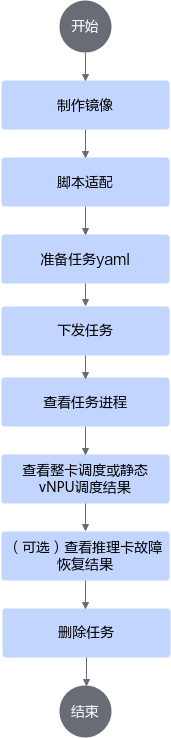
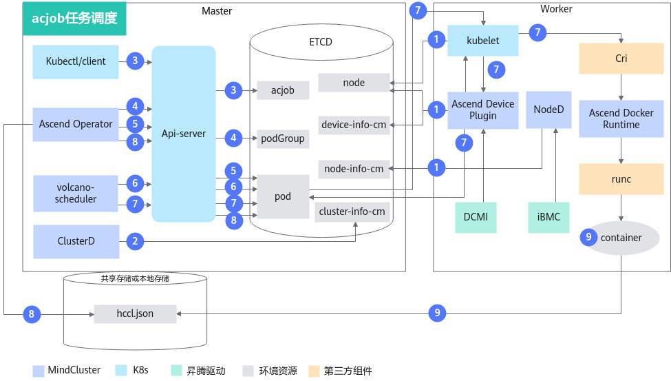
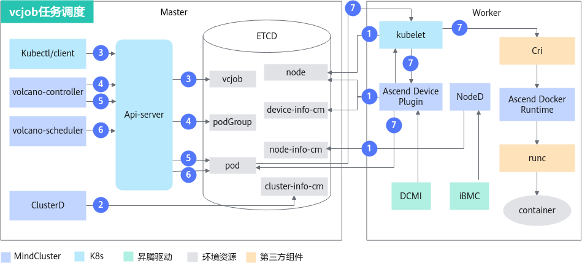
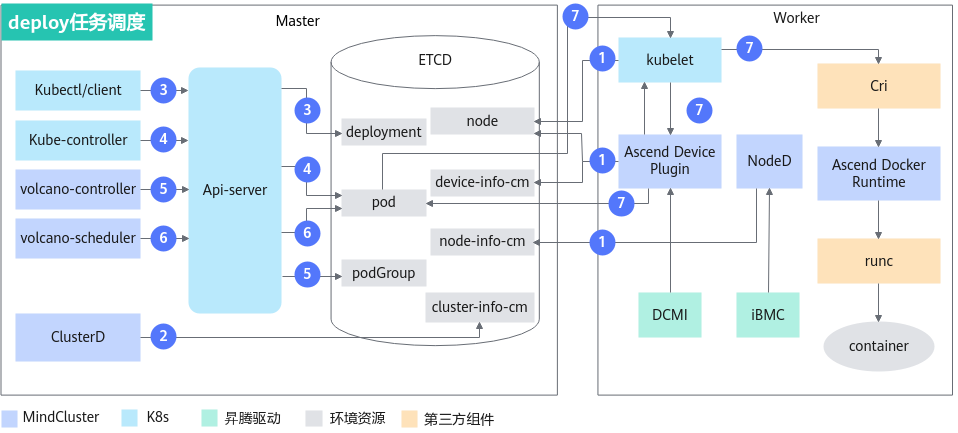

# 整卡调度（推理）<a name="ZH-CN_TOPIC_0000002511347095"></a>

## 使用前必读<a name="ZH-CN_TOPIC_0000002511427055"></a>

**前提条件<a name="section116017220425"></a>**

在命令行场景下使用整卡调度特性，需要确保已经安装如下组件；若没有安装，可以参考[安装部署](../../installation_guide/02_installation/manual_installation/00_obtaining_software_packages.md)章节进行操作。

- 调度器（Volcano或其他调度器）
- Ascend Device Plugin
- Ascend Docker Runtime
- Ascend Operator
- ClusterD
- NodeD

**使用方式<a name="section91871616135119"></a>**

整卡调度特性的使用方式如下：

- 通过命令行使用：安装集群调度组件，通过命令行使用整卡调度特性。
- 集成后使用：将集群调度组件集成到已有的第三方AI平台或者基于集群调度组件开发的AI平台。

**使用说明<a name="section577625973520"></a>**

- 资源监测可以和推理场景下的所有特性一起使用。
- 集群中同时跑多个推理任务，每个任务使用的特性可以不同。
- 推理卡故障恢复特性可以搭配整卡调度特性一起使用，开启整卡故障恢复特性只需要将Ascend Device Plugin的启动参数“-hotReset”取值设置为“0”或“2”（默认为“-1”，不支持故障恢复功能）。
- 整卡调度支持下发单副本数或者多副本数的单机任务，每个副本独立工作，只支持推理服务器（插Atlas 300I Duo 推理卡）和Atlas 800I A2 推理服务器、A200I A2 Box 异构组件部署acjob类型的分布式任务。

**支持的产品形态<a name="section169961844182917"></a>**

- 支持以下产品使用**整卡调度**。
    - 推理服务器（插Atlas 300I 推理卡）
    - Atlas 推理系列产品
    - Atlas 800I A2 推理服务器
    - A200I A2 Box 异构组件
    - Atlas 800I A3 超节点服务器
    - Atlas 350 标卡
    - Atlas 850 系列硬件产品
    - Atlas 950 SuperPoD

**使用流程<a name="section246711128536"></a>**

通过命令行使用整卡调度特性的流程可以参见[图1](#fig242524985412)。

通过命令行使用Volcano和其他调度器的使用流程一致，主要区别在使用其他调度器准备任务YAML需要参考[通过命令行使用（其他调度器）](#ZH-CN_TOPIC_0000002479227152)章节创建任务YAML。使用其他调度器的其余操作和使用Volcano一致，可以参考[通过命令行使用（Volcano）](#ZH-CN_TOPIC_0000002511427059)进行操作。

**图 1**  使用流程<a name="fig242524985412"></a>


## 实现原理<a name="ZH-CN_TOPIC_0000002479227174"></a>

根据推理任务类型的不同，特性的原理图略有差异。

**acjob任务<a name="section9971431567"></a>**

acjob任务原理图如[图1](#fig36890512379)所示。

**图 1**  acjob任务调度原理图<a name="fig36890512379"></a>


各步骤说明如下：

1. 集群调度组件定期上报节点和芯片信息。
    - kubelet上报节点芯片数量到节点对象（node）中。
    - Ascend Device Plugin定期上报芯片拓扑信息。

        上报整卡信息。将芯片的物理ID上报到device-info-cm中；可调度的芯片总数量（allocatable）、已使用的芯片数量（allocated）和芯片的基础信息（device ip和super\_device\_ip）上报到Node中，用于整卡调度。

    - 当节点上存在故障时，NodeD定期上报节点健康状态、节点硬件故障信息、节点DPC共享存储故障信息到node-info-cm中。

2. ClusterD读取device-info-cm和node-info-cm中信息后，将信息写入cluster-info-cm。
3. 用户通过kubectl或者其他深度学习平台下发acjob任务。
4. Ascend Operator为任务创建相应的PodGroup。关于PodGroup的详细说明，可以参考[开源Volcano官方文档](https://volcano.sh/zh/docs/v1-9-0/podgroup/)。
5. Ascend Operator为任务创建相应的Pod，并在容器中注入集合通信所需环境变量。
6. volcano-scheduler根据节点和芯片拓扑信息为任务选择合适节点，并在Pod的annotation上写入选择的芯片信息。整卡调度写入整卡信息。
7. kubelet创建容器时，调用Ascend Device Plugin挂载芯片，Ascend Device Plugin或volcano-scheduler在Pod的annotation上写入芯片信息。Ascend Docker Runtime协助挂载相应资源。
8. Ascend Operator读取Pod的annotation信息，将相关信息写入hccl.json。
9. 容器读取环境变量或者hccl.json信息，建立通信渠道，开始执行推理任务。

    >[!NOTE]
    >Ascend Operator当前仅支持为PyTorch任务生成hccl.json。

**vcjob任务<a name="section428321965913"></a>**

vcjob任务的原理图如[图2](#fig8231124765)所示。

**图 2**  vcjob任务调度原理图<a name="fig8231124765"></a>


各步骤说明如下：

1. 集群调度组件定期上报节点和芯片信息。
    - kubelet上报节点芯片数量到节点对象（node）中。
    - Ascend Device Plugin定期上报芯片拓扑信息。
        - 上报整卡信息。将芯片的物理ID上报到device-info-cm中；可调度的芯片总数量（allocatable）和已使用的芯片数量（allocated）上报到Node中，用于整卡调度。

    - 当节点上存在故障时，NodeD定期上报节点健康状态、节点硬件故障信息、节点DPC共享存储故障信息到node-info-cm中。

2. ClusterD读取device-info-cm和node-info-cm中信息后，将信息写入cluster-info-cm。
3. 用户通过kubectl或者其他深度学习平台下发vcjob任务。
4. volcano-controller为任务创建相应PodGroup。关于PodGroup的详细说明，可以参考[开源Volcano官方文档](https://volcano.sh/zh/docs/v1-9-0/podgroup/)。
5. 当集群资源满足任务要求时，volcano-controller创建任务Pod。
6. volcano-scheduler根据节点和芯片拓扑信息为任务选择合适节点，并在Pod的annotation上写入选择的芯片信息。
7. kubelet创建容器时，调用Ascend Device Plugin挂载芯片，Ascend Device Plugin在Pod的annotation上写入芯片信息。Ascend Docker Runtime协助挂载相应资源。

**deploy任务<a name="section148711820709"></a>**

deploy任务原理图如[图3](#fig178781320593)所示。

**图 3**  deploy任务调度原理图<a name="fig178781320593"></a>


各步骤说明如下：

1. 集群调度组件定期上报节点和芯片信息。
    - kubelet上报节点芯片数量到节点对象（node）中。
    - Ascend Device Plugin定期上报芯片拓扑信息。
        - 上报整卡信息。将芯片的物理ID上报到device-info-cm中；可调度的芯片总数量（allocatable）和已使用的芯片数量（allocated）上报到Node中，用于整卡调度。

    - 当节点上存在故障时，NodeD定期上报节点健康状态、节点硬件故障信息、节点DPC共享存储故障信息到node-info-cm中。

2. ClusterD读取device-info-cm和node-info-cm中信息后，将信息写入cluster-info-cm。
3. 用户通过kubectl或者其他深度学习平台下发deploy任务。
4. kube-controller为任务创建相应Pod。
5. volcano-controller创建任务PodGroup。关于PodGroup的详细说明，可以参考[开源Volcano官方文档](https://volcano.sh/zh/docs/v1-9-0/podgroup/)。
6. volcano-scheduler根据节点和芯片拓扑信息为任务选择合适节点，并在Pod的annotation上写入选择的芯片信息。
7. kubelet创建容器时，调用Ascend Device Plugin挂载芯片，Ascend Device Plugin在Pod的annotation上写入芯片信息。Ascend Docker Runtime协助挂载相应资源。

## 通过命令行使用（Volcano）<a name="ZH-CN_TOPIC_0000002511427059"></a>

### 制作镜像<a name="ZH-CN_TOPIC_0000002479227156"></a>

**获取推理镜像<a name="zh-cn_topic_0000001558675566_section971616541059"></a>**

可选择以下方式中的一种来获取推理镜像。

- 推荐从[昇腾镜像仓库](https://www.hiascend.com/developer/ascendhub)根据用户的系统架构（ARM或者x86\_64）下载推理基础镜像（如：[ascend-infer](https://www.hiascend.com/developer/ascendhub/detail/e02f286eef0847c2be426f370e0c2596)、[mindie](https://www.hiascend.com/developer/ascendhub/detail/af85b724a7e5469ebd7ea13c3439d48f)）。

    请注意，21.0.4版本之后推理基础镜像默认用户为非root用户，需要在下载基础镜像后对其进行修改，将默认用户修改为root。

    >[!NOTE]
    >基础镜像中不包含推理模型、脚本等文件，因此，用户需要根据自己的需求进行定制化修改（如加入推理脚本代码、模型等）后才能使用。

- （可选）如果用户需要更个性化的推理环境，可基于已下载的推理基础镜像，再[使用Dockerfile对其进行修改](../../common_operations.md#使用dockerfile构建容器镜像pytorch)。

    完成定制化修改后，用户可以给推理镜像重命名，以便管理和使用。

**加固镜像<a name="zh-cn_topic_0000001558675566_section1294572963118"></a>**

下载或者制作的推理基础镜像可以进行安全加固，提升镜像安全性，可参见[容器安全加固](../../security_hardening.md#容器安全加固)章节进行操作。

### 脚本适配<a name="ZH-CN_TOPIC_0000002479227176"></a>

本章节以昇腾镜像仓库中推理镜像为例，为用户介绍下发推理任务的操作流程。该镜像已经包含了推理示例脚本，实际推理场景需要用户自行准备推理脚本。在拉取镜像前，需要确保当前环境的网络代理已经配置完成，且能成功访问昇腾镜像仓库。

**从昇腾镜像仓库获取示例脚本<a name="section8181015175911"></a>**

1. 确保服务器能访问互联网后，访问[昇腾镜像仓库](https://www.hiascend.com/developer/ascendhub)。
2. 在左侧导航栏选择推理镜像，然后选择[mindie](https://www.hiascend.com/developer/ascendhub/detail/af85b724a7e5469ebd7ea13c3439d48f)镜像，获取推理示例脚本。

    >[!NOTE]
    >若无下载权限，请根据页面提示申请权限。提交申请后等待管理员审核，审核通过后即可下载镜像。

### 准备任务YAML<a name="ZH-CN_TOPIC_0000002479387148"></a>

>[!NOTE]
>如果用户不使用Ascend Docker Runtime组件，Ascend Device Plugin只会帮助用户挂载“/dev”目录下的设备。其他目录（如“/usr”）用户需要自行修改YAML文件，挂载对应的驱动目录和文件。容器内挂载路径和宿主机路径保持一致。
>因为Atlas 200I SoC A1 核心板场景不支持Ascend Docker Runtime，用户也无需修改YAML文件。

**操作步骤<a name="zh-cn_topic_0000001609074213_section14665181617334"></a>**

1. 下载YAML文件。

    **表 1**  任务类型与硬件型号对应YAML文件

    <a name="zh-cn_topic_0000001609074213_table15169151021912"></a>
    <table><thead align="left"><tr id="zh-cn_topic_0000001609074213_row16169201019192"><th class="cellrowborder" valign="top" width="18.48%" id="mcps1.2.5.1.1"><p id="zh-cn_topic_0000001609074213_p4169191017192"><a name="zh-cn_topic_0000001609074213_p4169191017192"></a><a name="zh-cn_topic_0000001609074213_p4169191017192"></a>任务类型</p>
    </th>
    <th class="cellrowborder" valign="top" width="26.479999999999997%" id="mcps1.2.5.1.2"><p id="zh-cn_topic_0000001609074213_p20181111517147"><a name="zh-cn_topic_0000001609074213_p20181111517147"></a><a name="zh-cn_topic_0000001609074213_p20181111517147"></a>硬件型号</p>
    </th>
    <th class="cellrowborder" valign="top" width="42.59%" id="mcps1.2.5.1.3"><p id="zh-cn_topic_0000001609074213_p181811156149"><a name="zh-cn_topic_0000001609074213_p181811156149"></a><a name="zh-cn_topic_0000001609074213_p181811156149"></a>YAML名称</p>
    </th>
    <th class="cellrowborder" valign="top" width="12.45%" id="mcps1.2.5.1.4"><p id="p1693015221828"><a name="p1693015221828"></a><a name="p1693015221828"></a>获取链接</p>
    </th>
    </tr>
    </thead>
    <tbody><tr id="zh-cn_topic_0000001609074213_row2169191091919"><td class="cellrowborder" rowspan="3" valign="top" width="18.48%" headers="mcps1.2.5.1.1 "><p id="zh-cn_topic_0000001609074213_p6169510191913"><a name="zh-cn_topic_0000001609074213_p6169510191913"></a><a name="zh-cn_topic_0000001609074213_p6169510191913"></a><span id="zh-cn_topic_0000001609074213_ph183921109162"><a name="zh-cn_topic_0000001609074213_ph183921109162"></a><a name="zh-cn_topic_0000001609074213_ph183921109162"></a>Volcano</span>调度的Deployment任务</p>
    </td>
    <td class="cellrowborder" valign="top" width="26.479999999999997%" headers="mcps1.2.5.1.2 "><p id="zh-cn_topic_0000001609074213_p8853185832112"><a name="zh-cn_topic_0000001609074213_p8853185832112"></a><a name="zh-cn_topic_0000001609074213_p8853185832112"></a><span id="zh-cn_topic_0000001609074213_ph238151934915"><a name="zh-cn_topic_0000001609074213_ph238151934915"></a><a name="zh-cn_topic_0000001609074213_ph238151934915"></a>Atlas 200I SoC A1 核心板</span></p>
    </td>
    <td class="cellrowborder" valign="top" width="42.59%" headers="mcps1.2.5.1.3 "><p id="zh-cn_topic_0000001609074213_p1116971091915"><a name="zh-cn_topic_0000001609074213_p1116971091915"></a><a name="zh-cn_topic_0000001609074213_p1116971091915"></a>infer-deploy-310p-1usoc.yaml</p>
    </td>
    <td class="cellrowborder" valign="top" width="12.45%" headers="mcps1.2.5.1.4 "><p id="p784716567219"><a name="p784716567219"></a><a name="p784716567219"></a><a href="https://gitcode.com/Ascend/mindxdl-deploy/blob/branch_v26.0.0/samples/inference/volcano/infer-deploy-310p-1usoc.yaml" target="_blank" rel="noopener noreferrer">获取YAML</a></p>
    </td>
    </tr>
    <tr>
    <td class="cellrowborder" valign="top" headers="mcps1.2.5.1.1 "><p>Atlas 950 SuperPoD</p><p>Atlas 850 系列硬件产品（超节点）</p><p>Atlas 350 标卡</p></td>
    <td class="cellrowborder" valign="top" headers="mcps1.2.5.1.2 "><p>infer-deploy-950.yaml</p></td>
    <td class="cellrowborder" valign="top" headers="mcps1.2.5.1.3 "><p><a href="https://gitcode.com/Ascend/mindxdl-deploy/blob/branch_v26.0.0/samples/inference/volcano/infer-deploy-950.yaml" target="_blank" rel="noopener noreferrer">获取YAML</a></p>
    </td>
    </tr>
    <tr id="zh-cn_topic_0000001609074213_row17169201091917"><td class="cellrowborder" valign="top" headers="mcps1.2.5.1.1 "><p id="zh-cn_topic_0000001609074213_p14853125832110"><a name="zh-cn_topic_0000001609074213_p14853125832110"></a><a name="zh-cn_topic_0000001609074213_p14853125832110"></a>其他类型推理节点</p>
    <p id="p1144215219166"><a name="p1144215219166"></a><a name="p1144215219166"></a></p>
    </td>
    <td class="cellrowborder" valign="top" headers="mcps1.2.5.1.2 "><p id="zh-cn_topic_0000001609074213_p51692100191"><a name="zh-cn_topic_0000001609074213_p51692100191"></a><a name="zh-cn_topic_0000001609074213_p51692100191"></a>infer-deploy.yaml</p>
    </td>
    <td class="cellrowborder" valign="top" headers="mcps1.2.5.1.3 "><p id="p74352718168"><a name="p74352718168"></a><a name="p74352718168"></a><a href="https://gitcode.com/Ascend/mindxdl-deploy/blob/branch_v26.0.0/samples/inference/volcano/infer-deploy.yaml" target="_blank" rel="noopener noreferrer">获取YAML</a></p>
    </td>
    </tr>
    <tr id="row114428221610"><td class="cellrowborder" rowspan="2" valign="top" width="18.48%" headers="mcps1.2.5.1.1 "><p id="p9442102131620"><a name="p9442102131620"></a><a name="p9442102131620"></a>Volcano Job任务</p>
    </td>
    <td class="cellrowborder" valign="top" width="26.479999999999997%" headers="mcps1.2.5.1.2 "><p id="p367438101714"><a name="p367438101714"></a><a name="p367438101714"></a><span id="ph313817549316"><a name="ph313817549316"></a><a name="ph313817549316"></a>Atlas 800I A2 推理服务器</span></p>
    <p id="p20458181019389"><a name="p20458181019389"></a><a name="p20458181019389"></a><span id="ph56342369338"><a name="ph56342369338"></a><a name="ph56342369338"></a>A200I A2 Box 异构组件</span></p>
    <p id="p1792637151014"><a name="p1792637151014"></a><a name="p1792637151014"></a><span id="ph12174764117"><a name="ph12174764117"></a><a name="ph12174764117"></a>Atlas 800I A3 超节点服务器</span></p>
    </td>
    <td class="cellrowborder" valign="top" width="42.59%" headers="mcps1.2.5.1.3 "><p id="p8442112171619"><a name="p8442112171619"></a><a name="p8442112171619"></a>infer-vcjob-910.yaml</p>
    </td>
    <td class="cellrowborder" valign="top" width="12.45%" headers="mcps1.2.5.1.4 "><p id="p15442424164"><a name="p15442424164"></a><a name="p15442424164"></a><a href="https://gitcode.com/Ascend/mindxdl-deploy/blob/branch_v26.0.0/samples/inference/volcano/infer-vcjob-910.yaml" target="_blank" rel="noopener noreferrer">获取YAML</a></p>
    </td>
    </tr>
    <tr>
    <td class="cellrowborder" valign="top" headers="mcps1.2.5.1.1 "><p>Atlas 950 SuperPoD</p><p>Atlas 850 系列硬件产品（超节点）</p><p>Atlas 350 标卡</p></td>
    <td class="cellrowborder" valign="top" headers="mcps1.2.5.1.2 "><p>infer-vcjob-950.yaml</p></td>
    <td class="cellrowborder" valign="top" headers="mcps1.2.5.1.3 "><p><a href="https://gitcode.com/Ascend/mindxdl-deploy/blob/branch_v26.0.0/samples/inference/volcano/infer-vcjob-950.yaml" target="_blank" rel="noopener noreferrer">获取YAML</a></p>
    </td>
    </tr>
    <tr id="row16861151313547"><td class="cellrowborder" rowspan="3" valign="top" width="18.48%" headers="mcps1.2.5.1.1 "><p id="p6861171325411"><a name="p6861171325411"></a><a name="p6861171325411"></a>Ascend Job任务</p>
    <p id="p12446175211817"><a name="p12446175211817"></a><a name="p12446175211817"></a></p>
    </td>
    <td class="cellrowborder" valign="top" width="26.479999999999997%" headers="mcps1.2.5.1.2 "><p id="p1328416110919"><a name="p1328416110919"></a><a name="p1328416110919"></a>推理服务器（插<span id="ph93658382564"><a name="ph93658382564"></a><a name="ph93658382564"></a>Atlas 300I Duo 推理卡</span>）</p>
    </td>
    <td class="cellrowborder" valign="top" width="42.59%" headers="mcps1.2.5.1.3 "><p id="p10861813135419"><a name="p10861813135419"></a><a name="p10861813135419"></a>pytorch_acjob_infer_310p_with_ranktable.yaml</p>
    </td>
    <td class="cellrowborder" valign="top" width="12.45%" headers="mcps1.2.5.1.4 "><p id="p1986116136544"><a name="p1986116136544"></a><a name="p1986116136544"></a><a href="https://gitcode.com/Ascend/mindxdl-deploy/blob/branch_v26.0.0/samples/inference/volcano/pytorch_acjob_infer_310p_with_ranktable.yaml" target="_blank" rel="noopener noreferrer">获取YAML</a></p>
    </td>
    </tr>
    <tr id="row18446115212811"><td class="cellrowborder" valign="top" headers="mcps1.2.5.1.1 "><p id="p1611216221297"><a name="p1611216221297"></a><a name="p1611216221297"></a><span id="ph10342125017508"><a name="ph10342125017508"></a><a name="ph10342125017508"></a>Atlas 800I A2 推理服务器</span></p>
    <p id="p1877419343388"><a name="p1877419343388"></a><a name="p1877419343388"></a><span id="ph1311636133812"><a name="ph1311636133812"></a><a name="ph1311636133812"></a>A200I A2 Box 异构组件</span></p>
    <p id="p1368016125100"><a name="p1368016125100"></a><a name="p1368016125100"></a><span id="ph17176513111020"><a name="ph17176513111020"></a><a name="ph17176513111020"></a>Atlas 800I A3 超节点服务器</span></p>
    </td>
    <td class="cellrowborder" valign="top" headers="mcps1.2.5.1.2 "><p id="p4446185212815"><a name="p4446185212815"></a><a name="p4446185212815"></a>pytorch_multinodes_acjob_infer_<em id="i232224205019"><a name="i232224205019"></a><a name="i232224205019"></a>{</em><em id="i133214249507"><a name="i133214249507"></a><a name="i133214249507"></a>xxx}</em>b_with_ranktable.yaml</p>
    </td>
    <td class="cellrowborder" valign="top" headers="mcps1.2.5.1.3 "><p id="p962512301913"><a name="p962512301913"></a><a name="p962512301913"></a><a href="https://gitcode.com/Ascend/mindxdl-deploy/blob/branch_v26.0.0/samples/inference/volcano/pytorch_multinodes_acjob_infer_910b_with_ranktable.yaml" target="_blank" rel="noopener noreferrer">获取YAML</a></p>
    </td>
    </tr>
    <tr>
    <td class="cellrowborder" valign="top" headers="mcps1.2.5.1.1 "><p>Atlas 950 SuperPoD</p><p>Atlas 850 系列硬件产品（超节点）</p><p>Atlas 350 标卡</p></td>
    <td class="cellrowborder" valign="top" headers="mcps1.2.5.1.2 "><p>pytorch_multinodes_acjob_infer_950_with_ranktable.yaml</p></td>
    <td class="cellrowborder" valign="top" headers="mcps1.2.5.1.3 "><p><a href="https://gitcode.com/Ascend/mindxdl-deploy/blob/branch_v26.0.0/samples/inference/volcano/pytorch_multinodes_acjob_infer_950_with_ranktable.yaml" target="_blank" rel="noopener noreferrer">获取YAML</a></p>
    </td>
    </tr>
    </tbody>
    </table>

2. 将YAML文件上传至管理节点任意目录，并参考[YAML配置说明](../../api/yaml_configuration.md#yaml_configuration)修改示例YAML。

3. 根据实际需求，选择YAML示例并进行如下修改。

    **表 3**  操作示例

    <a name="table1990975873315"></a>
    <table><thead align="left"><tr id="row890916589334"><th class="cellrowborder" valign="top" width="50%" id="mcps1.2.3.1.1"><p id="p169091858183312"><a name="p169091858183312"></a><a name="p169091858183312"></a>特性名称</p>
    </th>
    <th class="cellrowborder" valign="top" width="50%" id="mcps1.2.3.1.2"><p id="p1690905820337"><a name="p1690905820337"></a><a name="p1690905820337"></a>操作参考</p>
    </th>
    </tr>
    </thead>
    <tbody><tr id="row690965893312"><td class="cellrowborder" rowspan="5" valign="top" width="50%" headers="mcps1.2.3.1.1 "><p id="p690915813336"><a name="p690915813336"></a><a name="p690915813336"></a>整卡调度</p>
    </td>
    <td class="cellrowborder" valign="top" width="50%" headers="mcps1.2.3.1.2 "><p id="p79091587334"><a name="p79091587334"></a><a name="p79091587334"></a><a href="#li1888133815128">在推理服务器（插Atlas 300I 推理卡）上创建单卡任务</a></p>
    </td>
    </tr>
    <tr id="row42351537182719"><td class="cellrowborder" valign="top" headers="mcps1.2.3.1.1 "><p id="p11235173717273"><a name="p11235173717273"></a><a name="p11235173717273"></a><a href="#li108651415102917">在推理服务器（插Atlas 300I Duo 推理卡）上创建分布式任务</a></p>
    </td>
    </tr>
    <tr id="row59097587338"><td class="cellrowborder" valign="top" headers="mcps1.2.3.1.1 "><p id="p99091858183320"><a name="p99091858183320"></a><a name="p99091858183320"></a><a href="#li7275039313101">在Atlas 推理系列产品（非Atlas 200I SoC A1 核心板和Atlas 300I Duo 推理卡）上创建单卡任务</a></p>
    </td>
    </tr>
    <tr id="row1890917580338"><td class="cellrowborder" valign="top" headers="mcps1.2.3.1.1 "><p id="p149091958123319"><a name="p149091958123319"></a><a name="p149091958123319"></a><a href="#li132621943121411">在Atlas 200I SoC A1 核心板上创建单卡任务</a></p>
    </td>
    </tr>
    <tr id="row1843115298483"><td class="cellrowborder" valign="top" headers="mcps1.2.3.1.1 "><p id="p4432729124818"><a name="p4432729124818"></a><a name="p4432729124818"></a><a href="#li1134113548015">在Atlas 800I A2 推理服务器上创建单卡任务</a></p>
    </td>
    </tr>

    </tbody>
    </table>

    - <a name="li1888133815128"></a>使用**整卡调度**特性，参考本配置。以infer-deploy.yaml为例，在推理服务器（插Atlas 300I 推理卡）节点创建一个单卡推理任务，并且启用了调度策略，示例如下。

        ```Yaml
        apiVersion: apps/v1
        kind: Deployment
        ...
        spec:
          template:
            metadata:
              labels:
                 app: infers
                 host-arch: huawei-arm
                 npu-310-strategy: card     # 按推理卡调度
        ...
            spec:
              schedulerName: volcano        # 此时调度器必须为Volcano
              nodeSelector:
                host-arch: huawei-arm    # 可选值，根据实际情况填写
        ...
              containers:
              - image: ubuntu-infer:v1
        ...
              env:
              - name: ASCEND_VISIBLE_DEVICES                       # Ascend Docker Runtime会使用该字段
                valueFrom:
                  fieldRef:
                    fieldPath: metadata.annotations['huawei.com/Ascend310']               # 需要和下面resources.requests保持一致
                resources:
                  requests:
                    huawei.com/Ascend310: 1                   # 申请的芯片数量
                  limits:
                    huawei.com/Ascend310: 1
        ...
        ```

    - <a name="li108651415102917"></a>使用**整卡调度**特性，参考本配置。以pytorch\_acjob\_infer\_310p\_with\_ranktable.yaml为例，在推理服务器（插Atlas 300I Duo 推理卡）节点创建一个分布式推理任务，并且启用了调度策略，示例如下。

        <pre codetype="yaml">
        apiVersion: mindxdl.gitee.com/v1
        kind: AscendJob
        metadata:
          name: default-infer-test
          labels:
        ...
            app: infers
            npu-310-strategy: chip      # 按昇腾AI处理器调度
            distributed: "true"         # 分布式推理
            duo: "true"             # 使用Atlas 300I Duo 推理卡
            ring-controller.atlas: ascend-310P  # 标识任务使用的芯片的产品类型
            framework: pytorch       # 框架类型

        spec:
          schedulerName: volcano     #当Ascend Operator组件的启动参数enableGangScheduling为true时生效
          runPolicy:
            schedulingPolicy:
              minAvailable: 2  # 任务总副本数
              queue: default      # 任务所属队列
          successPolicy: AllWorkers # 任务成功的前提
          replicaSpecs:
            Master:
              replicas: 1     # 任务副本数
        ...
                spec:
                  nodeSelector:
                    servertype: Ascend310P
                  containers:
                    - name: ascend         # 必须为ascend，不能修改
                      image: ubuntu:22.04          # 根据实际情况修改镜像名称
        ...
                        - name: ASCEND_VISIBLE_DEVICES
                          valueFrom:
                            fieldRef:
                              fieldPath: metadata.annotations['huawei.com/Ascend310P']       # 给容器挂载相应类型的芯片
        ...
                      ports:                  # 分布式训练集合通信端口
                        - containerPort: 2222
                          name: ascendjob-port
                      resources:
                        limits:
                          huawei.com/Ascend310P: 1   # 申请的芯片数量
                        requests:
                          huawei.com/Ascend310P: 1  #与limits取值一致
                      volumeMounts:
        ...
                        - name: ranktable
                          mountPath: /user/serverid/devindex/config
        ...
                  volumes:
        ...
                    - name: ranktable
                      hostPath:
                        path: /user/mindx-dl/ranktable/default.default-infer-test
        ...
            Worker:
        ...
                spec:
                  containers:
                    - name: ascend     #必须为ascend，不能修改
                      image: ubuntu:22.04      # 根据实际情况修改镜像名称
                      env:
        ...
                        - name: ASCEND_VISIBLE_DEVICES
                          valueFrom:
                            fieldRef:
                              fieldPath: metadata.annotations['huawei.com/Ascend310P']      # 给容器挂载相应类型的芯片
        ...
                      ports:     # 分布式训练集合通信端口
                        - containerPort: 2222
                          name: ascendjob-port
                      resources:
                        limits:
                          huawei.com/Ascend310P: 1   # 申请的芯片数
                        requests:
                          huawei.com/Ascend310P: 1   #与limits取值一致
                      volumeMounts:
        ...
                          # 可选，使用Ascend Operator组件为PyTorch和MindSpore框架生成RankTable文件，需要新增以下加粗字段，设置容器中hccl.json文件保存路径
                        <strong>- name: ranktable</strong>
                          <strong>mountPath: /user/serverid/devindex/config</strong>
        ...
                  volumes:
        ...
                    # 可选，使用Ascend Operator组件为PyTorch框架生成RankTable文件，需要新增以下加粗字段，设置hccl.json文件保存路径
                    <strong>- name: ranktable</strong>
                      <strong>hostPath:</strong>
                        <strong>path: /user/mindx-dl/ranktable/default.default-infer-test  # 共享存储或者本地存储路径，请根据实际情况修改</strong>
        ...</pre>

    - <a name="li7275039313101"></a>使用**整卡调度**特性，参考本配置。以infer-deploy.yaml为例，在Atlas 推理系列产品节点（非Atlas 200I SoC A1 核心板和Atlas 300I Duo 推理卡节点）创建一个不使用混插模式的单卡推理任务，示例如下。

        ```Yaml
        apiVersion: apps/v1
        kind: Deployment
        ...
        spec:
          template:
            metadata:
              labels:
                 app: infers
        ...
            spec:
              affinity:        # 本段代码表示不调度到Atlas 200I SoC A1 核心板节点
                nodeAffinity:
                  requiredDuringSchedulingIgnoredDuringExecution:
                    nodeSelectorTerms:
                      - matchExpressions:
                          - key: servertype
                            operator: NotIn
                            values:
                              - soc
              schedulerName: volcano
              nodeSelector:
                host-arch: huawei-arm
        ...
              containers:
              - image: ubuntu-infer:v1
        ...
              env:
              - name: ASCEND_VISIBLE_DEVICES                       # Ascend Docker Runtime会使用该字段
                valueFrom:
                  fieldRef:
                    fieldPath: metadata.annotations['huawei.com/Ascend310P']               # 给容器挂载相应类型的芯片
        ...
                resources:
                  requests:
                    huawei.com/Ascend310P: 1     # 申请的芯片数量
                  limits:
                    huawei.com/Ascend310P: 1
        ...
        ```

        >[!NOTE]
        >因为Atlas 200I SoC A1 核心板节点需要挂载的目录和文件与其他类型节点不一致，为了避免推理失败，如果需要使用Atlas 推理系列产品芯片，且集群中有Atlas 200I SoC A1 核心板节点但是不希望调度到这类节点上，请在示例的YAML中增加“affinity”字段，表示不调度到有“servertype=soc”标签的节点上。

    - <a name="li132621943121411"></a>使用**整卡调度**特性，参考本配置。以infer-deploy-310p-1usoc.yaml为例，在Atlas 200I SoC A1 核心板节点（不支持混插模式）创建一个单卡推理任务，示例如下。

        ```Yaml
        apiVersion: apps/v1
        kind: Deployment
        ...
        spec:
          template:
            metadata:
              labels:
                 app: infers
        ...
            spec:
              schedulerName: volcano
              nodeSelector:
                host-arch: huawei-arm
                servertype: soc      # 该标签表示仅能调度到Atlas 200I SoC A1 核心板节点
        ...
              containers:
              - image: ubuntu-infer:v1
        ...
              env:
              - name: ASCEND_VISIBLE_DEVICES                       # Ascend Docker Runtime会使用该字段
                valueFrom:
                  fieldRef:
                    fieldPath: metadata.annotations['huawei.com/Ascend310P']               # 给容器挂载相应类型的芯片
        ...
                resources:
                  requests:
                    huawei.com/Ascend310P: 1     # 申请的芯片数量
                  limits:
                    huawei.com/Ascend310P: 1
        ...
        ```

    - <a name="li1134113548015"></a>使用**整卡调度**特性，参考本配置。以infer-vcjob-910.yaml为例，在Atlas 800I A2 推理服务器上创建一个单卡推理任务，示例如下。

        ```Yaml
        apiVersion: batch.volcano.sh/v1alpha1
        kind: Job
        metadata:
          name: mindx-infer-test
          namespace: vcjob                      # 根据实际情况选择合适的命名空间
          labels:
            ring-controller.atlas: ascend-{xxx}b
            fault-scheduling: "force"
        spec:
        ...
            template:
              metadata:
                labels:
                  app: infer
                  ring-controller.atlas: ascend-{xxx}b
              spec:
                containers:
                  - image: infer_image:latest             # 推理镜像名称，以实际情况为准
        ...
              env:
              - name: ASCEND_VISIBLE_DEVICES                       # Ascend Docker Runtime会使用该字段
                valueFrom:
                  fieldRef:
                    fieldPath: metadata.annotations['huawei.com/Ascend910']               # 需要和下面resources.requests保持一致
                      requests:
                        huawei.com/Ascend910: 1          # 所需的芯片数量
                      limits:
                        huawei.com/Ascend910: 1          # 必须与requests的值一致.
                    volumeMounts:
                      - name: localtime                  # 容器时间必须与主机时间一致
                        mountPath: /etc/localtime
                nodeSelector:
                  host-arch: huawei-arm                  # 根据实际情况进行配置
                  accelerator-type: module-{xxx}b-8      # Atlas 800I A2 推理服务器
                volumes:
                - name: localtime
                  hostPath:
                    path: /etc/localtime
                restartPolicy: OnFailure
        ```

4. 挂载权重文件。

    ```Yaml
    ...
                  ports:     # 分布式训练集合通信端口
                    - containerPort: 2222
                      name: ascendjob-port
                  resources:
                    limits:
                      huawei.com/Ascend310P: 1   # 申请的芯片数
                    requests:
                      huawei.com/Ascend310P: 1   # 与limits取值一致
                  volumeMounts:
    ...
                      # 权重文件挂载路径
                    - name: weights
                      mountPath: /path-to-weights
    ...
              volumes:
    ...
                # 权重文件挂载路径
                - name: weights
                  hostPath:
                    path: /path-to-weights  # 共享存储或者本地存储路径，请根据实际情况修改
    ...
    ```

    >[!NOTE]
    >- /path-to-weights为模型权重，需要用户自行准备。mindie镜像可以参考镜像中$ATB\_SPEED\_HOME\_PATH/examples/models/llama3/README.md文件中的说明进行下载。
    >- ATB_SPEED_HOME_PATH默认路径为“/usr/local/Ascend/atb-models”，在source模型仓中set_env.sh脚本时已配置，用户无需自行配置。

5. 修改示例YAML中容器启动命令，即“command”字段内容，如果没有则需添加。

    ```Yaml
    ...
          containers:
          - image: ubuntu-infer:v1
    ...
            command: ["/bin/bash", "-c", "cd $ATB_SPEED_HOME_PATH; python examples/run_pa.py --model_path /path-to-weights"]
            resources:
              requests:
    ...
    ```

### 下发任务<a name="ZH-CN_TOPIC_0000002479387146"></a>

在管理节点示例YAML所在路径，执行以下命令，使用YAML下发推理任务。

```shell
kubectl apply -f XXX.yaml
```

例如：

```shell
kubectl apply -f infer-310p-1usoc.yaml
```

回显示例如下：

```ColdFusion
job.batch/resnetinfer1-2 created
```

>[!NOTE]
>如果下发任务成功后，又修改了任务YAML，需要先执行kubectl delete -f _XXX_.yaml命令删除原任务，再重新下发任务。

### 查看任务进程<a name="ZH-CN_TOPIC_0000002511347103"></a>

**操作步骤<a name="zh-cn_topic_0000001609474293_section96791230183711"></a>**

1. <a name="ZH-CN_TOPIC_0000002511347103_li96791230183711"></a>执行以下命令，查看Pod运行状况。

    ```shell
    kubectl get pod --all-namespaces
    ```

    回显示例如下：

    ```ColdFusion
    NAMESPACE        NAME                                       READY   STATUS    RESTARTS   AGE
    ...
    default          resnetinfer1-2-scpr5                      1/1     Running   0          8s
    ...
    ```

2. 执行以下命令，查看运行推理任务的节点详情。

    ```shell
    kubectl describe node <hostname>
    ```

    例如：

    ```shell
    kubectl describe node ubuntu
    ```

    - **整卡调度**回显示例如下：

        ```ColdFusion
        ...
        Allocated resources:
          (Total limits may be over 100 percent, i.e., overcommitted.)
          Resource              Requests     Limits
          --------              --------     ------
          cpu                   4 (2%)       3500m (1%)
          memory                2140Mi (0%)  4040Mi (0%)
          ephemeral-storage     0 (0%)       0 (0%)
          huawei.com/Ascend310P  1            1
        Events:
          Type    Reason    Age   From                Message
          ----    ------    ----  ----                -------
          Normal  Starting  36m   kube-proxy, ubuntu  Starting kube-proxy.
        ...
        ```

        在显示的信息中，找到“Allocated resources”下的**huawei.com/Ascend310P**，该参数取值在执行推理任务之后会增加，增加数量为推理任务使用的NPU芯片个数。

    >[!NOTE]
    >- 如果使用的是Atlas 推理系列产品非混插模式，则上述字段显示为**Ascend310P**。
    >- 如果使用的是Atlas 推理系列产品混插模式，则上述字段显示为**Ascend310P-V、Ascend310P-VPro、Ascend310P-IPro之一**。

### 查看整卡调度结果<a name="ZH-CN_TOPIC_0000002511347083"></a>

**操作步骤<a name="zh-cn_topic_0000001558675486_section96791230183711"></a>**

在管理节点执行以下命令，查看推理结果。

```shell
kubectl logs -f resnetinfer1-2-scpr5
```

回显示例如下，以实际回显为准。

```ColdFusion
[2025-02-24 19:13:09,331] [2269] [281472887965984] [llm] [INFO] [logging.py-331] : Answer[0]:  Deep learning is a subset of machine learning that uses neural networks with multiple layers to model complex relationships between
[2025-02-24 19:13:09,331] [2269] [281472887965984] [llm] [INFO] [logging.py-331] : Generate[0] token num: (0, 20)
```

>[!NOTE]
><i>resnetinfer1-2-scpr5</i>为[步骤1](#ZH-CN_TOPIC_0000002511347103_li96791230183711)中创建任务对应的Pod名称。

### （可选）查看推理卡故障恢复结果<a name="ZH-CN_TOPIC_0000002511427061"></a>

当NPU故障时，Volcano组件会自动将该NPU上运行的推理任务调度到其他节点上（其他调度器不支持该功能，需要用户自行实现）；再由Ascend Device Plugin组件实现NPU的复位操作，使NPU恢复健康。用户可以通过**npu-smi info**命令查看NPU信息，若故障的NPU当前“health”字段显示的信息为“OK”，表示NPU已经恢复健康。

>[!NOTE]
>Ascend Device Plugin组件实现NPU的复位功能，需要确保当前故障NPU上没有推理任务或者推理任务已经被调走。若用户使用其他调度器且该调度器没有实现重调度功能，可以手动删除该NPU上的推理任务。

### 删除任务<a name="ZH-CN_TOPIC_0000002511427043"></a>

在示例YAML所在路径下，执行以下命令，删除对应的推理任务。

```shell
kubectl delete -f XXX.yaml
```

例如：

```shell
kubectl delete -f infer-310p-1usoc.yaml
```

回显示例如下：

```ColdFusion
root@ubuntu:/home/test/yaml# kubectl delete -f infer-310p-1usoc.yaml
job "resnetinfer1-2" deleted
```

## 通过命令行使用（其他调度器）<a name="ZH-CN_TOPIC_0000002479227152"></a>

通过命令行使用（其他调度器）和通过命令行使用（Volcano）使用流程一致，只有任务YAML有所不同，用户可以准备好相应YAML后参考[通过命令行使用（Volcano）](#ZH-CN_TOPIC_0000002511427059)章节使用。

**操作步骤<a name="section1290513712233"></a>**

1. 请从集群调度代码仓中下载YAML文件。

    **表 1**  任务类型与硬件型号对应YAML文件

    <a name="zh-cn_topic_0000001609074213_table15169151021912"></a>
    <table><thead align="left"><tr id="zh-cn_topic_0000001609074213_row16169201019192"><th class="cellrowborder" valign="top" width="20%" id="mcps1.2.5.1.1"><p id="zh-cn_topic_0000001609074213_p4169191017192"><a name="zh-cn_topic_0000001609074213_p4169191017192"></a><a name="zh-cn_topic_0000001609074213_p4169191017192"></a>任务类型</p>
    </th>
    <th class="cellrowborder" valign="top" width="20%" id="mcps1.2.5.1.2"><p id="zh-cn_topic_0000001609074213_p20181111517147"><a name="zh-cn_topic_0000001609074213_p20181111517147"></a><a name="zh-cn_topic_0000001609074213_p20181111517147"></a>硬件型号</p>
    </th>
    <th class="cellrowborder" valign="top" width="40%" id="mcps1.2.5.1.3"><p id="zh-cn_topic_0000001609074213_p181811156149"><a name="zh-cn_topic_0000001609074213_p181811156149"></a><a name="zh-cn_topic_0000001609074213_p181811156149"></a>YAML文件名称</p>
    </th>
    <th class="cellrowborder" valign="top" width="20%" id="mcps1.2.5.1.4"><p id="p1510912587514"><a name="p1510912587514"></a><a name="p1510912587514"></a>获取链接</p>
    </th>
    </tr>
    </thead>
    <tbody><tr id="zh-cn_topic_0000001609074213_row81696106197"><td class="cellrowborder" rowspan="2" valign="top" width="20%" headers="mcps1.2.5.1.1 "><p id="zh-cn_topic_0000001609074213_p18169161011913"><a name="zh-cn_topic_0000001609074213_p18169161011913"></a><a name="zh-cn_topic_0000001609074213_p18169161011913"></a><span id="zh-cn_topic_0000001609074213_ph1319220540374"><a name="zh-cn_topic_0000001609074213_ph1319220540374"></a><a name="zh-cn_topic_0000001609074213_ph1319220540374"></a>K8s</span>或其他调度器场景下的Job任务</p>
    </td>
    <td class="cellrowborder" valign="top" width="20%" headers="mcps1.2.5.1.2 "><p id="zh-cn_topic_0000001609074213_p4169310141916"><a name="zh-cn_topic_0000001609074213_p4169310141916"></a><a name="zh-cn_topic_0000001609074213_p4169310141916"></a><span id="zh-cn_topic_0000001609074213_ph1355971413491"><a name="zh-cn_topic_0000001609074213_ph1355971413491"></a><a name="zh-cn_topic_0000001609074213_ph1355971413491"></a>Atlas 200I SoC A1 核心板</span></p>
    </td>
    <td class="cellrowborder" valign="top" width="40%" headers="mcps1.2.5.1.3 "><p id="zh-cn_topic_0000001609074213_p17169210171914"><a name="zh-cn_topic_0000001609074213_p17169210171914"></a><a name="zh-cn_topic_0000001609074213_p17169210171914"></a>infer-310p-1usoc.yaml</p>
    </td>
    <td class="cellrowborder" rowspan="2" valign="top" width="20%" headers="mcps1.2.5.1.4 "><p id="p63731221566"><a name="p63731221566"></a><a name="p63731221566"></a><a href="https://gitcode.com/Ascend/mindxdl-deploy/tree/branch_v26.0.0/samples/inference/without-volcano" target="_blank" rel="noopener noreferrer">获取YAML</a></p>
    </td>
    </tr>
    <tr id="zh-cn_topic_0000001609074213_row63291517182014"><td class="cellrowborder" valign="top" headers="mcps1.2.5.1.1 "><p id="zh-cn_topic_0000001609074213_p13330817142010"><a name="zh-cn_topic_0000001609074213_p13330817142010"></a><a name="zh-cn_topic_0000001609074213_p13330817142010"></a>其他类型推理节点</p>
    </td>
    <td class="cellrowborder" valign="top" headers="mcps1.2.5.1.2 "><p id="zh-cn_topic_0000001609074213_p433071711206"><a name="zh-cn_topic_0000001609074213_p433071711206"></a><a name="zh-cn_topic_0000001609074213_p433071711206"></a>infer.yaml</p>
    </td>
    </tr>
    </tbody>
    </table>

2. 将YAML文件上传至管理节点任意目录，并参考[YAML配置说明](../../api/yaml_configuration.md#yaml_configuration)根据实际情况修改文件内容。

3. 根据实际需求，选择YAML示例并进行如下修改。

    **表 3**  操作示例

    <a name="table1819282912379"></a>
    <table><thead align="left"><tr id="row1719292923716"><th class="cellrowborder" valign="top" width="50%" id="mcps1.2.3.1.1"><p id="p219217290379"><a name="p219217290379"></a><a name="p219217290379"></a>特性名称</p>
    </th>
    <th class="cellrowborder" valign="top" width="50%" id="mcps1.2.3.1.2"><p id="p81921229193710"><a name="p81921229193710"></a><a name="p81921229193710"></a>操作参考</p>
    </th>
    </tr>
    </thead>
    <tbody><tr id="row19193152915372"><td class="cellrowborder" rowspan="3" valign="top" width="50%" headers="mcps1.2.3.1.1 "><p id="p1619313291370"><a name="p1619313291370"></a><a name="p1619313291370"></a>整卡调度</p>
    </td>
    <td class="cellrowborder" valign="top" width="50%" headers="mcps1.2.3.1.2 "><p id="p1719312293376"><a name="p1719312293376"></a><a name="p1719312293376"></a><a href="#li18881338151288">在Atlas推理系列产品节点（非Atlas 200I SoC A1 核心板）上创建单卡任务</a></p>
    </td>
    </tr>
    <tr id="row18193142910374"><td class="cellrowborder" valign="top" headers="mcps1.2.3.1.1 "><p id="p161931629153719"><a name="p161931629153719"></a><a name="p161931629153719"></a><a href="#li727503931310">在Atlas 200I SoC A1 核心板上创建单卡任务</a></p>
    </td>
    </tr>
    <tr id="row119193361316"><td class="cellrowborder" valign="top" headers="mcps1.2.3.1.1 "><p id="p4432729124818"><a name="p4432729124818"></a><a name="p4432729124818"></a><a href="#li11341135480159">在Atlas 800I A2 推理服务器上创建单卡任务</a></p>
    </td>
    </tr>

    </tbody>
    </table>

    - <a name="li18881338151288"></a>以infer.yaml为例，在Atlas 推理系列产品节点（非Atlas 200I SoC A1 核心板节点）创建一个不使用混插模式的单卡推理任务，示例如下。

        ```Yaml
        apiVersion: batch/v1
        kind: Job
        metadata:
          name: resnetinfer1-1
        spec:
          template:
            spec:
              nodeSelector:
                host-arch: huawei-arm    # 可选值，根据实际情况填写
              affinity:        # 本段表示不调度到Atlas 200I SoC A1 核心板节点
                nodeAffinity:
                  requiredDuringSchedulingIgnoredDuringExecution:
                    nodeSelectorTerms:
                      - matchExpressions:
                          - key: servertype
                            operator: NotIn
                            values:
                              - soc
              containers:
              - image: ubuntu-infer:v1
        ...
                resources:
                  requests:
                    huawei.com/Ascend310P: 1
                  limits:
                    huawei.com/Ascend310P: 1
        ...
        ```

    - <a name="li727503931310"></a>以infer-310p-1usoc.yaml为例，在Atlas 200I SoC A1 核心板节点（不支持混插模式）创建一个单卡推理任务，示例如下。

        ```Yaml
        apiVersion: batch/v1
        kind: Job
        metadata:
          name: resnetinfer1-1-1usoc
        spec:
          template:
            spec:
              nodeSelector:
                host-arch: huawei-arm     # 可选值，根据实际情况填写
                servertype: soc               # 该标签表示仅能调度到Atlas 200I SoC A1 核心板节点
              containers:
              - image: ubuntu-infer:v1
        ...
                resources:
                  requests:
                    huawei.com/Ascend310P: 1
                  limits:
                    huawei.com/Ascend310P: 1
        ...
        ```

        >[!NOTE]
        >因为Atlas 200I SoC A1 核心板节点需要挂载的目录和文件与其他类型节点不一致，为了避免推理失败，如果需要使用Atlas 推理系列产品，且集群中有Atlas 200I SoC A1 核心板节点但是不希望调度到这类节点上，请在示例的YAML中增加“affinity”字段，表示不调度到有“servertype=soc”标签的节点上。

    - <a name="li11341135480159"></a>使用**整卡调度**特性，参考本配置。以infer.yaml为例，在Atlas 800I A2 推理服务器上创建一个单卡推理任务，示例如下。

        ```Yaml
        apiVersion: batch/v1
        kind: Job
        metadata:
          name: resnetinfer1-1
        spec:
          template:
            spec:
              nodeSelector:
                host-arch: huawei-arm   # 可选值，根据实际情况填写
        ...
              containers:
              - image: ubuntu-infer:v1
        ...
                resources:
                  requests:
                    huawei.com/Ascend910: 1
                  limits:
                    huawei.com/Ascend910: 1
        ...
        ```

## 集成后使用<a name="ZH-CN_TOPIC_0000002479387128"></a>

本章节需要用户熟悉编程开发，以及对K8s有一定了解。如果用户已有AI平台或者想基于集群调度组件开发AI平台，需要完成以下内容：

1. 根据编程语言找到对应的K8s的[官方API库](https://github.com/kubernetes-client)。
2. 根据K8s官方提供的API库，对任务进行创建、查询、删除等操作。
3. 创建、查询或删除操作任务时，用户需要将[示例YAML](#准备任务yaml)的内容转换成K8s官方API中定义的对象，通过官方库里面提供的API发送给K8s的API Server或者将YAML内容转换为JSON格式直接发送给K8s的API Server。
