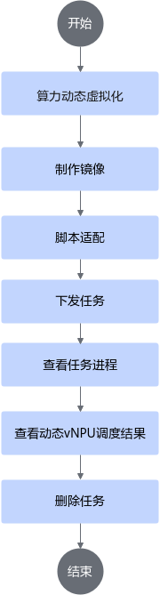
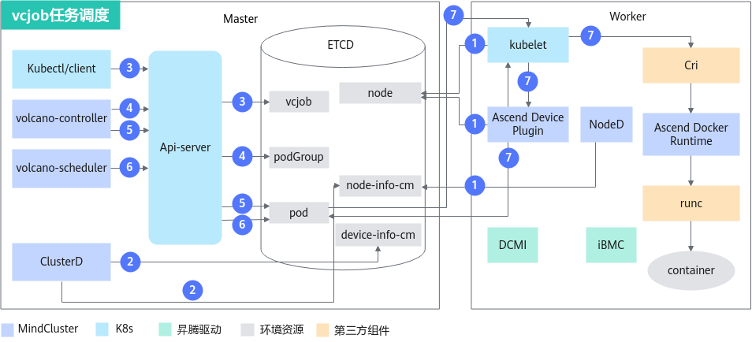
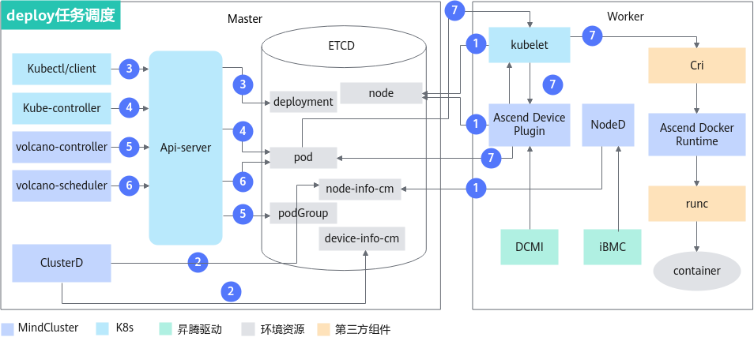

# 动态vNPU调度（推理）<a name="ZH-CN_TOPIC_0000002511427045"></a>

## 使用前必读<a name="ZH-CN_TOPIC_0000002511347087"></a>

### 前提条件<a name="section121807404519"></a>

在命令行场景下使用动态vNPU调度特性，需要确保已经安装如下组件；若没有安装，可以参考[安装部署](../../../../developer_guide/installation_deployment/manual_installation/00_obtaining_software_packages.md)章节进行操作。动态vNPU调度特性只支持使用Volcano作为调度器，不支持使用其他调度器。

**表 1**  虚拟化需要的集群调度组件

<a name="table19103194217329"></a>
<table><thead align="left"><th class="cellrowborder" valign="top" width="11.677219849801206%" id="mcps1.2.5.1.1"><p id="p2103642143218"><a name="p2103642143218"></a><a name="p2103642143218"></a>特性</p>
</th>
<th class="cellrowborder" valign="top" width="24.82697688116625%" id="mcps1.2.5.1.2"><p id="p619110456115"><a name="p619110456115"></a><a name="p619110456115"></a>需要的集群调度组件</p>
</th>
</thead>
<tbody>
<tr id="row610314214324"><td class="cellrowborder" rowspan="5" valign="top" width="11.677219849801206%" headers="mcps1.2.5.1.1 "><p id="p11036426328"><a name="p11036426328"></a><a name="p11036426328"></a>动态虚拟化</p>
</td>
<td class="cellrowborder" valign="top" width="24.82697688116625%" headers="mcps1.2.5.1.2 "><p id="p1219211451715"><a name="p1219211451715"></a><a name="p1219211451715"></a><span id="ph12922181924413"><a name="ph12922181924413"></a><a name="ph12922181924413"></a>Ascend Docker Runtime</span></p>
</td>
</tr>
<tr><td><p><span>Ascend Device Plugin</span></p>
</td>
</tr>
<tr><td><p><span>Volcano</span></p>
</td>
</tr>
<tr><td><p>（可选）<span>Ascend Operator</span></p>
</td>
</tr>
<tr><td><p>（可选）<span>ClusterD</span></p>
</td>
</tr>
</tbody>
</table>

1. 需要先获取“Ascend-docker-runtime\_\{version\}\_linux-\{arch\}.run”，安装容器引擎插件。
2. 参见[安装部署](../../../../developer_guide/installation_deployment/manual_installation/00_obtaining_software_packages.md)章节，完成各组件的安装。

   虚拟化实例涉及到需要修改相关参数的集群调度组件为Volcano和Ascend Device Plugin，请按如下要求修改并使用对应的YAML安装部署：

   1. Ascend Device Plugin参数修改及启动说明。

      虚拟化实例启动参数说明如下：

      **表 2** Ascend Device Plugin启动参数

      <a name="table1064314568229"></a>

      |参数|类型|默认值|说明|
      |--|--|--|--|
      |-volcanoType|bool|false|是否使用Volcano进行调度，如使用动态虚拟化，需要设置为true。|
      |-presetVirtualDevice|bool|true|静态虚拟化功能开关。<p>如使用动态虚拟化，需要设置为false，并需要同步开启Volcano，即设置“-volcanoType”参数为true。</p>|

      YAML启动说明如下：

      K8s集群中存在使用Atlas 推理系列产品的节点，需要在device-plugin-310P-volcano-v\{version\}中将“presetVirtualDevice”字段修改为“false”（协同Volcano使用，支持NPU虚拟化，YAML默认关闭动态虚拟化）。

       ```Yaml
       ...
       args: [ "device-plugin -volcanoType=true -presetVirtualDevice=false
                  -logFile=/var/log/mindx-dl/devicePlugin/devicePlugin.log -logLevel=0" ]
       ...
       ```

   2. Volcano参数修改及启动说明。

      在Volcano部署文件“volcano-v<i>\{version\}</i>.yaml”中，需要配置“presetVirtualDevice”的值为“false”。

       ```Yaml
       ...
       data:
         volcano-scheduler.conf: |
           actions: "enqueue, allocate, backfill"
           tiers:
           - plugins:
             - name: priority
             - name: gang
             - name: conformance
             - name: volcano-npu-v{version}_linux-aarch64
           - plugins:
             - name: drf
             - name: predicates
             - name: proportion
             - name: nodeorder
             - name: binpack
           configurations:
            ...
             - name: init-params
               arguments: {"grace-over-time":"900","presetVirtualDevice":"false"}  # 开启动态虚拟化，presetVirtualDevice的值需要设置为false
       ...
       ```

### 使用方式<a name="zh-cn_topic_0000001559979444_section91871616135119"></a>

- 通过命令行使用：安装集群调度组件，通过命令行使用动态vNPU调度特性。
- 集成后使用：将集群调度组件集成到已有的第三方AI平台或者基于集群调度组件开发的AI平台。

### 使用说明<a name="section10769161412815"></a>

**表 3**  场景说明

<a name="table625511844619"></a>
<table><thead align="left"><tr id="row9255148204610"><th class="cellrowborder" valign="top" width="19.98%" id="mcps1.2.3.1.1"><p id="p4381442125317"><a name="p4381442125317"></a><a name="p4381442125317"></a>场景</p>
</th>
<th class="cellrowborder" valign="top" width="80.02%" id="mcps1.2.3.1.2"><p id="p2255984464"><a name="p2255984464"></a><a name="p2255984464"></a>说明</p>
</th>
</tr>
</thead>
<tbody><tr id="row132012115910"><td class="cellrowborder" rowspan="8" valign="top" width="19.98%" headers="mcps1.2.3.1.1 "><p id="p1950512911598"><a name="p1950512911598"></a><a name="p1950512911598"></a>通用说明</p>
</td>
<td class="cellrowborder" valign="top" width="80.02%" headers="mcps1.2.3.1.2 "><p id="p450516910592"><a name="p450516910592"></a><a name="p450516910592"></a>分配的芯片信息会在Pod的annotation中体现出来，关于Pod annotation的详细说明请参见<a href="../../../../api/k8s.md">Pod annotation</a>中的huawei.com/npu-core、huawei.com/AscendReal参数。</p>
</td>
</tr>
<tr id="row48061646595"><td class="cellrowborder" valign="top" headers="mcps1.2.3.1.1 "><p id="p1749665239"><a name="p1749665239"></a><a name="p1749665239"></a>同一时刻，只能下发相同<a href="../03_virtualization_templates.md">虚拟化模板</a>的任务。</p>
</td>
</tr>
<tr id="row18542176195917"><td class="cellrowborder" valign="top" headers="mcps1.2.3.1.1 "><p id="p450559185914"><a name="p450559185914"></a><a name="p450559185914"></a>动态分配vNPU时，经<span id="ph19255162231216"><a name="ph19255162231216"></a><a name="ph19255162231216"></a>MindCluster</span>调度，将优先占满剩余算力最少的物理NPU。</p>
</td>
</tr>
<tr id="row11648825917"><td class="cellrowborder" valign="top" headers="mcps1.2.3.1.1 "><p id="p19505796596"><a name="p19505796596"></a><a name="p19505796596"></a>目前任务的每个Pod请求的NPU数量为1个。</p>
</td>
</tr>
<tr id="row192561854613"><td class="cellrowborder" valign="top" headers="mcps1.2.3.1.1 "><p id="p02561481463"><a name="p02561481463"></a><a name="p02561481463"></a>任务请求的AICore数量，为vNPU时，按实际填写；为整张物理NPU时，需要为单张卡的AICore个数或其倍数且整卡时调度可能不满足亲和性。</p>
</td>
</tr>
<tr id="row11782173617479"><td class="cellrowborder" valign="top" headers="mcps1.2.3.1.1 "><p id="p18782936144718"><a name="p18782936144718"></a><a name="p18782936144718"></a>默认需要容器以root用户启动，若需要以普通用户运行推理任务，需要参考<a href="https://gitcode.com/Ascend/mind-cluster/issues/359">使用动态虚拟化时，以普通用户运行推理业务容器失败</a>章节进行操作。</p>
</td>
</tr>
<tr id="row117233216566"><td class="cellrowborder" valign="top" headers="mcps1.2.3.1.1 "><p id="p18081933105617"><a name="p18081933105617"></a><a name="p18081933105617"></a>vNPU动态创建和销毁在<span id="ph20808153335610"><a name="ph20808153335610"></a><a name="ph20808153335610"></a>Atlas 推理系列产品、Atlas A2 训练/推理系列产品和Atlas A3 训练/推理系列产品</span>上有效，并且需要配套<span id="ph13808233145619"><a name="ph13808233145619"></a><a name="ph13808233145619"></a>Volcano</span>使用。</p>
</td>
</tr>
<tr id="row_dyn_switch"><td class="cellrowborder" valign="top" headers="mcps1.2.3.1.1 "><p id="p_dyn_switch">节点在动态虚拟化和非动态虚拟化之间切换时，需要将已有任务删除。</p>
</td>
</tr>
<tr id="row32567817461"><td class="cellrowborder" rowspan="2" valign="top" width="19.98%" headers="mcps1.2.3.1.1 "><p id="p1325613818460"><a name="p1325613818460"></a><a name="p1325613818460"></a>特性支持的场景</p>
</td>
<td class="cellrowborder" valign="top" width="80.02%" headers="mcps1.2.3.1.2 "><p id="p32561983469"><a name="p32561983469"></a><a name="p32561983469"></a>支持多副本，但多副本中的每个pod都必须使用vNPU。</p>
</td>
</tr>
<tr id="row825611817468"><td class="cellrowborder" valign="top" headers="mcps1.2.3.1.1 "><p id="p2795151384913"><a name="p2795151384913"></a><a name="p2795151384913"></a>支持芯片故障和节点故障的重调度。具体参考<span id="ph1389215534914"><a name="ph1389215534914"></a><a name="ph1389215534914"></a><a href="../../../basic_scheduling/08_recovery_of_inference_card_faults.md">推理卡故障恢复</a></span>和<a href="../../../basic_scheduling/07_rescheduling_upon_inference_card_faults.md">推理卡故障重调度</a>章节。</p>
</td>
</tr>
<tr id="row237762345420"><td class="cellrowborder" rowspan="4" valign="top" width="19.98%" headers="mcps1.2.3.1.1 "><p id="p840574125511"><a name="p840574125511"></a><a name="p840574125511"></a>特性不支持的场景</p>
<p id="p17835104672517"><a name="p17835104672517"></a><a name="p17835104672517"></a></p>
<p id="p36763525314"><a name="p36763525314"></a><a name="p36763525314"></a></p>
<p id="p767616565314"><a name="p767616565314"></a><a name="p767616565314"></a></p>
<p id="p667616595317"><a name="p667616595317"></a><a name="p667616595317"></a></p>
</td>
<td class="cellrowborder" valign="top" width="80.02%" headers="mcps1.2.3.1.2 "><p id="p14377152385414"><a name="p14377152385414"></a><a name="p14377152385414"></a>不支持不同芯片在一个任务内混用。</p>
</td>
</tr>
<tr id="row1625614818462"><td class="cellrowborder" valign="top" headers="mcps1.2.3.1.1 "><p id="p32566874611"><a name="p32566874611"></a><a name="p32566874611"></a>任务运行过程中，不支持卸载<span id="ph42462611516"><a name="ph42462611516"></a><a name="ph42462611516"></a>Volcano</span>。</p>
</td>
</tr>
<tr id="row1854910515540"><td class="cellrowborder" valign="top" headers="mcps1.2.3.1.1 "><p id="p12256108124616"><a name="p12256108124616"></a><a name="p12256108124616"></a>K8s场景会自动创建与销毁vNPU，不能与Docker场景的操作混用。</p>
</td>
</tr>
<tr id="row151011624135113"><td class="cellrowborder" valign="top" headers="mcps1.2.3.1.1 "><p id="p18102182414515"><a name="p18102182414515"></a><a name="p18102182414515"></a>进行动态虚拟化的节点不能对芯片的CPU进行设置。详情请参考<span id="ph373734654014"><a name="ph373734654014"></a><a name="ph373734654014"></a>《Atlas 中心推理卡 26.0.RC1 npu-smi 命令参考》中的"信息查询（info）&gt;<a href="https://support.huawei.com/enterprise/zh/doc/EDOC1100568418/a31a9e5b" target="_blank" rel="noopener noreferrer">查询所有芯片的AI CPU、control CPU和data CPU数量</a>"</span>章节。</p>
</td>
</tr>
</tbody>
</table>

**表 4**  虚拟化实例模板与vNPU类型关系表

<a name="table47415104403"></a>
<table><thead align="left"><tr id="row67416101402"><th class="cellrowborder" valign="top" width="20%" id="mcps1.2.5.1.1"><p id="p117491014400"><a name="p117491014400"></a><a name="p117491014400"></a>NPU类型</p>
</th>
<th class="cellrowborder" valign="top" width="19.98%" id="mcps1.2.5.1.2"><p id="p177431064013"><a name="p177431064013"></a><a name="p177431064013"></a>虚拟化实例模板</p>
</th>
<th class="cellrowborder" valign="top" width="20.02%" id="mcps1.2.5.1.3"><p id="p1374210134015"><a name="p1374210134015"></a><a name="p1374210134015"></a>vNPU类型</p>
</th>
<th class="cellrowborder" valign="top" width="40%" id="mcps1.2.5.1.4"><p id="p1041963771317"><a name="p1041963771317"></a><a name="p1041963771317"></a>具体虚拟设备名称（以vNPU ID100、物理卡ID0为例）</p>
</th>
</tr>
</thead>
<tbody><tr id="row84911853114212"><td class="cellrowborder" rowspan="7" valign="top" width="20%" headers="mcps1.2.5.1.1 "><p id="p1868751772016"><a name="p1868751772016"></a><a name="p1868751772016"></a><span id="ph1534112451967"><a name="ph1534112451967"></a><a name="ph1534112451967"></a>Atlas 推理系列产品</span>（8个AICore）</p>
</td>
<td class="cellrowborder" valign="top" width="19.98%" headers="mcps1.2.5.1.2 "><p id="p11312190431"><a name="p11312190431"></a><a name="p11312190431"></a>vir01</p>
</td>
<td class="cellrowborder" valign="top" width="20.02%" headers="mcps1.2.5.1.3 "><p id="p9491185334212"><a name="p9491185334212"></a><a name="p9491185334212"></a>Ascend310P-1c</p>
</td>
<td class="cellrowborder" valign="top" width="40%" headers="mcps1.2.5.1.4 "><p id="p785817208133"><a name="p785817208133"></a><a name="p785817208133"></a>Ascend310P-1c-100-0</p>
</td>
</tr>
<tr id="row025285715427"><td class="cellrowborder" valign="top" headers="mcps1.2.5.1.1 "><p id="p42104229438"><a name="p42104229438"></a><a name="p42104229438"></a>vir02</p>
</td>
<td class="cellrowborder" valign="top" headers="mcps1.2.5.1.2 "><p id="p15252157204214"><a name="p15252157204214"></a><a name="p15252157204214"></a>Ascend310P-2c</p>
</td>
<td class="cellrowborder" valign="top" headers="mcps1.2.5.1.3 "><p id="p5858122031313"><a name="p5858122031313"></a><a name="p5858122031313"></a>Ascend310P-2c-100-0</p>
</td>
</tr>
<tr id="row97276094310"><td class="cellrowborder" valign="top" headers="mcps1.2.5.1.1 "><p id="p21621623154317"><a name="p21621623154317"></a><a name="p21621623154317"></a>vir04</p>
</td>
<td class="cellrowborder" valign="top" headers="mcps1.2.5.1.2 "><p id="p7727808436"><a name="p7727808436"></a><a name="p7727808436"></a>Ascend310P-4c</p>
</td>
<td class="cellrowborder" valign="top" headers="mcps1.2.5.1.3 "><p id="p88588203133"><a name="p88588203133"></a><a name="p88588203133"></a>Ascend310P-4c-100-0</p>
</td>
</tr>
<tr id="row1924012424312"><td class="cellrowborder" valign="top" headers="mcps1.2.5.1.1 "><p id="p864822594315"><a name="p864822594315"></a><a name="p864822594315"></a>vir02_1c</p>
</td>
<td class="cellrowborder" valign="top" headers="mcps1.2.5.1.2 "><p id="p9240174124315"><a name="p9240174124315"></a><a name="p9240174124315"></a>Ascend310P-2c.1cpu</p>
</td>
<td class="cellrowborder" valign="top" headers="mcps1.2.5.1.3 "><p id="p7858122011317"><a name="p7858122011317"></a><a name="p7858122011317"></a>Ascend310P-2c.1cpu-100-0</p>
</td>
</tr>
<tr id="row15871137104318"><td class="cellrowborder" valign="top" headers="mcps1.2.5.1.1 "><p id="p17120529164318"><a name="p17120529164318"></a><a name="p17120529164318"></a>vir04_3c</p>
</td>
<td class="cellrowborder" valign="top" headers="mcps1.2.5.1.2 "><p id="p1287219754318"><a name="p1287219754318"></a><a name="p1287219754318"></a>Ascend310P-4c.3cpu</p>
</td>
<td class="cellrowborder" valign="top" headers="mcps1.2.5.1.3 "><p id="p2858132091317"><a name="p2858132091317"></a><a name="p2858132091317"></a>Ascend310P-4c.3cpu-100-0</p>
</td>
</tr>
<tr id="row33716311573"><td class="cellrowborder" valign="top" headers="mcps1.2.5.1.1 "><p id="p03711631778"><a name="p03711631778"></a><a name="p03711631778"></a>vir04_3c_ndvpp</p>
</td>
<td class="cellrowborder" valign="top" headers="mcps1.2.5.1.2 "><p id="p237116311471"><a name="p237116311471"></a><a name="p237116311471"></a>Ascend310P-4c.3cpu.ndvpp</p>
</td>
<td class="cellrowborder" valign="top" headers="mcps1.2.5.1.3 "><p id="p23716311171"><a name="p23716311171"></a><a name="p23716311171"></a>Ascend310P-4c.3cpu.ndvpp-100-0</p>
</td>
</tr>
<tr id="row595773615716"><td class="cellrowborder" valign="top" headers="mcps1.2.5.1.1 "><p id="p119572361679"><a name="p119572361679"></a><a name="p119572361679"></a>vir04_4c_dvpp</p>
</td>
<td class="cellrowborder" valign="top" headers="mcps1.2.5.1.2 "><p id="p995718366710"><a name="p995718366710"></a><a name="p995718366710"></a>Ascend310P-4c.4cpu.dvpp</p>
</td>
<td class="cellrowborder" valign="top" headers="mcps1.2.5.1.3 "><p id="p9957636276"><a name="p9957636276"></a><a name="p9957636276"></a>Ascend310P-4c.4cpu.dvpp-100-0</p>
</td>
</tr>
<tr><td class="cellrowborder" rowspan="4" valign="top" headers="mcps1.2.5.1.1 "><p>Atlas A2 训练/推理系列产品</p><p>（20/24/25个AICore）</p></td>
<td class="cellrowborder" valign="top" headers="mcps1.2.5.1.1 "><p>vir05_1c_16g</p></td>
<td class="cellrowborder" valign="top" headers="mcps1.2.5.1.2 "><p>Ascend910-5c.1cpu.16g</p></td>
<td class="cellrowborder" valign="top" headers="mcps1.2.5.1.3 "><p>Ascend910-5c.1cpu.16g-100-0</p></td>
</tr>
<tr><td class="cellrowborder" valign="top" headers="mcps1.2.5.1.1 "><p>vir10_3c_32g</p></td>
<td class="cellrowborder" valign="top" headers="mcps1.2.5.1.2 "><p>Ascend910-10c.3cpu.32g</p></td>
<td class="cellrowborder" valign="top" headers="mcps1.2.5.1.3 "><p>Ascend910-10c.3cpu.32g-100-0</p></td>
</tr>
<tr><td class="cellrowborder" valign="top" headers="mcps1.2.5.1.1 "><p>vir06_1c_16g</p></td>
<td class="cellrowborder" valign="top" headers="mcps1.2.5.1.2 "><p>Ascend910-6c.1cpu.16g</p></td>
<td class="cellrowborder" valign="top" headers="mcps1.2.5.1.3 "><p>Ascend910-6c.1cpu.16g-100-0</p></td>
</tr>
<tr><td class="cellrowborder" valign="top" headers="mcps1.2.5.1.1 "><p>vir12_3c_32g</p></td>
<td class="cellrowborder" valign="top" headers="mcps1.2.5.1.2 "><p>Ascend910-12c.3cpu.32g</p></td>
<td class="cellrowborder" valign="top" headers="mcps1.2.5.1.3 "><p>Ascend910-12c.3cpu.32g-100-0</p></td>
</tr>
<tr><td class="cellrowborder" rowspan="4" valign="top" headers="mcps1.2.5.1.1 "><p>Atlas A3 训练/推理系列产品</p><p>（40/48个AICore）</p></td>
<td class="cellrowborder" valign="top" headers="mcps1.2.5.1.1 "><p>vir05_1c_16g</p></td>
<td class="cellrowborder" valign="top" headers="mcps1.2.5.1.2 "><p>Ascend910-5c.1cpu.16g</p></td>
<td class="cellrowborder" valign="top" headers="mcps1.2.5.1.3 "><p>Ascend910-5c.1cpu.16g-100-0</p></td>
</tr>
<tr><td class="cellrowborder" valign="top" headers="mcps1.2.5.1.1 "><p>vir10_3c_32g</p></td>
<td class="cellrowborder" valign="top" headers="mcps1.2.5.1.2 "><p>Ascend910-10c.3cpu.32g</p></td>
<td class="cellrowborder" valign="top" headers="mcps1.2.5.1.3 "><p>Ascend910-10c.3cpu.32g-100-0</p></td>
</tr>
<tr><td class="cellrowborder" valign="top" headers="mcps1.2.5.1.1 "><p>vir06_1c_16g</p></td>
<td class="cellrowborder" valign="top" headers="mcps1.2.5.1.2 "><p>Ascend910-6c.1cpu.16g</p></td>
<td class="cellrowborder" valign="top" headers="mcps1.2.5.1.3 "><p>Ascend910-6c.1cpu.16g-100-0</p></td>
</tr>
<tr><td class="cellrowborder" valign="top" headers="mcps1.2.5.1.1 "><p>vir12_3c_32g</p></td>
<td class="cellrowborder" valign="top" headers="mcps1.2.5.1.2 "><p>Ascend910-12c.3cpu.32g</p></td>
<td class="cellrowborder" valign="top" headers="mcps1.2.5.1.3 "><p>Ascend910-12c.3cpu.32g-100-0</p></td>
</tr>
</tbody>
</table>

- 资源监测可以和推理场景下的所有特性一起使用。
- 集群中同时运行多个推理任务，每个任务使用的特性可以不同，但不能同时存在使用静态vNPU的任务和使用动态vNPU的任务。
- 动态vNPU调度仅支持下发单副本数或者多副本数的单机任务，每个副本独立工作，不支持分布式任务。

### 支持的产品形态<a name="section169961844182917"></a>

Atlas 推理系列产品、Atlas A2 训练/推理系列产品、Atlas A3 训练/推理系列产品

### 使用流程<a name="zh-cn_topic_0000001559979444_section246711128536"></a>

通过命令行使用动态vNPU调度特性流程可以参见[图1](#zh-cn_topic_0000001559979444_fig242524985412)。

**图 1**  使用流程<a name="zh-cn_topic_0000001559979444_fig242524985412"></a>


## 实现原理<a name="ZH-CN_TOPIC_0000002511427057"></a>

根据推理任务类型的不同，特性的原理图略有差异。

**vcjob任务<a name="section11346231114"></a>**

vcjob任务原理图如[图2](#fig1918122131712)所示。

**图 2**  vcjob任务调度原理图<a name="fig1918122131712"></a>


各步骤说明如下：

1. 集群调度组件定期上报节点和芯片信息。
    - kubelet上报节点芯片数量到节点对象（node）中。
    - Ascend Device Plugin定期上报AICore数量到Node中。
    - 当节点上存在故障时，NodeD定期上报节点健康状态、节点硬件故障信息、节点DPC共享存储故障信息到node-info-cm中。

2. ClusterD读取device-info-cm和node-info-cm中信息后，将信息分别写入cluster-info-device-cm和cluster-info-node-cm中。
3. 用户通过kubectl或者其他深度学习平台下发vcjob任务。
4. volcano-controller为任务创建相应PodGroup。关于PodGroup的详细说明，可以参考[开源Volcano官方文档](https://volcano.sh/zh/docs/v1-9-0/podgroup/)。
5. 当集群资源满足任务要求时，volcano-controller创建任务Pod。
6. volcano-scheduler根据节点和芯片拓扑信息为任务选择合适节点，并在Pod的annotation上写入动态虚拟化的模板信息。
7. kubelet创建容器时，调用Ascend Device Plugin挂载芯片，Ascend Device Plugin根据模板信息动态虚拟化NPU。Ascend Docker Runtime协助挂载相应资源。

**deploy任务<a name="section41019364253"></a>**

deploy任务原理图如[图3](#fig349112913199)所示。

**图 3**  deploy任务调度原理图<a name="fig349112913199"></a>


各步骤说明如下：

1. 集群调度组件定期上报节点和芯片信息。
    - Ascend Device Plugin定期上报AICore数量到Node中。
    - 当节点上存在故障时，NodeD定期上报节点健康状态、节点硬件故障信息、节点DPC共享存储故障信息到node-info-cm中。
2. ClusterD读取device-info-cm和node-info-cm中信息后，将信息分别写入cluster-info-device-cm和cluster-info-node-cm中。
3. 用户通过kubectl或者其他深度学习平台下发deploy任务。
4. kube-controller为任务创建相应Pod。
5. volcano-controller创建任务PodGroup。关于PodGroup的详细说明，可以参考[开源Volcano官方文档](https://volcano.sh/zh/docs/v1-9-0/podgroup/)。
6. volcano-scheduler根据节点和芯片拓扑信息为任务选择合适节点，并在Pod的annotation上写入动态虚拟化的模板信息。
7. kubelet创建容器时，调用Ascend Device Plugin挂载芯片，Ascend Device Plugin根据Pod的annotation模板信息动态虚拟化NPU。Ascend Docker Runtime协助挂载相应资源。

## 通过命令行使用（Volcano）<a name="ZH-CN_TOPIC_0000002479227144"></a>

### 制作镜像<a name="ZH-CN_TOPIC_0000002511427049"></a>

**获取推理镜像<a name="zh-cn_topic_0000001609173557_zh-cn_topic_0000001558675566_section971616541059"></a>**

可选择以下方式中的一种来获取推理镜像。

- 推荐从[昇腾镜像仓库](https://www.hiascend.com/developer/ascendhub)根据系统架构（ARM或者x86\_64）下载**推理基础镜像（**如：[ascend-infer](https://www.hiascend.com/developer/ascendhub/detail/e02f286eef0847c2be426f370e0c2596)、[mindie](https://www.hiascend.com/developer/ascendhub/detail/af85b724a7e5469ebd7ea13c3439d48f)**）**。

    请注意，21.0.4版本之后推理基础镜像默认用户为非root用户，需要在下载基础镜像后对其进行修改，将默认用户修改为root。

    >[!NOTE]
    >基础镜像中不包含推理模型、脚本等文件，因此，用户需要根据自己的需求进行定制化修改（如加入推理脚本代码、模型等）后才能使用。

- （可选）可基于推理基础镜像定制用户自己的推理镜像，制作过程请参见[使用Dockerfile构建推理镜像](../../../../common_operations.md#使用dockerfile构建推理镜像)。

    完成定制化修改后，用户可以给推理镜像重命名，以便管理和使用。

**加固镜像<a name="zh-cn_topic_0000001609173557_zh-cn_topic_0000001558675566_section1294572963118"></a>**

下载或者制作的推理基础镜像可以进行安全加固，提升镜像安全性，可参见[容器安全加固](../../../../security_hardening.md#容器安全加固)章节进行操作。

### 脚本适配<a name="ZH-CN_TOPIC_0000002511347067"></a>

本章节以昇腾镜像仓库中推理镜像为例为用户介绍操作流程，该镜像已经包含了推理示例脚本，实际推理场景需要用户自行准备推理脚本。在拉取镜像前，需要确保当前环境的网络代理已经配置完成，确保该环境可以正常访问昇腾镜像仓库。

**从昇腾镜像仓库获取示例脚本<a name="section8181015175911"></a>**

1. 确保服务器能访问互联网后，访问[昇腾镜像仓库](https://www.hiascend.com/developer/ascendhub)。
2. 在左侧导航栏选择推理镜像，然后选择[mindie](https://www.hiascend.com/developer/ascendhub/detail/af85b724a7e5469ebd7ea13c3439d48f)镜像，获取推理示例脚本。

    >[!NOTE]
    >若无下载权限，请根据页面提示申请权限。提交申请后等待管理员审核，审核通过后即可下载镜像。

### 准备任务YAML<a name="ZH-CN_TOPIC_0000002479387122"></a>

>[!NOTE]
>如果用户不使用Ascend Docker Runtime组件，Ascend Device Plugin只会帮助用户挂载“/dev”目录下的设备。其他目录（如“/usr”）用户需要自行修改YAML文件，挂载对应的驱动目录和文件。容器内挂载路径和宿主机路径保持一致。
>因为Atlas 200I SoC A1 核心板场景不支持Ascend Docker Runtime，用户也无需修改YAML文件。

**操作步骤<a name="zh-cn_topic_0000001558853680_zh-cn_topic_0000001609074213_section14665181617334"></a>**

1. 获取相应的YAML文件。

    **表 5**  YAML说明

    <a name="table0265132716351"></a>
    <table><thead align="left"><tr id="row132651727163516"><th class="cellrowborder" valign="top" width="15.36%" id="mcps1.2.5.1.1"><p id="p1447515933616"><a name="p1447515933616"></a><a name="p1447515933616"></a>任务类型</p>
    </th>
    <th class="cellrowborder" valign="top" width="18.2%" id="mcps1.2.5.1.2"><p id="zh-cn_topic_0000001609074213_p20181111517147"><a name="zh-cn_topic_0000001609074213_p20181111517147"></a><a name="zh-cn_topic_0000001609074213_p20181111517147"></a>硬件型号</p>
    </th>
    <th class="cellrowborder" valign="top" width="37.769999999999996%" id="mcps1.2.5.1.3"><p id="p626512711358"><a name="p626512711358"></a><a name="p626512711358"></a>YAML名称</p>
    </th>
    <th class="cellrowborder" valign="top" width="28.67%" id="mcps1.2.5.1.4"><p id="p3265172773514"><a name="p3265172773514"></a><a name="p3265172773514"></a>获取链接</p>
    </th>
    </tr>
    </thead>
    <tbody><tr id="row826513275355"><td class="cellrowborder" valign="top" width="15.36%" headers="mcps1.2.5.1.1 "><p id="p278965223717"><a name="p278965223717"></a><a name="p278965223717"></a>Deployment</p>
    </td>
    <td class="cellrowborder" rowspan="2" valign="top" width="18.2%" headers="mcps1.2.5.1.2 "><p id="zh-cn_topic_0000001609074213_p8853185832112"><a name="zh-cn_topic_0000001609074213_p8853185832112"></a><a name="zh-cn_topic_0000001609074213_p8853185832112"></a><span id="ph165178910439"><a name="ph165178910439"></a><a name="ph165178910439"></a>Atlas 推理系列产品</span></p>
    </td>
    <td class="cellrowborder" valign="top" width="37.769999999999996%" headers="mcps1.2.5.1.3 "><p id="p142651427103519"><a name="p142651427103519"></a><a name="p142651427103519"></a>infer-deploy-dynamic.yaml</p>
    </td>
    <td class="cellrowborder" valign="top" width="28.67%" headers="mcps1.2.5.1.4 "><p id="p1826522718352"><a name="p1826522718352"></a><a name="p1826522718352"></a><a href="https://gitcode.com/Ascend/mindxdl-deploy/blob/branch_v26.0.0/samples/inference/volcano/infer-deploy-dynamic.yaml" target="_blank" rel="noopener noreferrer">获取YAML</a></p>
    </td>
    </tr>
    <tr id="row9265727173515"><td class="cellrowborder" valign="top" headers="mcps1.2.5.1.1 "><p id="p191941452171418"><a name="p191941452171418"></a><a name="p191941452171418"></a>Volcano Job</p>
    </td>
    <td class="cellrowborder" valign="top" headers="mcps1.2.5.1.2 "><p id="p15629131423715"><a name="p15629131423715"></a><a name="p15629131423715"></a>infer-vcjob-dynamic.yaml</p>
    </td>
    <td class="cellrowborder" valign="top" headers="mcps1.2.5.1.3 "><p id="p1626592713355"><a name="p1626592713355"></a><a name="p1626592713355"></a><a href="https://gitcode.com/Ascend/mindxdl-deploy/blob/branch_v26.0.0/samples/inference/volcano/infer-vcjob-dynamic.yaml" target="_blank" rel="noopener noreferrer">获取YAML</a></p>
    </td>
    </tr>
    </tbody>
    </table>

2. 将YAML文件上传至管理节点任意目录，并根据实际情况修改文件内容。

    在Atlas 推理系列产品上，以infer-deploy-dynamic.yaml为例，申请1个AICore的参数配置示例如下。

    ```Yaml
    apiVersion: apps/v1
    kind: Deployment
    metadata:
      name: resnetinfer1-1-deploy
      labels:
        app: infers
    spec:
      replicas: 1
      selector:
        matchLabels:
          app: infers
      template:
        metadata:
          labels:
            app: infers
            fault-scheduling: "grace"           # 重调度所使用的label
             # 以下参数说明请参见表6
            ring-controller.atlas: ascend-310P
            vnpu-dvpp: "null"
            vnpu-level: "low"
        spec:
          schedulerName: volcano              # 需要使用MindCluster的调度器Volcano
          nodeSelector:
            example-key: example-value    # 示例值，用户可根据调度意图自行配置nodeSelector
          containers:
            - image: ubuntu-infer:v1   # 示例镜像
    ...

              resources:
                requests:
                  huawei.com/npu-core: 1        # 使用静态虚拟化的vir01模板动态虚拟化NPU
                limits:
                  huawei.com/npu-core: 1        # 数值与requests保持一致
    ```

    > [!NOTE]
    > 对于Atlas A2/A3系列产品，`ring-controller.atlas` 需设置为 `ascend-910b`，且不需要配置 `vnpu-dvpp` 和 `vnpu-level`（A2/A3不支持dvpp和level配置降级）。

    **表 6**  infer-deploy-dynamic.yaml参数说明

    <a name="table116201128162111"></a>
    <table><thead align="left"><tr id="row362062812113"><th class="cellrowborder" valign="top" width="33.33333333333333%" id="mcps1.2.4.1.1"><p id="p11620628192119"><a name="p11620628192119"></a><a name="p11620628192119"></a>参数</p>
    </th>
    <th class="cellrowborder" valign="top" width="33.33333333333333%" id="mcps1.2.4.1.2"><p id="p13620192817213"><a name="p13620192817213"></a><a name="p13620192817213"></a>取值</p>
    </th>
    <th class="cellrowborder" valign="top" width="33.33333333333333%" id="mcps1.2.4.1.3"><p id="p862022892120"><a name="p862022892120"></a><a name="p862022892120"></a>说明</p>
    </th>
    </tr>
    </thead>
    <tbody><tr id="row136201528182116"><td class="cellrowborder" rowspan="2" valign="top" width="33.33333333333333%" headers="mcps1.2.4.1.1 "><p id="p56210289215"><a name="p56210289215"></a><a name="p56210289215"></a>vnpu-level</p>
    <p id="p262172815213"><a name="p262172815213"></a><a name="p262172815213"></a></p>
    </td>
    <td class="cellrowborder" valign="top" width="33.33333333333333%" headers="mcps1.2.4.1.2 "><p id="p562182842111"><a name="p562182842111"></a><a name="p562182842111"></a>low</p>
    </td>
    <td class="cellrowborder" valign="top" width="33.33333333333333%" headers="mcps1.2.4.1.3 "><p id="p662112892120"><a name="p662112892120"></a><a name="p662112892120"></a>低配，默认值，选择最低配置的虚拟化实例模板。</p>
    </td>
    </tr>
    <tr id="row196219286214"><td class="cellrowborder" valign="top" headers="mcps1.2.4.1.1 "><p id="p146219285218"><a name="p146219285218"></a><a name="p146219285218"></a>high</p>
    </td>
    <td class="cellrowborder" valign="top" headers="mcps1.2.4.1.2 "><p id="p19621528112118"><a name="p19621528112118"></a><a name="p19621528112118"></a>性能优先。</p>
    <p id="p6621152812214"><a name="p6621152812214"></a><a name="p6621152812214"></a>在集群资源充足的情况下，将选择尽量高配的虚拟化实例模板；在整个集群资源已使用过多的情况下，如大部分物理NPU都已使用，每个物理NPU只剩下小部分AICore，不足以满足高配虚拟化实例模板时，将使用相同AICore数量下较低配置的其他模板。具体选择请参考<a href="../../virtual_instance_with_hdk/03_virtualization_templates.md">虚拟化模板</a>章节。</p>
    </td>
    </tr>
    <tr id="row1762192862114"><td class="cellrowborder" rowspan="3" valign="top" width="33.33333333333333%" headers="mcps1.2.4.1.1 "><p id="p462112842110"><a name="p462112842110"></a><a name="p462112842110"></a>vnpu-dvpp</p>
    <p id="p362120286216"><a name="p362120286216"></a><a name="p362120286216"></a></p>
    </td>
    <td class="cellrowborder" valign="top" width="33.33333333333333%" headers="mcps1.2.4.1.2 "><p id="p8621122816219"><a name="p8621122816219"></a><a name="p8621122816219"></a>yes</p>
    </td>
    <td class="cellrowborder" valign="top" width="33.33333333333333%" headers="mcps1.2.4.1.3 "><p id="p662162819213"><a name="p662162819213"></a><a name="p662162819213"></a>该<span id="ph1762113285210"><a name="ph1762113285210"></a><a name="ph1762113285210"></a>Pod</span>使用DVPP。</p>
    </td>
    </tr>
    <tr id="row1762172862117"><td class="cellrowborder" valign="top" headers="mcps1.2.4.1.1 "><p id="p46214285213"><a name="p46214285213"></a><a name="p46214285213"></a>no</p>
    </td>
    <td class="cellrowborder" valign="top" headers="mcps1.2.4.1.2 "><p id="p5621162812213"><a name="p5621162812213"></a><a name="p5621162812213"></a>该<span id="ph1362102815215"><a name="ph1362102815215"></a><a name="ph1362102815215"></a>Pod</span>不使用DVPP。</p>
    </td>
    </tr>
    <tr id="row1262122852117"><td class="cellrowborder" valign="top" headers="mcps1.2.4.1.1 "><p id="p462192852111"><a name="p462192852111"></a><a name="p462192852111"></a>null</p>
    </td>
    <td class="cellrowborder" valign="top" headers="mcps1.2.4.1.2 "><p id="p11621102818211"><a name="p11621102818211"></a><a name="p11621102818211"></a>默认值，不关注是否使用DVPP。</p>
    </td>
    </tr>
    <tr id="row1762110285219"><td class="cellrowborder" rowspan="2" valign="top" width="33.33333333333333%" headers="mcps1.2.4.1.1 "><p id="p2062182822111"><a name="p2062182822111"></a><a name="p2062182822111"></a>ring-controller.atlas</p>
    <p id="p2062182822111_2"><a name="p2062182822111_2"></a><a name="p2062182822111_2"></a></p>
    </td>
    <td class="cellrowborder" valign="top" width="33.33333333333333%" headers="mcps1.2.4.1.2 "><p id="p8621102882111"><a name="p8621102882111"></a><a name="p8621102882111"></a>ascend-310P</p>
    </td>
    <td class="cellrowborder" valign="top" width="33.33333333333333%" headers="mcps1.2.4.1.3 "><p id="p1762182892113"><a name="p1762182892113"></a><a name="p1762182892113"></a>任务使用<span id="ph1623844892113"><a name="ph1623844892113"></a><a name="ph1623844892113"></a>Atlas 推理系列产品</span>的标识。</p>
    </td>
    </tr>
    <tr id="row1762110285220"><td class="cellrowborder" valign="top" headers="mcps1.2.4.1.1 "><p id="p8621102882112"><a name="p8621102882112"></a><a name="p8621102882112"></a>ascend-910b</p>
    </td>
    <td class="cellrowborder" valign="top" headers="mcps1.2.4.1.2 "><p id="p1762182892114"><a name="p1762182892114"></a><a name="p1762182892114"></a>任务使用Atlas A2 训练/推理系列产品、Atlas A3 训练/推理系列产品的标识。</p>
    </td>
    </tr>
    </tbody>
    </table>

   >[!NOTE]
   >vnpu-level和vnpu-dvpp的选择结果，具体请参见[表5](#table83781115185619)。
   >
   >- 表中“降级”表示AICore满足的情况下，其他资源不够（如AICPU）时，模板会选择同AICore下的其他满足资源要求的模板。如在只剩一颗芯片上只有2个AICore，1个AICPU时，vir02模板会降级为vir02\_1c。
   >- 表中“选择模板”中的值来源于[虚拟化模板](./../03_virtualization_templates.md)中表1的Atlas 推理系列产品、“虚拟化实例模板”列的取值。
   >- 表中“vnpu-level”列的“其他值”表示除去“low”和“high”后的任意取值。
   >- 整卡场景下vnpu-dvpp与vnpu-level可以取任意值。

    **表 5**  Atlas 推理系列产品dvpp和level作用结果表

    <a name="table83781115185619"></a>
    <table><thead align="left"><tr id="row1837817157565"><th class="cellrowborder" valign="top" width="17.2982701729827%" id="mcps1.2.7.1.1"><p id="p11560216112"><a name="p11560216112"></a><a name="p11560216112"></a>产品型号</p>
    </th>
    <th class="cellrowborder" valign="top" width="16.42835716428357%" id="mcps1.2.7.1.2"><p id="p1024717408463"><a name="p1024717408463"></a><a name="p1024717408463"></a>AICore请求数量</p>
    </th>
    <th class="cellrowborder" valign="top" width="15.768423157684234%" id="mcps1.2.7.1.3"><p id="p192479402463"><a name="p192479402463"></a><a name="p192479402463"></a>vnpu-dvpp</p>
    </th>
    <th class="cellrowborder" valign="top" width="20.987901209879013%" id="mcps1.2.7.1.4"><p id="p1024716402460"><a name="p1024716402460"></a><a name="p1024716402460"></a>vnpu-level</p>
    </th>
    <th class="cellrowborder" valign="top" width="8.52914708529147%" id="mcps1.2.7.1.5"><p id="p8247440174613"><a name="p8247440174613"></a><a name="p8247440174613"></a>是否降级</p>
    </th>
    <th class="cellrowborder" valign="top" width="20.987901209879013%" id="mcps1.2.7.1.6"><p id="p0247164034611"><a name="p0247164034611"></a><a name="p0247164034611"></a>选择模板</p>
    </th>
    </tr>
    </thead>
    <tbody><tr id="row1517703912018"><td class="cellrowborder" rowspan="12" valign="top" width="17.2982701729827%" headers="mcps1.2.7.1.1 "><p id="p8916171416125"><a name="p8916171416125"></a><a name="p8916171416125"></a><span id="ph1856391311016"><a name="ph1856391311016"></a><a name="ph1856391311016"></a>Atlas 推理系列产品</span>（8个AICore）</p>
    <p id="p317720394019"><a name="p317720394019"></a><a name="p317720394019"></a></p>
    <p id="p717811391508"><a name="p717811391508"></a><a name="p717811391508"></a></p>
    <p id="p16324345105912"><a name="p16324345105912"></a><a name="p16324345105912"></a></p>
    <p id="p5934321617"><a name="p5934321617"></a><a name="p5934321617"></a></p>
    <p id="p209341921210"><a name="p209341921210"></a><a name="p209341921210"></a></p>
    <p id="p59341821618"><a name="p59341821618"></a><a name="p59341821618"></a></p>
    <p id="p9797183210114"><a name="p9797183210114"></a><a name="p9797183210114"></a></p>
    <p id="p19813153915118"><a name="p19813153915118"></a><a name="p19813153915118"></a></p>
    <p id="p1481383919117"><a name="p1481383919117"></a><a name="p1481383919117"></a></p>
    </td>
    <td class="cellrowborder" valign="top" width="16.42835716428357%" headers="mcps1.2.7.1.2 "><p id="p191771939903"><a name="p191771939903"></a><a name="p191771939903"></a>1</p>
    </td>
    <td class="cellrowborder" valign="top" width="15.768423157684234%" headers="mcps1.2.7.1.3 "><p id="p14248174010469"><a name="p14248174010469"></a><a name="p14248174010469"></a>null</p>
    </td>
    <td class="cellrowborder" valign="top" width="20.987901209879013%" headers="mcps1.2.7.1.4 "><p id="p1385717396538"><a name="p1385717396538"></a><a name="p1385717396538"></a>任意值</p>
    </td>
    <td class="cellrowborder" valign="top" width="8.52914708529147%" headers="mcps1.2.7.1.5 "><p id="p38575391531"><a name="p38575391531"></a><a name="p38575391531"></a>-</p>
    </td>
    <td class="cellrowborder" valign="top" width="20.987901209879013%" headers="mcps1.2.7.1.6 "><p id="p385603935319"><a name="p385603935319"></a><a name="p385603935319"></a>vir01</p>
    </td>
    </tr>
    <tr id="row11177839600"><td class="cellrowborder" rowspan="3" valign="top" headers="mcps1.2.7.1.1 "><p id="p1317733915013"><a name="p1317733915013"></a><a name="p1317733915013"></a>2</p>
    <p id="p8178439503"><a name="p8178439503"></a><a name="p8178439503"></a></p>
    <p id="p1732216453596"><a name="p1732216453596"></a><a name="p1732216453596"></a></p>
    </td>
    <td class="cellrowborder" rowspan="3" valign="top" headers="mcps1.2.7.1.2 "><p id="p1248174014614"><a name="p1248174014614"></a><a name="p1248174014614"></a>null</p>
    <p id="p13302164084616"><a name="p13302164084616"></a><a name="p13302164084616"></a></p>
    <p id="p1448013112212"><a name="p1448013112212"></a><a name="p1448013112212"></a></p>
    </td>
    <td class="cellrowborder" valign="top" headers="mcps1.2.7.1.3 "><p id="p14619832145315"><a name="p14619832145315"></a><a name="p14619832145315"></a>low/其他值</p>
    </td>
    <td class="cellrowborder" valign="top" headers="mcps1.2.7.1.4 "><p id="p126198326538"><a name="p126198326538"></a><a name="p126198326538"></a>-</p>
    </td>
    <td class="cellrowborder" valign="top" headers="mcps1.2.7.1.5 "><p id="p3248164094613"><a name="p3248164094613"></a><a name="p3248164094613"></a>vir02_1c</p>
    </td>
    </tr>
    <tr id="row117818394016"><td class="cellrowborder" rowspan="2" valign="top" headers="mcps1.2.7.1.1 "><p id="p162489402463"><a name="p162489402463"></a><a name="p162489402463"></a>high</p>
    <p id="p143218450593"><a name="p143218450593"></a><a name="p143218450593"></a></p>
    </td>
    <td class="cellrowborder" valign="top" headers="mcps1.2.7.1.2 "><p id="p22482040124615"><a name="p22482040124615"></a><a name="p22482040124615"></a>否</p>
    </td>
    <td class="cellrowborder" valign="top" headers="mcps1.2.7.1.3 "><p id="p182481740174611"><a name="p182481740174611"></a><a name="p182481740174611"></a>vir02</p>
    </td>
    </tr>
    <tr id="row16943192222113"><td class="cellrowborder" valign="top" headers="mcps1.2.7.1.1 "><p id="p1324834017468"><a name="p1324834017468"></a><a name="p1324834017468"></a>是</p>
    </td>
    <td class="cellrowborder" valign="top" headers="mcps1.2.7.1.2 "><p id="p16248840154619"><a name="p16248840154619"></a><a name="p16248840154619"></a>vir02_1c</p>
    </td>
    </tr>
    <tr id="row15502725152112"><td class="cellrowborder" rowspan="7" valign="top" headers="mcps1.2.7.1.1 "><p id="p1531894575910"><a name="p1531894575910"></a><a name="p1531894575910"></a>4</p>
    <p id="p231434585920"><a name="p231434585920"></a><a name="p231434585920"></a></p>
    <p id="p793462111111"><a name="p793462111111"></a><a name="p793462111111"></a></p>
    <p id="p1793418218114"><a name="p1793418218114"></a><a name="p1793418218114"></a></p>
    <p id="p16934112119119"><a name="p16934112119119"></a><a name="p16934112119119"></a></p>
    <p id="p1879713323111"><a name="p1879713323111"></a><a name="p1879713323111"></a></p>
    <p id="p68138391419"><a name="p68138391419"></a><a name="p68138391419"></a></p>
    </td>
    <td class="cellrowborder" valign="top" headers="mcps1.2.7.1.2 "><p id="p10248164012460"><a name="p10248164012460"></a><a name="p10248164012460"></a>yes</p>
    </td>
    <td class="cellrowborder" rowspan="3" valign="top" headers="mcps1.2.7.1.3 "><p id="p3248184024610"><a name="p3248184024610"></a><a name="p3248184024610"></a>low/其他值</p>
    </td>
    <td class="cellrowborder" rowspan="3" valign="top" headers="mcps1.2.7.1.4 "><p id="p4249114074618"><a name="p4249114074618"></a><a name="p4249114074618"></a>-</p>
    ia<p id="p1631211451596"><a name="p1631211451596"></a><a name="p1631211451596"></a></p>
    <p id="p189347217116"><a name="p189347217116"></a><a name="p189347217116"></a></p>
    </td>
    <td class="cellrowborder" valign="top" headers="mcps1.2.7.1.5 "><p id="p8249540164619"><a name="p8249540164619"></a><a name="p8249540164619"></a>vir04_4c_dvpp</p>
    </td>
    </tr>
    <tr id="row1631142722119"><td class="cellrowborder" valign="top" headers="mcps1.2.7.1.1 "><p id="p192491540164619"><a name="p192491540164619"></a><a name="p192491540164619"></a>no</p>
    </td>
    <td class="cellrowborder" valign="top" headers="mcps1.2.7.1.2 "><p id="p5249124011467"><a name="p5249124011467"></a><a name="p5249124011467"></a>vir04_3c_ndvpp</p>
    </td>
    </tr>
    <tr id="row493411217111"><td class="cellrowborder" valign="top" headers="mcps1.2.7.1.1 "><p id="p424914004612"><a name="p424914004612"></a><a name="p424914004612"></a>null</p>
    </td>
    <td class="cellrowborder" valign="top" headers="mcps1.2.7.1.2 "><p id="p192493409466"><a name="p192493409466"></a><a name="p192493409466"></a>vir04_3c</p>
    </td>
    </tr>
    <tr id="row139342211813"><td class="cellrowborder" valign="top" headers="mcps1.2.7.1.1 "><p id="p924924018462"><a name="p924924018462"></a><a name="p924924018462"></a>yes</p>
    </td>
    <td class="cellrowborder" rowspan="4" valign="top" headers="mcps1.2.7.1.2 "><p id="p2249440184619"><a name="p2249440184619"></a><a name="p2249440184619"></a>high</p>
    </td>
    <td class="cellrowborder" rowspan="2" valign="top" headers="mcps1.2.7.1.3 "><p id="p14272035114811"><a name="p14272035114811"></a><a name="p14272035114811"></a>-</p>
    <p id="p021482217814"><a name="p021482217814"></a><a name="p021482217814"></a></p>
    </td>
    <td class="cellrowborder" valign="top" headers="mcps1.2.7.1.4 "><p id="p1324984017461"><a name="p1324984017461"></a><a name="p1324984017461"></a>vir04_4c_dvpp</p>
    </td>
    </tr>
    <tr id="row1993412116119"><td class="cellrowborder" valign="top" headers="mcps1.2.7.1.1 "><p id="p824916403462"><a name="p824916403462"></a><a name="p824916403462"></a>no</p>
    </td>
    <td class="cellrowborder" valign="top" headers="mcps1.2.7.1.2 "><p id="p15249440164616"><a name="p15249440164616"></a><a name="p15249440164616"></a>vir04_3c_ndvpp</p>
    </td>
    </tr>
    <tr id="row2797113219118"><td class="cellrowborder" rowspan="2" valign="top" headers="mcps1.2.7.1.1 "><p id="p1824974014620"><a name="p1824974014620"></a><a name="p1824974014620"></a>null</p>
    <p id="p1681315391419"><a name="p1681315391419"></a><a name="p1681315391419"></a></p>
    </td>
    <td class="cellrowborder" valign="top" headers="mcps1.2.7.1.2 "><p id="p10249124011467"><a name="p10249124011467"></a><a name="p10249124011467"></a>否</p>
    </td>
    <td class="cellrowborder" valign="top" headers="mcps1.2.7.1.3 "><p id="p324964074618"><a name="p324964074618"></a><a name="p324964074618"></a>vir04</p>
    </td>
    </tr>
    <tr id="row16813143918117"><td class="cellrowborder" valign="top" headers="mcps1.2.7.1.1 "><p id="p2249340144615"><a name="p2249340144615"></a><a name="p2249340144615"></a>是</p>
    </td>
    <td class="cellrowborder" valign="top" headers="mcps1.2.7.1.2 "><p id="p924924064613"><a name="p924924064613"></a><a name="p924924064613"></a>vir04_3c</p>
    </td>
    </tr>
    <tr id="row1781312397116"><td class="cellrowborder" valign="top" headers="mcps1.2.7.1.1 "><p id="p102497405465"><a name="p102497405465"></a><a name="p102497405465"></a>8或8的倍数</p>
    </td>
    <td class="cellrowborder" valign="top" headers="mcps1.2.7.1.2 "><p id="p42491440174615"><a name="p42491440174615"></a><a name="p42491440174615"></a>任意值</p>
    </td>
    <td class="cellrowborder" valign="top" headers="mcps1.2.7.1.3 "><p id="p5249114074614"><a name="p5249114074614"></a><a name="p5249114074614"></a>任意值</p>
    </td>
    <td class="cellrowborder" valign="top" headers="mcps1.2.7.1.4 "><p id="p1224920403467"><a name="p1224920403467"></a><a name="p1224920403467"></a>-</p>
    </td>
    <td class="cellrowborder" valign="top" headers="mcps1.2.7.1.5 "><p id="p55031522345"><a name="p55031522345"></a><a name="p55031522345"></a>-</p>
    </td>
    </tr>
    <tr id="row74471126913"><td class="cellrowborder" colspan="6" valign="top" headers="mcps1.2.7.1.1 mcps1.2.7.1.2 mcps1.2.7.1.3 mcps1.2.7.1.4 mcps1.2.7.1.5 mcps1.2.7.1.6 "><p id="p627014191100"><a name="p627014191100"></a><a name="p627014191100"></a>注：</p>
    <p id="p9942971914"><a name="p9942971914"></a><a name="p9942971914"></a>如果是<span id="ph884102218100"><a name="ph884102218100"></a><a name="ph884102218100"></a>Atlas 推理系列产品</span>（8个AICore），必须申请AICore数量为8或8的倍数。</p>
    </td>
    </tr>
    </tbody>
    </table>

    >[!NOTICE]
    >上表中对于芯片虚拟化（非整卡），vnpu-dvpp的值只能为表中对应的值，其他值会导致任务不能下发。

3. 挂载权重文件。

    ```Yaml
    ...
                  ports:     # 分布式训练集合通信端口
                    - containerPort: 2222
                      name: ascendjob-port
                  resources:
                    limits:
                      huawei.com/Ascend310P: 1   # 申请的芯片数
                    requests:
                      huawei.com/Ascend310P: 1   #与limits取值一致
                  volumeMounts:
    ...
                      # 权重文件挂载路径
                    - name: weights
                      mountPath: /path-to-weights
    ...
              volumes:
    ...
                # 权重文件挂载路径
                - name: weights
                  hostPath:
                    path: /path-to-weights  # 共享存储或者本地存储路径，请根据实际情况修改
    ...
    ```

    >[!NOTE]
    >- /path-to-weights为模型权重，需要用户自行准备。mindie镜像可以参考镜像中$ATB\_SPEED\_HOME\_PATH/examples/models/llama3/README.md文件中的说明进行下载。
    >- ATB_SPEED_HOME_PATH默认路径为“/usr/local/Ascend/atb-models”，在source模型仓中set_env.sh脚本时已配置，用户无需自行配置。

4. 修改所选YAML中的容器启动命令，即“command”字段内容，如果没有则需添加。

    ```Yaml
    ...
          containers:
          - image: ubuntu-infer:v1
    ...
            command: ["/bin/bash", "-c", "cd $ATB_SPEED_HOME_PATH; python examples/run_pa.py --model_path /path-to-weights"]
            resources:
              requests:
    ...
    ```

### 下发任务<a name="ZH-CN_TOPIC_0000002479227134"></a>

在管理节点示例YAML所在路径，执行以下命令，使用YAML下发推理任务。

```shell
kubectl apply -f XXX.yaml
```

例如：

```shell
kubectl apply -f infer-deploy-dynamic.yaml
```

回显示例如下：

```ColdFusion
job.batch/resnetinfer1-2 created
```

>[!NOTE]
>如果下发任务成功后，又修改了任务YAML，需要先执行kubectl delete -f _XXX_.yaml命令删除原任务，再重新下发任务。

### 查看任务进程<a name="ZH-CN_TOPIC_0000002511347071"></a>

**操作步骤**

1. <a name="zh-cn_topic_0000001609093161_zh-cn_topic_0000001609474293_section96791230183711011"></a>执行以下命令，查看Pod运行状况。

    ```shell
    kubectl get pod --all-namespaces
    ```

    回显示例如下：

    ```ColdFusion
    NAMESPACE        NAME                                       READY   STATUS    RESTARTS   AGE
    ...
    default          resnetinfer1-2-scpr5                      1/1     Running   0          8s
    ...
    ```

2. 查看运行推理任务的节点详情。
    1. 执行以下命令查看节点的名称。

        ```shell
        kubectl get node -A
        ```

    2. 根据上一步骤中查询到的节点名称，执行以下命令查看节点详情。

        ```shell
        kubectl describe node <nodename>
        ```

        回显示例如下：

        ```ColdFusion
        ...
        Allocated resources:
          (Total limits may be over 100 percent, i.e., overcommitted.)
          Resource              Requests     Limits
          --------              --------     ------
          cpu                   4 (2%)       3500m (1%)
          memory                2140Mi (0%)  4040Mi (0%)
          ephemeral-storage     0 (0%)       0 (0%)
          huawei.com/npu-core  4            4
        Events:
          Type    Reason    Age   From                Message
          ----    ------    ----  ----                -------
          Normal  Starting  36m   kube-proxy, ubuntu  Starting kube-proxy.
        ...
        ```

        在显示的信息中，找到“Allocated resources”下的**huawei.com/npu-core**，该参数取值在执行推理任务之后会增加，增加数量为推理任务使用的NPU芯片个数。

### 查看动态vNPU调度结果<a name="ZH-CN_TOPIC_0000002479387120"></a>

**操作步骤<a name="zh-cn_topic_0000001559013282_zh-cn_topic_0000001558675486_section96791230183711"></a>**

在管理节点执行以下命令查看推理结果。

```shell
kubectl logs -f resnetinfer1-2-scpr5
```

回显示例如下，以实际回显为准。

```ColdFusion
[2025-02-24 19:13:09,331] [2269] [281472887965984] [llm] [INFO] [logging.py-331] : Answer[0]:  Deep learning is a subset of machine learning that uses neural networks with multiple layers to model complex relationships between
[2025-02-24 19:13:09,331] [2269] [281472887965984] [llm] [INFO] [logging.py-331] : Generate[0] token num: (0, 20)
```

>[!NOTE]
>_resnetinfer1-2-scpr5_：查看任务进程章节[步骤1](#zh-cn_topic_0000001609093161_zh-cn_topic_0000001609474293_section96791230183711011)中运行的任务名称。

### 删除任务<a name="ZH-CN_TOPIC_0000002511347065"></a>

在示例YAML所在路径下，执行以下命令，删除对应的推理任务。

```shell
kubectl delete -f XXX.yaml
```

例如：

```shell
kubectl delete -f infer-deploy-dynamic.yaml
```

回显示例如下：

```ColdFusion
root@ubuntu:/home/test/yaml# kubectl delete -f infer-310p-1usoc.yaml
job "resnetinfer1-1" deleted
```

## 集成后使用<a name="ZH-CN_TOPIC_0000002511347073"></a>

本章节需要用户熟悉编程开发，以及对K8s有一定了解。如果用户已有AI平台或者想基于集群调度组件开发AI平台，需要完成以下内容：

1. 根据编程语言找到对应的K8s的[官方API库](https://github.com/kubernetes-client)。
2. 根据K8s的官方API库，对任务进行创建、查询、删除等操作。
3. 创建、查询或删除任务时，用户需要将[示例YAML](#准备任务yaml)的内容转换成K8s官方API中定义的对象，通过官方API发送给K8s的API Server或者将YAML内容转换成JSON格式直接发送给K8s的API Server。
