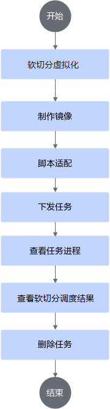
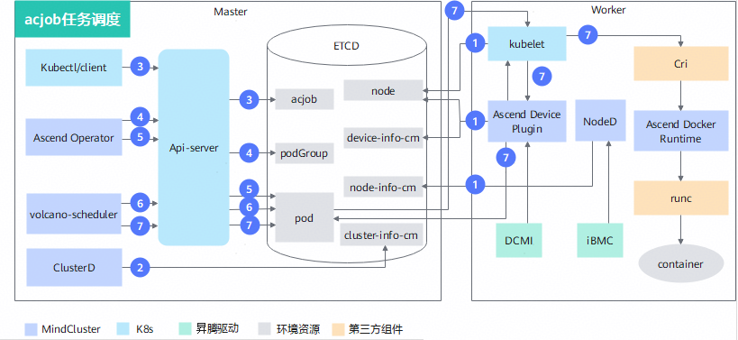

# 软切分调度（推理）<a name="ZH-CN_TOPIC_0000002511428569"></a>

## 使用前必读<a name="ZH-CN_TOPIC_0000002511347125"></a>

### 使用软切分NPU说明<a name="ZH-CN_TOPIC_00000025113463450356vcann"></a>

在Kubernetes场景下，当用户需要使用NPU资源时，需要结合集群调度组件Ascend Device Plugin和Volcano的使用，使Kubernetes可以管理并调度昇腾处理器资源。昇腾软切分虚拟化实例特性需要的集群调度组件包括Ascend Device Plugin、Volcano、Ascend Docker Runtime、Ascend Operator和ClusterD。支持的产品型号请参见[特性说明](./00_description.md)中的“表1 产品支持情况说明”。

软切分调度特性只支持使用Volcano作为调度器，不支持使用其他调度器。

### 场景说明<a name="section1576110260450vcann"></a>

使用软切分虚拟化前，需要提前了解[表1 场景说明](#table62551184461989657)中的场景说明。

**表 1**  场景说明

<a name="table62551184461989657"></a>
<table><thead align="left"><tr><th class="cellrowborder" valign="top" width="19.98%" id="mcps1.2.3.1.1"><p>场景</p>
</th>
<th class="cellrowborder" valign="top" width="80.02%" id="mcps1.2.3.1.2"><p>说明</p>
</th>
</tr>
</thead>
<tbody><tr><td class="cellrowborder" rowspan="4" valign="top" width="19.98%" headers="mcps1.2.3.1.1 "><p>通用说明</p>
</td>
<td class="cellrowborder" valign="top" width="80.02%" headers="mcps1.2.3.1.2 "><p>分配的芯片信息会在PodGroup的label中体现出来，关于PodGroup label的详细说明请参见<a href="../../../api/volcano.md#podgroup">PodGroup label</a>中的如下参数：<ul><li>huawei.com/scheduler.softShareDev.aicoreQuota</li><li>huawei.com/scheduler.softShareDev.hbmQuota</li><li>huawei.com/scheduler.softShareDev.policy</li></ul></p>
</td>
</tr>
<tr><td class="cellrowborder" valign="top" headers="mcps1.2.3.1.1 "><p>软切分功能必须配合vCANN-RT使用。</p>
</td>
</tr>
<tr><td class="cellrowborder" valign="top" headers="mcps1.2.3.1.1 "><p>分配软切分NPU时，经MindCluster调度，将优先占满剩余算力最少的物理NPU。</p>
</td>
</tr>
<tr><td class="cellrowborder" valign="top" headers="mcps1.2.3.1.1 "><p>目前任务的每个Pod请求的NPU数量为1个。物理上使用的NPU数量为1，但任务YAML中请求的NPU数量需要与huawei.com/scheduler.softShareDev.aicoreQuota配置保持一致。</p>
</td>
</tr>
<tr><td class="cellrowborder" rowspan="4" valign="top" width="19.98%" headers="mcps1.2.3.1.1 "><p>特性支持的场景</p>
</td>
<td class="cellrowborder" valign="top" width="80.02%" headers="mcps1.2.3.1.2 "><p>支持多副本，但多副本中的每个Pod所使用的NPU软切分策略必须一致。</p>
</td>
</tr>
<tr><td class="cellrowborder" valign="top" headers="mcps1.2.3.1.1 "><p>支持K8s的机制，如亲和性等。</p>
</td>
</tr>
<tr><td class="cellrowborder" valign="top" headers="mcps1.2.3.1.1 "><p>支持芯片故障和节点故障的重调度。具体参考<a href="../../basic_scheduling/08_recovery_of_inference_card_faults.md">推理卡故障恢复</a>和<a href="../../basic_scheduling/07_rescheduling_upon_inference_card_faults.md">推理卡故障重调度</a>章节。</p>
</td>
</tr>
<tr><td class="cellrowborder" valign="top" headers="mcps1.2.3.1.1 "><p>支持集群中软切分虚拟化功能和非软切分虚拟化功能混合部署的场景。</p>
</td>
</tr>
<tr><td class="cellrowborder" rowspan="3" valign="top" width="19.98%" headers="mcps1.2.3.1.1 "><p>特性不支持的场景</p>
</td>
<td class="cellrowborder" valign="top" width="80.02%" headers="mcps1.2.3.1.2 "><p>不支持不同芯片在一个任务内混用。</p>
</td>
</tr>
<tr><td class="cellrowborder" valign="top" headers="mcps1.2.3.1.1 "><p>任务运行过程中，不支持卸载Volcano。</p>
</td>
</tr>
<tr><td class="cellrowborder" valign="top" headers="mcps1.2.3.1.1 "><p>不支持与Docker场景的操作混用。</p>
</td>
</tr>
</tbody>
</table>

### 前提条件

使用软切分调度特性，需要确保已经安装如下组件；若没有安装，可以参考[安装部署](../../../developer_guide/installation_deployment/manual_installation/00_obtaining_software_packages.md)章节进行操作。

- Volcano
- Ascend Device Plugin
- Ascend Docker Runtime
- Ascend Operator
- ClusterD

1. 需要在节点上增加标签huawei.com/scheduler.chip1softsharedev.enable=true，表示该节点支持软切分功能。

    ```shell
    kubectl label nodes 节点名称 huawei.com/scheduler.chip1softsharedev.enable=true
    ```

    在软切分虚拟化功能和非软切分虚拟化功能混合部署场景下，若节点不支持软切分虚拟化功能，则需要为节点增加标签huawei.com/scheduler.chip1softsharedev.enable=false。

2. 需要先获取"Ascend-docker-runtime\_\{version\}\_linux-\{arch\}.run"，安装容器引擎插件。
3. 参见[安装部署](../../../developer_guide/installation_deployment/manual_installation/00_obtaining_software_packages.md)章节，完成各组件的安装。

    虚拟化实例涉及修改相关参数的集群调度组件为Ascend Device Plugin，请按如下要求修改并使用对应的YAML安装部署：

    1. 在device-plugin-volcano-v\{version\}.yaml中添加-shareDevCount=100 -softShareDevConfigDir=/share_device/，其中/share_device/由用户手动创建。当Atlas A3 推理系列产品使用软切分虚拟化功能时，需额外增加启动参数-useSingleDieMode=true。

       ```Yaml
       ...

               args: [ "device-plugin -volcanoType=true -presetVirtualDevice=true
                 -logFile=/var/log/mindx-dl/devicePlugin/devicePlugin.log -logLevel=0 -shareDevCount=100 -softShareDevConfigDir=/share_device/ -useSingleDieMode=true" ]   # 只有Atlas A3 推理系列产品使用软切分虚拟化功能时，才需增加-useSingleDieMode=true
             ...
               volumeMounts:
             ...
                 - name:  enpu-config-dir
                   mountPath: /etc/enpu/
                 - name: share-device-config-dir
                   mountPath: /share_device/
           ...
       volumes:
             ...
         - name: enpu-config-dir
           hostPath:
             path: /etc/enpu/
         - name: share-device-config-dir
           hostPath:
             path: /share_device/
             type: DirectoryOrCreate
       ```

        软切分虚拟化实例启动参数说明如下：

       **表 2** Ascend Device Plugin启动参数

       <a name="table1064314568229"></a>

       |参数|类型|默认值|说明|
       |--|--|--|--|
       |-shareDevCount|uint|1|使用软切分虚拟化功能时，值只能为100。|
       |-softShareDevConfigDir|string|""|软切分虚拟化场景配置目录。|
       |-useSingleDieMode|bool|false|Atlas A3 推理系列产品是否开启单die直通模式。<ul><li>true：开启单die直通模式。</li><li>false：关闭单die直通模式。</li></ul>使用软切分虚拟化功能时，该参数必须配置为true。|

    2. （可选）针对软切分虚拟化功能和非软切分虚拟化功能混合部署场景，需要对Ascend Device Plugin的YAML进行如下修改。

       - 在支持软切分虚拟化功能的节点上安装支持软切分功能的Ascend Device Plugin，将device-plugin-volcano-v\{version\}.yaml拷贝为softsharedev-device-plugin-volcano-v\{version\}.yaml。softsharedev-device-plugin-volcano-v\{version\}.yaml修改如下：

         ```Yaml
         apiVersion: apps/v1
         kind: DaemonSet
         metadata:
           name: ascend-device-plugin-daemonset-910-softShareDev #标识Ascend Device Plugin在软切分虚拟化功能和非软切分虚拟化功能混合部署场景下支持软切分虚拟化功能
           namespace: kube-system
         spec:
           ...
           template:
           ...
             spec:
             ...
               nodeSelector:
                 huawei.com/scheduler.chip1softsharedev.enable: "true"  #选择支持软切分虚拟化功能的节点部署Ascend Device Plugin
               serviceAccountName: ascend-device-plugin-sa-910
               containers:
               ...
                 command: [ "/bin/bash", "-c", "--"]
                 args: [ "device-plugin -volcanoType=true -presetVirtualDevice=true
                 -logFile=/var/log/mindx-dl/devicePlugin/devicePlugin.log -logLevel=0 -shareDevCount=100 -softShareDevConfigDir=/share_device/" ]
               ...
                 volumeMounts:
               ...
                   - name: enpu-config-dir
                     mountPath: /etc/enpu/
                   - name: share-device-config-dir
                     mountPath: /share_device/
             ...
         volumes:
               ...
           - name: enpu-config-dir
             hostPath:
               path: /etc/enpu/
           - name: share-device-config-dir
             hostPath:
               path: /share_device/
               type: DirectoryOrCreate
         ```

       - 在不支持软切分虚拟化功能的节点上安装原始的Ascend Device Plugin，device-plugin-volcano-v\{version\}.yaml修改如下：

         ```Yaml
         apiVersion: apps/v1
         kind: DaemonSet
         metadata:
           name: ascend-device-plugin-daemonset-910 #标识Ascend Device Plugin在软切分虚拟化功能和非软切分虚拟化功能混合部署场景下不支持软切分虚拟化功能
           namespace: kube-system
         spec:
           ...
           template:
           ...
             spec:
             ...
               nodeSelector:
                 huawei.com/scheduler.chip1softsharedev.enable: "false"  #选择不支持软切分虚拟化功能的节点部署Ascend Device Plugin
               serviceAccountName: ascend-device-plugin-sa-910
           ...
         ```

### 使用方式

软切分调度特性的使用方式如下：

- 通过命令行使用：安装集群调度组件，通过命令行使用软切分调度特性。
- 集成后使用：将集群调度组件集成到已有的第三方AI平台或者基于集群调度组件开发的AI平台。

### 支持的产品形态

- Atlas A2 推理系列产品
- Atlas A3 推理系列产品

### 使用流程

通过命令行使用软切分调度特性流程可以参见[图1](#fig24252498666vcann)。

**图 1**  使用流程<a name="fig24252498666vcann"></a>


## 实现原理

目前仅支持acjob任务类型，其原理图如[图1](#fig23698010123)所示。

**图 1**  acjob任务调度原理图<a name="fig23698010123"></a>


各步骤说明如下：

1. 集群调度组件定期上报节点和芯片信息。
    - kubelet上报节点芯片数量到节点对象（node）中。
    - Ascend Device Plugin定期上报芯片拓扑信息。

        上报软切分NPU信息。将芯片的物理ID上报到device-info-cm中；可调度的芯片百分比总量（allocatable）、已使用的芯片百分比数量（allocated）和芯片的基础信息（device ip和super\_device\_ip）上报到Node中，用于软切分调度。

    - 当节点上存在故障时，NodeD定期上报节点健康状态、节点硬件故障信息、节点DPC共享存储故障信息到node-info-cm中。

2. ClusterD读取device-info-cm和node-info-cm中的信息后，将信息写入cluster-info-cm。
3. 用户通过kubectl或者其他深度学习平台下发acjob任务。
4. Ascend Operator为任务创建相应的PodGroup。关于PodGroup的详细说明，可以参考[开源Volcano官方文档](https://volcano.sh/zh/docs/v1-9-0/podgroup/)。
5. Ascend Operator为任务创建相应的Pod，并在容器中注入集合通信所需环境变量。
6. volcano-scheduler根据节点的芯片AICore百分比总量和芯片高带宽内存总量以及该节点上已部署Pod的annotation已使用信息为任务选择合适节点，并在Pod的annotation上写入选择的芯片信息。
7. kubelet创建容器时，调用Ascend Device Plugin挂载芯片及芯片共享所需文件，Ascend Device Plugin或volcano-scheduler在Pod的annotation上写入芯片信息。Ascend Docker Runtime协助挂载相应资源。

## 通过命令行使用（Volcano）<a name="ZH-CN_TOPIC_00000024792271456"></a>

### 制作镜像<a name="ZH-CN_TOPIC_0000002511427026"></a>

**获取推理镜像**

可选择以下方式中的一种来获取推理镜像。

- 推荐从[昇腾镜像仓库](https://www.hiascend.com/developer/ascendhub)根据系统架构（ARM或者x86\_64）下载**推理基础镜像（**如：[ascend-infer](https://www.hiascend.com/developer/ascendhub/detail/e02f286eef0847c2be426f370e0c2596)、[mindie](https://www.hiascend.com/developer/ascendhub/detail/af85b724a7e5469ebd7ea13c3439d48f)**）**。

    请注意，21.0.4版本之后推理基础镜像默认用户为非root用户，需要在下载基础镜像后对其进行修改，将默认用户修改为root。

    >[!NOTE]
    >基础镜像中不包含推理模型、脚本等文件，因此，用户需要根据自己的需求进行定制化修改（如加入推理脚本代码、模型等）后才能使用。

- （可选）可基于推理基础镜像定制用户自己的推理镜像，制作过程请参见[使用Dockerfile构建推理镜像](../../../common_operations.md#使用dockerfile构建推理镜像)。

    完成定制化修改后，用户可以给推理镜像重命名，以便管理和使用。

**加固镜像**

下载或者制作的推理基础镜像可以进行安全加固，提升镜像安全性，可参见[容器安全加固](../../../security_hardening.md#容器安全加固)章节进行操作。

### 脚本适配<a name="ZH-CN_TOPIC_000000251134706701"></a>

本章节以昇腾镜像仓库中推理镜像为例为用户介绍操作流程，该镜像已经包含了推理示例脚本，实际推理场景需要用户自行准备推理脚本。在拉取镜像前，需要确保当前环境的网络代理已经配置完成，确保该环境可以正常访问昇腾镜像仓库。

**从昇腾镜像仓库获取示例脚本<a name="section8181015175911"></a>**

1. 确保服务器能访问互联网后，访问[昇腾镜像仓库](https://www.hiascend.com/developer/ascendhub)。
2. 在左侧导航栏选择推理镜像，然后选择[mindie](https://www.hiascend.com/developer/ascendhub/detail/af85b724a7e5469ebd7ea13c3439d48f)镜像，获取推理示例脚本。

    >[!NOTE]
    >若无下载权限，请根据页面提示申请权限。提交申请后等待管理员审核，审核通过后即可下载镜像。

### 准备任务YAML<a name="ZH-CN_TOPIC_00000024793871220102"></a>

>[!NOTE]
>如果用户不使用Ascend Docker Runtime组件，Ascend Device Plugin只会帮助用户挂载"/dev"目录下的设备。其他目录（如"/usr"）用户需要自行修改YAML文件，挂载对应的驱动目录和文件。容器内挂载路径和宿主机路径保持一致。
>因为Atlas 200I SoC A1 核心板场景不支持Ascend Docker Runtime，用户也无需修改YAML文件。

**操作步骤<a name="zh-cn_topic_0000001558853680_zh-cn_topic_0000001609074213_section14665181617334"></a>**

1. 获取相应的YAML文件。

    **表 3**  YAML说明

    |任务类型|硬件型号|YAML名称|获取链接|
    |--|--|--|--|
    |Ascend Job|<ul><li>Atlas A2 推理系列产品</li><li>Atlas A3 推理系列产品</li></ul>|pytorch_acjob_infer_<i>\{xxx\}</i>b_softsharedev.yaml|[获取YAML](https://gitcode.com/Ascend/mindcluster-deploy/blob/branch_v26.0.0/samples/inference/volcano/pytorch_acjob_infer_910b_softsharedev.yaml)|

2. 将YAML文件上传至管理节点任意目录，并根据实际情况修改文件内容。

    在Atlas 800I A2 推理服务器上，以pytorch_acjob_infer_910b_softsharedev.yaml为例，申请芯片AICore百分比为50%，芯片高带宽内存量为2048MB，软切分策略为fixed-share的参数配置示例如下。yaml配置参考请参考[YAML配置说明](../../../api/yaml_configuration.md#yaml_configuration)。

    <pre codetype="yaml">
    apiVersion: mindxdl.gitee.com/v1
    kind: AscendJob
    metadata:
      name: default-infer-test-pytorch-910b
      labels:
        framework: pytorch
        ring-controller.atlas: ascend-910b
        fault-scheduling: "force"
        <strong>huawei.com/scheduler.softShareDev.aicoreQuota: "50" # 软切分任务请求的芯片AICore百分比，单位为%</strong>
        <strong>huawei.com/scheduler.softShareDev.hbmQuota: "2048" # 软切分任务请求的芯片高带宽内存量，单位为MB</strong>
        <strong>huawei.com/scheduler.softShareDev.policy: "fixed-share" # 软切分策略，取值为fixed-share、elastic和best-effort</strong>
      annotations:
        <strong>huawei.com/schedule_policy: "chip1-softShareDev" # 软切分场景Volcano调度策略</strong>
    spec:
      schedulerName: volcano   # work when enableGangScheduling is true
      runPolicy:
        schedulingPolicy:      # work when enableGangScheduling is true
          minAvailable: 1
          queue: default
      successPolicy: AllWorkers
      replicaSpecs:
        Master:
          replicas: 1
          restartPolicy: Never
          template:
            metadata:
              labels:
                ring-controller.atlas: ascend-910b
            spec:
              automountServiceAccountToken: false
              nodeSelector:
                example-key: example-value    # 示例值，用户可根据调度意图自行配置nodeSelector
              containers:
                - name: ascend # do not modify
                  image: pytorch-test:latest         # training framework image， which can be modified
                  imagePullPolicy: IfNotPresent
                  env:
                    - name: XDL_IP                                       # IP address of the physical node, which is used to identify the node where the pod is running
                      valueFrom:
                        fieldRef:
                          fieldPath: status.hostIP
                  command:                           # training command,  which can be modified
                    - /bin/bash
                    - -c
                  args: [ "./infer.sh" ]
                  ports:                          # default value       containerPort: 2222 name: ascendjob-port if not set
                    - containerPort: 2222         # determined by user
                      name: ascendjob-port        # do not modify
                  resources:
                    requests:
                      <strong>huawei.com/Ascend910: 50 # 此处需要与huawei.com/scheduler.softShareDev.aicoreQuota的值保持一致，表示软切分任务请求的AICore百分比</strong>
                    limits:
                      <strong>huawei.com/Ascend910: 50 # 数值与requests保持一致</strong>
                  volumeMounts:
                    - name: ascend-driver
                      mountPath: /usr/local/Ascend/driver
                    - name: ascend-add-ons
                      mountPath: /usr/local/Ascend/add-ons
                    - name: localtime
                      mountPath: /etc/localtime
                    <strong>- name: libpreload # 软切分动态库地址</strong>
                      <strong>mountPath: /opt/enpu/vcann-rt/lib/libvruntime.so</strong>
                    <strong>- name: preload # preload配置文件地址</strong>
                      <strong>mountPath: ${preload_path}/ld.so.preload</strong>
              volumes:
                - name: ascend-driver
                  hostPath:
                    path: /usr/local/Ascend/driver
                - name: ascend-add-ons
                  hostPath:
                    path: /usr/local/Ascend/add-ons
                - name: localtime
                  hostPath:
                    path: /etc/localtime
                <strong>- name: libpreload # 软切分动态库地址</strong>
                  <strong>hostPath:</strong>
                    <strong>path: /opt/enpu/vcann-rt/lib/libvruntime.so</strong>
                <strong>- name: preload # preload配置文件地址</strong>
                  <strong>hostPath:</strong>
                    <strong>path: ${preload_path}/ld.so.preload</strong>
    </pre>

>[!NOTE]
><term>Atlas A3 推理系列产品</term>下发软切分虚拟化任务时，在任务容器中，/dev/实际挂载1个die，但是执行<b>npu-smi info</b>命令查询显示挂载了2个die。回显示例如下：
>
> ```ColdFusion
> +-----------------------------------------------------------------------------------------------+
> | npu-smi xxx.xxx.xxx                Version: xxx.xxx.xxx                                       |
> +---------------------------+---------------+---------------------------------------------------+
> | NPU   Name         | Health        | Power(W)    Temp(C)           Hugepages-Usage(page)      |
> | Chip  Phy-ID       | Bus-Id        | AICore(%)   Memory-Usage(MB)  HBM-Usage(MB)              |
> +===========================+===============+===================================================+
> | 0     xxx          | OK            | 157.3       32                0    / 0                   |
> | 0     0            | 0000:9D:00.0  | 0           0        / 0      3130 / 65536               |
> +---------------------------+---------------+---------------------------------------------------+
> | 0     xxx          | OK            | -           32                0    / 0                   |
> | 1     0            | 0000:9D:00.0  | 0           0        / 0      3130 / 65536               |
> +===========================+===============+===================================================+
> +---------------------------+---------------+---------------------------------------------------+
> | NPU     Chip       | Process id    | Process name| Process memory(MB) |Process id in container|
> +===========================+===============+===================================================+
> | No running processes found in NPU 0                                                           |
> +===========================+===============+===================================================+
> ```

### 下发任务<a name="ZH-CN_TOPIC_000000247922713402"></a>

在管理节点示例YAML所在路径，执行以下命令，使用YAML下发推理任务。

```shell
kubectl apply -f XXX.yaml
```

例如：

```shell
kubectl apply -f pytorch_acjob_infer_910b_softsharedev.yaml
```

回显示例如下：

```ColdFusion
ascendjob.mindxdl.gitee.com/default-infer-test-pytorch-910b created
```

>[!NOTE]
>如果下发任务成功后，又修改了任务YAML，需要先执行kubectl delete -f <i>XXX</i>.yaml命令删除原任务，再重新下发任务。

### 查看任务进程<a name="ZH-CN_TOPIC_00000025113470710203"></a>

**操作步骤**

1. <a name="ZH-CN_TOPIC_00000025113470710203step01"></a>执行以下命令，查看Pod运行状况。

    ```shell
    kubectl get pod --all-namespaces
    ```

    回显示例：

    ```ColdFusion
    NAMESPACE        NAME                                       READY   STATUS    RESTARTS   AGE
    ...
    default         default-infer-test-pytorch-910b-master-0    1/1     Running   0          8s
    ...
    ```

2. 查看运行推理任务的节点详情。
    1. 执行以下命令查看节点的名称。

        ```shell
        kubectl get node -A
        ```

    2. 根据上一步骤中查询到的节点名称，执行以下命令查看节点详情。

        ```shell
        kubectl describe node <nodename>
        ```

        回显示例：

        ```ColdFusion
        ...
        Allocated resources:
          (Total limits may be over 100 percent, i.e., overcommitted.)
          Resource              Requests     Limits
          --------              --------     ------
          cpu                   4 (2%)       3500m (1%)
          memory                2140Mi (0%)  4040Mi (0%)
          ephemeral-storage     0 (0%)       0 (0%)
          huawei.com/Ascend910  50           50
        Events:
          Type    Reason    Age   From                Message
          ----    ------    ----  ----                -------
          Normal  Starting  36m   kube-proxy, ubuntu  Starting kube-proxy.
        ...
        ```

        在显示的信息中，找到"Allocated resources"下的**huawei.com/Ascend910**，该参数取值在执行推理任务之后会增加，增加数量为推理任务使用的NPU芯片的AICore百分比总量。

### 查看软切分调度结果<a name="ZH-CN_TOPIC_000000247938712002"></a>

**操作步骤**

在管理节点执行以下命令查看推理结果。

```shell
kubectl logs -f default-infer-test-pytorch-910b-master-0
```

回显示例如下，以实际回显为准。

```ColdFusion
[20260304150146] [INFO] [eNPU] [vCANN_RT] [1799:281472853921824:config.c:145] Success to load config: physical-npu-id, value: 2
[20260304150146] [INFO] [eNPU] [vCANN_RT] [1799:281472853921824:config.c:145] Success to load config: virtual-npu-id, value: 0
[20260304150146] [INFO] [eNPU] [vCANN_RT] [1799:281472853921824:config.c:145] Success to load config: aicore-quota, value: 100
[20260304150146] [INFO] [eNPU] [vCANN_RT] [1799:281472853921824:config.c:145] Success to load config: memory-quota, value: 60000
[20260304150146] [INFO] [eNPU] [vCANN_RT] [1799:281472853921824:config.c:145] Success to load config: shm-id, value: C281A66C-80A047F2-0A645632-CC500485-100301E3
[20260304150146] [INFO] [eNPU] [vCANN_RT] [1799:281472853921824:config.c:145] Success to load config: scheduling-policy, value: 2
[20260304150146] [INFO] [eNPU] [vCANN_RT] [1799:281472853921824:npu-manager.c:127] Successfully to initialize vnpu device.
[20260304150146] [INFO] [eNPU] [vCANN_RT] [1799:281472853921824:mem-limiter.c:69] create /run/enpu/vcann-rt/ success
[20260304150146] [INFO] [eNPU] [vCANN_RT] [1799:281460942893344:core-limiter.c:290] The scheduling process has been detected to exit, and the scheduling is being taken over.
[20260304150146] [INFO] [eNPU] [vCANN_RT] [1799:281472853921824:npu-manager.c:168] Successfully to initialize all module.
[20260304150146] [INFO] [eNPU] [vCANN_RT] [1799:281472853921824:memory.c:91] Hook mem rtMemGetInfoEx.
[20260304150146] [INFO] [eNPU] [vCANN_RT] [1799:281472853921824:memory.c:91] Hook mem rtMemGetInfoEx.
```

>[!NOTE]
><i>default-infer-test-pytorch-910b-master-0</i>：查看任务进程章节[步骤1](#ZH-CN_TOPIC_00000025113470710203step01)中运行的任务名称。

### 删除任务<a name="ZH-CN_TOPIC_00000025113470650102"></a>

在示例YAML所在路径下，执行以下命令，删除对应的推理任务。

```shell
kubectl delete -f XXX.yaml
```

例如：

```shell
kubectl delete -f pytorch_acjob_infer_910b_softsharedev.yaml
```

回显示例：

```ColdFusion
root@ubuntu:/home/test/yaml# kubectl delete -f pytorch_acjob_infer_910b_softsharedev.yaml
ascendjob.mindxdl.gitee.com "default-infer-test-pytorch-910b" deleted
```

## 集成后使用<a name="ZH-CN_TOPIC_00000025113470730102"></a>

本章节需要用户熟悉编程开发，以及对K8s有一定了解。如果用户已有AI平台或者想基于集群调度组件开发AI平台，需要完成以下内容：

1. 根据编程语言找到对应的K8s的[官方API库](https://github.com/kubernetes-client)。
2. 根据K8s的官方API库，对任务进行创建、查询、删除等操作。
3. 创建、查询或删除任务时，用户需要将[示例YAML](#准备任务yaml)的内容转换成K8s官方API中定义的对象，通过官方API发送给K8s的API Server或者将YAML内容转换成JSON格式直接发送给K8s的API Server。
