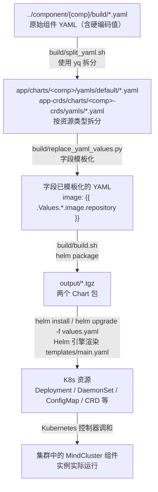

# MindCluster Helm 部署工具

## 简介

MindCluster Helm 部署工具用于将 MindCluster 集群调度组件以 Helm Chart 的方式打包、发布和部署到 Kubernetes 集群。通过该工具，用户可以使用标准 `helm` 命令快速安装、升级和管理以下组件：

- Ascend Device Plugin
- Ascend Operator
- Volcano（含Ascend for Volcano插件）
- ClusterD
- NodeD
- NPU Exporter
- Infer Operator
- K8s RDMA Shared Dev Plugin

工具产出两个独立的 Chart 包：

- `mindcluster-crds-deploy-tool-{chart_version}.tgz`：部署 CRD 资源（Ascend Operator、Volcano、Infer Operator 的 CRD）。
- `mindcluster-deploy-tool-{chart_version}.tgz`：部署应用组件。

> [!NOTE]
> 将 CRD 拆分为独立的 Chart 包，主要出于以下考虑：
>
> - **独立生命周期管理**：CRD 的变更频率远低于应用组件，拆分后可以独立升级、回滚 CRD 资源，避免因应用组件升级而误触发 CRD 变更。
> - **权限分离**：CRD 是集群级别的资源，安装需要较高的集群权限（ClusterRole）；而应用组件通常部署在命名空间级别。拆分为两个 Chart 后，运维人员可以为不同的 Chart 分配不同的权限，提升安全性。
> - **避免级联删除风险**：Helm 在卸载 Chart 时会尝试清理所有该 Chart 管理的资源。如果 CRD 与应用组件混在同一个 Chart 中，卸载应用组件时可能意外删除 CRD，导致所有依赖该 CRD 的自定义资源一并被清理。独立管理 CRD 可有效防止此类误操作。

详细安装步骤请参考[使用 helm 安装](../docs/zh/scheduling/03_installation_guide/02_installation/00_helm_installation.md)。

## 编译方法

### 环境依赖

编译前请确保已安装以下工具：

| 工具 | 版本要求 | 用途 |
| --- | --- | --- |
| helm | 3.x | 打包 Chart（`helm package`） |
| yq | mikefarah/yq v4 及以上 | 在 `split_yaml.sh` 中拆分组件 YAML |
| python3 | 3.6 及以上 | 执行 `replace_yaml_values.py` 将硬编码字段替换为 Helm 模板变量 |
| dos2unix | 任意版本 | 处理脚本换行符 |

### 安装 helm 与 yq

若环境中尚未安装 helm 或 yq 命令，可参考以下步骤进行安装。

**安装 helm 3.x：**

```bash
# 下载（请根据实际需要替换版本号与系统架构）
wget https://get.helm.sh/helm-v3.17.3-linux-arm64.tar.gz
tar -zxvf helm-v3.17.3-linux-arm64.tar.gz
mv linux-arm64/helm /usr/local/bin/helm
rm -rf linux-arm64 helm-v3.17.3-linux-arm64.tar.gz

# 验证
helm version
```

**安装 yq（mikefarah/yq v4）：**

```bash
# 下载并安装
wget -qO /usr/local/bin/yq https://github.com/mikefarah/yq/releases/download/v4.53.2/yq_linux_arm64
chmod +x /usr/local/bin/yq

# 验证
yq --version
```

> [!NOTE]
>
> - 更多 Helm 安装方式请参考 [Helm 官方文档](https://helm.sh/zh/docs/v3/intro/install)。
> - 若目标机器为 x86_64 架构，请将上述命令中的 `linux-arm64`（helm）与 `yq_linux_arm64`（yq）替换为 `linux-amd64` 与 `yq_linux_amd64`。

### 执行编译

在 `helm-deploy-tool/build` 目录下执行：

```bash
cd helm-deploy-tool/build
bash build.sh
```

`build.sh` 会依次调用以下脚本完成构建：

1. **`split_yaml.sh`**：使用 `yq` 将 `../component/{comp}/build/` 中的组件 YAML 按资源类型拆分，分别放置到 `app/charts/<component>/yamls/` 与 `app-crds/charts/<component>-crds/yamls/` 下；同时将 Volcano ConfigMap 中的 `volcano-npu` 镜像名更新为目标发布版本（如 `volcano-npu_v26.1.0`）。
2. **`replace_yaml_values.py`**：将组件 YAML 中的 `image`、`imagePullPolicy` 等硬编码字段替换为 `{{ .Values.<component>.image.repository }}` 等 Helm 模板变量。
3. **`helm package`**：对 `app` 与 `app-crds` 两个 Chart 执行打包，生成 `mindcluster-deploy-tool-{chart_version}.tgz` 与 `mindcluster-crds-deploy-tool-{chart_version}.tgz`。

构建完成后，脚本会将 `helm_tool.sh` 与上述 `.tgz` 包归档到 `output/` 目录。

编译产物位于 `helm-deploy-tool/output/`：

```text
output/
├── helm_tool.sh
├── mindcluster-crds-deploy-tool-{chart_version}.tgz
└── mindcluster-deploy-tool-{chart_version}.tgz
```

## 目录结构

```text
helm-deploy-tool/
├── app/                              # 应用组件 Chart（主 Chart）
│   ├── Chart.yaml                    # Chart 元信息与子 Chart 依赖声明
│   ├── values.yaml                   # 默认配置（镜像、调度策略、特性开关等）
│   ├── templates/
│   │   └── ns.yaml                   # 预创建的 Namespace（mindx-dl、cluster-system）
│   └── charts/                       # 各组件子 Chart
│       ├── clusterd/
│       │   ├── Chart.yaml
│       │   ├── values.yaml
│       │   └── templates/
│       │       └── main.yaml         # 通过 .Files.Glob 渲染 yamls/ 下的资源
│       ├── noded/
│       ├── npu-exporter/
│       ├── ascend-operator/
│       ├── ascend-for-volcano/
│       ├── infer-operator/
│       ├── ascend-device-plugin/
│       └── k8s-rdma-shared-dev-plugin/
├── app-crds/                         # CRD Chart（独立发布，便于单独管理 CRD 生命周期）
│   ├── Chart.yaml
│   ├── values.yaml
│   └── charts/
│       ├── ascend-operator-crds/
│       ├── ascend-for-volcano-crds/  # 含 v1.7.0 / v1.9.0 / v1.12.0 多版本 CRD
│       └── infer-operator-crds/
├── build/                            # 构建脚本目录
│   ├── build.sh                      # 主构建入口
│   ├── split_yaml.sh                 # 使用 yq 拆分组件 YAML 到各子 Chart
│   ├── replace_yaml_values.py         # 将硬编码值替换为 Helm 模板变量
│   └── helm_tool.sh                  # 为已存在的 K8s 资源补打 Helm 标签/注解，用于接管存量资源或删除资源
└── output/                           # 构建产物输出目录（编译时自动生成）
```

## Helm 渲染到 K8s 生效的路径原理

MindCluster 采用「CRD 与应用组件分离」的双 Chart 设计，整体渲染与生效流程如下：

### 1. 模板渲染机制

每个组件子 Chart 的 `templates/main.yaml` 使用 `.Files.Glob` 读取 `yamls/default/**/*.yaml` 下的资源文件，并通过 `tpl` 渲染其中的 Helm 模板变量：

```go
{{- $files := .Files.Glob "yamls/default/**.yaml" -}}
{{- range $path, $_ := $files }}
  {{- $content := $.Files.Get $path -}}
  {{- tpl $content $ }}
---
{{- end }}
```

`yamls/` 下的资源文件由 `build/split_yaml.sh` 从 `../component/{comp}/build/` 拆分而来，`build/replace_yaml_values.py` 进一步将 `image`、`imagePullPolicy` 等字段替换为 `{{ .Values.<component>.image.repository }}` 等模板变量。因此用户在 `values.yaml` 中修改的配置会注入到最终渲染出的 K8s 资源中。

### 2. 生效路径

完整的「源码 → 集群生效」链路如下：



### 3. 安装顺序约束

由于应用组件依赖 CRD 定义，安装时必须严格遵循以下顺序：

1. **安装 CRD Chart**：

   ```bash
   helm install mindcluster-crds mindcluster-crds-deploy-tool-{chart_version}.tgz
   ```

2. **安装应用组件 Chart**：

   ```bash
   helm install mindcluster mindcluster-deploy-tool-{chart_version}.tgz
   ```

如需自定义配置，可通过 `-f values.yaml` 覆盖默认值；执行 `helm install ... --dry-run` 可预先查看渲染结果而不实际下发资源。

### 4. 接管存量资源（可选）

对于已通过非 Helm 方式部署的存量集群，可使用 `output/helm_tool.sh` 为既有 K8s 资源补打 Helm 标签（`app.kubernetes.io/managed-by=Helm`）和注解（`meta.helm.sh/release-name`、`meta.helm.sh/release-namespace`），随后即可通过 `helm upgrade` 接管这些资源的生命周期。
